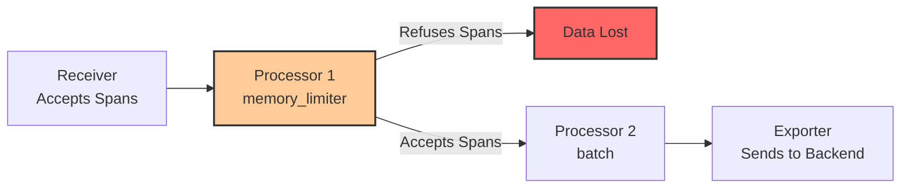
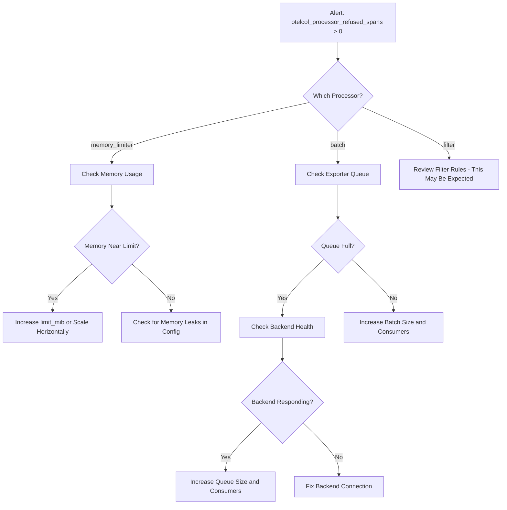

# How to Fix "otelcol_processor_refused_spans" Metric Alerting on Data Loss

Author: [nawazdhandala](https://www.github.com/nawazdhandala)

Tags: OpenTelemetry, Collector, Metrics, Data Loss, Backpressure, Memory, Troubleshooting, Spans

Description: Diagnose and resolve the otelcol_processor_refused_spans metric in OpenTelemetry Collector to prevent trace data loss and pipeline backpressure issues.

---

When you see the `otelcol_processor_refused_spans` metric climbing in your monitoring dashboards, it means the OpenTelemetry Collector is actively dropping trace data. Spans are entering the pipeline but being rejected by a processor before they reach your backend. This is not a warning you can ignore. Every refused span is a gap in your traces, a missing piece of observability data that you will not get back.

This guide explains exactly what causes this metric to appear, how to diagnose which processor is refusing data and why, and how to fix it without destabilizing your collector.

## What "Refused Spans" Actually Means

The OpenTelemetry Collector tracks data flow through its pipeline using internal metrics. The `otelcol_processor_refused_spans` metric increments every time a processor in the pipeline rejects incoming span data instead of passing it downstream.



The metric has labels that tell you which processor is refusing data:

```promql
# PromQL query to see refused spans broken down by processor
# This tells you exactly which processor is the bottleneck
otelcol_processor_refused_spans{processor="memory_limiter"}
otelcol_processor_refused_spans{processor="batch"}
otelcol_processor_refused_spans{processor="filter"}
```

The three most common processors that refuse spans are the memory limiter, the batch processor (when its send queue is full), and filter processors (by design). Each has a different root cause and fix.

## Cause 1: Memory Limiter Activating Under Pressure

The memory limiter processor is the most common source of refused spans. It exists specifically to prevent the collector from running out of memory and crashing. When memory usage exceeds the configured limit, it starts refusing all incoming data.

Check if the memory limiter is the culprit:

```bash
# Query the collector's internal metrics endpoint
# Look for the memory limiter's refused spans count
curl -s http://otel-collector:8888/metrics | grep refused_spans

# Expected output when memory limiter is refusing:
# otelcol_processor_refused_spans{processor="memory_limiter",
#   service_instance_id="abc123"} 45230
```

The typical misconfiguration looks like this:

```yaml
# BAD: Memory limits too aggressive for the traffic volume
processors:
  memory_limiter:
    check_interval: 1s
    limit_mib: 256    # Only 256 MB before refusing data
    spike_limit_mib: 64
```

If your collector receives bursts of traffic, 256 MB fills up fast. The fix depends on your environment:

```yaml
# FIX: Increase memory limits to match actual available memory
# Rule of thumb: set limit_mib to 80% of available memory
# and spike_limit_mib to 25% of limit_mib
processors:
  memory_limiter:
    check_interval: 1s
    limit_mib: 1536      # 1.5 GB limit (for a 2 GB container)
    spike_limit_mib: 512  # 512 MB spike headroom
```

If you are running in Kubernetes, make sure the container's memory limit matches:

```yaml
# kubernetes-deployment.yaml
# The container memory limit should be higher than the
# memory_limiter's limit_mib to avoid OOM kills
apiVersion: apps/v1
kind: Deployment
metadata:
  name: otel-collector
spec:
  template:
    spec:
      containers:
      - name: collector
        image: otel/opentelemetry-collector-contrib:latest
        resources:
          requests:
            memory: "1Gi"
          limits:
            # Set container limit above the memory_limiter limit
            # 2Gi container for 1536 MiB memory_limiter limit
            memory: "2Gi"
```

The relationship between these values matters:

```
Container memory limit > memory_limiter limit_mib + spike_limit_mib
         2048 MiB      >        1536 MiB          +     512 MiB
         2048 MiB      >                2048 MiB

# This is too tight! Increase container memory or lower the limits.
# A safer ratio:
Container memory limit = memory_limiter limit_mib * 1.5
         2304 MiB      =        1536 MiB          * 1.5
```

## Cause 2: Batch Processor Queue Overflow

The batch processor groups spans into batches before sending them to exporters. It has an internal queue, and when that queue fills up because the exporter cannot keep up, the batch processor starts refusing new spans.

```bash
# Check batch processor queue metrics
curl -s http://otel-collector:8888/metrics | grep "batch"

# Look for these metrics:
# otelcol_processor_batch_batch_send_size - size of batches being sent
# otelcol_exporter_queue_size - current queue depth
# otelcol_exporter_queue_capacity - maximum queue depth
```

The root cause is usually that the exporter is slower than the incoming data rate. This can happen because of network latency to the backend, backend throttling, or simply too much data for the exporter to handle.

```yaml
# BAD: Default batch and queue settings may be too small for high throughput
processors:
  batch:
    timeout: 5s
    send_batch_size: 512

exporters:
  otlp:
    endpoint: backend.example.com:4317
    sending_queue:
      enabled: true
      num_consumers: 10
      queue_size: 1000
```

```yaml
# FIX: Tune batch processor and exporter queue for higher throughput
processors:
  batch:
    # Shorter timeout sends batches more frequently
    timeout: 2s
    # Larger batch size means fewer network round trips
    send_batch_size: 1024
    # Maximum batch size prevents memory buildup
    send_batch_max_size: 2048

exporters:
  otlp:
    endpoint: backend.example.com:4317
    sending_queue:
      enabled: true
      # More consumers process the queue in parallel
      num_consumers: 20
      # Larger queue absorbs traffic bursts
      queue_size: 5000
    # Retry settings for transient failures
    retry_on_failure:
      enabled: true
      initial_interval: 5s
      max_interval: 30s
      max_elapsed_time: 300s
    # Timeout for each export request
    timeout: 30s
```

If the exporter queue is consistently full, you may need to scale horizontally:

```yaml
# Scale the collector horizontally with a load balancer
# This distributes incoming spans across multiple collector instances
apiVersion: apps/v1
kind: Deployment
metadata:
  name: otel-collector
spec:
  # Increase replicas to handle more throughput
  replicas: 3
  template:
    spec:
      containers:
      - name: collector
        image: otel/opentelemetry-collector-contrib:latest
        resources:
          requests:
            cpu: "1"
            memory: "2Gi"
          limits:
            cpu: "2"
            memory: "4Gi"
```

## Cause 3: Exporter Endpoint Issues

Sometimes the refused spans are not caused by resource limits but by the exporter failing to send data. When the backend is unreachable or returning errors, the exporter's retry mechanism eventually gives up, and data backed up in the queue causes the batch processor to refuse new spans.

Check exporter health:

```bash
# Check for exporter send failures
curl -s http://otel-collector:8888/metrics | grep "exporter"

# Key metrics to look for:
# otelcol_exporter_send_failed_spans - number of spans that failed to export
# otelcol_exporter_sent_spans - number of spans successfully exported
# otelcol_exporter_queue_size - how full the export queue is
```

If `otelcol_exporter_send_failed_spans` is climbing, the problem is between the collector and your backend. Common causes include:

```yaml
# FIX: Add connection and timeout tuning for unreliable backends
exporters:
  otlp:
    endpoint: backend.example.com:4317
    # TLS configuration - misconfigured TLS causes silent failures
    tls:
      insecure: false
      ca_file: /etc/ssl/certs/ca-certificates.crt

    # Compression reduces bandwidth and can help with slow connections
    compression: gzip

    # Timeout settings
    timeout: 30s

    # Retry with backoff for transient failures
    retry_on_failure:
      enabled: true
      initial_interval: 5s
      max_interval: 60s
      max_elapsed_time: 600s

    # Queue settings with persistent storage
    # This prevents data loss during collector restarts
    sending_queue:
      enabled: true
      num_consumers: 10
      queue_size: 10000
      # Persistent queue survives collector restarts
      storage: file_storage/traces

extensions:
  # File storage extension for persistent queues
  file_storage/traces:
    directory: /var/lib/otelcol/traces-queue
    timeout: 10s
```

## Setting Up Alerts Before Data Loss Happens

Do not wait until you notice missing traces. Set up alerts on the refused spans metric so you catch the problem early:

```yaml
# prometheus-alerts.yaml
# Alert rules for OpenTelemetry Collector data loss
groups:
  - name: otel-collector-data-loss
    rules:
      # Alert when any processor is refusing spans
      - alert: OtelCollectorRefusedSpans
        # rate() over 5 minutes smooths out brief spikes
        expr: rate(otelcol_processor_refused_spans[5m]) > 0
        for: 2m
        labels:
          severity: warning
        annotations:
          summary: "OTel Collector is refusing spans"
          description: >
            Processor {{ $labels.processor }} on collector
            {{ $labels.service_instance_id }} is refusing
            {{ $value | humanize }} spans/sec.

      # Alert when refused spans exceed a significant threshold
      - alert: OtelCollectorHighDataLoss
        expr: rate(otelcol_processor_refused_spans[5m]) > 100
        for: 5m
        labels:
          severity: critical
        annotations:
          summary: "OTel Collector is losing significant trace data"
          description: >
            Processor {{ $labels.processor }} is refusing more than
            100 spans/sec. Immediate action required to prevent
            observability gaps.

      # Alert when exporter queue is near capacity
      - alert: OtelCollectorQueueNearFull
        expr: >
          otelcol_exporter_queue_size / otelcol_exporter_queue_capacity > 0.8
        for: 5m
        labels:
          severity: warning
        annotations:
          summary: "OTel Collector exporter queue is 80% full"
          description: >
            Exporter queue is at {{ $value | humanizePercentage }} capacity.
            If this continues, spans will be refused.
```

## The Diagnostic Workflow

When your alert fires, follow this sequence:



Start by identifying which processor is refusing spans using the metric labels. Then investigate the specific cause using the metrics and fixes described above.

## Verifying the Fix

After applying changes, verify that refused spans drop to zero:

```bash
# Watch the refused spans metric in real time
# It should stop increasing after your fix takes effect
watch 'curl -s http://otel-collector:8888/metrics | grep refused_spans'

# Also verify that exported spans are increasing normally
watch 'curl -s http://otel-collector:8888/metrics | grep sent_spans'
```

```promql
# PromQL query to verify the fix over time
# This should return 0 after the fix is deployed
rate(otelcol_processor_refused_spans[5m])

# Compare with the successful export rate to confirm data is flowing
rate(otelcol_exporter_sent_spans[5m])
```

The goal is to get `otelcol_processor_refused_spans` rate to zero and keep it there. Brief spikes during traffic bursts are acceptable as long as they resolve quickly. Sustained refused spans indicate that your collector is undersized for its workload and needs more resources or horizontal scaling.

Remember that every refused span is a permanent gap in your observability data. It is always better to over-provision the collector slightly than to lose trace data that you cannot recover.
