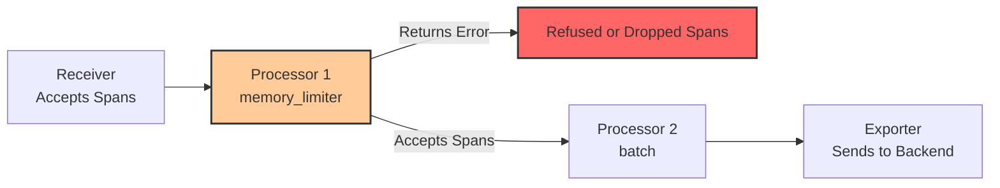
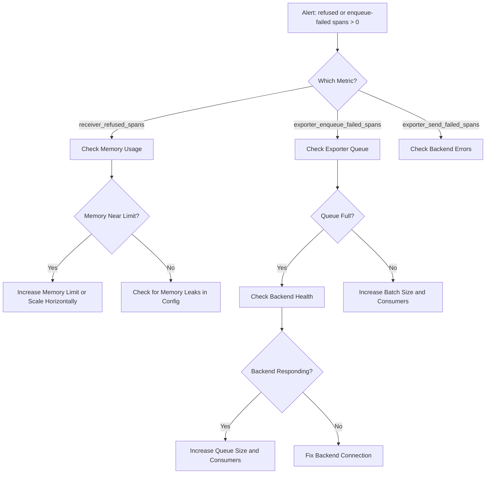

# How to Fix 'otelcol_processor_refused_spans' Metric Alerting on Data Loss

Author: [nawazdhandala](https://www.github.com/nawazdhandala)

Tags: OpenTelemetry, Collector, Metric, Data Loss, Backpressure, Memory, Troubleshooting, Span

Description: Diagnose and resolve the otelcol_processor_refused_spans metric in OpenTelemetry Collector to prevent trace data loss and pipeline backpressure issues.

---

When you see `otelcol_receiver_refused_spans` or `otelcol_exporter_enqueue_failed_spans` climbing in your monitoring dashboards, it means the OpenTelemetry Collector cannot accept or queue trace data fast enough. Spans are reaching the collector, but backpressure or exporter failures are preventing them from moving through the pipeline normally. This is not a warning you can ignore. Every refused span is a potential gap in your traces, a missing piece of observability data that you may not get back.

This guide explains exactly what causes these metrics to appear, how to diagnose where data is being refused or dropped, and how to fix it without destabilizing your collector.

## What "Refused Spans" Actually Means

The OpenTelemetry Collector tracks data flow through its pipeline using internal metrics. In current collector releases, refused spans are reported at the receiver layer with `otelcol_receiver_refused_spans`. Exporter backpressure and failed delivery are reported with exporter metrics such as `otelcol_exporter_enqueue_failed_spans`, `otelcol_exporter_send_failed_spans`, `otelcol_exporter_queue_size`, and `otelcol_exporter_queue_capacity`.


```mermaid
graph LR
    A[Receiver<br/>Accepts Spans] --> B[Processor 1<br/>memory_limiter]
    B -->|Returns Error| X[Refused or Dropped Spans]
    B -->|Accepts Spans| C[Processor 2<br/>batch]
    C --> D[Exporter<br/>Sends to Backend]

    style X fill:#f66,stroke:#333,stroke-width:2px
    style B fill:#fc9,stroke:#333,stroke-width:2px
```

Use these metrics together to identify where the data is being rejected or dropped:

```promql
# Refused spans at the collector receiver

rate(otelcol_receiver_refused_spans[5m])

# Exporter queue overflow and send failures
rate(otelcol_exporter_enqueue_failed_spans[5m])
rate(otelcol_exporter_send_failed_spans[5m])

# Exporter queue utilization
otelcol_exporter_queue_size / otelcol_exporter_queue_capacity
```

The most common causes are the memory limiter rejecting data under memory pressure, the exporter sending queue filling up, and the backend returning errors or becoming unreachable. Filter processors can intentionally drop spans by design, but that is normal filtering behavior rather than a refused-span signal.

## Cause 1: Memory Limiter Activating Under Pressure

The memory limiter processor is a common source of refused spans. It exists specifically to prevent the collector from running out of memory and crashing. When memory usage exceeds the soft limit (`limit_mib - spike_limit_mib`), it starts refusing incoming data. If memory reaches the hard limit, it also forces garbage collection.

Check if the memory limiter is the culprit:

```bash
# Query the collector's internal metrics endpoint
# Look for refused spans and collector memory usage
curl -s http://otel-collector:8888/metrics | grep -E "receiver_refused_spans|process_memory|runtime.*memory"

# Expected output when the collector is refusing spans:
# otelcol_receiver_refused_spans{receiver="otlp",
#   service_instance_id="abc123",transport="grpc"} 45230
```

The typical misconfiguration looks like this:

```yaml
# BAD: Memory limits too aggressive for the traffic volume
processors:
  memory_limiter:
    check_interval: 1s
    limit_mib: 256    # Only 256 MB before refusing data
    spike_limit_mib: 64
```

If your collector receives bursts of traffic, 256 MB fills up fast. The fix depends on your environment:

```yaml
# FIX: Increase memory limits to match actual available memory
# Rule of thumb: set limit_mib to a large but safe share of available memory
# and spike_limit_mib to about 20% of limit_mib
processors:
  memory_limiter:
    check_interval: 1s
    limit_mib: 1536      # 1.5 GB limit (for a 2 GB container)
    spike_limit_mib: 300  # 300 MB spike headroom
```

If you are running in Kubernetes, make sure the container's memory limit matches:

```yaml
# kubernetes-deployment.yaml
# The container memory limit should be higher than the
# memory_limiter's hard limit to avoid OOM kills
apiVersion: apps/v1
kind: Deployment
metadata:
  name: otel-collector
spec:
  template:
    spec:
      containers:
      - name: collector
        image: otel/opentelemetry-collector-contrib:latest
        resources:
          requests:
            memory: "1Gi"
          limits:
            # Set container limit above the memory_limiter hard limit
            # 2Gi container for 1536 MiB memory_limiter limit
            memory: "2Gi"
```

The relationship between these values matters:

```text
Container memory limit > memory_limiter limit_mib + non-heap/process overhead
         2048 MiB      >        1536 MiB          +     overhead

# Do not set the collector hard limit equal to the container limit.
# Leave headroom for non-heap memory and normal process overhead.
# A safer ratio:
Container memory limit = memory_limiter limit_mib * 1.5
         2304 MiB      =        1536 MiB          * 1.5
```

## Cause 2: Exporter Queue Overflow

The batch processor groups spans into batches before sending them to exporters. The exporter has the sending queue that absorbs backend slowness or network delay. When that queue fills up because the exporter cannot keep up, new data can fail to enqueue and be dropped.

```bash
# Check batch processor and exporter queue metrics
curl -s http://otel-collector:8888/metrics | grep -E "processor_batch|exporter_queue|enqueue_failed"

# Look for these metrics:
# otelcol_processor_batch_batch_send_size - size of batches being sent
# otelcol_exporter_queue_size - current queue depth
# otelcol_exporter_queue_capacity - maximum queue depth
# otelcol_exporter_enqueue_failed_spans - spans that failed to enter the exporter queue
```

The root cause is usually that the exporter is slower than the incoming data rate. This can happen because of network latency to the backend, backend throttling, or simply too much data for the exporter to handle.

```yaml
# BAD: Small batch and queue settings may be too small for high throughput
processors:
  batch:
    timeout: 200ms
    send_batch_size: 512

exporters:
  otlp:
    endpoint: backend.example.com:4317
    sending_queue:
      enabled: true
      num_consumers: 10
      queue_size: 1000
```

```yaml
# FIX: Tune batch processor and exporter queue for higher throughput
processors:
  batch:
    # Timeout controls how long data can wait before being sent
    timeout: 2s
    # Larger trigger size can mean fewer network round trips
    send_batch_size: 1024
    # Maximum batch size splits oversized batches
    send_batch_max_size: 2048

exporters:
  otlp:
    endpoint: backend.example.com:4317
    sending_queue:
      enabled: true
      # More consumers process the queue in parallel
      num_consumers: 20
      # Larger queue absorbs traffic bursts
      queue_size: 5000
    # Retry settings for transient failures
    retry_on_failure:
      enabled: true
      initial_interval: 5s
      max_interval: 30s
      max_elapsed_time: 300s
    # Timeout for each export request
    timeout: 30s
```

If the exporter queue is consistently full, you may need to scale horizontally:

```yaml
# Scale the collector horizontally with a load balancer
# This distributes incoming spans across multiple collector instances
apiVersion: apps/v1
kind: Deployment
metadata:
  name: otel-collector
spec:
  # Increase replicas to handle more throughput
  replicas: 3
  template:
    spec:
      containers:
      - name: collector
        image: otel/opentelemetry-collector-contrib:latest
        resources:
          requests:
            cpu: "1"
            memory: "2Gi"
          limits:
            cpu: "2"
            memory: "4Gi"
```

## Cause 3: Exporter Endpoint Issues

Sometimes the span loss is not caused by local memory pressure but by the exporter failing to send data. When the backend is unreachable or returning errors, the exporter's retry mechanism eventually gives up. If data continues to arrive while the exporter is backed up, the sending queue can fill and new data can fail to enqueue.

Check exporter health:

```bash
# Check for exporter send failures
curl -s http://otel-collector:8888/metrics | grep "exporter"

# Key metrics to look for:
# otelcol_exporter_send_failed_spans - number of spans that failed to export
# otelcol_exporter_sent_spans - number of spans successfully exported
# otelcol_exporter_queue_size - how full the export queue is
```

If `otelcol_exporter_send_failed_spans` is climbing, the problem is between the collector and your backend. Common causes include:

```yaml
# FIX: Add connection and timeout tuning for unreliable backends
exporters:
  otlp:
    endpoint: backend.example.com:4317
    # TLS configuration - misconfigured TLS causes silent failures
    tls:
      insecure: false
      ca_file: /etc/ssl/certs/ca-certificates.crt

    # Compression reduces bandwidth and can help with slow connections
    compression: gzip

    # Timeout settings
    timeout: 30s

    # Retry with backoff for transient failures
    retry_on_failure:
      enabled: true
      initial_interval: 5s
      max_interval: 60s
      max_elapsed_time: 600s

    # Queue settings with persistent storage
    # This prevents data loss during collector restarts
    sending_queue:
      enabled: true
      num_consumers: 10
      queue_size: 10000
      # Persistent queue survives collector restarts
      storage: file_storage/traces

extensions:
  # File storage extension for persistent queues
  file_storage/traces:
    directory: /var/lib/otelcol/traces-queue
    timeout: 10s

service:
  extensions: [file_storage/traces]
```

## Setting Up Alerts Before Data Loss Happens

Do not wait until you notice missing traces. Set up alerts on refused spans and exporter queue failures so you catch the problem early:

```yaml
# prometheus-alerts.yaml
# Alert rules for OpenTelemetry Collector data loss
groups:
  - name: otel-collector-data-loss
    rules:
      # Alert when a receiver cannot push spans into the pipeline
      - alert: OtelCollectorRefusedSpans
        # rate() over 5 minutes smooths out brief spikes
        expr: rate(otelcol_receiver_refused_spans[5m]) > 0
        for: 2m
        labels:
          severity: warning
        annotations:
          summary: "OTel Collector is refusing spans"
          description: >
            Receiver {{ $labels.receiver }} on collector
            {{ $labels.service_instance_id }} is refusing
            {{ $value | humanize }} spans/sec.

      # Alert when spans fail to enter the exporter sending queue
      - alert: OtelCollectorHighDataLoss
        expr: rate(otelcol_exporter_enqueue_failed_spans[5m]) > 100
        for: 5m
        labels:
          severity: critical
        annotations:
          summary: "OTel Collector is losing significant trace data"
          description: >
            Exporter {{ $labels.exporter }} failed to enqueue more than
            100 spans/sec. Immediate action required to prevent
            observability gaps.

      # Alert when exporter queue is near capacity
      - alert: OtelCollectorQueueNearFull
        expr: >
          otelcol_exporter_queue_size / otelcol_exporter_queue_capacity > 0.8
        for: 5m
        labels:
          severity: warning
        annotations:
          summary: "OTel Collector exporter queue is 80% full"
          description: >
            Exporter queue is at {{ $value | humanizePercentage }} capacity.
            If this continues, spans may fail to enqueue.
```

## The Diagnostic Workflow

When your alert fires, follow this sequence:


```mermaid
graph TD
    A[Alert: refused or enqueue-failed spans > 0] --> B{Which Metric?}
    B -->|receiver_refused_spans| C[Check Memory Usage]
    B -->|exporter_enqueue_failed_spans| D[Check Exporter Queue]
    B -->|exporter_send_failed_spans| E[Check Backend Errors]

    C --> F{Memory Near Limit?}
    F -->|Yes| G[Increase Memory Limit or Scale Horizontally]
    F -->|No| H[Check for Memory Leaks in Config]

    D --> I{Queue Full?}
    I -->|Yes| J[Check Backend Health]
    I -->|No| K[Increase Batch Size and Consumers]

    J --> L{Backend Responding?}
    L -->|Yes| M[Increase Queue Size and Consumers]
    L -->|No| N[Fix Backend Connection]
```

Start by identifying which metric is firing and which receiver or exporter label is involved. Then investigate the specific cause using the metrics and fixes described above.

## Verifying the Fix

After applying changes, verify that refused spans and exporter queue failures drop to zero:

```bash
# Watch refused and enqueue-failed span metrics in real time
# It should stop increasing after your fix takes effect
watch 'curl -s http://otel-collector:8888/metrics | grep -E "receiver_refused_spans|enqueue_failed_spans"'

# Also verify that exported spans are increasing normally
watch 'curl -s http://otel-collector:8888/metrics | grep sent_spans'
```

```promql
# PromQL query to verify the fix over time
# These should return 0 after the fix is deployed
rate(otelcol_receiver_refused_spans[5m])
rate(otelcol_exporter_enqueue_failed_spans[5m])

# Compare with the successful export rate to confirm data is flowing
rate(otelcol_exporter_sent_spans[5m])
```

The goal is to get `otelcol_receiver_refused_spans` and `otelcol_exporter_enqueue_failed_spans` rates to zero and keep them there. Brief spikes during traffic bursts are worth investigating but may resolve quickly. Sustained refused spans or enqueue failures indicate that your collector is undersized for its workload, your backend is unavailable, or the exporter queue and retry settings need tuning.

Remember that every refused or dropped span can become a permanent gap in your observability data. It is always better to over-provision the collector slightly than to lose trace data that you cannot recover.
