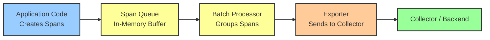

# How to Fix "Span Batch Export Error" in OpenTelemetry SDKs

Author: [nawazdhandala](https://www.github.com/nawazdhandala)

Tags: OpenTelemetry, Tracing, Span Export, Batch Processing, SDK, Debugging, Troubleshooting, Performance

Description: Learn how to diagnose and fix span batch export errors in OpenTelemetry SDKs, covering timeout issues, queue overflow, exporter failures, and batch processor tuning.

---

One of the more frustrating errors you will see when working with OpenTelemetry tracing is the "span batch export error." This error means the SDK collected spans from your application but failed to send them out in a batch to the collector or backend. The spans either get dropped or pile up in memory, and you end up with gaps in your traces.

This post covers the main reasons batch exports fail, how to read the error messages to figure out what is going wrong, and concrete fixes for each scenario.

## What the Batch Span Processor Does

Before diving into the errors, it helps to understand how the batch processor works. When your application creates spans, they do not get sent immediately. Instead, they go into an internal queue. The batch span processor periodically pulls spans from this queue, groups them into batches, and sends them to the configured exporter.



The batch processor has several configurable parameters that control this behavior:

```python
# Python: BatchSpanProcessor configuration with all parameters
from opentelemetry.sdk.trace.export import BatchSpanProcessor

processor = BatchSpanProcessor(
    exporter,
    max_queue_size=2048,          # Maximum spans in the queue
    schedule_delay_millis=5000,    # How often batches are sent (ms)
    max_export_batch_size=512,     # Maximum spans per batch
    export_timeout_millis=30000    # Timeout for each export call (ms)
)
```

When any part of this pipeline breaks, you get a batch export error. Let us look at the specific failure modes.

## Error Type 1: Export Timeout

The most common batch export error is a timeout. The exporter tried to send a batch but the collector or backend did not respond in time.

```
WARNING:opentelemetry.sdk.trace.export:Span export timed out after 30000ms
Failed to export 512 spans: deadline exceeded
```

This usually means the collector is overloaded, the network is slow, or the batch is too large for the available bandwidth. Here is how to fix it:

```python
# Python: Increase timeout and reduce batch size to avoid timeouts
from opentelemetry.exporter.otlp.proto.grpc.trace_exporter import OTLPSpanExporter
from opentelemetry.sdk.trace.export import BatchSpanProcessor

exporter = OTLPSpanExporter(
    endpoint="http://collector:4317",
    insecure=True,
    timeout=60  # Exporter-level timeout in seconds
)

processor = BatchSpanProcessor(
    exporter,
    max_export_batch_size=256,     # Smaller batches export faster
    export_timeout_millis=60000,   # Give more time per batch
    schedule_delay_millis=3000     # Send more frequently
)
```

```javascript
// Node.js: Adjust batch processor and exporter timeouts
const { BatchSpanProcessor } = require('@opentelemetry/sdk-trace-base');
const { OTLPTraceExporter } = require('@opentelemetry/exporter-trace-otlp-grpc');

const exporter = new OTLPTraceExporter({
    url: 'http://collector:4317',
    // gRPC deadline in milliseconds
    timeoutMillis: 60000
});

const processor = new BatchSpanProcessor(exporter, {
    maxExportBatchSize: 256,       // Smaller batches
    scheduledDelayMillis: 3000,    // More frequent sends
    exportTimeoutMillis: 60000,    // Longer timeout
    maxQueueSize: 4096             // Larger queue to buffer during slow exports
});
```

The idea is to send smaller batches more frequently so each individual export completes faster, and to give a longer timeout so transient slowness does not cause failures.

## Error Type 2: Queue Overflow and Dropped Spans

When the exporter cannot keep up with the rate of incoming spans, the queue fills up and spans get dropped:

```
WARNING:opentelemetry.sdk.trace.export:Queue is full, dropping span
Dropped 128 spans due to queue overflow (queue size: 2048/2048)
```

This is a backpressure problem. Your application produces spans faster than the exporter can send them. The fix involves both increasing the queue and improving export throughput:

```python
# Python: Tune queue size and export rate for high-throughput applications
from opentelemetry.sdk.trace.export import BatchSpanProcessor

processor = BatchSpanProcessor(
    exporter,
    max_queue_size=8192,           # Larger queue to absorb bursts
    max_export_batch_size=512,     # Larger batches for efficiency
    schedule_delay_millis=2000,    # Send batches every 2 seconds
    export_timeout_millis=30000
)
```

```go
// Go: Configure batch processor with larger queue
import (
    "go.opentelemetry.io/otel/sdk/trace"
    "time"
)

bsp := trace.NewBatchSpanProcessor(exporter,
    trace.WithMaxQueueSize(8192),             // Buffer more spans
    trace.WithMaxExportBatchSize(512),        // Larger batches
    trace.WithBatchTimeout(2 * time.Second),  // Export every 2 seconds
    trace.WithExportTimeout(30 * time.Second),
)
```

If increasing the queue still does not help, you might need to use sampling to reduce the volume of spans being created in the first place:

```python
# Python: Use a parent-based sampler to reduce span volume
from opentelemetry.sdk.trace.sampling import TraceIdRatioBased, ParentBasedTraceIdRatio

# Sample 25% of traces instead of all of them
sampler = ParentBasedTraceIdRatio(0.25)

provider = TracerProvider(
    sampler=sampler,
    resource=resource
)
```

## Error Type 3: Exporter Connection Failure

Sometimes the batch processor itself works fine but the exporter cannot connect to the collector at all:

```
Failed to export 512 spans: rpc error: code = Unavailable
desc = connection error: desc = "transport: Error while dialing"
```

This is a connectivity issue between your application and the collector. The batch processor will retry, but if the connection stays down, it keeps failing and eventually starts dropping spans when the queue fills up.

The key thing to understand is that the batch processor has limited retry logic built in. For persistent connection issues, you need to fix the underlying network problem. But you can configure the exporter to handle transient issues better:

```python
# Python: Configure retry behavior for gRPC exporter
from opentelemetry.exporter.otlp.proto.grpc.trace_exporter import OTLPSpanExporter

exporter = OTLPSpanExporter(
    endpoint="http://collector:4317",
    insecure=True,
    timeout=30
)

# The batch processor will retry on failure
# Increase the queue to buffer spans during temporary outages
processor = BatchSpanProcessor(
    exporter,
    max_queue_size=16384,          # Large queue to buffer during outages
    schedule_delay_millis=5000,
    max_export_batch_size=512,
    export_timeout_millis=30000
)
```

```java
// Java: Configure retry with environment variables
// These environment variables control OTLP exporter retry behavior
// OTEL_EXPORTER_OTLP_RETRY_ENABLED=true
// OTEL_EXPORTER_OTLP_RETRY_MAX_ATTEMPTS=5
// OTEL_EXPORTER_OTLP_RETRY_INITIAL_BACKOFF=1000
// OTEL_EXPORTER_OTLP_RETRY_MAX_BACKOFF=5000

// Or configure programmatically
OtlpGrpcSpanExporter exporter = OtlpGrpcSpanExporter.builder()
    .setEndpoint("http://collector:4317")
    .setTimeout(30, TimeUnit.SECONDS)
    .setRetryPolicy(RetryPolicy.builder()
        .setMaxAttempts(5)
        .setInitialBackoff(Duration.ofSeconds(1))
        .setMaxBackoff(Duration.ofSeconds(5))
        .build())
    .build();
```

## Error Type 4: Serialization Failures

Less common but still worth knowing about: sometimes the batch export fails because a span contains data that cannot be serialized properly. This can happen with very large attribute values or malformed data:

```
Failed to export batch: marshal error: attribute value exceeds maximum size
```

The fix is to limit attribute sizes and count:

```python
# Python: Set span attribute limits to prevent serialization issues
from opentelemetry.sdk.trace import TracerProvider, SpanLimits

# Configure limits on span data
span_limits = SpanLimits(
    max_attributes=128,                    # Maximum attributes per span
    max_attribute_length=1024,             # Maximum length of string attributes
    max_events=128,                        # Maximum events per span
    max_links=128,                         # Maximum links per span
    max_event_attributes=128,              # Maximum attributes per event
    max_link_attributes=128                # Maximum attributes per link
)

provider = TracerProvider(
    span_limits=span_limits,
    resource=resource
)
```

```javascript
// Node.js: Configure span limits
const { NodeTracerProvider } = require('@opentelemetry/sdk-trace-node');

const provider = new NodeTracerProvider({
    spanLimits: {
        attributeCountLimit: 128,          // Max attributes per span
        attributeValueLengthLimit: 1024,   // Max string attribute length
        eventCountLimit: 128,              // Max events per span
        linkCountLimit: 128                // Max links per span
    }
});
```

## Diagnosing with Debug Logging

When you are not sure which type of error you are hitting, enable debug logging to get the full picture:

```bash
# Enable debug logging via environment variables
export OTEL_LOG_LEVEL=debug

# Python-specific debug logging
export OTEL_PYTHON_LOG_LEVEL=debug
```

```python
# Python: Enable logging programmatically for more control
import logging

# Set OpenTelemetry logger to DEBUG
logging.getLogger("opentelemetry").setLevel(logging.DEBUG)

# This will show you:
# - When batches are scheduled for export
# - How many spans are in each batch
# - Whether exports succeed or fail
# - The specific error when exports fail
# - Queue depth at each export cycle
```

Debug logging will produce output like this when things are working:

```
DEBUG:opentelemetry.sdk.trace.export:BatchSpanProcessor: exporting 256 spans
DEBUG:opentelemetry.sdk.trace.export:BatchSpanProcessor: export completed successfully
DEBUG:opentelemetry.sdk.trace.export:BatchSpanProcessor: queue depth 45/2048
```

And like this when things are failing:

```
DEBUG:opentelemetry.sdk.trace.export:BatchSpanProcessor: exporting 512 spans
WARNING:opentelemetry.sdk.trace.export:BatchSpanProcessor: export failed
ERROR:opentelemetry.exporter.otlp.proto.grpc:Export RPC failed: StatusCode.DEADLINE_EXCEEDED
DEBUG:opentelemetry.sdk.trace.export:BatchSpanProcessor: queue depth 2048/2048
WARNING:opentelemetry.sdk.trace.export:BatchSpanProcessor: dropping spans, queue full
```

## Monitoring Batch Processor Health

You can monitor the health of your batch processor using internal metrics. OpenTelemetry SDKs emit metrics about the batch processor that you can scrape:

```
# Key metrics to watch
otel.sdk.span.exported       - Number of successfully exported spans
otel.sdk.span.dropped        - Number of dropped spans (queue overflow)
otel.sdk.span.export_errors  - Number of failed export attempts
otel.sdk.span.queue_size     - Current queue depth
```

Set up alerts on `otel.sdk.span.dropped` and `otel.sdk.span.export_errors` so you get notified before the problem becomes severe.

## Best Practices for Avoiding Batch Export Errors

Here is a summary of configuration recommendations based on your application profile:

```python
# Low-throughput application (< 100 spans/second)
# Default settings are usually fine
processor = BatchSpanProcessor(
    exporter,
    max_queue_size=2048,
    max_export_batch_size=512,
    schedule_delay_millis=5000,
    export_timeout_millis=30000
)

# Medium-throughput application (100-1000 spans/second)
# Increase queue and send frequency
processor = BatchSpanProcessor(
    exporter,
    max_queue_size=8192,
    max_export_batch_size=512,
    schedule_delay_millis=2000,
    export_timeout_millis=30000
)

# High-throughput application (> 1000 spans/second)
# Large queue, frequent sends, consider sampling
processor = BatchSpanProcessor(
    exporter,
    max_queue_size=16384,
    max_export_batch_size=1024,
    schedule_delay_millis=1000,
    export_timeout_millis=30000
)
```

Also remember to always call `shutdown()` on your tracer provider when your application exits. This flushes any remaining spans in the queue:

```python
# Python: Proper shutdown to flush remaining spans
import atexit

provider = TracerProvider(resource=resource)
provider.add_span_processor(processor)

# Register shutdown hook to flush spans on exit
atexit.register(lambda: provider.shutdown())
```

```javascript
// Node.js: Graceful shutdown
process.on('SIGTERM', async () => {
    // Flush all pending spans before shutting down
    await provider.shutdown();
    process.exit(0);
});
```

## Conclusion

Span batch export errors in OpenTelemetry come down to four main causes: timeouts from slow exports, queue overflow from high span volume, connection failures to the collector, and serialization issues from oversized attributes. The batch processor is designed to be resilient, but it needs proper tuning for your workload. Start with debug logging to identify the specific failure mode, then adjust your batch processor parameters accordingly. For high-throughput applications, combine larger queues and more frequent exports with sampling to keep the telemetry pipeline healthy without losing critical trace data.
