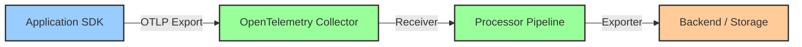

# How to Fix "Traces Not Showing Up" in Your OpenTelemetry Backend

Author: [nawazdhandala](https://www.github.com/nawazdhandala)

Tags: OpenTelemetry, Tracing, Troubleshooting, Backend, Debugging, Observability

Description: A practical troubleshooting guide to diagnose and fix traces not appearing in your OpenTelemetry backend, covering SDK, collector, and exporter issues.

You have instrumented your application with OpenTelemetry, deployed the collector, and configured your backend. But when you open the trace viewer, nothing is there. No spans, no traces, just an empty screen staring back at you. This is one of the most common and frustrating problems teams run into when adopting OpenTelemetry.

The good news is that traces going missing almost always comes down to a handful of well-known causes. This guide walks through each layer of the telemetry pipeline, from the SDK inside your application to the collector and finally the backend, with concrete steps to find and fix the problem.

## Understanding the Trace Pipeline

Before diving into fixes, it helps to visualize the full path a trace takes from your application to the backend:



A break at any point in this chain will cause traces to disappear. The trick is figuring out which link is broken.

## Step 1: Verify the SDK Is Actually Generating Traces

The most overlooked cause is that the application never creates traces in the first place. Maybe the tracer provider was not registered, or the exporter was never wired in.

Start by adding a debug exporter or console exporter to confirm spans are being created:

```python
# Python example: verify spans are generated locally
from opentelemetry import trace
from opentelemetry.sdk.trace import TracerProvider
from opentelemetry.sdk.trace.export import (
    ConsoleSpanExporter,
    SimpleSpanProcessor,
)

# Set up a tracer provider with a console exporter
# This prints every span to stdout so you can confirm creation
provider = TracerProvider()
provider.add_span_processor(SimpleSpanProcessor(ConsoleSpanExporter()))
trace.set_tracer_provider(provider)

# Create a test span
tracer = trace.get_tracer("debug.tracer")
with tracer.start_as_current_span("test-span") as span:
    span.set_attribute("test.key", "test-value")
    print("Span created successfully")
```

If you see span output in your console, the SDK is working. If you see nothing, the tracer provider is not initialized or not set as the global provider. Double check that `trace.set_tracer_provider()` is called before any instrumentation runs.

For Node.js applications, the same approach applies:

```javascript
// Node.js: verify span generation with console exporter
const { NodeTracerProvider } = require('@opentelemetry/sdk-trace-node');
const { ConsoleSpanExporter, SimpleSpanProcessor } = require('@opentelemetry/sdk-trace-base');

// Create provider with console output
const provider = new NodeTracerProvider();

// SimpleSpanProcessor sends spans immediately (not batched)
// Use this for debugging only, not production
provider.addSpanProcessor(new SimpleSpanProcessor(new ConsoleSpanExporter()));
provider.register();

const tracer = provider.getTracer('debug-tracer');
const span = tracer.startSpan('test-span');
span.setAttribute('test.key', 'test-value');
span.end();
```

The key detail here is using `SimpleSpanProcessor` instead of `BatchSpanProcessor`. The simple processor exports spans immediately, making it easier to confirm that spans exist. Batch processors can delay export and make debugging harder.

## Step 2: Check the Exporter Endpoint Configuration

If spans are generated but never reach the collector, the exporter endpoint is usually wrong. This is especially common when running in containers or Kubernetes where hostnames differ from local development.

```python
# Common mistake: wrong endpoint
from opentelemetry.exporter.otlp.proto.grpc.trace_exporter import OTLPSpanExporter

# This will fail silently if the collector is not on localhost
exporter = OTLPSpanExporter(endpoint="http://localhost:4317")

# Correct endpoint for Kubernetes deployments
# Use the collector service name and namespace
exporter = OTLPSpanExporter(
    endpoint="http://otel-collector.observability.svc.cluster.local:4317",
    insecure=True,  # Required for non-TLS gRPC connections
)
```

A subtle pitfall is the difference between gRPC and HTTP protocols. The OTLP gRPC exporter uses port 4317 by default, while the HTTP exporter uses port 4318. Mixing these up results in connection failures that may not produce obvious errors in your application logs.

```yaml
# Collector receiver configuration showing both ports
receivers:
  otlp:
    protocols:
      # gRPC receiver on port 4317
      grpc:
        endpoint: 0.0.0.0:4317
      # HTTP receiver on port 4318
      http:
        endpoint: 0.0.0.0:4318
```

Verify connectivity by sending a test request to the collector:

```bash
# Test gRPC connectivity to the collector
grpcurl -plaintext localhost:4317 list

# Test HTTP connectivity to the collector
curl -v http://localhost:4318/v1/traces \
  -H "Content-Type: application/json" \
  -d '{"resourceSpans": []}'
```

A successful HTTP response (even with an empty payload) confirms the collector is reachable and accepting data on that port.

## Step 3: Inspect the Collector Pipeline

The collector may be receiving traces but dropping them before they reach the exporter. This happens when processors filter out data, or when the pipeline is misconfigured.

Enable the debug exporter in your collector to see what data passes through:

```yaml
# Add debug exporter to trace pipeline
receivers:
  otlp:
    protocols:
      grpc:
        endpoint: 0.0.0.0:4317

processors:
  batch:
    timeout: 5s
    send_batch_size: 100

exporters:
  # Debug exporter prints telemetry to collector stdout
  debug:
    verbosity: detailed

  otlp:
    endpoint: backend.example.com:4317

service:
  pipelines:
    traces:
      receivers: [otlp]
      processors: [batch]
      # Include debug exporter alongside your real exporter
      exporters: [debug, otlp]
```

With `verbosity: detailed`, the debug exporter prints full span content to the collector logs. If you see spans in the debug output but they do not appear in your backend, the problem is between the collector exporter and the backend.

If you see nothing in the debug output either, the collector is not receiving data. Go back to Step 2 and verify the endpoint and protocol.

## Step 4: Verify the Backend Exporter Configuration

The collector exporter must be configured to match what your backend expects. Common issues include wrong endpoints, missing authentication headers, and TLS mismatches.

```yaml
# Example: exporting to a backend that requires authentication
exporters:
  otlp:
    endpoint: traces.backend.example.com:443
    # TLS is required when using port 443
    tls:
      insecure: false
    # Authentication headers required by many commercial backends
    headers:
      "Authorization": "Bearer ${env:BACKEND_API_KEY}"
      "X-Tenant-ID": "my-team"
```

Check the collector logs for export errors:

```bash
# Look for exporter errors in collector logs
kubectl logs -n observability deployment/otel-collector | grep -i "error\|fail\|refused"
```

Common error patterns and their meaning:

```
# Connection refused: backend is unreachable
"error": "connection refused"

# Permission denied: authentication is wrong or missing
"error": "rpc error: code = PermissionDenied"

# Deadline exceeded: backend is too slow or overloaded
"error": "rpc error: code = DeadlineExceeded"

# Resource exhausted: backend is rejecting data due to rate limits
"error": "rpc error: code = ResourceExhausted"
```

Each of these points to a specific problem in the connection between collector and backend.

## Step 5: Check for Sampling That Drops Traces

Sampling is a frequent cause of "missing" traces that are actually working as designed. If you have configured a sampler, it may be dropping traces before they are exported.

```python
# Python: check if a sampler is dropping traces
from opentelemetry.sdk.trace import TracerProvider
from opentelemetry.sdk.trace.sampling import TraceIdRatioBased

# This sampler only keeps 10% of traces
# 90% of your traces will never appear in the backend
sampler = TraceIdRatioBased(0.1)
provider = TracerProvider(sampler=sampler)
```

For testing, temporarily switch to the `ALWAYS_ON` sampler to confirm that all traces reach the backend:

```python
# Use AlwaysOn sampler to confirm the pipeline works
from opentelemetry.sdk.trace.sampling import ALWAYS_ON

provider = TracerProvider(sampler=ALWAYS_ON)
```

You can also set the sampler via environment variable without changing code:

```bash
# Force all traces to be sampled
export OTEL_TRACES_SAMPLER=always_on

# Run your application
python app.py
```

If traces appear with `always_on` but not with your configured sampler, the sampler is working correctly and just filtering out the traces you are looking for. Adjust the sampling rate or use a tail-based sampler in the collector for more control.

## Step 6: Look for Resource and Attribute Mismatches

Some backends require specific resource attributes to index and display traces. If `service.name` is missing or set to a default value, traces might end up in an unexpected location.

```python
# Set resource attributes explicitly
from opentelemetry.sdk.resources import Resource
from opentelemetry.sdk.trace import TracerProvider

# Without a service name, traces may be filed under "unknown_service"
# and not appear where you expect in the backend UI
resource = Resource.create({
    "service.name": "my-api-service",
    "service.version": "1.2.3",
    "deployment.environment": "production",
})

provider = TracerProvider(resource=resource)
```

You can also set the service name via environment variable:

```bash
# Set service name via environment variable
export OTEL_SERVICE_NAME=my-api-service
export OTEL_RESOURCE_ATTRIBUTES=service.version=1.2.3,deployment.environment=production
```

Check your backend UI for traces filed under "unknown_service" or "OTLPResourceNoServiceName". These names indicate that the SDK did not have a service name configured.

## Step 7: Verify Network and Firewall Rules

In cloud and Kubernetes environments, network policies and firewalls can silently block OTLP traffic.

```yaml
# Kubernetes NetworkPolicy allowing OTLP traffic to collector
apiVersion: networking.k8s.io/v1
kind: NetworkPolicy
metadata:
  name: allow-otlp-to-collector
  namespace: observability
spec:
  podSelector:
    matchLabels:
      app: otel-collector
  ingress:
    # Allow gRPC and HTTP OTLP traffic from all namespaces
    - from:
        - namespaceSelector: {}
      ports:
        - protocol: TCP
          port: 4317
        - protocol: TCP
          port: 4318
```

Test connectivity from your application pod directly:

```bash
# From an application pod, test collector connectivity
kubectl exec -it deployment/my-app -- curl -v http://otel-collector.observability:4318/v1/traces \
  -H "Content-Type: application/json" \
  -d '{"resourceSpans": []}'
```

A connection timeout or refused connection at this step confirms a network issue between your application and the collector.

## Systematic Debugging Checklist

When traces are missing, work through this checklist from bottom to top:

1. Are spans being created? (Console exporter test)
2. Is the exporter endpoint correct? (Protocol and port match)
3. Is the collector receiving data? (Debug exporter in collector)
4. Is the collector exporting data? (Check collector logs for errors)
5. Is sampling dropping traces? (Switch to always_on temporarily)
6. Are resource attributes correct? (Check for unknown_service)
7. Is the network path open? (Connectivity test from app to collector)

Working through these steps methodically will identify the broken link in your trace pipeline. Most of the time, the fix is a simple configuration change in an endpoint URL, a port number, or a missing environment variable.

## Conclusion

Traces not showing up is almost never a deep platform bug. It is nearly always a configuration issue at one of the well-defined boundaries in the telemetry pipeline. By systematically checking each layer from SDK to collector to backend, you can quickly isolate and resolve the problem. Start with the console exporter to prove spans exist, work outward to the collector with the debug exporter, and then verify the final hop to your backend. Once you have done this a few times, the debugging process becomes second nature.
