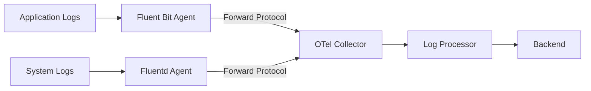

# How to Configure the Fluent Forward Receiver in the OpenTelemetry Collector

Author: [nawazdhandala](https://www.github.com/nawazdhandala)

Tags: OpenTelemetry, Collector, Fluent Forward, Fluentd, Logging, Observability

Description: Learn how to configure the Fluent Forward receiver in OpenTelemetry Collector to ingest logs from Fluentd and Fluent Bit with practical YAML examples and best practices.

The Fluent Forward receiver enables the OpenTelemetry Collector to receive logs via the Fluentd Forward protocol. This receiver is particularly useful when migrating from Fluentd or Fluent Bit to OpenTelemetry, or when you need to integrate existing Fluentd-based logging infrastructure with your OpenTelemetry pipeline. In current Collector releases, the receiver type is `fluent_forward`; the older `fluentforward` name is a deprecated alias.

## Understanding the Fluent Forward Protocol

The Fluentd Forward protocol is a binary protocol used by Fluentd and Fluent Bit to transfer log data between agents and aggregators. By implementing this protocol, the OpenTelemetry Collector can act as a drop-in replacement for Fluentd aggregators, making migration paths smoother and enabling hybrid deployments.

The protocol supports both TCP and Unix socket connections, making it flexible for various deployment scenarios. When logs are received through this protocol, they are automatically converted into OpenTelemetry's log data model, allowing you to leverage the full power of OpenTelemetry processors and exporters.


```mermaid
graph LR
    A[Fluent Bit Agent] -->|Forward Protocol| B[OTel Collector]
    C[Fluentd Agent] -->|Forward Protocol| B
    D[Application Logs] --> A
    E[System Logs] --> C
    B --> F[Log Processor]
    F --> G[Backend]
```

## Basic Configuration

The minimal configuration for the Fluent Forward receiver requires the receiver declaration and an endpoint. The OpenTelemetry documentation commonly uses `0.0.0.0:8006` in examples.

Here's a basic configuration:

```yaml
receivers:
  # Fluent Forward receiver
  fluent_forward:
    # Listen on all interfaces on port 8006
    endpoint: 0.0.0.0:8006

processors:
  # Add batch processing to improve performance
  batch:
    timeout: 10s
    send_batch_size: 1024

exporters:
  # Export logs to stdout for testing
  debug:
    verbosity: basic

service:
  pipelines:
    logs:
      receivers: [fluent_forward]
      processors: [batch]
      exporters: [debug]
```

This configuration creates a log pipeline that receives Fluent Forward messages, batches them for efficiency, and exports them to the console for verification.

## Advanced Configuration Options

The Fluent Forward receiver supports several advanced configuration options for production deployments.

### Network Configuration

You can customize the network settings to control how the receiver accepts connections:

```yaml
receivers:
  fluent_forward:
    # Listen on a specific interface and port
    endpoint: 0.0.0.0:24224

    # Unix socket listener (alternative to TCP)
    # Useful for same-host communication with better performance
    # endpoint: unix:///var/run/fluent-forward.sock
```

The `endpoint` parameter controls whether the receiver listens on TCP or a Unix domain socket. When using TCP, the receiver also starts a UDP listener on the same port for Forward protocol heartbeat responses.

### Authentication and Security

The upstream Fluent Forward receiver does not support TLS or the handshake portion of the Forward protocol, including shared key authentication. If you need to prevent unauthorized log submissions, place the receiver behind trusted network controls or a separate TLS/authentication proxy:

```yaml
receivers:
  fluent_forward:
    endpoint: 0.0.0.0:24224
```

Do not configure Fluentd or Fluent Bit Forward shared key authentication or TLS directly against this receiver, because the Collector will not complete the secure Forward handshake.

## Configuring Fluentd to Send Logs

To send logs from Fluentd to the OpenTelemetry Collector, configure a forward output:

```conf
# Fluentd configuration to forward logs to OpenTelemetry Collector

<source>
  @type tail
  path /var/log/app/*.log
  pos_file /var/log/td-agent/app.log.pos
  tag app.logs
  <parse>
    @type json
    time_key timestamp
    time_format %Y-%m-%dT%H:%M:%S.%NZ
  </parse>
</source>

<match app.logs>
  @type forward

  # OpenTelemetry Collector endpoint
  <server>
    host otel-collector.example.com
    port 24224
  </server>

  # Buffer configuration for reliability
  <buffer>
    @type file
    path /var/log/td-agent/buffer/forward
    flush_interval 5s
    retry_type exponential_backoff
    retry_max_interval 30s
  </buffer>
</match>
```

## Configuring Fluent Bit to Send Logs

Fluent Bit can also forward logs using the Forward protocol:

```conf
[SERVICE]
    Flush        5
    Daemon       Off
    Log_Level    info

[INPUT]
    Name              tail
    Path              /var/log/containers/*.log
    Parser            docker
    Tag               kube.*
    Refresh_Interval  5
    Mem_Buf_Limit     5MB

[OUTPUT]
    Name          forward
    Match         *
    Host          otel-collector.example.com
    Port          24224

    # Retry settings
    Retry_Limit   5

```

## Production-Ready Configuration

Here's a complete production configuration that includes memory protection, resource attributes, and multiple export destinations:

```yaml
receivers:
  fluent_forward:
    endpoint: 0.0.0.0:24224

processors:
  # Add resource attributes for better context
  resource:
    attributes:
      - key: collector.name
        value: otel-fluent-forward
        action: insert
      - key: deployment.environment
        value: production
        action: insert

  # Parse and extract structured data from logs
  attributes:
    actions:
      - key: log.file.path
        action: extract
        pattern: ^/var/log/(?P<service>[^/]+)/.*$
      - key: service.name
        from_attribute: service
        action: insert

  # Batch logs for efficiency
  batch:
    timeout: 10s
    send_batch_size: 2048

  # Add memory limiter to prevent OOM
  memory_limiter:
    check_interval: 1s
    limit_mib: 512
    spike_limit_mib: 128

exporters:
  # Export to observability backend
  otlp:
    endpoint: https://observability.example.com:4317
    headers:
      api-key: "${env:OBSERVABILITY_API_KEY}"
    compression: gzip

  # Keep console export for debugging
  debug:
    verbosity: basic
    sampling_initial: 5
    sampling_thereafter: 200

service:
  pipelines:
    logs:
      receivers: [fluent_forward]
      processors: [memory_limiter, resource, attributes, batch]
      exporters: [otlp, debug]

  # Enable telemetry for collector monitoring
  telemetry:
    logs:
      level: info
    metrics:
      level: detailed
```

## Monitoring and Troubleshooting

The Fluent Forward receiver exposes several metrics to help you monitor its health and performance. The Collector exposes internal Prometheus-format metrics at `http://127.0.0.1:8888/metrics` by default; you can adjust the internal telemetry level like this:

```yaml
service:
  telemetry:
    metrics:
      level: detailed
```

Key metrics to monitor include:

- `otelcol_receiver_accepted_log_records`: Number of log records successfully received
- `otelcol_receiver_refused_log_records`: Number of log records rejected
- `otelcol_fluent_events_parsed`: Number of Fluent events parsed successfully
- `otelcol_fluent_parse_failures`: Number of times Fluent messages failed to be decoded
- `otelcol_processor_batch_timeout_trigger_send`: How often batches are sent due to timeout
- `otelcol_exporter_send_failed_log_records`: Number of logs that failed to export

## Common Issues and Solutions

### Connection Refused

If Fluentd or Fluent Bit cannot connect to the collector, verify:

1. The endpoint configuration matches on both sides
2. Firewall rules allow traffic on the configured port
3. The collector is running and listening on the correct interface

### Secure Forward Handshake Failures

If Fluentd or Fluent Bit is configured with Forward shared key authentication or TLS, the connection will fail because the OpenTelemetry Collector Fluent Forward receiver does not support TLS or the Forward protocol handshake. Remove those settings from clients that connect directly to the Collector, or terminate TLS/authentication before traffic reaches the receiver.


### High Memory Usage

If the collector consumes excessive memory:

1. Reduce `send_batch_size` in the batch processor
2. Enable and tune the memory limiter processor
3. Increase export frequency to reduce buffering

## Integration with OneUptime

When using OneUptime as your observability backend, configure the OTLP exporter to send logs:

```yaml
exporters:
  otlp:
    endpoint: https://opentelemetry-collector.oneuptime.com:4317
    headers:
      x-oneuptime-token: "${env:ONEUPTIME_API_KEY}"
    compression: gzip

service:
  pipelines:
    logs:
      receivers: [fluent_forward]
      processors: [batch]
      exporters: [otlp]
```

For more information on OpenTelemetry Collector exporters, see our guide on [configuring OTLP exporters](https://oneuptime.com/blog/post/2026-02-06-otlp-grpc-exporter-opentelemetry-collector/view).

## Conclusion

The Fluent Forward receiver provides a seamless migration path from Fluentd-based logging infrastructure to OpenTelemetry. By supporting the Fluent Forward protocol, it allows you to incrementally adopt OpenTelemetry while maintaining compatibility with existing Fluentd and Fluent Bit deployments.

Start with a basic configuration and gradually add network controls, proxy-based security, and advanced processing as your requirements grow. Monitor the receiver metrics to ensure healthy operation and tune configuration parameters based on your specific workload characteristics.

For more OpenTelemetry Collector receivers, explore our guides on the [Docker Stats receiver](https://oneuptime.com/blog/post/2026-02-06-docker-stats-receiver-opentelemetry-collector/view) and [PostgreSQL receiver](https://oneuptime.com/blog/post/2026-02-06-postgresql-receiver-opentelemetry-collector/view).
