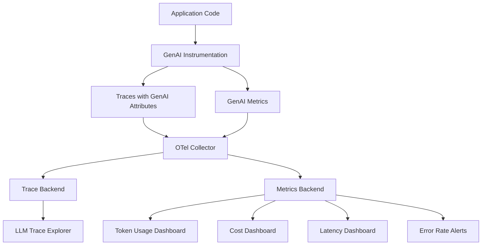

# How to Use GenAI Semantic Conventions for LLM Monitoring

Author: [nawazdhandala](https://www.github.com/nawazdhandala)

Tags: OpenTelemetry, Semantic Conventions, GenAI, LLM, Monitoring, Observability, AI

Description: Learn how to instrument LLM applications using OpenTelemetry GenAI semantic conventions to track token usage, latency, model performance, and costs.

---

Large language models are becoming core infrastructure in modern applications, handling everything from customer support chatbots to code generation pipelines. But monitoring LLM operations is different from monitoring traditional API calls. You need to track token counts, model parameters, prompt and completion details, and costs that vary by model and provider. The OpenTelemetry GenAI semantic conventions provide a standardized framework for capturing all of this telemetry.

This guide walks through the GenAI semantic conventions, shows how to instrument LLM calls in your applications, and demonstrates how to build meaningful monitoring dashboards from the collected data.

## The GenAI Semantic Convention Namespace

OpenTelemetry's GenAI conventions live under the `gen_ai` namespace and cover the full lifecycle of an LLM interaction. The conventions define attributes for the request, the response, token usage, and the model itself.

```text
# Core GenAI attributes

gen_ai.system              - The GenAI provider (e.g., "openai", "anthropic")
gen_ai.request.model       - Model requested (e.g., "gpt-4", "claude-3-opus")
gen_ai.response.model      - Model that actually served the request
gen_ai.operation.name      - Type of operation ("chat", "text_completion", "embeddings")

# Token usage attributes
gen_ai.usage.input_tokens  - Number of tokens in the prompt
gen_ai.usage.output_tokens - Number of tokens in the completion

# Request parameters
gen_ai.request.temperature      - Temperature parameter for the request
gen_ai.request.top_p            - Top-p (nucleus) sampling parameter
gen_ai.request.max_tokens       - Maximum tokens requested for completion
gen_ai.request.stop_sequences   - Stop sequences provided in the request

# Response attributes
gen_ai.response.finish_reasons  - Why the model stopped generating
gen_ai.response.id              - Unique identifier for the response
```

These attributes give you a complete picture of every LLM call your application makes. By standardizing on these names, you can build dashboards and alerts that work across different LLM providers.

## Instrumenting LLM Calls

Here is how to instrument a typical OpenAI API call with the GenAI semantic conventions.

```python
# llm_instrumentation.py
# Wraps OpenAI API calls with OpenTelemetry spans using GenAI conventions.
# Captures token usage, model info, latency, and request parameters.

from opentelemetry import trace
import openai
import time

tracer = trace.get_tracer("llm-service", "1.0.0")

def instrumented_chat_completion(
    messages: list,
    model: str = "gpt-4",
    temperature: float = 0.7,
    max_tokens: int = 1000
) -> dict:
    """Make an OpenAI chat completion call with full telemetry."""

    # Start a span named according to GenAI conventions
    # Format: <gen_ai.operation.name> <gen_ai.request.model>
    with tracer.start_as_current_span(f"chat {model}") as span:

        # Set request attributes before the call
        span.set_attribute("gen_ai.system", "openai")
        span.set_attribute("gen_ai.operation.name", "chat")
        span.set_attribute("gen_ai.request.model", model)
        span.set_attribute("gen_ai.request.temperature", temperature)
        span.set_attribute("gen_ai.request.max_tokens", max_tokens)

        try:
            # Make the actual API call
            client = openai.OpenAI()
            response = client.chat.completions.create(
                model=model,
                messages=messages,
                temperature=temperature,
                max_tokens=max_tokens
            )

            # Set response attributes after the call
            span.set_attribute("gen_ai.response.model", response.model)
            span.set_attribute("gen_ai.response.id", response.id)

            # Capture finish reasons as a list
            finish_reasons = [
                choice.finish_reason for choice in response.choices
            ]
            span.set_attribute("gen_ai.response.finish_reasons", finish_reasons)

            # Token usage is critical for cost tracking
            if response.usage:
                span.set_attribute(
                    "gen_ai.usage.input_tokens",
                    response.usage.prompt_tokens
                )
                span.set_attribute(
                    "gen_ai.usage.output_tokens",
                    response.usage.completion_tokens
                )

            return response

        except openai.APIError as e:
            # Record the error on the span
            span.set_status(trace.StatusCode.ERROR, str(e))
            span.record_exception(e)
            raise
```

Every LLM call now produces a span with rich metadata. You can see which model was used, how many tokens were consumed, what parameters were set, and how long the call took.

## Instrumenting Multi-Provider Applications

Many applications use multiple LLM providers. The GenAI conventions handle this cleanly because the `gen_ai.system` attribute distinguishes between providers.

```python
# multi_provider.py
# A unified LLM client that instruments calls to multiple providers
# using the same GenAI semantic conventions.

from opentelemetry import trace

tracer = trace.get_tracer("llm-gateway", "1.0.0")

class InstrumentedLLMClient:
    """Wraps multiple LLM providers with consistent telemetry."""

    def call_openai(self, prompt: str, model: str = "gpt-4") -> dict:
        """Call OpenAI with GenAI convention instrumentation."""
        with tracer.start_as_current_span(f"chat {model}") as span:
            span.set_attribute("gen_ai.system", "openai")
            span.set_attribute("gen_ai.operation.name", "chat")
            span.set_attribute("gen_ai.request.model", model)

            # ... make the API call ...
            # ... set response attributes ...
            return response

    def call_anthropic(self, prompt: str, model: str = "claude-3-opus") -> dict:
        """Call Anthropic with GenAI convention instrumentation."""
        with tracer.start_as_current_span(f"chat {model}") as span:
            span.set_attribute("gen_ai.system", "anthropic")
            span.set_attribute("gen_ai.operation.name", "chat")
            span.set_attribute("gen_ai.request.model", model)

            # ... make the API call ...
            # ... set response attributes ...
            return response

    def call_embedding(self, text: str, model: str = "text-embedding-3-small") -> list:
        """Generate embeddings with GenAI convention instrumentation."""
        with tracer.start_as_current_span(f"embeddings {model}") as span:
            span.set_attribute("gen_ai.system", "openai")
            span.set_attribute("gen_ai.operation.name", "embeddings")
            span.set_attribute("gen_ai.request.model", model)

            # ... make the API call ...
            # Set token usage (embeddings only have input tokens)
            span.set_attribute("gen_ai.usage.input_tokens", token_count)

            return embeddings
```

With this approach, a single dashboard can show you token usage, latency, and error rates broken down by `gen_ai.system` and `gen_ai.request.model`. You get a unified view across all your LLM providers.

## Capturing Prompt and Completion Events

The GenAI conventions also define span events for recording prompt and completion content. This is optional and should be gated by a configuration flag since prompts may contain sensitive data.

```python
# prompt_events.py
# Records prompt and completion content as span events.
# IMPORTANT: Only enable this in environments where prompt logging is acceptable.
# Prompts may contain PII or confidential business data.

from opentelemetry import trace
import os

tracer = trace.get_tracer("llm-service", "1.0.0")

# Control prompt logging via environment variable
CAPTURE_PROMPTS = os.environ.get("OTEL_GENAI_CAPTURE_CONTENT", "false").lower() == "true"

def chat_with_events(messages: list, model: str = "gpt-4") -> dict:
    """Make a chat completion call with optional prompt/completion events."""

    with tracer.start_as_current_span(f"chat {model}") as span:
        span.set_attribute("gen_ai.system", "openai")
        span.set_attribute("gen_ai.request.model", model)

        # Record each message as a gen_ai.content.prompt event
        if CAPTURE_PROMPTS:
            for i, msg in enumerate(messages):
                span.add_event(
                    "gen_ai.content.prompt",
                    attributes={
                        "gen_ai.prompt": msg.get("content", ""),
                        # Role helps distinguish system, user, and assistant messages
                        "gen_ai.prompt.role": msg.get("role", "user"),
                        "gen_ai.prompt.index": i,
                    }
                )

        # Make the API call
        response = call_openai_api(messages, model)

        # Record the completion as a gen_ai.content.completion event
        if CAPTURE_PROMPTS:
            for choice in response.choices:
                span.add_event(
                    "gen_ai.content.completion",
                    attributes={
                        "gen_ai.completion": choice.message.content,
                        "gen_ai.completion.role": choice.message.role,
                        "gen_ai.completion.index": choice.index,
                    }
                )

        return response
```

The `OTEL_GENAI_CAPTURE_CONTENT` environment variable follows the pattern used by OpenTelemetry auto-instrumentation libraries. When set to `true`, full prompt and completion text is recorded. When `false`, only the metadata (token counts, model, parameters) is captured.

## Metrics for LLM Operations

Beyond traces, the GenAI conventions define standard metrics for monitoring LLM operations at a higher level.

```python
# llm_metrics.py
# Records GenAI metrics using OpenTelemetry conventions.
# These metrics power high-level dashboards for LLM cost and performance.

from opentelemetry import metrics

meter = metrics.get_meter("llm-service", "1.0.0")

# Token usage counters - critical for cost tracking
input_token_counter = meter.create_counter(
    name="gen_ai.client.token.usage",
    description="Total tokens consumed by LLM operations",
    unit="{token}"
)

# Operation duration histogram - tracks latency distribution
operation_duration = meter.create_histogram(
    name="gen_ai.client.operation.duration",
    description="Duration of GenAI operations",
    unit="s"
)

def record_llm_metrics(
    system: str,
    model: str,
    operation: str,
    input_tokens: int,
    output_tokens: int,
    duration_seconds: float
):
    """Record standard GenAI metrics for an LLM operation."""

    # Common attributes for all metrics from this operation
    common_attrs = {
        "gen_ai.system": system,
        "gen_ai.request.model": model,
        "gen_ai.operation.name": operation,
    }

    # Record input and output tokens separately using the token type attribute
    input_token_counter.add(
        input_tokens,
        {**common_attrs, "gen_ai.token.type": "input"}
    )
    input_token_counter.add(
        output_tokens,
        {**common_attrs, "gen_ai.token.type": "output"}
    )

    # Record operation duration
    operation_duration.record(duration_seconds, common_attrs)
```

These metrics give you aggregated views that traces alone cannot efficiently provide. You can answer questions like "How many total tokens did we consume from GPT-4 today?" or "What is the p99 latency for Anthropic chat completions?" without scanning individual traces.

## Cost Tracking with Token Metrics

One of the most valuable uses of GenAI telemetry is cost tracking. Token counts combined with model information let you calculate spend in near real-time.

```python
# cost_calculator.py
# Estimates LLM costs from OpenTelemetry metrics data.
# Prices are approximate and should be updated as providers change rates.

# Cost per 1000 tokens (input / output) in USD
MODEL_PRICING = {
    "gpt-4": {"input": 0.03, "output": 0.06},
    "gpt-4-turbo": {"input": 0.01, "output": 0.03},
    "gpt-3.5-turbo": {"input": 0.0005, "output": 0.0015},
    "claude-3-opus": {"input": 0.015, "output": 0.075},
    "claude-3-sonnet": {"input": 0.003, "output": 0.015},
    "claude-3-haiku": {"input": 0.00025, "output": 0.00125},
}

def estimate_cost(model: str, input_tokens: int, output_tokens: int) -> float:
    """Estimate the cost of an LLM operation based on token usage."""
    pricing = MODEL_PRICING.get(model, {"input": 0.01, "output": 0.03})

    input_cost = (input_tokens / 1000) * pricing["input"]
    output_cost = (output_tokens / 1000) * pricing["output"]

    return input_cost + output_cost

def daily_cost_report(metrics_data: list) -> dict:
    """Generate a daily cost report from collected GenAI metrics."""
    report = {}

    for entry in metrics_data:
        model = entry["gen_ai.request.model"]
        system = entry["gen_ai.system"]
        key = f"{system}/{model}"

        if key not in report:
            report[key] = {
                "input_tokens": 0,
                "output_tokens": 0,
                "total_cost": 0.0,
                "operation_count": 0
            }

        report[key]["input_tokens"] += entry.get("input_tokens", 0)
        report[key]["output_tokens"] += entry.get("output_tokens", 0)
        report[key]["operation_count"] += 1
        report[key]["total_cost"] += estimate_cost(
            model,
            entry.get("input_tokens", 0),
            entry.get("output_tokens", 0)
        )

    return report
```

With this cost data flowing through your observability pipeline, you can set budget alerts, identify expensive operations, and make informed decisions about model selection.

## Dashboard Architecture

Here is how the pieces fit together into a monitoring architecture for LLM operations.



The trace explorer lets you drill into individual LLM calls to see prompts, completions, and parameters. The metrics dashboards give you fleet-wide views of token usage, costs, latency distributions, and error rates. Alerts fire when costs spike, error rates increase, or latency degrades.

## Streaming Response Instrumentation

Many LLM applications use streaming responses for better user experience. Instrumenting streaming calls requires a slightly different approach since token counts are only available after the stream completes.

```python
# streaming_instrumentation.py
# Instruments streaming LLM responses, recording the span
# only after the full response has been received.

from opentelemetry import trace

tracer = trace.get_tracer("llm-service", "1.0.0")

def instrumented_streaming_chat(messages: list, model: str = "gpt-4"):
    """Stream a chat completion with telemetry captured at stream end."""

    span = tracer.start_span(f"chat {model}")
    span.set_attribute("gen_ai.system", "openai")
    span.set_attribute("gen_ai.request.model", model)
    span.set_attribute("gen_ai.operation.name", "chat")

    try:
        client = openai.OpenAI()
        stream = client.chat.completions.create(
            model=model,
            messages=messages,
            stream=True,
            stream_options={"include_usage": True}
        )

        # Yield chunks to the caller while accumulating metadata
        full_content = []
        for chunk in stream:
            if chunk.choices and chunk.choices[0].delta.content:
                content = chunk.choices[0].delta.content
                full_content.append(content)
                yield content

            # The final chunk contains usage information
            if chunk.usage:
                span.set_attribute(
                    "gen_ai.usage.input_tokens",
                    chunk.usage.prompt_tokens
                )
                span.set_attribute(
                    "gen_ai.usage.output_tokens",
                    chunk.usage.completion_tokens
                )

        # Mark the span as successful and end it
        span.set_status(trace.StatusCode.OK)

    except Exception as e:
        span.set_status(trace.StatusCode.ERROR, str(e))
        span.record_exception(e)
        raise

    finally:
        span.end()
```

The key detail here is that we create the span manually instead of using a context manager, because the span needs to stay open for the entire duration of the streaming response. The `stream_options={"include_usage": True}` parameter tells OpenAI to include token counts in the final streamed chunk.

## Getting Started

If you are just beginning to instrument LLM operations, start with the basics: set `gen_ai.system`, `gen_ai.request.model`, `gen_ai.operation.name`, and the token usage attributes on every LLM call. These five attributes alone give you enough data for cost tracking, latency monitoring, and error rate alerting. Add prompt and completion events later once you have addressed the privacy and compliance considerations for your organization.

The GenAI semantic conventions are still evolving as the LLM landscape matures, but the core attributes covered here are stable and widely supported. Building on them now gives you a strong foundation for LLM observability that will grow with your AI infrastructure.
