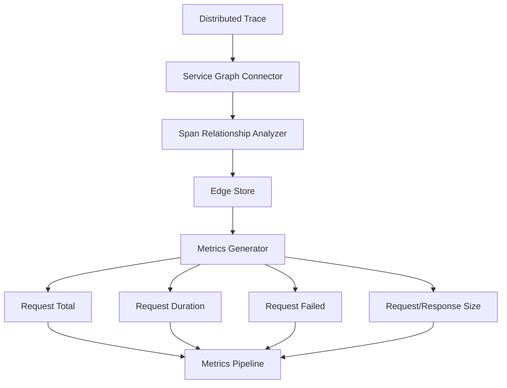

# How to Generate Service Graph Metrics from Traces in the Collector

Author: [nawazdhandala](https://www.github.com/nawazdhandala)

Tags: OpenTelemetry, Collector, Service Graph, Traces, Metrics, Distributed Tracing, Microservices

Description: Learn how to use the Service Graph connector in OpenTelemetry Collector to automatically generate service dependency metrics and visualize microservice relationships from distributed traces.

Understanding service dependencies and communication patterns is critical in microservices architectures. The Service Graph connector in the OpenTelemetry Collector automatically analyzes distributed traces to generate metrics that describe how services interact with each other. These metrics reveal request rates, latency distributions, error rates, and payload sizes between service pairs, providing invaluable insights for troubleshooting, capacity planning, and architectural decisions.

## What is the Service Graph Connector?

The Service Graph connector is a specialized connector that analyzes parent-child relationships within distributed traces to infer service-to-service communication patterns. By examining span relationships, the connector identifies which services call which other services and generates metrics representing these interactions.

When a trace flows through your system, it creates a chain of spans. A span representing a service calling another service has a parent-child relationship where the parent is the calling service and the child is the called service. The Service Graph connector tracks these relationships and aggregates them into metrics that represent edges in your service dependency graph.

## Core Concepts

Understanding the fundamental concepts helps clarify how service graph metrics work:

**Service Node**: A distinct service in your architecture, identified by attributes like `service.name` and `service.namespace`.

**Service Edge**: A connection between two services, representing that one service calls another. This is the fundamental unit the connector tracks.

**Client and Server**: In each edge, the client is the calling service and the server is the called service. Metrics are labeled with both.

**Span Relationship Analysis**: The connector examines parent-child span relationships to determine service edges. A client span (span.kind = CLIENT) whose child is a server span (span.kind = SERVER) indicates an inter-service call.

## Basic Service Graph Configuration

Here's a foundational configuration to generate service graph metrics:

```yaml
receivers:
  otlp:
    protocols:
      grpc:
        endpoint: 0.0.0.0:4317

processors:
  batch:
    timeout: 10s
    send_batch_size: 1024

connectors:
  servicegraph:
    # Configure the trace relationship store
    store:
      # Maximum number of edges to track
      max_items: 10000
      # How long to keep edge information (must be >= 2x expected trace duration)
      ttl: 5s

    # Define histogram buckets for latency metrics
    latency_histogram_buckets: [10ms, 50ms, 100ms, 250ms, 500ms, 1s, 2.5s, 5s, 10s]

    # Dimensions to include in generated metrics
    dimensions:
      - service.name
      - service.namespace

exporters:
  otlp/traces:
    endpoint: jaeger:4317

  prometheusremotewrite:
    endpoint: http://prometheus:9090/api/v1/write

service:
  pipelines:
    # Traces pipeline feeds the service graph connector
    traces:
      receivers: [otlp]
      processors: [batch]
      exporters: [servicegraph, otlp/traces]

    # Metrics pipeline receives service graph metrics
    metrics/service-graph:
      receivers: [servicegraph]
      processors: [batch]
      exporters: [prometheusremotewrite]
```

This configuration analyzes all incoming traces and generates metrics describing service-to-service communication patterns.

## Understanding Generated Metrics

The Service Graph connector generates several types of metrics:

**Request Total**: `traces_service_graph_request_total{client="service-a", server="service-b"}` counts the total number of requests from service-a to service-b.

**Request Failed Total**: `traces_service_graph_request_failed_total{client="service-a", server="service-b"}` counts failed requests between services.

**Request Duration**: `traces_service_graph_request_duration_seconds{client="service-a", server="service-b"}` provides a histogram of request latency between services.

**Request Size**: `traces_service_graph_request_size_bytes{client="service-a", server="service-b"}` tracks request payload sizes (if available).

**Response Size**: `traces_service_graph_response_size_bytes{client="service-a", server="service-b"}` tracks response payload sizes (if available).

## Service Graph Data Flow

Understanding how the connector processes traces is essential:



As traces arrive, the connector examines span relationships, stores edge information temporarily, and periodically emits aggregated metrics.

## Configuring Store Parameters

The store configuration is critical for accurate metric generation:

```yaml
connectors:
  servicegraph:
    store:
      # Maximum edges to track in memory
      # Set based on: (number of services)^2 * expected dimension cardinality
      max_items: 50000

      # Time-to-live for edge data
      # Must be at least 2x your longest expected trace duration
      # Too short: incomplete traces won't be properly analyzed
      # Too long: higher memory usage
      ttl: 10s

      # Cleanup interval for expired edges
      # How often to remove expired edge data
      cleanup_interval: 5s
```

The TTL is particularly important. If a trace takes 3 seconds to complete, but your TTL is only 2 seconds, the connector might not see all spans before the relationship expires, resulting in incomplete service graph metrics.

## Customizing Dimensions

Dimensions determine how granular your service graph metrics are:

```yaml
connectors:
  servicegraph/detailed:
    store:
      max_items: 100000
      ttl: 10s

    latency_histogram_buckets: [10ms, 50ms, 100ms, 250ms, 500ms, 1s, 2.5s, 5s, 10s]

    # Include additional dimensions
    dimensions:
      - service.name
      - service.namespace
      - service.version
      - deployment.environment
      - k8s.cluster.name

    # You can also include span attributes as dimensions
    span_attributes:
      - http.method
      - http.route
      - rpc.method
```

More dimensions provide finer granularity but increase cardinality. For a service graph, focus on service-level attributes rather than request-level attributes to keep cardinality manageable.

## Configuring Latency Histogram Buckets

Tailor histogram buckets to your service latency characteristics:

```yaml
connectors:
  # Fast microservices (APIs, caches)
  servicegraph/fast:
    latency_histogram_buckets: [1ms, 5ms, 10ms, 25ms, 50ms, 100ms, 250ms, 500ms, 1s]

  # Standard web services
  servicegraph/standard:
    latency_histogram_buckets: [10ms, 50ms, 100ms, 250ms, 500ms, 1s, 2.5s, 5s, 10s]

  # Slow batch processing or external APIs
  servicegraph/slow:
    latency_histogram_buckets: [100ms, 500ms, 1s, 5s, 10s, 30s, 60s, 120s, 300s]
```

Choose buckets that capture the distribution of your service latencies. Too few buckets lose detail; too many buckets increase storage costs without adding value.

## Filtering Traces for Service Graph Generation

You can selectively process traces to focus on specific service interactions:

```yaml
processors:
  # Only analyze production traffic
  filter/production:
    traces:
      span:
        - 'resource.attributes["deployment.environment"] == "production"'

  # Exclude internal health checks
  filter/exclude-health:
    traces:
      span:
        - 'attributes["http.route"] != "/health"'
        - 'attributes["http.route"] != "/readiness"'

  # Only analyze specific services
  filter/critical-services:
    traces:
      span:
        - 'resource.attributes["service.name"] matches "^(payment|auth|checkout).*"'

connectors:
  servicegraph:
    store:
      max_items: 10000
      ttl: 5s
    latency_histogram_buckets: [10ms, 50ms, 100ms, 250ms, 500ms, 1s, 2.5s, 5s]

service:
  pipelines:
    traces:
      receivers: [otlp]
      processors: [filter/production, filter/exclude-health, batch]
      exporters: [servicegraph, otlp/traces]

    metrics/service-graph:
      receivers: [servicegraph]
      exporters: [prometheusremotewrite]
```

Filtering reduces the volume of data processed and focuses metrics on relevant service interactions.

## Handling Virtual Services and Edge Cases

In complex architectures, you may need to handle special cases:

```yaml
processors:
  # Normalize service names
  transform/normalize:
    trace_statements:
      - context: resource
        statements:
          # Remove version numbers from service names
          - replace_pattern(attributes["service.name"], "^(.+)-v\\d+$", "$$1")

          # Map load balancers to backend services
          - set(attributes["service.name"], "api-backend") where attributes["service.name"] == "nginx-lb"

  # Add virtual node for external services
  attributes/external:
    actions:
      - key: service.name
        pattern: ".*\\.(amazonaws\\.com|external\\.api).*"
        value: "external-service"
        action: update

connectors:
  servicegraph:
    store:
      max_items: 10000
      ttl: 5s
    latency_histogram_buckets: [10ms, 50ms, 100ms, 250ms, 500ms, 1s, 2.5s, 5s]
    dimensions:
      - service.name
      - service.namespace

service:
  pipelines:
    traces:
      receivers: [otlp]
      processors: [transform/normalize, attributes/external, batch]
      exporters: [servicegraph, otlp/traces]

    metrics/service-graph:
      receivers: [servicegraph]
      exporters: [prometheusremotewrite]
```

These transformations ensure your service graph accurately represents your architecture, even with complex routing, versioning, or external dependencies.

## Multi-Cluster Service Graph

For multi-cluster deployments, create separate service graphs per cluster:

```yaml
receivers:
  otlp/cluster-a:
    protocols:
      grpc:
        endpoint: 0.0.0.0:4317

  otlp/cluster-b:
    protocols:
      grpc:
        endpoint: 0.0.0.0:4318

processors:
  # Tag with cluster identifier
  resource/cluster-a:
    attributes:
      - key: k8s.cluster.name
        value: "production-us-east"
        action: insert

  resource/cluster-b:
    attributes:
      - key: k8s.cluster.name
        value: "production-eu-west"
        action: insert

connectors:
  # Separate service graph per cluster
  servicegraph/cluster-a:
    store:
      max_items: 50000
      ttl: 10s
    latency_histogram_buckets: [10ms, 50ms, 100ms, 250ms, 500ms, 1s, 2.5s, 5s]
    dimensions:
      - service.name
      - k8s.cluster.name

  servicegraph/cluster-b:
    store:
      max_items: 50000
      ttl: 10s
    latency_histogram_buckets: [10ms, 50ms, 100ms, 250ms, 500ms, 1s, 2.5s, 5s]
    dimensions:
      - service.name
      - k8s.cluster.name

exporters:
  prometheusremotewrite:
    endpoint: http://prometheus:9090/api/v1/write

service:
  pipelines:
    traces/cluster-a:
      receivers: [otlp/cluster-a]
      processors: [resource/cluster-a, batch]
      exporters: [servicegraph/cluster-a]

    traces/cluster-b:
      receivers: [otlp/cluster-b]
      processors: [resource/cluster-b, batch]
      exporters: [servicegraph/cluster-b]

    metrics/service-graph:
      receivers: [servicegraph/cluster-a, servicegraph/cluster-b]
      exporters: [prometheusremotewrite]
```

This approach maintains separate service graphs per cluster while allowing unified querying by including cluster name as a dimension.

## Combining Service Graph with Span Metrics

Use both connectors for comprehensive service monitoring:

```yaml
receivers:
  otlp:
    protocols:
      grpc:
        endpoint: 0.0.0.0:4317

processors:
  batch:
    timeout: 10s
    send_batch_size: 1024

connectors:
  # Generate service graph metrics
  servicegraph:
    store:
      max_items: 10000
      ttl: 5s
    latency_histogram_buckets: [10ms, 50ms, 100ms, 250ms, 500ms, 1s, 2.5s, 5s]
    dimensions:
      - service.name
      - service.namespace

  # Generate per-service RED metrics
  spanmetrics:
    histogram:
      explicit:
        buckets: [10ms, 50ms, 100ms, 250ms, 500ms, 1s, 2.5s, 5s, 10s]
    dimensions:
      - name: service.name
      - name: http.method
      - name: http.status_code
    namespace: span

exporters:
  otlp/traces:
    endpoint: jaeger:4317

  prometheusremotewrite:
    endpoint: http://prometheus:9090/api/v1/write

service:
  pipelines:
    # Traces feed both connectors
    traces:
      receivers: [otlp]
      processors: [batch]
      exporters: [servicegraph, spanmetrics, otlp/traces]

    # Service graph metrics
    metrics/service-graph:
      receivers: [servicegraph]
      exporters: [prometheusremotewrite]

    # Span metrics
    metrics/spans:
      receivers: [spanmetrics]
      exporters: [prometheusremotewrite]
```

Service graph metrics show inter-service communication, while span metrics provide detailed RED metrics for each service. Together, they offer complete observability.

## Real-World Example: E-Commerce Platform

Here's a comprehensive configuration for an e-commerce platform:

```yaml
receivers:
  otlp:
    protocols:
      grpc:
        endpoint: 0.0.0.0:4317
      http:
        endpoint: 0.0.0.0:4318

processors:
  # Resource detection
  resourcedetection:
    detectors: [env, system, docker, kubernetes]
    timeout: 5s

  # Memory protection
  memory_limiter:
    check_interval: 1s
    limit_mib: 1024

  # Batch processing
  batch:
    timeout: 10s
    send_batch_size: 1024

  # Filter out health checks and internal traffic
  filter/meaningful:
    traces:
      span:
        - 'attributes["http.route"] != "/health"'
        - 'attributes["http.route"] != "/metrics"'
        - 'resource.attributes["service.name"] != "istio-proxy"'

  # Normalize service names
  transform/normalize:
    trace_statements:
      - context: resource
        statements:
          # Remove replica identifiers
          - replace_pattern(attributes["service.name"], "^(.+)-[a-f0-9]{8,}$", "$$1")

  # Add business context
  attributes/business:
    actions:
      - key: business.tier
        from_attribute: service.namespace
        action: insert

connectors:
  servicegraph/platform:
    store:
      # Large e-commerce platform with many services
      max_items: 100000
      # Long TTL for slow payment/shipping processes
      ttl: 30s
      cleanup_interval: 10s

    # Buckets covering fast APIs to slow payment processing
    latency_histogram_buckets: [10ms, 50ms, 100ms, 250ms, 500ms, 1s, 2.5s, 5s, 10s, 30s, 60s]

    dimensions:
      - service.name
      - service.namespace
      - business.tier
      - deployment.environment
      - k8s.cluster.name

    # Generate all available metric types
    metrics:
      calls:
        enabled: true
      duration:
        enabled: true
      request_size:
        enabled: true
      response_size:
        enabled: true
      failed_requests:
        enabled: true

exporters:
  # Export traces to Tempo
  otlp/tempo:
    endpoint: tempo:4317
    compression: gzip
    sending_queue:
      enabled: true
      num_consumers: 10
      queue_size: 5000

  # Export service graph metrics to Prometheus
  prometheusremotewrite/graph:
    endpoint: http://prometheus:9090/api/v1/write
    compression: snappy
    headers:
      X-Prometheus-Remote-Write-Version: "0.1.0"
    external_labels:
      source: service-graph
      platform: ecommerce

service:
  telemetry:
    logs:
      level: info
    metrics:
      level: detailed
      address: 0.0.0.0:8888

  pipelines:
    # Main traces pipeline
    traces/platform:
      receivers: [otlp]
      processors:
        - memory_limiter
        - resourcedetection
        - filter/meaningful
        - transform/normalize
        - attributes/business
        - batch
      exporters: [servicegraph/platform, otlp/tempo]

    # Service graph metrics pipeline
    metrics/service-graph:
      receivers: [servicegraph/platform]
      processors: [batch]
      exporters: [prometheusremotewrite/graph]
```

This configuration creates a comprehensive service graph for a complex e-commerce platform, capturing:

- Frontend to API gateway communication
- API gateway to microservice calls
- Microservice to database interactions
- Service to external payment processor calls
- Async service to message queue interactions

## Visualizing Service Graph Metrics

Once metrics are generated, you can query them in Prometheus and visualize in Grafana:

```promql
# Request rate between services
rate(traces_service_graph_request_total[5m])

# Error rate between specific services
rate(traces_service_graph_request_failed_total{client="frontend", server="api-gateway"}[5m])

# P95 latency between services
histogram_quantile(0.95,
  rate(traces_service_graph_request_duration_seconds_bucket[5m])
)

# Top service dependencies by request volume
topk(10,
  sum by (client, server) (rate(traces_service_graph_request_total[5m]))
)

# Services with highest error rates
topk(5,
  sum by (server) (rate(traces_service_graph_request_failed_total[5m]))
)
```

These queries power dashboards showing:

- Service dependency maps
- Traffic flow visualization
- Latency heatmaps
- Error hotspots
- Request volume trends

## Performance Optimization

Service graph generation can be memory-intensive. Optimize with these strategies:

**Right-Size max_items**: Calculate based on your service count. For N services, you may have up to N^2 edges, multiplied by dimension cardinality.

```yaml
# Formula: max_items >= (num_services)^2 * dimension_cardinality * safety_factor
# Example: 50 services, 5 dimensions, 2x safety = 50*50*5*2 = 25,000

connectors:
  servicegraph:
    store:
      max_items: 25000
```

**Optimize TTL**: Set TTL based on your p99 trace duration, not average. If p99 is 5 seconds, use TTL of 10-15 seconds.

**Filter Aggressively**: Remove health checks, internal monitoring, and other noise before service graph processing.

**Control Dimensions**: Fewer dimensions mean fewer unique metric series and lower memory usage.

```yaml
connectors:
  servicegraph/optimized:
    store:
      max_items: 10000
      ttl: 10s

    # Minimal dimensions for lower cardinality
    dimensions:
      - service.name
      # Consider removing:
      # - service.version (if not needed)
      # - deployment.environment (if single environment)

    # Wider buckets reduce histogram overhead
    latency_histogram_buckets: [100ms, 500ms, 1s, 5s, 10s]
```

## Monitoring Service Graph Generation

Track the health of your service graph connector:

```yaml
service:
  telemetry:
    logs:
      level: info
      initial_fields:
        service: otel-collector
    metrics:
      level: detailed
      address: 0.0.0.0:8888
```

Key metrics to monitor:

- `otelcol_connector_servicegraph_total_edges`: Current number of tracked edges
- `otelcol_connector_servicegraph_expired_edges`: Edges that expired (may indicate TTL too short)
- `otelcol_connector_servicegraph_traces_processed`: Traces analyzed
- `otelcol_processor_batch_batch_send_size_bucket`: Batch sizes for metrics

If `expired_edges` is high relative to `total_edges`, increase your TTL.

## Troubleshooting Common Issues

**No Metrics Generated**: Verify traces contain proper span.kind attributes (CLIENT/SERVER). Service graph requires these to determine service boundaries.

**Incomplete Service Graph**: Check TTL configuration. If traces take longer than TTL to complete, relationships won't be captured.

**High Memory Usage**: Reduce max_items, decrease TTL, or filter traces before service graph processing. Also consider reducing dimensions.

**Missing Service Relationships**: Ensure traces properly link parent and child spans with trace context propagation. Broken trace context prevents relationship detection.

## Related Resources

For more information about connectors and trace-to-metrics conversion:

- [How to Use Connectors to Link Traces and Metrics Pipelines](https://oneuptime.com/blog/post/2026-02-06-connectors-link-traces-metrics-pipelines-opentelemetry/view)
- [How to Convert Spans to Metrics Using the Span Metrics Connector](https://oneuptime.com/blog/post/2026-02-06-convert-spans-to-metrics-span-metrics-connector/view)
- [How to Configure the Signal to Metrics Connector in the OpenTelemetry Collector](https://oneuptime.com/blog/post/2026-02-06-signal-to-metrics-connector-opentelemetry-collector/view)

The Service Graph connector transforms your distributed traces into a clear picture of service dependencies, communication patterns, and interaction health, providing essential insights for operating and evolving microservices architectures.
