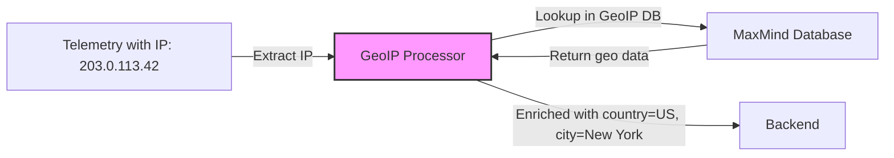

# How to Configure the GeoIP Processor in the OpenTelemetry Collector

Author: [nawazdhandala](https://www.github.com/nawazdhandala)

Tags: OpenTelemetry, Collector, Processors, GeoIP, Location, Observability, IP Enrichment

Description: Learn how to configure the GeoIP Processor in OpenTelemetry Collector to enrich telemetry data with geographical location information based on IP addresses.

IP addresses in your telemetry tell you where requests originate, but they don't tell you the geographic location, ISP, or network context. The GeoIP Processor solves this by enriching telemetry with location data derived from IP addresses. This enables geographic analysis, regional performance monitoring, and location-based alerting without modifying application code.

## What Is the GeoIP Processor?

The GeoIP Processor looks up IP addresses in telemetry data and adds geographic attributes like country, city, latitude, longitude, and ASN (Autonomous System Number). It uses MaxMind GeoIP databases or compatible alternatives to perform these lookups and enriches traces, metrics, and logs with location context.

This is useful when:

- You need to analyze performance by geographic region
- You want to detect unusual traffic patterns from specific locations
- Your SLOs differ by geographic market
- You need to route or filter telemetry based on location
- Compliance requires tracking data origin by region

## Architecture Overview

The GeoIP Processor enriches telemetry with location data based on IP attributes:



The processor reads IP addresses from configured attributes, looks them up in a local GeoIP database, and adds geographic attributes to the telemetry data.

## Basic Configuration

Here's a minimal GeoIP Processor configuration that enriches telemetry with country information:

```yaml
# Configure receivers to accept telemetry
receivers:
  otlp:
    protocols:
      grpc:
        endpoint: 0.0.0.0:4317
      http:
        endpoint: 0.0.0.0:4318

# Define the GeoIP Processor
processors:
  # The geoip processor enriches telemetry with geographic data
  geoip:
    # Path to MaxMind GeoIP database file
    # Download from https://dev.maxmind.com/geoip/geolite2-free-geolocation-data
    database_path: /etc/otel/GeoLite2-City.mmdb

    # Specify which attribute contains the IP address to lookup
    # This attribute should contain a valid IPv4 or IPv6 address
    source:
      attribute: client.address

    # Define which geographic attributes to add
    # These will be added as new attributes to your telemetry
    destination:
      # Add country ISO code (e.g., "US", "GB", "JP")
      country_code: geo.country_code

      # Add country name (e.g., "United States", "United Kingdom")
      country_name: geo.country_name

      # Add city name (e.g., "New York", "London", "Tokyo")
      city_name: geo.city_name

      # Add latitude and longitude coordinates
      latitude: geo.location.lat
      longitude: geo.location.lon

  # Batch processor for efficient export
  batch:
    timeout: 10s
    send_batch_size: 1024

# Configure export destination
exporters:
  otlphttp:
    endpoint: https://oneuptime.com/otlp
    headers:
      x-oneuptime-token: ${ONEUPTIME_TOKEN}

# Wire everything together in pipelines
service:
  pipelines:
    # Traces pipeline with GeoIP enrichment
    traces:
      receivers: [otlp]
      processors: [geoip, batch]
      exporters: [otlphttp]

    # Logs pipeline with GeoIP enrichment
    logs:
      receivers: [otlp]
      processors: [geoip, batch]
      exporters: [otlphttp]
```

## Setting Up GeoIP Databases

The GeoIP Processor requires MaxMind GeoIP2 or GeoLite2 databases. Here's how to obtain and maintain them:

### Downloading GeoLite2 (Free)

MaxMind provides free GeoLite2 databases with basic location data:

```bash
# Register for a free MaxMind account at https://www.maxmind.com/en/geolite2/signup
# Get your license key from the account dashboard

# Download GeoLite2-City database (includes country, city, location)
curl -L "https://download.maxmind.com/app/geoip_download?edition_id=GeoLite2-City&license_key=YOUR_LICENSE_KEY&suffix=tar.gz" \
  -o GeoLite2-City.tar.gz

# Extract the database file
tar -xzf GeoLite2-City.tar.gz
mv GeoLite2-City_*/GeoLite2-City.mmdb /etc/otel/

# Download GeoLite2-ASN database (includes ISP and network information)
curl -L "https://download.maxmind.com/app/geoip_download?edition_id=GeoLite2-ASN&license_key=YOUR_LICENSE_KEY&suffix=tar.gz" \
  -o GeoLite2-ASN.tar.gz

tar -xzf GeoLite2-ASN.tar.gz
mv GeoLite2-ASN_*/GeoLite2-ASN.mmdb /etc/otel/
```

### Automating Database Updates

GeoIP databases are updated regularly. Automate updates with a Kubernetes CronJob:

```yaml
apiVersion: batch/v1
kind: CronJob
metadata:
  name: geoip-updater
  namespace: observability
spec:
  # Run weekly on Sunday at 2 AM
  schedule: "0 2 * * 0"
  jobTemplate:
    spec:
      template:
        spec:
          containers:
          - name: updater
            image: curlimages/curl:latest
            command:
            - sh
            - -c
            - |
              curl -L "https://download.maxmind.com/app/geoip_download?edition_id=GeoLite2-City&license_key=${MAXMIND_LICENSE_KEY}&suffix=tar.gz" \
                -o /tmp/GeoLite2-City.tar.gz
              tar -xzf /tmp/GeoLite2-City.tar.gz -C /tmp
              mv /tmp/GeoLite2-City_*/GeoLite2-City.mmdb /data/GeoLite2-City.mmdb
            env:
            - name: MAXMIND_LICENSE_KEY
              valueFrom:
                secretKeyRef:
                  name: maxmind-credentials
                  key: license-key
            volumeMounts:
            - name: geoip-data
              mountPath: /data
          restartPolicy: OnFailure
          volumes:
          - name: geoip-data
            persistentVolumeClaim:
              claimName: geoip-data
```

## Advanced Configuration

### Multiple Database Lookups

Use multiple databases to enrich telemetry with different geographic attributes:

```yaml
processors:
  # City-level geographic data
  geoip/city:
    database_path: /etc/otel/GeoLite2-City.mmdb
    source:
      attribute: client.address

    destination:
      country_code: geo.country_code
      country_name: geo.country_name
      city_name: geo.city_name
      region_name: geo.region_name
      postal_code: geo.postal_code
      latitude: geo.location.lat
      longitude: geo.location.lon
      timezone: geo.timezone

  # Network and ISP data
  geoip/asn:
    database_path: /etc/otel/GeoLite2-ASN.mmdb
    source:
      attribute: client.address

    destination:
      asn: geo.asn
      organization: geo.organization
```

### Multiple IP Sources

Enrich telemetry with location data from different IP address fields:

```yaml
processors:
  # Enrich based on client IP
  geoip/client:
    database_path: /etc/otel/GeoLite2-City.mmdb
    source:
      attribute: http.client_ip

    destination:
      country_code: client.geo.country_code
      city_name: client.geo.city_name

  # Enrich based on server IP
  geoip/server:
    database_path: /etc/otel/GeoLite2-City.mmdb
    source:
      attribute: server.address

    destination:
      country_code: server.geo.country_code
      city_name: server.geo.city_name

  # Enrich based on X-Forwarded-For header
  geoip/forwarded:
    database_path: /etc/otel/GeoLite2-City.mmdb
    source:
      # Extract first IP from X-Forwarded-For header
      attribute: http.request.header.x-forwarded-for

    destination:
      country_code: origin.geo.country_code
      city_name: origin.geo.city_name
```

### Conditional Enrichment

Only enrich telemetry that matches specific criteria:

```yaml
processors:
  geoip:
    database_path: /etc/otel/GeoLite2-City.mmdb
    source:
      attribute: client.address

    destination:
      country_code: geo.country_code
      city_name: geo.city_name

    # Only enrich if the IP is not internal
    # Skip enrichment for RFC1918 private addresses
    skip_private: true

    # Only enrich specific signal types
    traces:
      enabled: true
    metrics:
      enabled: false
    logs:
      enabled: true
```

## Production Configuration Example

Here's a complete production-ready configuration with GeoIP enrichment, monitoring, and performance optimization:

```yaml
receivers:
  otlp:
    protocols:
      grpc:
        endpoint: 0.0.0.0:4317
      http:
        endpoint: 0.0.0.0:4318

processors:
  # Memory limiter prevents OOM issues
  memory_limiter:
    check_interval: 1s
    limit_mib: 1024
    spike_limit_mib: 256

  # Extract IP from X-Forwarded-For header if present
  attributes/extract_ip:
    actions:
      # Copy X-Forwarded-For to a working attribute
      - key: client.ip
        from_attribute: http.request.header.x-forwarded-for
        action: insert

      # If X-Forwarded-For not present, use source address
      - key: client.ip
        from_attribute: net.sock.peer.addr
        action: insert
        # Only insert if client.ip doesn't exist

  # City-level geographic enrichment
  geoip/city:
    database_path: /etc/otel/GeoLite2-City.mmdb
    source:
      attribute: client.ip

    destination:
      country_code: geo.country_code
      country_name: geo.country_name
      city_name: geo.city_name
      region_code: geo.region_code
      region_name: geo.region_name
      postal_code: geo.postal_code
      latitude: geo.location.lat
      longitude: geo.location.lon
      timezone: geo.timezone
      continent_code: geo.continent_code

    # Skip private/internal IPs
    skip_private: true

    # Cache lookups for performance
    cache:
      enabled: true
      max_size: 10000
      ttl: 1h

  # Network and ISP enrichment
  geoip/asn:
    database_path: /etc/otel/GeoLite2-ASN.mmdb
    source:
      attribute: client.ip

    destination:
      asn: geo.asn
      organization: geo.organization

    skip_private: true

    cache:
      enabled: true
      max_size: 5000
      ttl: 1h

  # Add computed attributes based on geo data
  attributes/geo_region:
    actions:
      # Add a region grouping for monitoring
      - key: geo.region_group
        value: "UNKNOWN"
        action: insert

      # North America
      - key: geo.region_group
        value: "NORTH_AMERICA"
        action: update
        # Activate when country is US, CA, or MX
        conditions:
          - key: geo.country_code
            value: "(US|CA|MX)"
            match_type: regexp

      # Europe
      - key: geo.region_group
        value: "EUROPE"
        action: update
        conditions:
          - key: geo.continent_code
            value: "EU"

      # Asia Pacific
      - key: geo.region_group
        value: "ASIA_PACIFIC"
        action: update
        conditions:
          - key: geo.continent_code
            value: "AS"

  # Resource processor adds deployment context
  resource:
    attributes:
      - key: collector.location
        value: ${COLLECTOR_REGION}
        action: upsert

  # Batch processor for efficient export
  batch:
    timeout: 10s
    send_batch_size: 1024
    send_batch_max_size: 2048

exporters:
  # Primary backend
  otlphttp/primary:
    endpoint: https://oneuptime.com/otlp
    headers:
      x-oneuptime-token: ${ONEUPTIME_TOKEN}
    compression: gzip
    retry_on_failure:
      enabled: true
      initial_interval: 5s
      max_interval: 30s
      max_elapsed_time: 300s

  # Debug logging
  logging:
    loglevel: info
    sampling_initial: 5
    sampling_thereafter: 50

service:
  extensions: [health_check, pprof]

  pipelines:
    traces:
      receivers: [otlp]
      processors:
        - memory_limiter
        - attributes/extract_ip
        - geoip/city
        - geoip/asn
        - attributes/geo_region
        - resource
        - batch
      exporters: [otlphttp/primary]

    logs:
      receivers: [otlp]
      processors:
        - memory_limiter
        - attributes/extract_ip
        - geoip/city
        - geoip/asn
        - attributes/geo_region
        - resource
        - batch
      exporters: [otlphttp/primary]

    metrics:
      receivers: [otlp]
      processors:
        - memory_limiter
        - batch
      exporters: [otlphttp/primary]

extensions:
  health_check:
    endpoint: 0.0.0.0:13133
  pprof:
    endpoint: 0.0.0.0:1777
```

## Deployment in Kubernetes

Deploy the GeoIP Processor in Kubernetes with persistent database storage:

```yaml
apiVersion: v1
kind: PersistentVolumeClaim
metadata:
  name: geoip-data
  namespace: observability
spec:
  accessModes:
    - ReadWriteMany
  resources:
    requests:
      storage: 1Gi
---
apiVersion: v1
kind: ConfigMap
metadata:
  name: otel-collector-config
  namespace: observability
data:
  collector.yaml: |
    receivers:
      otlp:
        protocols:
          grpc:
            endpoint: 0.0.0.0:4317
          http:
            endpoint: 0.0.0.0:4318

    processors:
      memory_limiter:
        check_interval: 1s
        limit_mib: 1024

      attributes/extract_ip:
        actions:
          - key: client.ip
            from_attribute: http.request.header.x-forwarded-for
            action: insert
          - key: client.ip
            from_attribute: net.sock.peer.addr
            action: insert

      geoip/city:
        database_path: /data/GeoLite2-City.mmdb
        source:
          attribute: client.ip
        destination:
          country_code: geo.country_code
          country_name: geo.country_name
          city_name: geo.city_name
          latitude: geo.location.lat
          longitude: geo.location.lon
        skip_private: true
        cache:
          enabled: true
          max_size: 10000
          ttl: 1h

      batch:
        timeout: 10s
        send_batch_size: 1024

    exporters:
      otlphttp:
        endpoint: https://oneuptime.com/otlp
        headers:
          x-oneuptime-token: ${ONEUPTIME_TOKEN}

    service:
      pipelines:
        traces:
          receivers: [otlp]
          processors: [memory_limiter, attributes/extract_ip, geoip/city, batch]
          exporters: [otlphttp]
        logs:
          receivers: [otlp]
          processors: [memory_limiter, attributes/extract_ip, geoip/city, batch]
          exporters: [otlphttp]
---
apiVersion: apps/v1
kind: Deployment
metadata:
  name: otel-collector
  namespace: observability
spec:
  replicas: 3
  selector:
    matchLabels:
      app: otel-collector
  template:
    metadata:
      labels:
        app: otel-collector
    spec:
      # Initialize GeoIP database on first run
      initContainers:
      - name: geoip-init
        image: curlimages/curl:latest
        command:
        - sh
        - -c
        - |
          if [ ! -f /data/GeoLite2-City.mmdb ]; then
            curl -L "https://download.maxmind.com/app/geoip_download?edition_id=GeoLite2-City&license_key=${MAXMIND_LICENSE_KEY}&suffix=tar.gz" \
              -o /tmp/GeoLite2-City.tar.gz
            tar -xzf /tmp/GeoLite2-City.tar.gz -C /tmp
            mv /tmp/GeoLite2-City_*/GeoLite2-City.mmdb /data/
          fi
        env:
        - name: MAXMIND_LICENSE_KEY
          valueFrom:
            secretKeyRef:
              name: maxmind-credentials
              key: license-key
        volumeMounts:
        - name: geoip-data
          mountPath: /data

      containers:
      - name: otel-collector
        image: otel/opentelemetry-collector-contrib:0.93.0
        args:
          - "--config=/conf/collector.yaml"
        env:
        - name: ONEUPTIME_TOKEN
          valueFrom:
            secretKeyRef:
              name: oneuptime-credentials
              key: token
        - name: COLLECTOR_REGION
          value: "us-east-1"
        volumeMounts:
        - name: config
          mountPath: /conf
        - name: geoip-data
          mountPath: /data
        ports:
        - containerPort: 4317
          name: otlp-grpc
        - containerPort: 4318
          name: otlp-http
        resources:
          requests:
            memory: "1Gi"
            cpu: "500m"
          limits:
            memory: "2Gi"
            cpu: "1000m"
        livenessProbe:
          httpGet:
            path: /
            port: 13133
          initialDelaySeconds: 30
          periodSeconds: 10
      volumes:
      - name: config
        configMap:
          name: otel-collector-config
      - name: geoip-data
        persistentVolumeClaim:
          claimName: geoip-data
---
apiVersion: v1
kind: Service
metadata:
  name: otel-collector
  namespace: observability
spec:
  type: ClusterIP
  selector:
    app: otel-collector
  ports:
  - name: otlp-grpc
    port: 4317
    targetPort: 4317
  - name: otlp-http
    port: 4318
    targetPort: 4318
```

## Use Cases and Queries

### Regional Performance Analysis

Query traces by geographic region to identify performance issues:

```
# Find slow requests by country
span.duration > 500ms
GROUP BY geo.country_code
ORDER BY p95(duration) DESC

# Compare latency across continents
span.duration
WHERE span.name = "GET /api/products"
GROUP BY geo.continent_code
```

### Geographic Traffic Distribution

Analyze traffic patterns by location:

```
# Request volume by city
COUNT(spans)
WHERE span.kind = "server"
GROUP BY geo.city_name, geo.country_code
ORDER BY count DESC
LIMIT 20

# Top regions by error rate
COUNT(spans WHERE span.status = "error") / COUNT(spans)
GROUP BY geo.region_group
```

### Anomaly Detection by Location

Alert on unusual traffic from unexpected locations:

```yaml
# Alert configuration example
alerts:
  - name: unusual_traffic_location
    query: |
      COUNT(spans)
      WHERE geo.country_code NOT IN ("US", "CA", "GB", "DE", "FR")
      AND span.name LIKE "/admin/%"
    threshold: 10
    window: 5m
    severity: high
```

## Validating GeoIP Enrichment

To verify that the GeoIP Processor is working correctly:

```yaml
exporters:
  # Add logging exporter to see enriched data
  logging:
    loglevel: debug
    sampling_initial: 10
    sampling_thereafter: 100

service:
  pipelines:
    traces:
      receivers: [otlp]
      processors: [attributes/extract_ip, geoip/city, batch]
      # Include logging exporter for validation
      exporters: [otlphttp, logging]
```

Check the Collector logs to verify geographic enrichment:

```bash
# View Collector logs
kubectl logs -n observability deployment/otel-collector -f | grep "geo\."

# Expected output showing enriched attributes:
# client.ip=203.0.113.42
# geo.country_code=US
# geo.country_name=United States
# geo.city_name=New York
# geo.location.lat=40.7128
# geo.location.lon=-74.0060
```

## Performance Optimization

The GeoIP Processor can impact performance with high-throughput telemetry. Optimize with these techniques:

### Enable Caching

Cache lookups to avoid repeated database queries:

```yaml
processors:
  geoip:
    database_path: /etc/otel/GeoLite2-City.mmdb
    source:
      attribute: client.ip

    destination:
      country_code: geo.country_code

    # Cache configuration
    cache:
      enabled: true
      # Maximum number of cached entries
      max_size: 50000
      # How long to cache each lookup
      ttl: 2h
```

### Selective Enrichment

Only enrich telemetry that needs geographic data:

```yaml
processors:
  # Only enrich HTTP server spans
  filter/http_only:
    traces:
      span:
        - 'attributes["span.kind"] == "server"'
        - 'attributes["http.method"] != nil'

  geoip:
    database_path: /etc/otel/GeoLite2-City.mmdb
    source:
      attribute: client.ip
    destination:
      country_code: geo.country_code

service:
  pipelines:
    traces:
      receivers: [otlp]
      processors: [filter/http_only, geoip, batch]
      exporters: [otlphttp]
```

## Troubleshooting

### Database Not Found

If the processor can't load the database:

```bash
# Verify database file exists and is readable
kubectl exec -n observability deployment/otel-collector -- ls -lh /data/GeoLite2-City.mmdb

# Check Collector logs for errors
kubectl logs -n observability deployment/otel-collector | grep -i "geoip\|database"
```

### IP Address Not Resolved

If IPs aren't being enriched:

```yaml
processors:
  # Add debug logging to see IP extraction
  attributes/debug:
    actions:
      - key: debug.ip_source
        from_attribute: client.ip
        action: insert

  geoip:
    database_path: /etc/otel/GeoLite2-City.mmdb
    source:
      attribute: client.ip
    destination:
      country_code: geo.country_code

    # Enable processor debug logging
    debug:
      enabled: true
```

## Privacy Considerations

When using the GeoIP Processor, consider privacy implications:

1. **PII concerns**: IP addresses may be considered personally identifiable information in some jurisdictions
2. **Data retention**: Define policies for how long enriched location data is retained
3. **Precision control**: Consider using only country-level data instead of city-level for privacy
4. **Internal traffic**: Use `skip_private: true` to avoid enriching internal IP addresses

Example privacy-focused configuration:

```yaml
processors:
  # Only enrich with country-level data
  geoip:
    database_path: /etc/otel/GeoLite2-Country.mmdb
    source:
      attribute: client.ip

    destination:
      # Only add country, not city or precise location
      country_code: geo.country_code

    skip_private: true

  # Remove the source IP after enrichment
  attributes/remove_ip:
    actions:
      - key: client.ip
        action: delete
      - key: http.client_ip
        action: delete
```

## Best Practices

1. **Update databases regularly**: GeoIP databases change frequently; automate updates weekly
2. **Enable caching**: Reduce lookup latency and database load with aggressive caching
3. **Skip private IPs**: Always set `skip_private: true` to avoid unnecessary lookups
4. **Monitor cache hit rate**: Track cache effectiveness to optimize cache size and TTL
5. **Consider privacy**: Only enrich with the precision needed for your use case

## Related Resources

- [What is OpenTelemetry Collector and Why Use One](https://oneuptime.com/blog/post/2025-09-18-what-is-opentelemetry-collector-and-why-use-one/view)
- [How to Reduce Noise in OpenTelemetry](https://oneuptime.com/blog/post/2025-08-25-how-to-reduce-noise-in-opentelemetry/view)
- [How to Configure the DNS Lookup Processor in OpenTelemetry Collector](https://oneuptime.com/blog/post/2026-02-06-dns-lookup-processor-opentelemetry-collector/view)

## Final Thoughts

The GeoIP Processor transforms IP addresses into actionable geographic context without modifying application code. By enriching telemetry with location data, you enable geographic performance analysis, regional SLO tracking, and location-based anomaly detection.

Start with basic country enrichment, maintain up-to-date GeoIP databases, and enable caching for optimal performance. With the GeoIP Processor, you gain geographic visibility into your telemetry data, enabling better operational insights and more effective incident response across global deployments.
