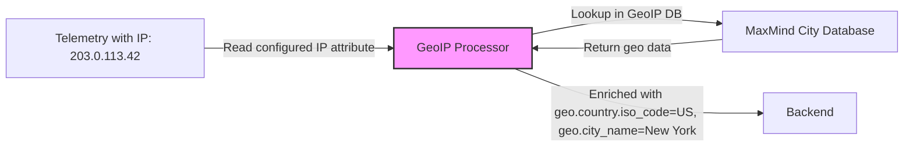

# How to Configure the GeoIP Processor in the OpenTelemetry Collector

Author: [nawazdhandala](https://www.github.com/nawazdhandala)

Tags: OpenTelemetry, Collector, Processor, GeoIP, Location, Observability, IP Enrichment

Description: Learn how to configure the GeoIP Processor in OpenTelemetry Collector to enrich telemetry data with geographical location information based on IP addresses.

IP addresses in your telemetry tell you where requests originate, but they don't tell you the geographic location or regional context. The GeoIP Processor solves this by enriching telemetry with location data derived from IP addresses. This enables geographic analysis, regional performance monitoring, and location-based alerting without modifying application code.

## What Is the GeoIP Processor?

The GeoIP Processor looks up IP addresses in telemetry data and adds geographic attributes like country, city, latitude, longitude, region, continent, postal code, and timezone. It uses a configured provider such as MaxMind GeoIP2-City or GeoLite2-City to perform these lookups and enriches traces, metrics, and logs with location context.

This is useful when:

- You need to analyze performance by geographic region
- You want to detect unusual traffic patterns from specific locations
- Your SLOs differ by geographic market
- You need to route or filter telemetry based on location
- Compliance requires tracking data origin by region

## Architecture Overview

The GeoIP Processor enriches telemetry with location data based on IP attributes:


```mermaid
graph LR
    A[Telemetry with IP: 203.0.113.42] -->|Read configured IP attribute| B[GeoIP Processor]
    B -->|Lookup in GeoIP DB| C[MaxMind City Database]
    C -->|Return geo data| B
    B -->|Enriched with geo.country.iso_code=US, geo.city_name=New York| D[Backend]

    style B fill:#f9f,stroke:#333,stroke-width:2px
```

The processor reads IP addresses from configured attributes, looks them up in a local GeoIP database, and adds geographic attributes to the telemetry data. By default, the processor looks for `client.address` and `source.address` and writes the location attributes to resource attributes. Set `context: record` when the IP address is stored on spans, log records, or metric data points.

## Basic Configuration

Here's a minimal GeoIP Processor configuration that enriches telemetry with location information:

```yaml
# Configure receivers to accept telemetry
receivers:
  otlp:
    protocols:
      grpc:
        endpoint: 0.0.0.0:4317
      http:
        endpoint: 0.0.0.0:4318

# Define the GeoIP Processor
processors:
  # The geoip processor enriches telemetry with geographic data
  geoip:
    # Configure a MaxMind provider and point it to a City database
    # Download from https://dev.maxmind.com/geoip/geolite2-free-geolocation-data
    providers:
      maxmind:
        database_path: /etc/otel/GeoLite2-City.mmdb

    # Look for IPs in record-level attributes such as span or log attributes
    context: record

    # Specify which attributes contain the IP address to look up
    # These attributes should contain a valid IPv4 or IPv6 address
    attributes: [client.address]

  # Batch processor for efficient export
  batch:
    timeout: 10s
    send_batch_size: 1024

# Configure export destination
exporters:
  otlphttp:
    endpoint: https://oneuptime.com/otlp
    headers:
      x-oneuptime-token: ${ONEUPTIME_TOKEN}

# Wire everything together in pipelines
service:
  pipelines:
    # Traces pipeline with GeoIP enrichment
    traces:
      receivers: [otlp]
      processors: [geoip, batch]
      exporters: [otlphttp]

    # Logs pipeline with GeoIP enrichment
    logs:
      receivers: [otlp]
      processors: [geoip, batch]
      exporters: [otlphttp]
```

When the lookup succeeds, the processor adds supported GeoIP attributes such as `geo.country.iso_code`, `geo.country_name`, `geo.city_name`, `geo.region.iso_code`, `geo.region_name`, `geo.continent.code`, `geo.continent_name`, `geo.postal_code`, `geo.timezone`, `geo.location.lat`, and `geo.location.lon`.

## Setting Up GeoIP Databases

The GeoIP Processor's MaxMind provider requires a MaxMind GeoIP2-City or GeoLite2-City database. Here's how to obtain and maintain one:

### Downloading GeoLite2 (Free)

MaxMind provides free GeoLite2 databases with basic location data:

```bash
# Register for a free MaxMind account at https://www.maxmind.com/en/geolite2/signup
# Get your license key from the account dashboard

# Download GeoLite2-City database (includes country, city, and location data)
curl -L "https://download.maxmind.com/app/geoip_download?edition_id=GeoLite2-City&license_key=YOUR_LICENSE_KEY&suffix=tar.gz" \
  -o GeoLite2-City.tar.gz

# Extract the database file
tar -xzf GeoLite2-City.tar.gz
mv GeoLite2-City_*/GeoLite2-City.mmdb /etc/otel/
```

### Automating Database Updates

GeoIP databases are updated regularly. Automate updates with a Kubernetes CronJob:

```yaml
apiVersion: batch/v1
kind: CronJob
metadata:
  name: geoip-updater
  namespace: observability
spec:
  # Run weekly on Sunday at 2 AM
  schedule: "0 2 * * 0"
  jobTemplate:
    spec:
      template:
        spec:
          containers:
          - name: updater
            image: curlimages/curl:latest
            command:
            - sh
            - -c
            - |
              curl -L "https://download.maxmind.com/app/geoip_download?edition_id=GeoLite2-City&license_key=${MAXMIND_LICENSE_KEY}&suffix=tar.gz" \
                -o /tmp/GeoLite2-City.tar.gz
              tar -xzf /tmp/GeoLite2-City.tar.gz -C /tmp
              mv /tmp/GeoLite2-City_*/GeoLite2-City.mmdb /data/GeoLite2-City.mmdb
            env:
            - name: MAXMIND_LICENSE_KEY
              valueFrom:
                secretKeyRef:
                  name: maxmind-credentials
                  key: license-key
            volumeMounts:
            - name: geoip-data
              mountPath: /data
          restartPolicy: OnFailure
          volumes:
          - name: geoip-data
            persistentVolumeClaim:
              claimName: geoip-data
```

## Advanced Configuration

### Multiple IP Sources

Enrich telemetry by checking more than one IP address field:

```yaml
processors:
  geoip:
    providers:
      maxmind:
        database_path: /etc/otel/GeoLite2-City.mmdb
    context: record
    attributes:
      - http.client_ip
      - client.address
      - source.address
```

The processor checks the configured attribute names for an IP address and writes the standard GeoIP attributes when the provider returns location data.

### Resource-Level Enrichment

If the IP address is stored as a resource attribute, use the default `resource` context:

```yaml
processors:
  geoip:
    providers:
      maxmind:
        database_path: /etc/otel/GeoLite2-City.mmdb
    attributes: [client.address, source.address]
```

### Conditional Enrichment

Only enrich telemetry that reaches the GeoIP Processor by using separate pipelines or a filter processor before GeoIP. For example, this pipeline drops non-HTTP spans before enrichment:

```yaml
processors:
  filter/http_only:
    error_mode: ignore
    trace_conditions:
      - span.attributes["http.request.method"] == nil

  geoip:
    providers:
      maxmind:
        database_path: /etc/otel/GeoLite2-City.mmdb
    context: record
    attributes: [client.address]

service:
  pipelines:
    traces:
      receivers: [otlp]
      processors: [filter/http_only, geoip, batch]
      exporters: [otlphttp]
```

## Production Configuration Example

Here's a complete production-ready configuration with GeoIP enrichment and monitoring:

```yaml
receivers:
  otlp:
    protocols:
      grpc:
        endpoint: 0.0.0.0:4317
      http:
        endpoint: 0.0.0.0:4318

processors:
  # Memory limiter prevents OOM issues
  memory_limiter:
    check_interval: 1s
    limit_mib: 1024
    spike_limit_mib: 256

  # Extract a client IP from collector transport metadata if it is available
  attributes/extract_ip:
    actions:
      - key: client.address
        from_context: client.address
        action: insert

  # City-level geographic enrichment
  geoip/city:
    providers:
      maxmind:
        database_path: /etc/otel/GeoLite2-City.mmdb
    context: record
    attributes: [client.address, source.address]

  # Resource processor adds deployment context
  resource:
    attributes:
      - key: collector.location
        value: ${COLLECTOR_REGION}
        action: upsert

  # Batch processor for efficient export
  batch:
    timeout: 10s
    send_batch_size: 1024
    send_batch_max_size: 2048

exporters:
  # Primary backend
  otlphttp/primary:
    endpoint: https://oneuptime.com/otlp
    headers:
      x-oneuptime-token: ${ONEUPTIME_TOKEN}
    compression: gzip
    retry_on_failure:
      enabled: true
      initial_interval: 5s
      max_interval: 30s
      max_elapsed_time: 300s

  # Debug exporter for validation
  debug:
    verbosity: normal
    sampling_initial: 5
    sampling_thereafter: 50

service:
  extensions: [health_check, pprof]

  pipelines:
    traces:
      receivers: [otlp]
      processors:
        - memory_limiter
        - attributes/extract_ip
        - geoip/city
        - resource
        - batch
      exporters: [otlphttp/primary]

    logs:
      receivers: [otlp]
      processors:
        - memory_limiter
        - attributes/extract_ip
        - geoip/city
        - resource
        - batch
      exporters: [otlphttp/primary]

    metrics:
      receivers: [otlp]
      processors:
        - memory_limiter
        - batch
      exporters: [otlphttp/primary]

extensions:
  health_check:
    endpoint: 0.0.0.0:13133
  pprof:
    endpoint: 0.0.0.0:1777
```

## Deployment in Kubernetes

Deploy the GeoIP Processor in Kubernetes with persistent database storage:

```yaml
apiVersion: v1
kind: PersistentVolumeClaim
metadata:
  name: geoip-data
  namespace: observability
spec:
  accessModes:
    - ReadWriteMany
  resources:
    requests:
      storage: 1Gi
---
apiVersion: v1
kind: ConfigMap
metadata:
  name: otel-collector-config
  namespace: observability
data:
  collector.yaml: |
    receivers:
      otlp:
        protocols:
          grpc:
            endpoint: 0.0.0.0:4317
          http:
            endpoint: 0.0.0.0:4318

    processors:
      memory_limiter:
        check_interval: 1s
        limit_mib: 1024

      attributes/extract_ip:
        actions:
          - key: client.address
            from_context: client.address
            action: insert

      geoip/city:
        providers:
          maxmind:
            database_path: /data/GeoLite2-City.mmdb
        context: record
        attributes: [client.address, source.address]

      batch:
        timeout: 10s
        send_batch_size: 1024

    exporters:
      otlphttp:
        endpoint: https://oneuptime.com/otlp
        headers:
          x-oneuptime-token: ${ONEUPTIME_TOKEN}

    service:
      extensions: [health_check]
      pipelines:
        traces:
          receivers: [otlp]
          processors: [memory_limiter, attributes/extract_ip, geoip/city, batch]
          exporters: [otlphttp]
        logs:
          receivers: [otlp]
          processors: [memory_limiter, attributes/extract_ip, geoip/city, batch]
          exporters: [otlphttp]

    extensions:
      health_check:
        endpoint: 0.0.0.0:13133
---
apiVersion: apps/v1
kind: Deployment
metadata:
  name: otel-collector
  namespace: observability
spec:
  replicas: 3
  selector:
    matchLabels:
      app: otel-collector
  template:
    metadata:
      labels:
        app: otel-collector
    spec:
      # Initialize GeoIP database on first run
      initContainers:
      - name: geoip-init
        image: curlimages/curl:latest
        command:
        - sh
        - -c
        - |
          if [ ! -f /data/GeoLite2-City.mmdb ]; then
            curl -L "https://download.maxmind.com/app/geoip_download?edition_id=GeoLite2-City&license_key=${MAXMIND_LICENSE_KEY}&suffix=tar.gz" \
              -o /tmp/GeoLite2-City.tar.gz
            tar -xzf /tmp/GeoLite2-City.tar.gz -C /tmp
            mv /tmp/GeoLite2-City_*/GeoLite2-City.mmdb /data/
          fi
        env:
        - name: MAXMIND_LICENSE_KEY
          valueFrom:
            secretKeyRef:
              name: maxmind-credentials
              key: license-key
        volumeMounts:
        - name: geoip-data
          mountPath: /data

      containers:
      - name: otel-collector
        image: otel/opentelemetry-collector-contrib:0.153.0
        args:
          - "--config=/conf/collector.yaml"
        env:
        - name: ONEUPTIME_TOKEN
          valueFrom:
            secretKeyRef:
              name: oneuptime-credentials
              key: token
        volumeMounts:
        - name: config
          mountPath: /conf
        - name: geoip-data
          mountPath: /data
        ports:
        - containerPort: 4317
          name: otlp-grpc
        - containerPort: 4318
          name: otlp-http
        - containerPort: 13133
          name: health
        resources:
          requests:
            memory: "1Gi"
            cpu: "500m"
          limits:
            memory: "2Gi"
            cpu: "1000m"
        livenessProbe:
          httpGet:
            path: /
            port: 13133
          initialDelaySeconds: 30
          periodSeconds: 10
      volumes:
      - name: config
        configMap:
          name: otel-collector-config
      - name: geoip-data
        persistentVolumeClaim:
          claimName: geoip-data
---
apiVersion: v1
kind: Service
metadata:
  name: otel-collector
  namespace: observability
spec:
  type: ClusterIP
  selector:
    app: otel-collector
  ports:
  - name: otlp-grpc
    port: 4317
    targetPort: 4317
  - name: otlp-http
    port: 4318
    targetPort: 4318
```

## Use Cases and Queries

### Regional Performance Analysis

Query traces by geographic region to identify performance issues:

```text
# Find slow requests by country
span.duration > 500ms
GROUP BY geo.country.iso_code
ORDER BY p95(duration) DESC

# Compare latency across continents
span.duration
WHERE span.name = "GET /api/products"
GROUP BY geo.continent.code
```

### Geographic Traffic Distribution

Analyze traffic patterns by location:

```text
# Request volume by city
COUNT(spans)
WHERE span.kind = "server"
GROUP BY geo.city_name, geo.country.iso_code
ORDER BY count DESC
LIMIT 20

# Top continents by error rate
COUNT(spans WHERE span.status = "error") / COUNT(spans)
GROUP BY geo.continent.code
```

### Anomaly Detection by Location

Alert on unusual traffic from unexpected locations:

```yaml
# Alert configuration example
alerts:
  - name: unusual_traffic_location
    query: |
      COUNT(spans)
      WHERE geo.country.iso_code NOT IN ("US", "CA", "GB", "DE", "FR")
      AND span.name LIKE "/admin/%"
    threshold: 10
    window: 5m
    severity: high
```

## Validating GeoIP Enrichment

To verify that the GeoIP Processor is working correctly:

```yaml
exporters:
  # Add debug exporter to see enriched data
  debug:
    verbosity: detailed
    sampling_initial: 10
    sampling_thereafter: 100

service:
  pipelines:
    traces:
      receivers: [otlp]
      processors: [attributes/extract_ip, geoip/city, batch]
      # Include debug exporter for validation
      exporters: [otlphttp, debug]
```

Check the Collector logs to verify geographic enrichment:

```bash
# View Collector logs
kubectl logs -n observability deployment/otel-collector -f | grep "geo\."

# Expected output showing enriched attributes:
# client.address=203.0.113.42
# geo.country.iso_code=US
# geo.country_name=United States
# geo.city_name=New York
# geo.location.lat=40.7128
# geo.location.lon=-74.0060
```

## Performance Optimization

The GeoIP Processor can impact performance with high-throughput telemetry. Optimize with these techniques:

### Selective Enrichment

Only enrich telemetry that needs geographic data:

```yaml
processors:
  # Drop non-HTTP spans before GeoIP enrichment
  filter/http_only:
    error_mode: ignore
    trace_conditions:
      - span.attributes["http.request.method"] == nil

  geoip:
    providers:
      maxmind:
        database_path: /etc/otel/GeoLite2-City.mmdb
    context: record
    attributes: [client.address]

service:
  pipelines:
    traces:
      receivers: [otlp]
      processors: [filter/http_only, geoip, batch]
      exporters: [otlphttp]
```

### Keep the Attribute List Focused

Avoid checking unnecessary fields on every telemetry record:

```yaml
processors:
  geoip:
    providers:
      maxmind:
        database_path: /etc/otel/GeoLite2-City.mmdb
    context: record
    attributes: [client.address]
```

## Troubleshooting

### Database Not Found

If the processor can't load the database:

```bash
# Verify database file exists and is readable
kubectl exec -n observability deployment/otel-collector -- ls -lh /data/GeoLite2-City.mmdb

# Check Collector logs for errors
kubectl logs -n observability deployment/otel-collector | grep -i "geoip\|database"
```

### IP Address Not Resolved

If IPs aren't being enriched:

```yaml
processors:
  # Add a debug attribute to confirm that the source IP exists
  attributes/debug:
    actions:
      - key: debug.ip_source
        from_attribute: client.address
        action: insert

  geoip:
    providers:
      maxmind:
        database_path: /etc/otel/GeoLite2-City.mmdb
    context: record
    attributes: [client.address]
```

## Privacy Considerations

When using the GeoIP Processor, consider privacy implications:

1. **PII concerns**: IP addresses may be considered personally identifiable information in some jurisdictions
2. **Data retention**: Define policies for how long enriched location data is retained
3. **Precision control**: Consider whether you need city-level coordinates or only country-level reporting
4. **Internal traffic**: Use filtering or pipeline design to avoid enriching telemetry that only contains internal IP addresses

Example privacy-focused configuration:

```yaml
processors:
  # Enrich with the standard GeoIP attributes
  geoip:
    providers:
      maxmind:
        database_path: /etc/otel/GeoLite2-City.mmdb
    context: record
    attributes: [client.address]

  # Remove the source IP after enrichment
  attributes/remove_ip:
    actions:
      - key: client.address
        action: delete
      - key: http.client_ip
        action: delete
```

## Best Practices

1. **Update databases regularly**: GeoIP databases change frequently; automate updates weekly and comply with MaxMind's update requirements
2. **Use the contrib distribution**: The GeoIP Processor is available in the OpenTelemetry Collector contrib distribution
3. **Keep attribute lists focused**: Configure only the IP address fields you actually use
4. **Choose the right context**: Use `context: record` for span, log record, and metric data point attributes; use the default resource context for resource attributes
5. **Consider privacy**: Only enrich with the precision needed for your use case

## Related Resources

- [What is OpenTelemetry Collector and Why Use One](https://oneuptime.com/blog/post/2025-09-18-what-is-opentelemetry-collector-and-why-use-one/view)
- [How to Reduce Noise in OpenTelemetry](https://oneuptime.com/blog/post/2025-08-25-how-to-reduce-noise-in-opentelemetry/view)

## Final Thoughts

The GeoIP Processor transforms IP addresses into actionable geographic context without modifying application code. By enriching telemetry with location data, you enable geographic performance analysis, regional SLO tracking, and location-based anomaly detection.

Start with focused enrichment, maintain up-to-date GeoIP databases, and use filtering or separate pipelines to control where enrichment runs. With the GeoIP Processor, you gain geographic visibility into your telemetry data, enabling better operational insights and more effective incident response across global deployments.
