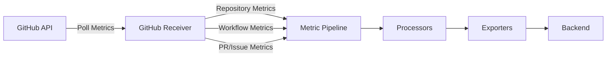

# How to Configure the GitHub Receiver in the OpenTelemetry Collector

Author: [nawazdhandala](https://www.github.com/nawazdhandala)

Tags: OpenTelemetry, Collector, GitHub, Metrics, API, DevOps

Description: Learn how to configure the GitHub Receiver in the OpenTelemetry Collector to collect repository metrics, workflow data, and GitHub activity.

---

The GitHub Receiver collects metrics from GitHub repositories using the GitHub API. It provides visibility into repository activity, pull requests, issues, workflows, and other GitHub-specific metrics that are crucial for understanding development team performance and project health.

For more on application metrics collection, see our guide on [metric receivers](https://oneuptime.com/blog/post/opentelemetry-metrics-receivers/view).

## What is the GitHub Receiver?

The GitHub Receiver polls the GitHub API at regular intervals to collect metrics about repositories, workflows, pull requests, issues, and contributors. It converts GitHub data into OpenTelemetry metrics that can be exported to any observability backend.



Key metrics include:
- Repository size, stars, forks, watchers
- Pull request counts and merge times
- Issue counts by state and label
- Workflow run duration and success rates
- Contributor activity

## Basic Configuration

Start with a minimal configuration to collect repository metrics.

```yaml
receivers:
  github:
    # GitHub repository to monitor (org/repo format)
    repository: "open-telemetry/opentelemetry-collector"

    # GitHub personal access token
    token: ${env:GITHUB_TOKEN}

    # How often to scrape metrics
    collection_interval: 5m

exporters:
  debug:
    verbosity: detailed

service:
  pipelines:
    metrics:
      receivers: [github]
      exporters: [debug]
```

## Authentication

The GitHub Receiver requires authentication to access the GitHub API.

### Personal Access Token

Create a personal access token with appropriate permissions.

```yaml
receivers:
  github:
    repository: "myorg/myrepo"

    # Token from environment variable (recommended)
    token: ${env:GITHUB_TOKEN}

    collection_interval: 5m
```

**Creating a GitHub Token:**

1. Go to GitHub Settings > Developer settings > Personal access tokens > Tokens (classic)
2. Click "Generate new token (classic)"
3. Select scopes:
   - `repo` - Full control of private repositories (for private repos)
   - `public_repo` - Access public repositories (for public repos only)
   - `workflow` - Access Actions workflows
4. Generate token and save it securely
5. Set environment variable: `export GITHUB_TOKEN=ghp_your_token_here`

### GitHub App Authentication

For production, use GitHub App for better rate limits and security.

```yaml
receivers:
  github:
    repository: "myorg/myrepo"

    # GitHub App authentication
    github_app:
      # App ID from GitHub App settings
      app_id: 123456

      # Installation ID (find in app installations)
      installation_id: 789012

      # Private key file path
      private_key_file: /etc/collector/github-app-key.pem

    collection_interval: 5m
```

**Creating a GitHub App:**

1. Go to Organization Settings > Developer settings > GitHub Apps
2. Click "New GitHub App"
3. Set permissions:
   - Repository permissions: Contents (read), Pull requests (read), Issues (read), Actions (read)
4. Generate and download private key
5. Install app to your organization
6. Note App ID and Installation ID

## Repository Configuration

Monitor single or multiple repositories.

### Single Repository

```yaml
receivers:
  github:
    # Single repository
    repository: "open-telemetry/opentelemetry-collector"
    token: ${env:GITHUB_TOKEN}
    collection_interval: 5m
```

### Multiple Repositories

Use multiple receiver instances for different repositories.

```yaml
receivers:
  # Monitor main application repo
  github/app:
    repository: "myorg/application"
    token: ${env:GITHUB_TOKEN}
    collection_interval: 5m

  # Monitor infrastructure repo
  github/infra:
    repository: "myorg/infrastructure"
    token: ${env:GITHUB_TOKEN}
    collection_interval: 10m

  # Monitor public docs repo
  github/docs:
    repository: "myorg/documentation"
    token: ${env:GITHUB_TOKEN}
    collection_interval: 15m

processors:
  # Add repository name as resource attribute
  resource/github:
    attributes:
      - key: source
        value: github
        action: upsert

exporters:
  otlp:
    endpoint: ${env:OTEL_EXPORTER_OTLP_ENDPOINT}

service:
  pipelines:
    metrics:
      receivers: [github/app, github/infra, github/docs]
      processors: [resource/github]
      exporters: [otlp]
```

## Metrics Configuration

Configure which metrics to collect.

### All Metrics

```yaml
receivers:
  github:
    repository: "myorg/myrepo"
    token: ${env:GITHUB_TOKEN}
    collection_interval: 5m

    # Collect all available metrics
    metrics:
      github.repository.count:
        enabled: true
      github.repository.stars:
        enabled: true
      github.repository.forks:
        enabled: true
      github.repository.watchers:
        enabled: true
      github.repository.open_issues:
        enabled: true
      github.repository.open_pull_requests:
        enabled: true
      github.repository.size:
        enabled: true
      github.pull_request.time_to_merge:
        enabled: true
      github.pull_request.time_open:
        enabled: true
      github.workflow.run.duration:
        enabled: true
      github.workflow.run.count:
        enabled: true
```

### Selective Metrics

Enable only specific metrics to reduce API calls.

```yaml
receivers:
  github:
    repository: "myorg/myrepo"
    token: ${env:GITHUB_TOKEN}
    collection_interval: 5m

    # Enable only PR and workflow metrics
    metrics:
      github.pull_request.time_to_merge:
        enabled: true
      github.pull_request.time_open:
        enabled: true
      github.workflow.run.duration:
        enabled: true
      github.workflow.run.count:
        enabled: true

      # Disable repository metadata metrics
      github.repository.stars:
        enabled: false
      github.repository.forks:
        enabled: false
```

## Workflow Metrics

Collect detailed metrics about GitHub Actions workflows.

```yaml
receivers:
  github:
    repository: "myorg/myrepo"
    token: ${env:GITHUB_TOKEN}
    collection_interval: 5m

    # Enable workflow metrics
    metrics:
      github.workflow.run.duration:
        enabled: true
      github.workflow.run.count:
        enabled: true

    # Specify workflows to monitor (optional)
    workflows:
      - name: "CI"
      - name: "Deploy to Production"
      - name: "Run Tests"

processors:
  # Add workflow context
  transform/workflows:
    metric_statements:
      - context: metric
        statements:
          # Add repository name
          - set(resource.attributes["repository"], "myorg/myrepo")

          # Add organization name
          - set(resource.attributes["organization"], "myorg")

exporters:
  otlp:
    endpoint: ${env:OTEL_EXPORTER_OTLP_ENDPOINT}

service:
  pipelines:
    metrics:
      receivers: [github]
      processors: [transform/workflows]
      exporters: [otlp]
```

## Pull Request Metrics

Track pull request metrics to understand code review efficiency.

```yaml
receivers:
  github:
    repository: "myorg/myrepo"
    token: ${env:GITHUB_TOKEN}
    collection_interval: 5m

    # Enable PR metrics
    metrics:
      github.pull_request.count:
        enabled: true
      github.pull_request.time_to_merge:
        enabled: true
      github.pull_request.time_open:
        enabled: true
      github.pull_request.commits:
        enabled: true
      github.pull_request.changed_files:
        enabled: true

    # Filter PRs (optional)
    pull_requests:
      # Only track PRs with these labels
      labels:
        - "bug"
        - "feature"
        - "hotfix"

      # Only track PRs in these states
      states:
        - "open"
        - "closed"

processors:
  # Calculate additional PR metrics
  transform/pr_metrics:
    metric_statements:
      - context: metric
        statements:
          # Tag by PR state
          - set(attributes["pr.state"], attributes["state"]) where attributes["state"] != nil

          # Tag by PR labels
          - set(attributes["pr.has_bug_label"], true) where attributes["labels"] != nil and "bug" in attributes["labels"]

exporters:
  otlp:
    endpoint: ${env:OTEL_EXPORTER_OTLP_ENDPOINT}

service:
  pipelines:
    metrics:
      receivers: [github]
      processors: [transform/pr_metrics]
      exporters: [otlp]
```

## Issue Metrics

Monitor issue activity and resolution times.

```yaml
receivers:
  github:
    repository: "myorg/myrepo"
    token: ${env:GITHUB_TOKEN}
    collection_interval: 5m

    # Enable issue metrics
    metrics:
      github.issue.count:
        enabled: true
      github.issue.time_to_close:
        enabled: true
      github.issue.time_open:
        enabled: true

    # Filter issues
    issues:
      # Only track issues with these labels
      labels:
        - "bug"
        - "enhancement"
        - "documentation"

      # Only track issues in these states
      states:
        - "open"
        - "closed"

      # Exclude pull requests
      exclude_pull_requests: true

processors:
  # Group issues by label
  transform/issues:
    metric_statements:
      - context: metric
        statements:
          # Extract primary label
          - set(attributes["issue.type"], "bug") where attributes["labels"] != nil and "bug" in attributes["labels"]
          - set(attributes["issue.type"], "enhancement") where attributes["labels"] != nil and "enhancement" in attributes["labels"]
          - set(attributes["issue.type"], "documentation") where attributes["labels"] != nil and "documentation" in attributes["labels"]
          - set(attributes["issue.type"], "other") where attributes["issue.type"] == nil

exporters:
  otlp:
    endpoint: ${env:OTEL_EXPORTER_OTLP_ENDPOINT}

service:
  pipelines:
    metrics:
      receivers: [github]
      processors: [transform/issues]
      exporters: [otlp]
```

## Contributor Metrics

Track contributor activity and engagement.

```yaml
receivers:
  github:
    repository: "myorg/myrepo"
    token: ${env:GITHUB_TOKEN}
    collection_interval: 5m

    # Enable contributor metrics
    metrics:
      github.contributor.count:
        enabled: true
      github.contributor.commits:
        enabled: true
      github.contributor.additions:
        enabled: true
      github.contributor.deletions:
        enabled: true

    # Timeframe for contributor stats
    contributor_stats:
      # Look back period
      lookback: 30d

      # Minimum commits to be counted as active contributor
      min_commits: 1

processors:
  # Add contributor segments
  transform/contributors:
    metric_statements:
      - context: metric
        statements:
          # Segment contributors by commit count
          - set(attributes["contributor.segment"], "core") where attributes["commits"] != nil and attributes["commits"] >= 50
          - set(attributes["contributor.segment"], "regular") where attributes["commits"] != nil and attributes["commits"] >= 10 and attributes["commits"] < 50
          - set(attributes["contributor.segment"], "occasional") where attributes["commits"] != nil and attributes["commits"] < 10

exporters:
  otlp:
    endpoint: ${env:OTEL_EXPORTER_OTLP_ENDPOINT}

service:
  pipelines:
    metrics:
      receivers: [github]
      processors: [transform/contributors]
      exporters: [otlp]
```

## Resource Attributes

Add contextual information to collected metrics.

```yaml
receivers:
  github:
    repository: "myorg/myrepo"
    token: ${env:GITHUB_TOKEN}
    collection_interval: 5m

processors:
  # Add resource attributes
  resource/github:
    attributes:
      # Source identifier
      - key: source
        value: github
        action: upsert

      # Repository info
      - key: github.repository
        value: myorg/myrepo
        action: upsert

      # Organization
      - key: github.organization
        value: myorg
        action: upsert

      # Environment
      - key: deployment.environment
        value: ${env:ENVIRONMENT}
        action: upsert

      # Team
      - key: team.name
        value: platform
        action: upsert

  # Add collector info
  resourcedetection:
    detectors: [env, system]
    timeout: 5s

exporters:
  otlp:
    endpoint: ${env:OTEL_EXPORTER_OTLP_ENDPOINT}

service:
  pipelines:
    metrics:
      receivers: [github]
      processors: [resource/github, resourcedetection]
      exporters: [otlp]
```

## Rate Limiting

Handle GitHub API rate limits effectively.

```yaml
receivers:
  github:
    repository: "myorg/myrepo"
    token: ${env:GITHUB_TOKEN}

    # Adjust collection interval based on rate limits
    # GitHub allows 5,000 requests/hour for authenticated users
    # Adjust interval to stay under limit
    collection_interval: 5m

    # Timeout for API requests
    timeout: 30s

    # Retry configuration for rate limit errors
    retry_on_failure:
      enabled: true
      initial_interval: 5s
      max_interval: 30s
      max_elapsed_time: 5m

processors:
  # Add rate limit metrics
  transform/rate_limits:
    metric_statements:
      - context: metric
        statements:
          # Track remaining API calls (if exposed by receiver)
          - set(attributes["github.rate_limit.remaining"], attributes["rate_limit_remaining"]) where attributes["rate_limit_remaining"] != nil

exporters:
  otlp:
    endpoint: ${env:OTEL_EXPORTER_OTLP_ENDPOINT}

service:
  pipelines:
    metrics:
      receivers: [github]
      processors: [transform/rate_limits]
      exporters: [otlp]
```

## Multiple Organizations

Monitor repositories across multiple organizations.

```yaml
receivers:
  # Organization 1 - Main product
  github/org1_app:
    repository: "org1/application"
    token: ${env:GITHUB_TOKEN_ORG1}
    collection_interval: 5m

  github/org1_api:
    repository: "org1/api"
    token: ${env:GITHUB_TOKEN_ORG1}
    collection_interval: 5m

  # Organization 2 - Infrastructure
  github/org2_infra:
    repository: "org2/infrastructure"
    token: ${env:GITHUB_TOKEN_ORG2}
    collection_interval: 10m

  # Public repositories (different token)
  github/public_docs:
    repository: "publicorg/documentation"
    token: ${env:GITHUB_TOKEN_PUBLIC}
    collection_interval: 15m

processors:
  # Add organization context
  transform/orgs:
    metric_statements:
      - context: metric
        statements:
          # Extract org from repository attribute
          - set(attributes["organization"], "org1") where resource.attributes["github.repository"] matches "^org1/"
          - set(attributes["organization"], "org2") where resource.attributes["github.repository"] matches "^org2/"
          - set(attributes["organization"], "publicorg") where resource.attributes["github.repository"] matches "^publicorg/"

  # Add batch processing
  batch:
    timeout: 10s
    send_batch_size: 100

exporters:
  otlp:
    endpoint: ${env:OTEL_EXPORTER_OTLP_ENDPOINT}

service:
  pipelines:
    metrics:
      receivers: [github/org1_app, github/org1_api, github/org2_infra, github/public_docs]
      processors: [transform/orgs, batch]
      exporters: [otlp]
```

## Complete Production Example

Full configuration with all features for production use.

```yaml
receivers:
  # Main application repository
  github/app:
    repository: "myorg/application"
    token: ${env:GITHUB_TOKEN}
    collection_interval: 5m
    timeout: 30s

    # Enable all relevant metrics
    metrics:
      # Repository metrics
      github.repository.stars:
        enabled: true
      github.repository.forks:
        enabled: true
      github.repository.open_issues:
        enabled: true
      github.repository.open_pull_requests:
        enabled: true

      # PR metrics
      github.pull_request.count:
        enabled: true
      github.pull_request.time_to_merge:
        enabled: true
      github.pull_request.time_open:
        enabled: true

      # Workflow metrics
      github.workflow.run.duration:
        enabled: true
      github.workflow.run.count:
        enabled: true

      # Issue metrics
      github.issue.count:
        enabled: true
      github.issue.time_to_close:
        enabled: true

      # Contributor metrics
      github.contributor.count:
        enabled: true
      github.contributor.commits:
        enabled: true

    # Retry on rate limits
    retry_on_failure:
      enabled: true
      initial_interval: 5s
      max_interval: 30s
      max_elapsed_time: 5m

  # Infrastructure repository
  github/infra:
    repository: "myorg/infrastructure"
    token: ${env:GITHUB_TOKEN}
    collection_interval: 10m
    timeout: 30s

    metrics:
      github.repository.open_pull_requests:
        enabled: true
      github.pull_request.time_to_merge:
        enabled: true
      github.workflow.run.duration:
        enabled: true
      github.workflow.run.count:
        enabled: true

processors:
  # Add resource attributes
  resource/github:
    attributes:
      - key: source
        value: github
        action: upsert
      - key: deployment.environment
        value: ${env:ENVIRONMENT}
        action: upsert
      - key: collector.name
        value: ${env:HOSTNAME}
        action: upsert

  # Add repository-specific tags
  transform/tags:
    metric_statements:
      - context: metric
        statements:
          # Extract repository name from resource
          - set(attributes["repository.name"], resource.attributes["github.repository"])

          # Tag by repository type
          - set(attributes["repository.type"], "application") where resource.attributes["github.repository"] == "myorg/application"
          - set(attributes["repository.type"], "infrastructure") where resource.attributes["github.repository"] == "myorg/infrastructure"

  # Calculate derived metrics
  transform/derived:
    metric_statements:
      - context: metric
        statements:
          # Calculate PR merge rate (if supported)
          - set(attributes["pr.merge_rate"], attributes["merged_prs"] / attributes["total_prs"]) where attributes["merged_prs"] != nil and attributes["total_prs"] != nil and attributes["total_prs"] > 0

  # Filter to only production-relevant metrics
  filter/production:
    metrics:
      metric:
        # Only include metrics from main app in production
        - resource.attributes["github.repository"] == "myorg/application" or IsMatch(resource.attributes["github.repository"], ".*infrastructure.*")

  # Batch for efficiency
  batch:
    timeout: 10s
    send_batch_size: 100

exporters:
  # Send to OTLP backend
  otlp:
    endpoint: ${env:OTEL_EXPORTER_OTLP_ENDPOINT}
    headers:
      authorization: Bearer ${env:OTEL_AUTH_TOKEN}
    compression: gzip

  # Prometheus for visualization
  prometheus:
    endpoint: 0.0.0.0:9090
    namespace: github
    const_labels:
      environment: ${env:ENVIRONMENT}

extensions:
  # Health check
  health_check:
    endpoint: 0.0.0.0:13133

  # Performance profiling
  pprof:
    endpoint: 0.0.0.0:1777

service:
  extensions: [health_check, pprof]

  pipelines:
    metrics:
      receivers: [github/app, github/infra]
      processors: [resource/github, transform/tags, transform/derived, filter/production, batch]
      exporters: [otlp, prometheus]

  telemetry:
    logs:
      level: info
      encoding: json
    metrics:
      address: 0.0.0.0:8888
```

## Monitoring GitHub Actions Workflows

Focus on CI/CD pipeline health.

```yaml
receivers:
  github:
    repository: "myorg/myrepo"
    token: ${env:GITHUB_TOKEN}
    collection_interval: 2m  # More frequent for CI/CD monitoring

    metrics:
      # Focus on workflow metrics
      github.workflow.run.duration:
        enabled: true
      github.workflow.run.count:
        enabled: true
      github.workflow.job.duration:
        enabled: true
      github.workflow.job.count:
        enabled: true

    # Specify workflows
    workflows:
      - name: "CI"
      - name: "Deploy to Staging"
      - name: "Deploy to Production"
      - name: "Security Scan"

processors:
  # Calculate workflow success rate
  transform/workflow_health:
    metric_statements:
      - context: metric
        statements:
          # Tag by workflow status
          - set(attributes["workflow.status"], attributes["conclusion"]) where attributes["conclusion"] != nil

          # Tag by workflow name
          - set(attributes["workflow.name"], attributes["name"]) where attributes["name"] != nil

          # Calculate if workflow is healthy (< 5 min duration)
          - set(attributes["workflow.healthy"], true) where attributes["duration_ms"] != nil and attributes["duration_ms"] < 300000
          - set(attributes["workflow.healthy"], false) where attributes["duration_ms"] != nil and attributes["duration_ms"] >= 300000

exporters:
  otlp:
    endpoint: ${env:OTEL_EXPORTER_OTLP_ENDPOINT}

service:
  pipelines:
    metrics:
      receivers: [github]
      processors: [transform/workflow_health]
      exporters: [otlp]
```

## Summary

| Feature | Configuration |
|---------|--------------|
| **Authentication** | Personal access token or GitHub App |
| **Repositories** | Single or multiple repos |
| **Metrics** | Repository, PR, issue, workflow, contributor |
| **Rate Limiting** | Retry and interval adjustment |
| **Resource Attributes** | Organization, team, environment context |
| **Processing** | Transform, filter, derived metrics |

The GitHub Receiver provides comprehensive visibility into repository activity and development team performance. By collecting metrics on pull requests, issues, workflows, and contributors, you can track development velocity, code review efficiency, and CI/CD pipeline health. Combined with processors, you can create dashboards and alerts that help teams improve their development processes.

For more on metric collection and processing, see our guides on [Prometheus receiver](https://oneuptime.com/blog/post/prometheus-receiver-opentelemetry-collector/view) and [metric processors](https://oneuptime.com/blog/post/opentelemetry-metric-processors/view).
