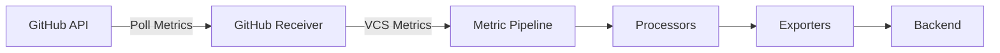

# How to Configure the GitHub Receiver in the OpenTelemetry Collector

Author: [nawazdhandala](https://www.github.com/nawazdhandala)

Tags: OpenTelemetry, Collector, GitHub, Metric, API, DevOps

Description: Learn how to configure the GitHub Receiver in the OpenTelemetry Collector to collect repository metrics, workflow data, and GitHub activity.

---

The GitHub Receiver collects version control system metrics from GitHub repositories and organizations using the GitHub REST and GraphQL APIs. It can also receive GitHub Actions webhook events and convert workflow and job events into traces.

For more on application metrics collection, see our guide on [metric receivers](https://oneuptime.com/blog/post/2025-08-26-what-are-metrics-in-opentelemetry/view).

## What is the GitHub Receiver?

The GitHub Receiver polls the GitHub API at regular intervals to collect metrics about repositories, pull requests, branches, and contributors. It converts GitHub data into OpenTelemetry metrics that can be exported to any observability backend.


```mermaid
graph LR
    A[GitHub API] -->|Poll Metrics| B[GitHub Receiver]
    B -->|VCS Metrics| C[Metric Pipeline]
    C --> D[Processors]
    D --> E[Exporters]
    E --> F[Backend]
```

Key metrics include:
- Repository count
- Pull request counts by state
- Pull request age and time to merge
- Branch count, age, line deltas, and revision deltas
- Contributor count

## Basic Configuration

Start with a minimal configuration to collect repository metrics. Use `github_org` to specify the organization or user, and use `search_query` to narrow collection to one repository.

```yaml
extensions:
  bearertokenauth/github:
    token: ${env:GH_PAT}

receivers:
  github:
    # How often to scrape metrics. The default is 30s; 300s is recommended.
    collection_interval: 300s
    scrapers:
      scraper:
        # GitHub organization or username to monitor
        github_org: open-telemetry

        # Optional: narrow collection to a single repository
        search_query: "repo:open-telemetry/opentelemetry-collector"

        auth:
          authenticator: bearertokenauth/github

exporters:
  debug:
    verbosity: detailed

service:
  extensions: [bearertokenauth/github]
  pipelines:
    metrics:
      receivers: [github]
      exporters: [debug]
```

## Authentication

The GitHub Receiver can make anonymous API calls for public data, but authenticated requests are recommended because anonymous calls are more limited and may be rate limited sooner.

### Personal Access Token

Create a personal access token with read access to the repositories you want to scrape, then pass it through the `bearertokenauth` extension.

```yaml
extensions:
  bearertokenauth/github:
    token: ${env:GH_PAT}

receivers:
  github:
    collection_interval: 300s
    scrapers:
      scraper:
        github_org: myorg
        search_query: "repo:myorg/myrepo"
        auth:
          authenticator: bearertokenauth/github

exporters:
  debug:
    verbosity: detailed

service:
  extensions: [bearertokenauth/github]
  pipelines:
    metrics:
      receivers: [github]
      exporters: [debug]
```

**Creating a GitHub Token:**

1. Go to GitHub Settings > Developer settings > Personal access tokens
2. Generate a fine-grained token or a classic token
3. Grant read access to the target repositories
4. Generate token and save it securely
5. Set environment variable: `export GH_PAT=github_pat_your_token_here`

### GitHub App Webhook Events

The receiver does not use an inline `github_app` block for metric scraping. GitHub App setup is used when receiving GitHub Actions webhook events for traces. Subscribe the app or webhook to `workflow_run` and `workflow_job` events.

```yaml
receivers:
  github:
    webhook:
      endpoint: localhost:19418
      path: /events
      health_path: /health
      secret: ${env:SECRET_STRING_VAR}
      service_name: github-actions
    scrapers:
      scraper:
        github_org: myorg

exporters:
  otlp:
    endpoint: ${env:OTEL_EXPORTER_OTLP_ENDPOINT}

service:
  pipelines:
    traces:
      receivers: [github]
      exporters: [otlp]
```

**Creating a GitHub App:**

1. Go to Organization Settings > Developer settings > GitHub Apps
2. Click "New GitHub App"
3. Subscribe to the `workflow_run` and `workflow_job` webhook events
4. Configure the webhook URL to point to the receiver endpoint and path
5. Set a webhook secret and configure the same value in the receiver
6. Install the app to your organization

## Repository Configuration

Monitor single or multiple repositories by configuring the scraper's `github_org` and `search_query`.

### Single Repository

```yaml
extensions:
  bearertokenauth/github:
    token: ${env:GH_PAT}

receivers:
  github:
    collection_interval: 300s
    scrapers:
      scraper:
        github_org: open-telemetry
        search_query: "repo:open-telemetry/opentelemetry-collector"
        auth:
          authenticator: bearertokenauth/github

exporters:
  debug:
    verbosity: detailed

service:
  extensions: [bearertokenauth/github]
  pipelines:
    metrics:
      receivers: [github]
      exporters: [debug]
```

### Multiple Repositories

Use multiple receiver instances for different repository groups.

```yaml
extensions:
  bearertokenauth/github:
    token: ${env:GH_PAT}

receivers:
  # Monitor main application repo
  github/app:
    collection_interval: 300s
    scrapers:
      scraper:
        github_org: myorg
        search_query: "repo:myorg/application"
        auth:
          authenticator: bearertokenauth/github

  # Monitor infrastructure repo
  github/infra:
    collection_interval: 600s
    scrapers:
      scraper:
        github_org: myorg
        search_query: "repo:myorg/infrastructure"
        auth:
          authenticator: bearertokenauth/github

  # Monitor public docs repo
  github/docs:
    collection_interval: 900s
    scrapers:
      scraper:
        github_org: myorg
        search_query: "repo:myorg/documentation"
        auth:
          authenticator: bearertokenauth/github

processors:
  # Add source as a resource attribute
  resource/github:
    attributes:
      - key: source
        value: github
        action: upsert

exporters:
  otlp:
    endpoint: ${env:OTEL_EXPORTER_OTLP_ENDPOINT}

service:
  extensions: [bearertokenauth/github]
  pipelines:
    metrics:
      receivers: [github/app, github/infra, github/docs]
      processors: [resource/github]
      exporters: [otlp]
```

## Metrics Configuration

Configure which metrics to collect. The current receiver emits VCS semantic convention metrics instead of `github.*` metric names.

### All Metrics

```yaml
receivers:
  github:
    collection_interval: 300s
    scrapers:
      scraper:
        github_org: myorg
        search_query: "repo:myorg/myrepo"

        # Enable optional metrics and keep default metrics enabled
        metrics:
          vcs.change.count:
            enabled: true
          vcs.change.duration:
            enabled: true
          vcs.change.time_to_approval:
            enabled: true
          vcs.change.time_to_merge:
            enabled: true
          vcs.ref.count:
            enabled: true
          vcs.ref.lines_delta:
            enabled: true
          vcs.ref.revisions_delta:
            enabled: true
          vcs.ref.time:
            enabled: true
          vcs.repository.count:
            enabled: true
          vcs.contributor.count:
            enabled: true
```

### Selective Metrics

Disable individual default metrics when you do not need them.

```yaml
receivers:
  github:
    collection_interval: 300s
    scrapers:
      scraper:
        github_org: myorg
        search_query: "repo:myorg/myrepo"

        metrics:
          vcs.contributor.count:
            enabled: true
          vcs.ref.lines_delta:
            enabled: false
          vcs.ref.revisions_delta:
            enabled: false
```

## Workflow Metrics

GitHub Actions workflow data is received as traces from webhook events, not as scraper metrics. Use the `webhook` block to collect workflow and job traces.

```yaml
receivers:
  github:
    webhook:
      endpoint: localhost:19418
      path: /events
      health_path: /health
      secret: ${env:SECRET_STRING_VAR}
      service_name: github-actions
    scrapers:
      scraper:
        github_org: myorg

processors:
  # Add workflow context
  resource/workflows:
    attributes:
      - key: vcs.owner.name
        value: myorg
        action: upsert

exporters:
  otlp:
    endpoint: ${env:OTEL_EXPORTER_OTLP_ENDPOINT}

service:
  pipelines:
    traces:
      receivers: [github]
      processors: [resource/workflows]
      exporters: [otlp]
```

## Pull Request Metrics

Track pull request metrics to understand code review efficiency.

```yaml
receivers:
  github:
    collection_interval: 300s
    scrapers:
      scraper:
        github_org: myorg
        search_query: "repo:myorg/myrepo"

        metrics:
          vcs.change.count:
            enabled: true
          vcs.change.duration:
            enabled: true
          vcs.change.time_to_approval:
            enabled: true
          vcs.change.time_to_merge:
            enabled: true

processors:
  # Add repository context
  resource/pr_metrics:
    attributes:
      - key: repository.group
        value: application
        action: upsert

exporters:
  otlp:
    endpoint: ${env:OTEL_EXPORTER_OTLP_ENDPOINT}

service:
  pipelines:
    metrics:
      receivers: [github]
      processors: [resource/pr_metrics]
      exporters: [otlp]
```

## Issue Metrics

The GitHub Receiver does not expose issue-specific metrics. Use pull request and branch metrics from the receiver, or use another GitHub integration if you need issue state, label, and resolution metrics.

```yaml
receivers:
  github:
    collection_interval: 300s
    scrapers:
      scraper:
        github_org: myorg
        search_query: "repo:myorg/myrepo"

        metrics:
          vcs.change.count:
            enabled: true
          vcs.change.duration:
            enabled: true
```

## Contributor Metrics

Track contributor activity and engagement with the optional `vcs.contributor.count` metric.

```yaml
receivers:
  github:
    collection_interval: 300s
    scrapers:
      scraper:
        github_org: myorg
        search_query: "repo:myorg/myrepo"

        metrics:
          vcs.contributor.count:
            enabled: true

processors:
  # Add contributor metric context
  resource/contributors:
    attributes:
      - key: repository.group
        value: application
        action: upsert

exporters:
  otlp:
    endpoint: ${env:OTEL_EXPORTER_OTLP_ENDPOINT}

service:
  pipelines:
    metrics:
      receivers: [github]
      processors: [resource/contributors]
      exporters: [otlp]
```

Resource Attributes

Add contextual information to collected metrics. The receiver emits `vcs.owner.name` and `vcs.provider.name` as resource attributes, and repository details such as `vcs.repository.name` and `vcs.repository.url.full` as metric attributes.

```yaml
receivers:
  github:
    collection_interval: 300s
    scrapers:
      scraper:
        github_org: myorg
        search_query: "repo:myorg/myrepo"

processors:
  # Add resource attributes
  resource/github:
    attributes:
      # Source identifier
      - key: source
        value: github
        action: upsert

      # Environment
      - key: deployment.environment
        value: ${env:ENVIRONMENT}
        action: upsert

      # Team
      - key: team.name
        value: platform
        action: upsert

  # Add collector info
  resourcedetection:
    detectors: [env, system]
    timeout: 5s

exporters:
  otlp:
    endpoint: ${env:OTEL_EXPORTER_OTLP_ENDPOINT}

service:
  pipelines:
    metrics:
      receivers: [github]
      processors: [resource/github, resourcedetection]
      exporters: [otlp]
```

## Rate Limiting

Handle GitHub API rate limits effectively.

```yaml
receivers:
  github:
    # Adjust collection interval based on rate limits.
    # The default is 30s; 300s is a sensible starting point.
    collection_interval: 300s
    scrapers:
      scraper:
        github_org: myorg
        search_query: "repo:myorg/myrepo"

        # Optional: keep concurrent requests below GitHub's secondary limit
        concurrency_limit: 50

        # Optional: retry transient GitHub API errors
        retry_on_failure:
          enabled: true
          max_retries: 10
          initial_interval: 1s
          max_interval: 30s
          multiplier: 1.5
          randomization_factor: 0.5

exporters:
  otlp:
    endpoint: ${env:OTEL_EXPORTER_OTLP_ENDPOINT}

service:
  pipelines:
    metrics:
      receivers: [github]
      exporters: [otlp]
```

## Multiple Organizations

Monitor repositories across multiple organizations.

```yaml
extensions:
  bearertokenauth/org1:
    token: ${env:GH_PAT_ORG1}
  bearertokenauth/org2:
    token: ${env:GH_PAT_ORG2}
  bearertokenauth/public:
    token: ${env:GH_PAT_PUBLIC}

receivers:
  # Organization 1 - Main product
  github/org1_app:
    collection_interval: 300s
    scrapers:
      scraper:
        github_org: org1
        search_query: "repo:org1/application"
        auth:
          authenticator: bearertokenauth/org1

  github/org1_api:
    collection_interval: 300s
    scrapers:
      scraper:
        github_org: org1
        search_query: "repo:org1/api"
        auth:
          authenticator: bearertokenauth/org1

  # Organization 2 - Infrastructure
  github/org2_infra:
    collection_interval: 600s
    scrapers:
      scraper:
        github_org: org2
        search_query: "repo:org2/infrastructure"
        auth:
          authenticator: bearertokenauth/org2

  # Public repositories
  github/public_docs:
    collection_interval: 900s
    scrapers:
      scraper:
        github_org: publicorg
        search_query: "repo:publicorg/documentation"
        auth:
          authenticator: bearertokenauth/public

processors:
  # Add batch processing
  batch:
    timeout: 10s
    send_batch_size: 100

exporters:
  otlp:
    endpoint: ${env:OTEL_EXPORTER_OTLP_ENDPOINT}

service:
  extensions: [bearertokenauth/org1, bearertokenauth/org2, bearertokenauth/public]
  pipelines:
    metrics:
      receivers: [github/org1_app, github/org1_api, github/org2_infra, github/public_docs]
      processors: [batch]
      exporters: [otlp]
```

## Complete Production Example

Full configuration with supported metric scraping and workflow tracing.

```yaml
extensions:
  bearertokenauth/github:
    token: ${env:GH_PAT}

  # Health check
  health_check:
    endpoint: 0.0.0.0:13133

  # Performance profiling
  pprof:
    endpoint: 0.0.0.0:1777

receivers:
  # Main application repository metrics
  github/app:
    collection_interval: 300s
    scrapers:
      scraper:
        github_org: myorg
        search_query: "repo:myorg/application"
        concurrency_limit: 50
        merged_pr_lookback_days: 30
        auth:
          authenticator: bearertokenauth/github

        metrics:
          vcs.change.count:
            enabled: true
          vcs.change.duration:
            enabled: true
          vcs.change.time_to_approval:
            enabled: true
          vcs.change.time_to_merge:
            enabled: true
          vcs.ref.count:
            enabled: true
          vcs.ref.time:
            enabled: true
          vcs.repository.count:
            enabled: true
          vcs.contributor.count:
            enabled: true

        retry_on_failure:
          enabled: true
          max_retries: 10
          initial_interval: 1s
          max_interval: 30s
          multiplier: 1.5
          randomization_factor: 0.5

  # Infrastructure repository metrics
  github/infra:
    collection_interval: 600s
    scrapers:
      scraper:
        github_org: myorg
        search_query: "repo:myorg/infrastructure"
        auth:
          authenticator: bearertokenauth/github

        metrics:
          vcs.change.count:
            enabled: true
          vcs.change.time_to_merge:
            enabled: true
          vcs.ref.count:
            enabled: true

  # GitHub Actions workflow traces
  github/actions:
    webhook:
      endpoint: 0.0.0.0:19418
      path: /events
      health_path: /health
      secret: ${env:GITHUB_WEBHOOK_SECRET}
      service_name: github-actions
    scrapers:
      scraper:
        github_org: myorg

processors:
  # Add resource attributes
  resource/github:
    attributes:
      - key: source
        value: github
        action: upsert
      - key: deployment.environment
        value: ${env:ENVIRONMENT}
        action: upsert
      - key: collector.name
        value: ${env:HOSTNAME}
        action: upsert

  # Batch for efficiency
  batch:
    timeout: 10s
    send_batch_size: 100

exporters:
  # Send to OTLP backend
  otlp:
    endpoint: ${env:OTEL_EXPORTER_OTLP_ENDPOINT}
    headers:
      authorization: Bearer ${env:OTEL_AUTH_TOKEN}
    compression: gzip

  # Prometheus for visualization
  prometheus:
    endpoint: 0.0.0.0:9090
    namespace: github
    const_labels:
      environment: ${env:ENVIRONMENT}

service:
  extensions: [bearertokenauth/github, health_check, pprof]

  pipelines:
    metrics:
      receivers: [github/app, github/infra]
      processors: [resource/github, batch]
      exporters: [otlp, prometheus]

    traces:
      receivers: [github/actions]
      processors: [resource/github, batch]
      exporters: [otlp]

  telemetry:
    logs:
      level: info
      encoding: json
    metrics:
      level: normal
```

## Monitoring GitHub Actions Workflows

Focus on CI/CD pipeline health by receiving GitHub Actions webhook traces.

```yaml
receivers:
  github:
    webhook:
      endpoint: 0.0.0.0:19418
      path: /events
      health_path: /health
      secret: ${env:GITHUB_WEBHOOK_SECRET}
      service_name: github-actions
      include_span_events: true
    scrapers:
      scraper:
        github_org: myorg

processors:
  # Add workflow context
  resource/workflow_health:
    attributes:
      - key: ci.provider
        value: github-actions
        action: upsert

exporters:
  otlp:
    endpoint: ${env:OTEL_EXPORTER_OTLP_ENDPOINT}

service:
  pipelines:
    traces:
      receivers: [github]
      processors: [resource/workflow_health]
      exporters: [otlp]
```

## Summary

| Feature | Configuration |
|---------|--------------|
| **Authentication** | Personal access token through `bearertokenauth` |
| **Repositories** | `github_org` with optional `search_query` |
| **Metrics** | VCS repository, PR, branch, and contributor metrics |
| **Workflow Telemetry** | GitHub Actions webhook events as traces |
| **Rate Limiting** | Collection interval, concurrency limit, and retry settings |
| **Resource Attributes** | Owner, provider, team, and environment context |
| **Processing** | Resource, batch, and other metric processors |

The GitHub Receiver provides visibility into repository activity and development team performance. By collecting VCS metrics on pull requests, branches, repositories, and contributors, and by receiving GitHub Actions events as traces, you can track development velocity, code review efficiency, and CI/CD pipeline health. Combined with processors, you can create dashboards and alerts that help teams improve their development processes.

For more on metric collection and processing, see our guides on [Prometheus receiver](https://oneuptime.com/blog/post/2026-02-06-configure-prometheus-receiver-opentelemetry-collector/view) and [metric processors](https://oneuptime.com/blog/post/2026-02-06-what-opentelemetry-does-not-do/view).
