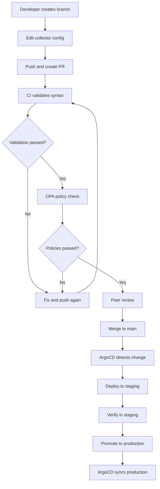

# How to Implement GitOps for OpenTelemetry Collector Configuration

Author: [nawazdhandala](https://www.github.com/nawazdhandala)

Tags: OpenTelemetry, GitOps, Collector, Configuration, ArgoCD, FluxCD, DevOps

Description: Learn how to manage OpenTelemetry Collector configurations using GitOps principles with version control, automated deployment, and rollback capabilities.

---

The OpenTelemetry Collector configuration file controls how telemetry flows through your observability pipeline. It defines what data is received, how it is processed, and where it goes. In production environments, a bad configuration change can cause data loss, increased latency, or even collector crashes. Managing this configuration through manual edits and kubectl apply commands is risky and unscalable.

GitOps applies software engineering practices to infrastructure configuration. Every change goes through version control, gets reviewed in a pull request, passes automated validation, and is deployed through a reconciliation loop. This post shows how to implement a full GitOps workflow for OpenTelemetry Collector configurations using tools like ArgoCD or FluxCD.

## Why GitOps for Collector Config

Collector configurations change frequently. Teams add new pipelines, adjust sampling rates, add processors, or change export destinations. Without GitOps, these changes happen in an ad-hoc way. Someone edits a ConfigMap, applies it, and hopes for the best. If something breaks, rolling back means finding the previous version (if anyone saved it) and reapplying.

With GitOps, you get:
- Full audit trail of every configuration change
- Pull request reviews before any change goes live
- Automated validation that catches syntax errors
- One-click rollback to any previous version
- Environment promotion (staging to production)

## Repository Structure

Organize your collector configurations in a Git repository:

```
otel-configs/
  base/
    collector-config.yaml      # Base configuration shared across environments
    kustomization.yaml
  overlays/
    staging/
      collector-patches.yaml   # Staging-specific overrides
      kustomization.yaml
    production/
      collector-patches.yaml   # Production-specific overrides
      kustomization.yaml
  policies/
    validation.rego            # OPA validation policies
  tests/
    config_test.yaml           # Configuration validation tests
  .github/
    workflows/
      validate.yaml            # CI validation pipeline
```

## Base Configuration

The base configuration contains the common setup that applies to all environments:

```yaml
# base/collector-config.yaml
# Base collector configuration. Environment-specific settings
# are applied as Kustomize overlays.
apiVersion: v1
kind: ConfigMap
metadata:
  name: otel-collector-config
  namespace: observability
data:
  config.yaml: |
    receivers:
      otlp:
        protocols:
          grpc:
            endpoint: 0.0.0.0:4317
          http:
            endpoint: 0.0.0.0:4318

    processors:
      memory_limiter:
        check_interval: 1s
        limit_mib: 2048
        spike_limit_mib: 512

      batch:
        timeout: 5s
        send_batch_size: 1024

      resource:
        attributes:
          - key: collector.managed_by
            value: gitops
            action: insert

    exporters:
      otlphttp:
        endpoint: "${OTLP_BACKEND_ENDPOINT}"

    extensions:
      health_check:
        endpoint: 0.0.0.0:13133

    service:
      extensions: [health_check]
      pipelines:
        traces:
          receivers: [otlp]
          processors: [memory_limiter, resource, batch]
          exporters: [otlphttp]
        metrics:
          receivers: [otlp]
          processors: [memory_limiter, batch]
          exporters: [otlphttp]
```

## Environment Overlays

Use Kustomize to apply environment-specific overrides:

```yaml
# overlays/staging/kustomization.yaml
# Staging overlay applies lower resource limits and higher sampling rates.
apiVersion: kustomize.config.k8s.io/v1beta1
kind: Kustomization
resources:
  - ../../base

patches:
  - path: collector-patches.yaml
    target:
      kind: ConfigMap
      name: otel-collector-config
```

```yaml
# overlays/staging/collector-patches.yaml
# Staging-specific configuration overrides.
# Higher sampling rate for better debugging, lower resource limits.
apiVersion: v1
kind: ConfigMap
metadata:
  name: otel-collector-config
data:
  config.yaml: |
    receivers:
      otlp:
        protocols:
          grpc:
            endpoint: 0.0.0.0:4317
          http:
            endpoint: 0.0.0.0:4318

    processors:
      memory_limiter:
        check_interval: 1s
        limit_mib: 1024
        spike_limit_mib: 256

      batch:
        timeout: 5s
        send_batch_size: 512

      resource:
        attributes:
          - key: collector.managed_by
            value: gitops
            action: insert
          - key: deployment.environment
            value: staging
            action: upsert

    exporters:
      otlphttp:
        endpoint: "https://staging-backend.yourdomain.com/otlp"

    extensions:
      health_check:
        endpoint: 0.0.0.0:13133

    service:
      extensions: [health_check]
      pipelines:
        traces:
          receivers: [otlp]
          processors: [memory_limiter, resource, batch]
          exporters: [otlphttp]
```

## CI Validation Pipeline

Every pull request should run validation before the configuration can be merged:

```yaml
# .github/workflows/validate.yaml
# CI pipeline that validates collector configuration on every PR.
name: Validate Collector Config

on:
  pull_request:
    paths:
      - 'base/**'
      - 'overlays/**'

jobs:
  validate:
    runs-on: ubuntu-latest
    steps:
      - uses: actions/checkout@v4

      - name: Install OpenTelemetry Collector
        run: |
          # Download the collector binary for validation
          curl -L -o otelcol https://github.com/open-telemetry/opentelemetry-collector-releases/releases/download/v0.96.0/otelcol-contrib_0.96.0_linux_amd64
          chmod +x otelcol

      - name: Build Kustomize Overlays
        run: |
          # Render each environment overlay
          for env in staging production; do
            echo "Building $env overlay..."
            kustomize build overlays/$env > /tmp/$env-config.yaml
          done

      - name: Validate Configuration Syntax
        run: |
          # Extract the config.yaml from the ConfigMap and validate it
          for env in staging production; do
            echo "Validating $env configuration..."
            # Extract the embedded config.yaml from the ConfigMap
            python3 -c "
            import yaml, sys
            with open('/tmp/$env-config.yaml') as f:
                cm = yaml.safe_load(f)
            config = cm['data']['config.yaml']
            with open('/tmp/$env-otel.yaml', 'w') as f:
                f.write(config)
            "
            # Run the collector's built-in validation
            ./otelcol validate --config /tmp/$env-otel.yaml
          done

      - name: Run OPA Policy Checks
        run: |
          # Validate against organizational policies
          for env in staging production; do
            opa eval -d policies/ -i /tmp/$env-otel.yaml \
              "data.otel.deny" --fail-defined
          done
```

## OPA Validation Policies

Use Open Policy Agent to enforce organizational rules about collector configuration:

```rego
# policies/validation.rego
# OPA policies for validating collector configurations.
# These prevent common misconfigurations from reaching production.
package otel

# Every pipeline must have a memory limiter processor
deny[msg] {
    pipeline := input.service.pipelines[name]
    not array_contains(pipeline.processors, "memory_limiter")
    msg := sprintf("Pipeline '%s' must include memory_limiter processor", [name])
}

# Batch timeout must be between 1s and 30s
deny[msg] {
    timeout := input.processors.batch.timeout
    not valid_duration(timeout, 1, 30)
    msg := sprintf("Batch timeout '%s' must be between 1s and 30s", [timeout])
}

# Health check extension must be enabled
deny[msg] {
    not array_contains(input.service.extensions, "health_check")
    msg := "health_check extension must be enabled"
}

# OTLP receivers must not use 0.0.0.0 without TLS in production
deny[msg] {
    input.receivers.otlp.protocols.grpc.endpoint == "0.0.0.0:4317"
    not input.receivers.otlp.protocols.grpc.tls
    input.processors.resource.attributes[_].value == "production"
    msg := "OTLP gRPC receiver must use TLS in production"
}

array_contains(arr, elem) {
    arr[_] == elem
}
```

## ArgoCD Application

Deploy the collector configuration using ArgoCD:

```yaml
# ArgoCD Application for the production collector config.
# ArgoCD watches the Git repository and automatically syncs
# changes to the Kubernetes cluster.
apiVersion: argoproj.io/v1alpha1
kind: Application
metadata:
  name: otel-collector-production
  namespace: argocd
spec:
  project: observability
  source:
    repoURL: https://github.com/mycompany/otel-configs.git
    targetRevision: main
    path: overlays/production
  destination:
    server: https://kubernetes.default.svc
    namespace: observability
  syncPolicy:
    automated:
      prune: true
      selfHeal: true
    syncOptions:
      - CreateNamespace=true
    retry:
      limit: 3
      backoff:
        duration: 5s
        factor: 2
```

## Configuration Rollback

One of the biggest benefits of GitOps is easy rollback. If a configuration change causes problems, revert the Git commit and ArgoCD automatically deploys the previous version:

```bash
# Revert the last configuration change.
# ArgoCD detects the new commit and syncs the cluster back
# to the previous configuration.
git revert HEAD
git push origin main

# Or roll back to a specific commit
git revert abc1234
git push origin main
```

For immediate rollback without waiting for the Git pipeline, ArgoCD provides a sync command:

```bash
# Sync to a specific Git revision immediately
argocd app sync otel-collector-production --revision abc1234
```

## Change Management Workflow

The complete workflow for a configuration change looks like this:



## Monitoring Configuration Drift

ArgoCD reports when the actual state differs from the desired state in Git. Set up alerts for configuration drift:

```yaml
# Alert when the collector configuration is out of sync.
# This catches manual changes that bypass the GitOps workflow.
apiVersion: monitoring.coreos.com/v1
kind: PrometheusRule
metadata:
  name: argocd-otel-drift
spec:
  groups:
    - name: argocd-otel
      rules:
        - alert: OTelCollectorConfigDrift
          expr: argocd_app_info{name="otel-collector-production",sync_status!="Synced"} == 1
          for: 5m
          labels:
            severity: warning
          annotations:
            summary: "OTel Collector config is out of sync with Git"
```

## Conclusion

GitOps transforms collector configuration management from a risky manual process into a safe, auditable, and automated workflow. Every change is tracked in Git, validated in CI, reviewed by peers, and deployed through a reconciliation loop. Rollbacks are as simple as reverting a commit. This approach is especially valuable for production observability infrastructure where a bad configuration can mean losing visibility into your entire system at the worst possible time.
