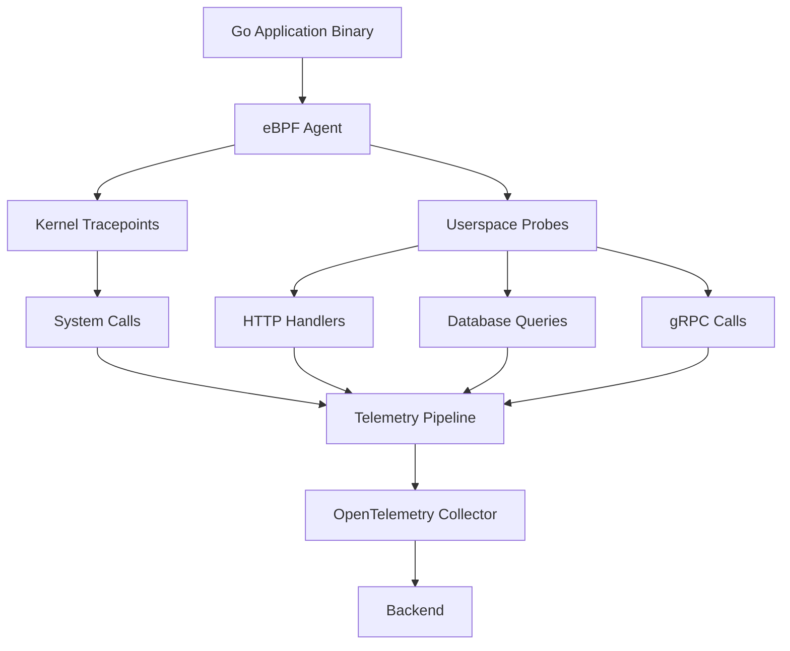

# How to Use Go Auto SDK for Zero-Code OpenTelemetry Instrumentation

Author: [nawazdhandala](https://www.github.com/nawazdhandala)

Tags: OpenTelemetry, Go, Auto SDK, Zero-Code, eBPF, Auto-Instrumentation

Description: Explore OpenTelemetry auto-instrumentation for Go using eBPF technology to add observability without modifying application code or recompiling binaries.

Traditional OpenTelemetry instrumentation requires adding SDK imports, creating spans manually, and modifying code throughout your application. This approach works well for new projects but becomes challenging with legacy codebases, third-party applications, or microservices where changing every service proves impractical.

OpenTelemetry auto-instrumentation for Go solves this problem using eBPF (extended Berkeley Packet Filter) technology. eBPF allows injecting instrumentation into running processes without code changes or recompilation. You get distributed tracing, metrics collection, and observability for existing Go applications without touching source code.

This guide covers OpenTelemetry auto-instrumentation for Go, explaining how it works, when to use it, and how to deploy it in production environments.

## Understanding Auto-Instrumentation

Auto-instrumentation operates at the binary level, intercepting function calls and system operations to generate telemetry data. Unlike manual instrumentation where you explicitly create spans, auto-instrumentation detects operations automatically and creates appropriate telemetry.

**eBPF Technology** enables kernel-level instrumentation without modifying application code. eBPF programs attach to kernel tracepoints and user-space functions, observing execution flow and extracting context.

**Uprobe Mechanisms** allow attaching to specific functions in user-space applications. When the instrumented function executes, the eBPF program captures arguments, return values, and timing information.

**Context Propagation** works by intercepting HTTP headers, gRPC metadata, and other communication channels to maintain distributed trace context across service boundaries.

**Automatic Discovery** identifies instrumentation targets by analyzing binary symbols and detecting common patterns like HTTP handlers, database clients, and RPC frameworks.

## How Go Auto-Instrumentation Works

Go presents unique challenges for auto-instrumentation compared to interpreted languages:

**Statically Linked Binaries** include all dependencies in a single executable, making it harder to instrument individual libraries.

**Goroutine Scheduling** complicates context tracking since goroutines can migrate between OS threads.

**Stack Management** differs from traditional languages, requiring special handling to extract trace context.

**Runtime Optimization** may inline functions or optimize away instrumentation points.

The OpenTelemetry Go auto-instrumentation project addresses these challenges using:



## Installing Auto-Instrumentation

The OpenTelemetry Go auto-instrumentation runs as a sidecar or separate process alongside your application:

```bash
# Download the auto-instrumentation binary
wget https://github.com/open-telemetry/opentelemetry-go-instrumentation/releases/latest/download/otel-go-auto-linux-amd64

chmod +x otel-go-auto-linux-amd64
mv otel-go-auto-linux-amd64 /usr/local/bin/otel-go-auto
```

Verify the installation:

```bash
otel-go-auto --version
```

## Basic Usage

Run your Go application with auto-instrumentation:

```bash
# Start your application normally
./your-go-application &

# Get the process ID
PID=$(pgrep your-go-application)

# Attach auto-instrumentation
otel-go-auto \
  --service-name=my-service \
  --endpoint=localhost:4317 \
  --pid=$PID
```

The auto-instrumentation agent attaches to the running process and begins generating traces automatically.

## Configuration Options

Configure auto-instrumentation through environment variables or command-line flags:

```bash
#!/bin/bash

# Service identification
export OTEL_SERVICE_NAME="my-service"
export OTEL_SERVICE_VERSION="1.0.0"
export OTEL_DEPLOYMENT_ENVIRONMENT="production"

# Exporter configuration
export OTEL_EXPORTER_OTLP_ENDPOINT="http://localhost:4317"
export OTEL_EXPORTER_OTLP_PROTOCOL="grpc"

# Sampling configuration
export OTEL_TRACES_SAMPLER="parentbased_traceidratio"
export OTEL_TRACES_SAMPLER_ARG="0.1"  # Sample 10% of traces

# Resource attributes
export OTEL_RESOURCE_ATTRIBUTES="deployment.environment=production,service.namespace=backend"

# Start application with auto-instrumentation
otel-go-auto --pid=$(pgrep your-app)
```

## Instrumentation Scope

Auto-instrumentation captures different types of operations:

**HTTP Servers** automatically instrument net/http handlers, capturing request/response details and generating spans for each request.

**HTTP Clients** trace outbound HTTP requests, including URLs, methods, status codes, and timing.

**gRPC Services** instrument both server and client sides, capturing method names, metadata, and status codes.

**Database Operations** trace SQL queries and database interactions when using standard database/sql package.

**Goroutines** track goroutine creation and execution context propagation.

## Kubernetes Deployment

Deploy auto-instrumentation in Kubernetes using the OpenTelemetry Operator:

```yaml
apiVersion: v1
kind: Namespace
metadata:
  name: observability
---
apiVersion: apps/v1
kind: Deployment
metadata:
  name: my-service
  namespace: default
spec:
  replicas: 3
  selector:
    matchLabels:
      app: my-service
  template:
    metadata:
      labels:
        app: my-service
      annotations:
        # Enable auto-instrumentation
        instrumentation.opentelemetry.io/inject-go: "true"
    spec:
      containers:
      - name: app
        image: my-service:latest
        env:
        - name: OTEL_SERVICE_NAME
          value: "my-service"
        - name: OTEL_EXPORTER_OTLP_ENDPOINT
          value: "http://otel-collector.observability:4317"
---
apiVersion: opentelemetry.io/v1alpha1
kind: Instrumentation
metadata:
  name: go-instrumentation
  namespace: default
spec:
  exporter:
    endpoint: http://otel-collector.observability:4317
  propagators:
    - tracecontext
    - baggage
  sampler:
    type: parentbased_traceidratio
    argument: "0.1"
  go:
    image: ghcr.io/open-telemetry/opentelemetry-go-instrumentation/autoinstrumentation-go:latest
```

The OpenTelemetry Operator automatically injects the auto-instrumentation agent when it detects the annotation.

## Docker Deployment

For Docker environments, use a multi-stage approach:

```dockerfile
# Build stage
FROM golang:1.21 AS builder
WORKDIR /app
COPY . .
RUN go build -o myapp .

# Runtime stage with auto-instrumentation
FROM ubuntu:22.04

# Install auto-instrumentation
RUN apt-get update && apt-get install -y wget ca-certificates && \
    wget https://github.com/open-telemetry/opentelemetry-go-instrumentation/releases/latest/download/otel-go-auto-linux-amd64 -O /usr/local/bin/otel-go-auto && \
    chmod +x /usr/local/bin/otel-go-auto

# Copy application
COPY --from=builder /app/myapp /usr/local/bin/myapp

# Environment configuration
ENV OTEL_SERVICE_NAME=my-service
ENV OTEL_EXPORTER_OTLP_ENDPOINT=http://otel-collector:4317

# Create startup script
COPY <<'EOF' /start.sh
#!/bin/bash
set -e

# Start application in background
/usr/local/bin/myapp &
APP_PID=$!

# Wait for application to start
sleep 2

# Attach auto-instrumentation
/usr/local/bin/otel-go-auto --pid=$APP_PID &

# Wait for application
wait $APP_PID
EOF

RUN chmod +x /start.sh

CMD ["/start.sh"]
```

## Comparing Manual vs Auto-Instrumentation

Here's when to use each approach:

**Manual Instrumentation Benefits:**
- Full control over span creation and attributes
- Custom metrics and business logic tracking
- Lower runtime overhead
- Better for greenfield projects
- Explicit instrumentation points

**Auto-Instrumentation Benefits:**
- No code changes required
- Works with legacy applications
- Faster time to observability
- Consistent instrumentation across services
- Easier to maintain

**Hybrid Approach:**

Many teams combine both approaches. Auto-instrumentation provides baseline observability while manual instrumentation adds business-specific context:

```go
package main

import (
    "context"
    "log"
    "net/http"

    "go.opentelemetry.io/otel"
    "go.opentelemetry.io/otel/attribute"
    "go.opentelemetry.io/otel/trace"
)

// Auto-instrumentation handles the HTTP server tracing
// Manual instrumentation adds business context
func orderHandler(w http.ResponseWriter, r *http.Request) {
    ctx := r.Context()

    // Auto-instrumentation already created a span for the HTTP request
    // Get that span and add custom attributes
    span := trace.SpanFromContext(ctx)

    // Add business-specific attributes
    orderID := r.URL.Query().Get("order_id")
    span.SetAttributes(
        attribute.String("order.id", orderID),
        attribute.String("order.type", "online"),
    )

    // Create custom spans for business operations
    tracer := otel.Tracer("order-service")
    ctx, processSpan := tracer.Start(ctx, "process.order")

    processOrder(ctx, orderID)

    processSpan.End()

    w.WriteHeader(http.StatusOK)
}

func processOrder(ctx context.Context, orderID string) {
    // Business logic here
    // Auto-instrumentation captures any HTTP/DB calls
    // Manual spans capture business operations
}
```

## Limitations and Considerations

Auto-instrumentation has some limitations to understand:

**Performance Overhead**: eBPF instrumentation adds CPU and memory overhead, typically 5-15% depending on application workload and instrumentation scope.

**Binary Requirements**: The Go binary must include symbol information (not stripped) for uprobe attachment. Build without `-ldflags="-s -w"` that strips symbols.

**Version Compatibility**: Auto-instrumentation targets specific Go runtime versions. Check compatibility before deploying.

**Limited Customization**: You can't control span names, attributes, or sampling at the operation level like with manual instrumentation.

**Context Propagation**: Complex context propagation scenarios may not work automatically, especially with custom communication protocols.

**Debugging Complexity**: Issues in auto-instrumentation require understanding eBPF, which increases troubleshooting difficulty.

## Troubleshooting Auto-Instrumentation

Common issues and solutions:

**No Traces Generated:**
```bash
# Check if eBPF programs are loaded
sudo bpftool prog list | grep otel

# Verify permissions (eBPF requires CAP_BPF or root)
sudo setcap cap_bpf+ep /usr/local/bin/otel-go-auto

# Check logs
otel-go-auto --verbose --pid=$PID
```

**Incomplete Traces:**
```bash
# Verify binary has symbols
go tool nm your-binary | grep http.Handler

# Check Go version compatibility
go version
otel-go-auto --supported-versions
```

**High Overhead:**
```bash
# Reduce sampling rate
export OTEL_TRACES_SAMPLER_ARG="0.01"  # Sample 1%

# Disable specific instrumentations
export OTEL_GO_AUTO_DISABLE_INSTRUMENTATIONS="grpc,database/sql"
```

## Monitoring Auto-Instrumentation

Monitor the auto-instrumentation agent itself:

```go
package main

import (
    "context"
    "log"
    "time"

    "go.opentelemetry.io/otel"
    "go.opentelemetry.io/otel/metric"
)

// MetricsCollector tracks auto-instrumentation health
type MetricsCollector struct {
    spansCreated   metric.Int64Counter
    spanErrors     metric.Int64Counter
    instrumentLoad metric.Float64Histogram
}

func NewMetricsCollector() (*MetricsCollector, error) {
    meter := otel.Meter("auto-instrumentation-metrics")

    spansCreated, err := meter.Int64Counter(
        "auto_instrument.spans.created",
        metric.WithDescription("Number of spans created by auto-instrumentation"),
    )
    if err != nil {
        return nil, err
    }

    spanErrors, err := meter.Int64Counter(
        "auto_instrument.spans.errors",
        metric.WithDescription("Number of span creation errors"),
    )
    if err != nil {
        return nil, err
    }

    instrumentLoad, err := meter.Float64Histogram(
        "auto_instrument.overhead.cpu_percent",
        metric.WithDescription("CPU overhead from instrumentation"),
    )
    if err != nil {
        return nil, err
    }

    return &MetricsCollector{
        spansCreated:   spansCreated,
        spanErrors:     spanErrors,
        instrumentLoad: instrumentLoad,
    }, nil
}
```

## Security Considerations

Auto-instrumentation requires elevated privileges:

**eBPF Capabilities**: The agent needs CAP_BPF and CAP_PERFMON capabilities to attach probes.

**Process Access**: Reading from other processes requires CAP_SYS_PTRACE or running as root.

**Network Access**: The agent sends telemetry data to collectors, requiring appropriate network policies.

Secure deployment example:

```yaml
apiVersion: v1
kind: ServiceAccount
metadata:
  name: otel-auto-instrument
  namespace: observability
---
apiVersion: rbac.authorization.k8s.io/v1
kind: ClusterRole
metadata:
  name: otel-auto-instrument
rules:
- apiGroups: [""]
  resources: ["pods"]
  verbs: ["get", "list", "watch"]
---
apiVersion: rbac.authorization.k8s.io/v1
kind: ClusterRoleBinding
metadata:
  name: otel-auto-instrument
roleRef:
  apiGroup: rbac.authorization.k8s.io
  kind: ClusterRole
  name: otel-auto-instrument
subjects:
- kind: ServiceAccount
  name: otel-auto-instrument
  namespace: observability
---
apiVersion: v1
kind: SecurityContext
spec:
  capabilities:
    add:
    - SYS_PTRACE
    - SYS_ADMIN
  privileged: false
  runAsNonRoot: true
  runAsUser: 1000
```

## Performance Benchmarking

Measure auto-instrumentation overhead:

```go
package main

import (
    "context"
    "fmt"
    "net/http"
    "net/http/httptest"
    "testing"
    "time"
)

// BenchmarkWithoutInstrumentation establishes baseline performance
func BenchmarkWithoutInstrumentation(b *testing.B) {
    handler := http.HandlerFunc(func(w http.ResponseWriter, r *http.Request) {
        w.WriteHeader(http.StatusOK)
    })

    server := httptest.NewServer(handler)
    defer server.Close()

    b.ResetTimer()
    for i := 0; i < b.N; i++ {
        resp, _ := http.Get(server.URL)
        resp.Body.Close()
    }
}

// BenchmarkWithAutoInstrumentation measures performance with auto-instrumentation
// Run this with auto-instrumentation agent attached
func BenchmarkWithAutoInstrumentation(b *testing.B) {
    handler := http.HandlerFunc(func(w http.ResponseWriter, r *http.Request) {
        w.WriteHeader(http.StatusOK)
    })

    server := httptest.NewServer(handler)
    defer server.Close()

    b.ResetTimer()
    for i := 0; i < b.N; i++ {
        resp, _ := http.Get(server.URL)
        resp.Body.Close()
    }
}

// Run benchmarks:
// go test -bench=BenchmarkWithoutInstrumentation -benchmem
// otel-go-auto --pid=$(pgrep test) &
// go test -bench=BenchmarkWithAutoInstrumentation -benchmem
```

## Future of Auto-Instrumentation

The OpenTelemetry Go auto-instrumentation project continues evolving:

**Expanded Coverage**: Support for more libraries and frameworks including Kafka clients, Redis, MongoDB drivers.

**Better Performance**: Optimizations to reduce overhead through selective instrumentation and smarter sampling.

**Enhanced Context Propagation**: Improved handling of goroutine context across complex execution paths.

**Configuration Flexibility**: Runtime configuration changes without restarting applications.

**Integration**: Tighter integration with service meshes and cloud-native platforms.

Auto-instrumentation transforms how you add observability to Go applications. While it doesn't replace manual instrumentation entirely, it provides a fast path to baseline observability for existing applications. Use auto-instrumentation to quickly gain visibility, then add manual instrumentation for business-critical paths requiring detailed tracking.

For legacy codebases, third-party applications, or rapid observability deployment, Go auto-instrumentation offers immediate value without the code changes traditional instrumentation demands.
