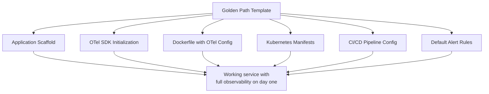

# How to Create Golden Path Templates for OpenTelemetry Instrumentation in Your Platform

Author: [nawazdhandala](https://www.github.com/nawazdhandala)

Tags: OpenTelemetry, Golden Path, Platform Engineering, Templates

Description: Design golden path templates that give developers a pre-configured, opinionated starting point for OpenTelemetry instrumentation in new services.

A golden path is the recommended way to do something within your organization. Not the only way - just the path that has been tested, documented, and supported by the platform team. For OpenTelemetry instrumentation, golden path templates mean that a developer starting a new Python Flask service (or Go Gin service, or Java Spring service) gets a project scaffold with telemetry already wired up correctly.

The alternative is every team figuring out OpenTelemetry setup from scratch, reading through pages of documentation, and making slightly different choices that create inconsistencies across the organization. Golden paths eliminate that repeated effort.

## What Belongs in a Golden Path Template

Each template is a project scaffold for a specific language and framework combination. The template includes OpenTelemetry dependencies, initialization code, Dockerfile configuration with the right environment variables, and Kubernetes manifests with collector connectivity.



## Template Structure

Here is the directory layout for a Python Flask golden path template. Other language templates follow the same pattern with language-appropriate tooling.

```
golden-path-python-flask/
  cookiecutter.json
  {{cookiecutter.service_name}}/
    app/
      __init__.py
      main.py
      telemetry.py          # OTel initialization
      routes/
        health.py            # Health check endpoint with trace context
    config/
      telemetry-config.yaml  # Sampling and export settings
    deploy/
      kubernetes/
        deployment.yaml
        service.yaml
      docker/
        Dockerfile
    alerts/
      baseline-alerts.yaml   # Default RED metric alerts
    pyproject.toml
    README.md
```

## The Telemetry Module

The core of the template is the telemetry module. It wraps the internal SDK wrapper (if you have one) or configures OpenTelemetry directly with your organization's defaults.

```python
# {{cookiecutter.service_name}}/app/telemetry.py
"""
OpenTelemetry configuration for {{cookiecutter.service_name}}.
Generated from the golden-path-python-flask template.

Modify telemetry-config.yaml for sampling and export settings.
Do not change this file unless you need custom instrumentation beyond
what the template provides.
"""

import yaml
from opentelemetry import trace, metrics
from opentelemetry.sdk.trace import TracerProvider
from opentelemetry.sdk.trace.export import BatchSpanProcessor
from opentelemetry.sdk.metrics import MeterProvider
from opentelemetry.sdk.metrics.export import PeriodicExportingMetricReader
from opentelemetry.exporter.otlp.proto.grpc.trace_exporter import OTLPSpanExporter
from opentelemetry.exporter.otlp.proto.grpc.metric_exporter import OTLPMetricExporter
from opentelemetry.sdk.resources import Resource
from opentelemetry.instrumentation.flask import FlaskInstrumentor
from opentelemetry.instrumentation.requests import RequestsInstrumentor
from opentelemetry.instrumentation.sqlalchemy import SQLAlchemyInstrumentor

def load_config() -> dict:
    """Load telemetry configuration from the config file."""
    with open("config/telemetry-config.yaml") as f:
        return yaml.safe_load(f)

def init_telemetry(app=None, db_engine=None):
    """
    Initialize all OpenTelemetry components.
    Call this once during application startup.
    """
    config = load_config()

    resource = Resource.create({
        "service.name": "{{cookiecutter.service_name}}",
        "service.version": "{{cookiecutter.version}}",
        "team.name": "{{cookiecutter.team_name}}",
        "deployment.environment": config.get("environment", "development"),
    })

    # Traces
    trace_provider = TracerProvider(resource=resource)
    trace_exporter = OTLPSpanExporter(
        endpoint=config["exporter"]["endpoint"]
    )
    trace_provider.add_span_processor(
        BatchSpanProcessor(trace_exporter)
    )
    trace.set_tracer_provider(trace_provider)

    # Metrics
    metric_reader = PeriodicExportingMetricReader(
        OTLPMetricExporter(endpoint=config["exporter"]["endpoint"]),
        export_interval_millis=config.get("metrics_interval_ms", 30000),
    )
    metric_provider = MeterProvider(
        resource=resource,
        metric_readers=[metric_reader],
    )
    metrics.set_meter_provider(metric_provider)

    # Auto-instrument common libraries
    if app:
        FlaskInstrumentor().instrument_app(app)
    RequestsInstrumentor().instrument()
    if db_engine:
        SQLAlchemyInstrumentor().instrument(engine=db_engine)

    return trace.get_tracer("{{cookiecutter.service_name}}")
```

## Configuration File

The telemetry config file is the only file teams should routinely modify. It controls sampling, export endpoints, and feature flags.

```yaml
# {{cookiecutter.service_name}}/config/telemetry-config.yaml
# Telemetry configuration - modify this file for your needs
# See https://internal-docs/telemetry/config for all options

environment: development

exporter:
  endpoint: "http://otel-collector.internal:4317"

sampling:
  # Percentage of traces to sample (1-100)
  # Production recommendation: 10-25 for high-traffic services
  rate: 100  # 100% in development, reduce for production

metrics_interval_ms: 30000  # How often to export metrics

# Feature flags for optional instrumentation
features:
  sql_query_capture: false   # Set true to capture SQL in spans
  request_body_capture: false # Never enable in production
  baggage_propagation: true
```

## Dockerfile with OTel Environment Variables

The Dockerfile sets environment variables that the OpenTelemetry SDK reads at runtime, providing fallback configuration that works even if the config file is missing.

```dockerfile
# {{cookiecutter.service_name}}/deploy/docker/Dockerfile
FROM python:3.12-slim

WORKDIR /app
COPY pyproject.toml .
RUN pip install --no-cache-dir .

COPY . .

# OpenTelemetry environment variables as fallback configuration
ENV OTEL_SERVICE_NAME="{{cookiecutter.service_name}}"
ENV OTEL_RESOURCE_ATTRIBUTES="team.name={{cookiecutter.team_name}}"
ENV OTEL_EXPORTER_OTLP_ENDPOINT="http://otel-collector.internal:4317"
ENV OTEL_TRACES_SAMPLER="parentbased_traceidratio"
ENV OTEL_TRACES_SAMPLER_ARG="0.25"

EXPOSE 8080
CMD ["gunicorn", "app.main:create_app()", "-b", "0.0.0.0:8080"]
```

## Keeping Templates Updated

Golden path templates are not a one-time effort. As OpenTelemetry releases new versions, as your internal conventions evolve, and as new instrumentation libraries become available, the templates need updates.

Use a template registry that tracks which services were generated from which template version. When you update a template, notify teams that their service was generated from an older version and provide a migration guide. Automated pull requests that update the telemetry module in existing services work well for non-breaking changes.

The measure of success for golden paths is adoption rate. If 80% of new services use a golden path template, you have strong consistency. If only 20% do, the templates are probably too restrictive or too hard to find. Track this metric and adjust the templates based on feedback from the teams using them.
