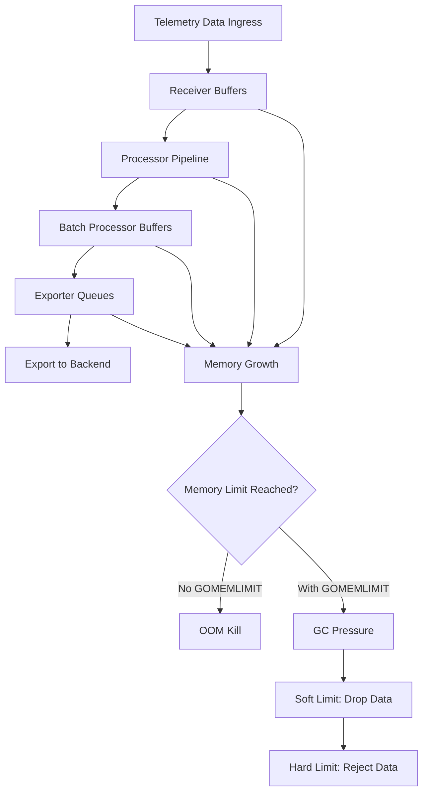

# How to Set Up GOMEMLIMIT and Memory Limiter for Stable Collectors

Author: [nawazdhandala](https://www.github.com/nawazdhandala)

Tags: OpenTelemetry, Collector, Memory Management, Performance, Stability

Description: Prevent OpenTelemetry Collector crashes with proper GOMEMLIMIT and memory limiter configuration. Learn how to tune memory settings for stability under high load.

The OpenTelemetry Collector is a critical component in observability pipelines, but it can become unstable under high load if memory is not properly managed. Out-of-memory (OOM) errors are the most common cause of Collector crashes, leading to data loss and gaps in telemetry.

Proper memory management requires two complementary mechanisms: GOMEMLIMIT (Go runtime memory limit) and the memory limiter processor. Together, they provide defense-in-depth against memory exhaustion and ensure your Collectors remain stable even under extreme load.

This guide provides comprehensive configuration strategies for production-grade memory management.

## Understanding Memory Management in Go Collectors

The OpenTelemetry Collector is written in Go, which uses a garbage collector (GC) for memory management. Without proper configuration, Go's GC can allow memory usage to grow until the operating system kills the process.



Three layers of defense prevent OOM:

1. **GOMEMLIMIT**: Tells Go runtime when to increase GC pressure
2. **Memory Limiter Soft Limit**: Starts dropping data proactively
3. **Memory Limiter Hard Limit**: Rejects new data completely

## Setting Up GOMEMLIMIT

GOMEMLIMIT is a Go 1.19+ environment variable that sets a soft memory limit for the Go runtime. When memory approaches this limit, the garbage collector runs more aggressively.

### Basic GOMEMLIMIT Configuration

```yaml
# Kubernetes deployment with GOMEMLIMIT
apiVersion: apps/v1
kind: Deployment
metadata:
  name: otel-collector
spec:
  replicas: 3
  template:
    spec:
      containers:
      - name: otel-collector
        image: otel/opentelemetry-collector-contrib:0.93.0
        env:
          # Set GOMEMLIMIT to 80% of container memory limit
          # If container limit is 2GB, set GOMEMLIMIT to ~1600MB
          - name: GOMEMLIMIT
            value: "1600MiB"

          # Alternative: Use downward API to calculate dynamically
          # This sets GOMEMLIMIT to 80% of memory limit automatically
          - name: GOMEMLIMIT
            valueFrom:
              resourceFieldRef:
                resource: limits.memory
                divisor: "1.25"  # 1/0.8 = 1.25, gives us 80%

        resources:
          requests:
            memory: "1Gi"
            cpu: "500m"
          limits:
            memory: "2Gi"
            cpu: "2000m"

        volumeMounts:
          - name: config
            mountPath: /etc/otel-collector

      volumes:
        - name: config
          configMap:
            name: otel-collector-config
```

### Calculating the Right GOMEMLIMIT

The rule of thumb is to set GOMEMLIMIT to 75-80% of available memory:

```bash
# Calculate GOMEMLIMIT for different container sizes

# 512MB container
# GOMEMLIMIT = 512 * 0.8 = 409.6 MB ≈ 400MiB

# 1GB container
# GOMEMLIMIT = 1024 * 0.8 = 819.2 MB ≈ 800MiB

# 2GB container
# GOMEMLIMIT = 2048 * 0.8 = 1638.4 MB ≈ 1600MiB

# 4GB container
# GOMEMLIMIT = 4096 * 0.8 = 3276.8 MB ≈ 3200MiB
```

The 20-25% headroom accounts for:
- Memory outside Go heap (cgo allocations, OS buffers)
- Temporary spikes during GC
- Safety margin to prevent OOM kills

## Configuring the Memory Limiter Processor

The memory limiter processor actively monitors memory usage and takes action before GOMEMLIMIT is reached:

```yaml
# Collector configuration with memory limiter
receivers:
  otlp:
    protocols:
      grpc:
        endpoint: 0.0.0.0:4317
      http:
        endpoint: 0.0.0.0:4318

processors:
  # Memory limiter should be the FIRST processor
  # This ensures it can protect all downstream processors
  memory_limiter:
    # How often to check memory usage
    check_interval: 1s

    # Soft limit (start refusing data)
    # Set to 75% of GOMEMLIMIT
    # If GOMEMLIMIT is 1600MiB, set to 1200MiB
    limit_mib: 1200

    # Spike limit (temporary spike allowance)
    # Set to 20% of limit_mib
    # Allows short bursts above the soft limit
    spike_limit_mib: 240

    # Hard limit (calculated as limit_mib + spike_limit_mib)
    # When memory exceeds hard limit, Collector refuses all new data
    # Hard limit = 1200 + 240 = 1440 MiB

  # Other processors follow memory limiter
  batch:
    timeout: 10s
    send_batch_size: 1024

  # Example: resource processor
  resource:
    attributes:
      - key: deployment.environment
        value: production
        action: insert

exporters:
  otlp:
    endpoint: backend:4317
    sending_queue:
      enabled: true
      num_consumers: 10
      queue_size: 5000

service:
  pipelines:
    traces:
      receivers: [otlp]
      # Memory limiter MUST be first
      processors: [memory_limiter, batch, resource]
      exporters: [otlp]

    metrics:
      receivers: [otlp]
      processors: [memory_limiter, batch, resource]
      exporters: [otlp]

    logs:
      receivers: [otlp]
      processors: [memory_limiter, batch, resource]
      exporters: [otlp]
```

### Memory Limiter Configuration Parameters

Understanding each parameter:

```yaml
processors:
  memory_limiter:
    # check_interval: How often to check memory
    # - Shorter interval (0.5s-1s): More responsive, higher CPU overhead
    # - Longer interval (2s-5s): Lower CPU overhead, slower response
    # Recommended: 1s for production
    check_interval: 1s

    # limit_mib: Soft limit in MiB
    # When memory exceeds this, Collector starts refusing data
    # Calculation: GOMEMLIMIT * 0.75
    # Example: GOMEMLIMIT=1600MiB → limit_mib=1200
    limit_mib: 1200

    # spike_limit_mib: Temporary burst allowance
    # Short spikes above limit_mib are allowed up to this amount
    # Calculation: limit_mib * 0.20
    # Example: limit_mib=1200 → spike_limit_mib=240
    spike_limit_mib: 240

    # limit_percentage: Alternative to limit_mib
    # Percentage of total system memory to use as limit
    # Only use this if you control the entire system
    # Not recommended in containers
    # limit_percentage: 75

    # spike_limit_percentage: Alternative to spike_limit_mib
    # Percentage of limit_percentage for spike allowance
    # spike_limit_percentage: 20
```

## Complete Production Configuration

A production-ready configuration combining GOMEMLIMIT and memory limiter:

```yaml
# Kubernetes deployment with complete memory management
apiVersion: apps/v1
kind: Deployment
metadata:
  name: otel-collector
  namespace: observability
spec:
  replicas: 3
  selector:
    matchLabels:
      app: otel-collector
  template:
    metadata:
      labels:
        app: otel-collector
      annotations:
        # Prometheus scraping annotations
        prometheus.io/scrape: "true"
        prometheus.io/port: "8888"
        prometheus.io/path: "/metrics"
    spec:
      # Use init container to validate configuration
      initContainers:
      - name: validate-config
        image: otel/opentelemetry-collector-contrib:0.93.0
        command: ["/otelcol-contrib"]
        args: ["validate", "--config=/etc/otel-collector/config.yaml"]
        volumeMounts:
          - name: config
            mountPath: /etc/otel-collector

      containers:
      - name: otel-collector
        image: otel/opentelemetry-collector-contrib:0.93.0
        command: ["/otelcol-contrib"]
        args: ["--config=/etc/otel-collector/config.yaml"]

        env:
          # GOMEMLIMIT set to 80% of memory limit
          - name: GOMEMLIMIT
            value: "3200MiB"  # 80% of 4GB

          # Enable Go GC debugging (optional)
          - name: GODEBUG
            value: "gctrace=1"

        resources:
          requests:
            memory: "2Gi"
            cpu: "1000m"
          limits:
            memory: "4Gi"
            cpu: "4000m"

        ports:
          - name: otlp-grpc
            containerPort: 4317
          - name: otlp-http
            containerPort: 4318
          - name: metrics
            containerPort: 8888

        # Liveness probe
        livenessProbe:
          httpGet:
            path: /
            port: 13133
          initialDelaySeconds: 30
          periodSeconds: 10
          timeoutSeconds: 5

        # Readiness probe
        readinessProbe:
          httpGet:
            path: /
            port: 13133
          initialDelaySeconds: 10
          periodSeconds: 5
          timeoutSeconds: 3

        volumeMounts:
          - name: config
            mountPath: /etc/otel-collector

      volumes:
        - name: config
          configMap:
            name: otel-collector-config

---
# Collector configuration
apiVersion: v1
kind: ConfigMap
metadata:
  name: otel-collector-config
  namespace: observability
data:
  config.yaml: |
    receivers:
      otlp:
        protocols:
          grpc:
            endpoint: 0.0.0.0:4317
            # Limit max message size to prevent memory spikes
            max_recv_msg_size_mib: 64
          http:
            endpoint: 0.0.0.0:4318

      # Enable health check endpoint
      prometheus:
        config:
          scrape_configs:
            - job_name: 'otel-collector'
              scrape_interval: 10s
              static_configs:
                - targets: ['localhost:8888']

    processors:
      # Memory limiter MUST be first processor
      memory_limiter:
        check_interval: 1s
        # 75% of GOMEMLIMIT (3200 * 0.75 = 2400)
        limit_mib: 2400
        # 20% of limit_mib (2400 * 0.20 = 480)
        spike_limit_mib: 480

      # Batch processor to reduce export frequency
      batch:
        timeout: 10s
        send_batch_size: 1024
        send_batch_max_size: 2048

      # Resource detection for better observability
      resourcedetection:
        detectors: [env, system, docker, k8s]
        timeout: 5s

    exporters:
      otlp:
        endpoint: backend.observability.svc.cluster.local:4317
        # Configure sending queue to buffer during backend slowness
        sending_queue:
          enabled: true
          num_consumers: 10
          queue_size: 5000
        # Retry on failure
        retry_on_failure:
          enabled: true
          initial_interval: 5s
          max_interval: 30s
          max_elapsed_time: 300s

      # Export Collector's own metrics
      prometheus:
        endpoint: "0.0.0.0:8889"

    extensions:
      # Health check extension
      health_check:
        endpoint: 0.0.0.0:13133

      # Performance profiler (useful for debugging)
      pprof:
        endpoint: 0.0.0.0:1777

      # zPages for live debugging
      zpages:
        endpoint: 0.0.0.0:55679

    service:
      extensions: [health_check, pprof, zpages]

      pipelines:
        traces:
          receivers: [otlp]
          processors: [memory_limiter, batch, resourcedetection]
          exporters: [otlp]

        metrics:
          receivers: [otlp, prometheus]
          processors: [memory_limiter, batch, resourcedetection]
          exporters: [otlp, prometheus]

        logs:
          receivers: [otlp]
          processors: [memory_limiter, batch, resourcedetection]
          exporters: [otlp]

      # Configure telemetry for the Collector itself
      telemetry:
        logs:
          level: info
        metrics:
          level: detailed
          address: 0.0.0.0:8888
```

## Monitoring Memory Usage

Monitor these metrics to validate your memory configuration:

```yaml
# Key metrics to monitor
metrics:
  # Go runtime metrics
  - runtime.go.mem.heap_alloc  # Current heap memory
  - runtime.go.mem.heap_sys    # Total heap memory from OS
  - runtime.go.gc.count        # GC execution count
  - runtime.go.gc.pause_ns     # GC pause duration

  # Memory limiter metrics
  - otelcol_processor_refused_spans        # Spans refused by memory limiter
  - otelcol_processor_refused_metric_points  # Metrics refused
  - otelcol_processor_refused_log_records   # Logs refused

  # Pipeline metrics
  - otelcol_receiver_accepted_spans       # Spans accepted by receiver
  - otelcol_exporter_sent_spans           # Spans successfully exported
  - otelcol_exporter_send_failed_spans    # Spans failed to export

# Alert on these conditions
alerts:
  - name: CollectorMemoryHigh
    expression: runtime.go.mem.heap_alloc > GOMEMLIMIT * 0.85
    message: "Collector memory usage above 85% of GOMEMLIMIT"

  - name: CollectorRefusingData
    expression: rate(otelcol_processor_refused_spans[5m]) > 0
    message: "Collector memory limiter is refusing data"

  - name: CollectorGCPressure
    expression: rate(runtime.go.gc.count[1m]) > 10
    message: "Collector experiencing high GC pressure"
```

### Grafana Dashboard for Memory Monitoring

```json
{
  "dashboard": {
    "title": "OpenTelemetry Collector Memory",
    "panels": [
      {
        "title": "Memory Usage",
        "targets": [
          {
            "expr": "runtime_go_mem_heap_alloc_bytes",
            "legendFormat": "Heap Allocated"
          },
          {
            "expr": "runtime_go_mem_heap_sys_bytes",
            "legendFormat": "Heap System"
          }
        ]
      },
      {
        "title": "GC Rate",
        "targets": [
          {
            "expr": "rate(runtime_go_gc_count[1m])",
            "legendFormat": "GC Per Second"
          }
        ]
      },
      {
        "title": "Data Refused",
        "targets": [
          {
            "expr": "rate(otelcol_processor_refused_spans[1m])",
            "legendFormat": "Spans Refused/sec"
          }
        ]
      }
    ]
  }
}
```

## Troubleshooting Memory Issues

### Problem 1: Frequent OOM Kills

**Symptoms**: Collector pods restart frequently with OOM errors

**Solution**:
```yaml
# Increase memory limits and adjust GOMEMLIMIT
resources:
  limits:
    memory: "8Gi"  # Increase from 4Gi

env:
  - name: GOMEMLIMIT
    value: "6400MiB"  # 80% of 8GB

processors:
  memory_limiter:
    limit_mib: 4800  # 75% of GOMEMLIMIT
    spike_limit_mib: 960  # 20% of limit_mib
```

### Problem 2: High GC Pressure

**Symptoms**: High CPU usage, increased latency, frequent GC runs

**Solution**:
```yaml
# Increase GOMEMLIMIT to reduce GC frequency
env:
  - name: GOMEMLIMIT
    value: "2400MiB"  # Increase from 1600MiB

# Keep container limit the same
resources:
  limits:
    memory: "3Gi"  # Was 2Gi, now increased

# This gives Go more headroom before triggering GC
```

### Problem 3: Memory Limiter Refusing Too Much Data

**Symptoms**: Data loss, `otelcol_processor_refused_spans` metric increasing

**Solution**:
```yaml
# Option 1: Increase memory limits
processors:
  memory_limiter:
    limit_mib: 3200  # Increase from 2400
    spike_limit_mib: 640

# Option 2: Add horizontal scaling
spec:
  replicas: 5  # Increase from 3

# Option 3: Add load balancing
---
apiVersion: v1
kind: Service
metadata:
  name: otel-collector-headless
spec:
  clusterIP: None
  selector:
    app: otel-collector
  ports:
    - name: otlp-grpc
      port: 4317
```

### Problem 4: Memory Leaks

**Symptoms**: Memory usage grows continuously, never drops

**Solution**:
```bash
# Enable memory profiling
kubectl exec -it otel-collector-pod -- wget -O mem.prof http://localhost:1777/debug/pprof/heap

# Analyze locally
go tool pprof mem.prof

# Look for cumulative allocations
(pprof) top10
(pprof) list <function_name>

# Common causes:
# 1. Unbounded queues in exporters
# 2. Stateful processors (like cumulativetodelta) with high cardinality
# 3. Tail sampling processor with too large num_traces
```

## Advanced Memory Optimization

### Optimizing Batch Processor

```yaml
processors:
  batch:
    # Reduce batch size to lower memory usage
    send_batch_size: 512  # Default is 8192
    send_batch_max_size: 1024
    timeout: 5s  # Export more frequently

    # Calculate memory usage:
    # memory = send_batch_max_size * avg_span_size * num_pipelines
    # Example: 1024 * 2KB * 3 = ~6MB buffer per pipeline
```

### Optimizing Exporter Queues

```yaml
exporters:
  otlp:
    endpoint: backend:4317
    sending_queue:
      enabled: true
      # Reduce queue size to lower memory usage
      queue_size: 1000  # Default is 5000
      num_consumers: 5

      # Calculate memory usage:
      # memory = queue_size * avg_item_size
      # Example: 1000 * 2KB = ~2MB per exporter
```

### Reducing Stateful Processor Memory

```yaml
processors:
  # Tail sampling uses significant memory
  tail_sampling:
    # Reduce num_traces to lower memory
    num_traces: 50000  # Default is 100000
    decision_wait: 5s  # Reduce wait time

    # Memory usage: num_traces * avg_trace_size
    # Example: 50000 * 10KB = ~500MB

  # Cumulative to delta uses memory for state
  cumulativetodelta:
    # Limit series tracked
    max_stale: 50000  # Default is unlimited
    max_staleness: 5m
```

## Related Resources

For more Collector optimization strategies:
- https://oneuptime.com/blog/post/2026-02-06-cut-observability-costs-opentelemetry-filtering-sampling/view
- https://oneuptime.com/blog/post/2026-02-06-reduce-telemetry-data-volume-span-suppression/view
- https://oneuptime.com/blog/post/2026-02-06-handle-high-cardinality-metrics-opentelemetry/view

Proper memory management is critical for Collector stability. By correctly configuring GOMEMLIMIT and the memory limiter processor, you can ensure your Collectors remain stable under high load while efficiently using available resources. The key is understanding the relationship between container limits, GOMEMLIMIT, and memory limiter thresholds.
