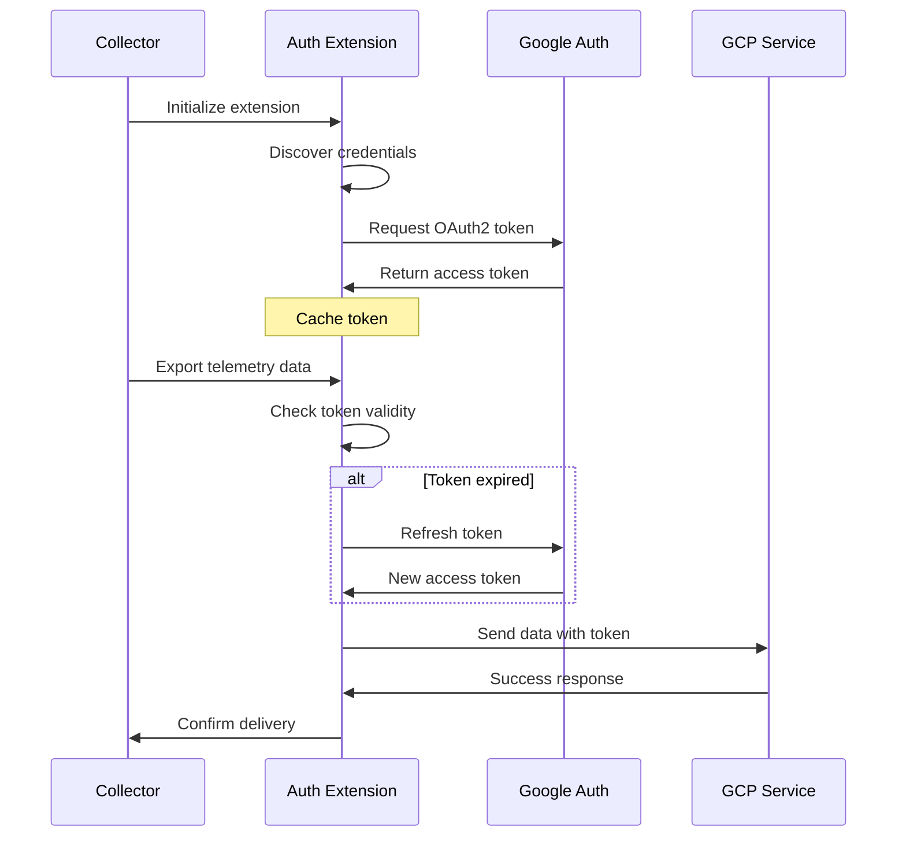

# How to Configure Google Client Auth Extension in the OpenTelemetry Collector

Author: [nawazdhandala](https://www.github.com/nawazdhandala)

Tags: OpenTelemetry, Collector, Extensions, Google Cloud, Authentication, GCP, Security

Description: Learn how to configure the Google Client Auth extension in OpenTelemetry Collector to authenticate with Google Cloud services using OAuth2, service accounts, and application default credentials.

When sending telemetry data from your OpenTelemetry Collector to Google Cloud services like Cloud Monitoring, Cloud Trace, or Cloud Logging, you need proper authentication. The Google Client Auth extension provides a robust authentication mechanism that integrates seamlessly with Google Cloud's identity and access management systems.

## What is the Google Client Auth Extension?

The Google Client Auth extension is an authenticator extension that enables the OpenTelemetry Collector to authenticate with Google Cloud Platform services. It supports multiple authentication methods including service account keys, workload identity, and application default credentials (ADC).

This extension implements the OAuth2 flow and automatically handles token refresh, making it ideal for production environments where long-running collectors need to maintain authenticated connections to Google Cloud services.

## Authentication Methods Supported

The extension supports three primary authentication methods:

**Service Account Keys**: JSON key files downloaded from Google Cloud Console containing credentials for a specific service account.

**Application Default Credentials (ADC)**: Automatically discovers credentials from the environment, including Google Cloud Shell, Compute Engine, Cloud Run, GKE, and local development environments with gcloud CLI.

**Workload Identity**: The recommended approach for applications running on GKE, allowing Kubernetes service accounts to authenticate as Google service accounts without managing keys.

## Basic Configuration

Here's a minimal configuration for the Google Client Auth extension using application default credentials.

```yaml
# collector-config.yaml
extensions:
  # Configure the Google Client Auth extension
  googleclientauth:
    # Use application default credentials (discovers from environment)
    # This works on GCE, GKE, Cloud Run, and with gcloud CLI
    project_id: "your-gcp-project-id"

receivers:
  otlp:
    protocols:
      grpc:
        endpoint: 0.0.0.0:4317

processors:
  batch:
    timeout: 10s

exporters:
  # Google Cloud exporters will use the auth extension
  googlecloud:
    # Reference the auth extension
    auth:
      authenticator: googleclientauth
    project: "your-gcp-project-id"

service:
  extensions: [googleclientauth]
  pipelines:
    traces:
      receivers: [otlp]
      processors: [batch]
      exporters: [googlecloud]
```

In this configuration, the extension automatically discovers credentials from the environment. The `auth` field in the exporter references the extension by name.

## Using Service Account Keys

For environments where ADC is not available, you can explicitly provide a service account key file.

```yaml
extensions:
  googleclientauth:
    # Explicitly specify a service account key file
    credentials_file: "/path/to/service-account-key.json"
    # Project ID is optional when using a service account key
    # It will be read from the key file
    project_id: "your-gcp-project-id"

receivers:
  otlp:
    protocols:
      grpc:
        endpoint: 0.0.0.0:4317

processors:
  batch:
    timeout: 10s

exporters:
  googlecloud:
    auth:
      authenticator: googleclientauth
    project: "your-gcp-project-id"

  # You can also use it with other exporters that need Google auth
  googlepubsub:
    auth:
      authenticator: googleclientauth
    project: "your-gcp-project-id"
    topic: "projects/your-gcp-project-id/topics/telemetry-data"

service:
  extensions: [googleclientauth]
  pipelines:
    traces:
      receivers: [otlp]
      processors: [batch]
      exporters: [googlecloud]
    logs:
      receivers: [otlp]
      processors: [batch]
      exporters: [googlepubsub]
```

The service account must have appropriate IAM permissions for the services you're accessing. For Cloud Monitoring, you typically need the `roles/monitoring.metricWriter` role. For Cloud Trace, use `roles/cloudtrace.agent`.

## Configuring with Workload Identity on GKE

When running on Google Kubernetes Engine, Workload Identity is the most secure approach as it eliminates the need to manage service account keys.

First, configure Workload Identity for your GKE cluster and namespace. Then use this configuration:

```yaml
extensions:
  googleclientauth:
    # When using Workload Identity, credentials are automatically discovered
    # The Kubernetes service account is mapped to a GCP service account
    project_id: "your-gcp-project-id"

    # Optional: specify scopes if you need specific permissions
    scopes:
      - "https://www.googleapis.com/auth/cloud-platform"
      - "https://www.googleapis.com/auth/monitoring.write"
      - "https://www.googleapis.com/auth/trace.append"

receivers:
  otlp:
    protocols:
      grpc:
        endpoint: 0.0.0.0:4317

processors:
  batch:
    timeout: 10s

  # Add resource detection to enrich with GKE metadata
  resourcedetection:
    detectors: [gcp]
    timeout: 5s

exporters:
  googlecloud:
    auth:
      authenticator: googleclientauth
    project: "your-gcp-project-id"

service:
  extensions: [googleclientauth]
  pipelines:
    traces:
      receivers: [otlp]
      processors: [resourcedetection, batch]
      exporters: [googlecloud]
```

In your Kubernetes deployment, ensure the service account annotation is set:

```yaml
apiVersion: v1
kind: ServiceAccount
metadata:
  name: otel-collector
  namespace: monitoring
  annotations:
    iam.gke.io/gcp-service-account: otel-collector@your-gcp-project-id.iam.gserviceaccount.com
```

## Authentication Flow Visualization

The following diagram illustrates how the Google Client Auth extension handles authentication:



## Multiple Authentication Configurations

You can configure multiple instances of the Google Client Auth extension for different projects or service accounts:

```yaml
extensions:
  # Primary project authentication
  googleclientauth/primary:
    project_id: "production-project"
    credentials_file: "/secrets/prod-sa-key.json"

  # Secondary project authentication
  googleclientauth/secondary:
    project_id: "backup-project"
    credentials_file: "/secrets/backup-sa-key.json"

receivers:
  otlp:
    protocols:
      grpc:
        endpoint: 0.0.0.0:4317

processors:
  batch:
    timeout: 10s

exporters:
  # Export to primary project
  googlecloud/primary:
    auth:
      authenticator: googleclientauth/primary
    project: "production-project"

  # Export to secondary project
  googlecloud/secondary:
    auth:
      authenticator: googleclientauth/secondary
    project: "backup-project"

service:
  extensions: [googleclientauth/primary, googleclientauth/secondary]
  pipelines:
    traces:
      receivers: [otlp]
      processors: [batch]
      # Send to both projects
      exporters: [googlecloud/primary, googlecloud/secondary]
```

This configuration allows you to send telemetry data to multiple Google Cloud projects simultaneously, useful for backup scenarios or multi-tenant architectures.

## Security Best Practices

When using the Google Client Auth extension, follow these security guidelines:

**Use Workload Identity when possible**: This eliminates the need to manage service account keys and reduces the risk of credential leakage.

**Apply principle of least privilege**: Grant only the minimum IAM permissions required for your collector's operations.

**Rotate service account keys regularly**: If you must use key files, implement a rotation schedule (recommended every 90 days).

**Secure key file storage**: Store service account keys in encrypted volumes or secret management systems like Kubernetes Secrets or Google Secret Manager.

**Monitor authentication failures**: Set up alerts for authentication errors to detect potential security issues.

## Troubleshooting Common Issues

**"Application Default Credentials not found" error**: This occurs when ADC is not configured. Install and authenticate with gcloud CLI (`gcloud auth application-default login`) or provide a credentials file.

**Permission denied errors**: Verify the service account has the required IAM roles. Use `gcloud projects get-iam-policy` to check current permissions.

**Token refresh failures**: Ensure your collector has network access to Google's OAuth2 endpoints. Check firewall rules and proxy configurations.

**Project ID mismatch**: Ensure the project_id in the extension matches the project in your exporters.

## Integration with Other Extensions

The Google Client Auth extension works well with other collector extensions. Here's an example combining it with health check and zpages extensions:

```yaml
extensions:
  googleclientauth:
    project_id: "your-gcp-project-id"

  health_check:
    endpoint: 0.0.0.0:13133

  zpages:
    endpoint: 0.0.0.0:55679

receivers:
  otlp:
    protocols:
      grpc:
        endpoint: 0.0.0.0:4317

processors:
  batch:
    timeout: 10s

exporters:
  googlecloud:
    auth:
      authenticator: googleclientauth
    project: "your-gcp-project-id"

service:
  extensions: [googleclientauth, health_check, zpages]
  pipelines:
    traces:
      receivers: [otlp]
      processors: [batch]
      exporters: [googlecloud]
```

## Conclusion

The Google Client Auth extension is essential for securely connecting your OpenTelemetry Collector to Google Cloud services. By supporting multiple authentication methods and handling token management automatically, it simplifies the deployment of collectors in various environments from local development to production Kubernetes clusters.

For more information on OpenTelemetry authentication, see the related guides on [Azure Auth Extension](https://oneuptime.com/blog/post/azure-auth-extension-opentelemetry-collector/view) and [storage extension configuration](https://oneuptime.com/blog/post/storage-extension-opentelemetry-collector/view).
