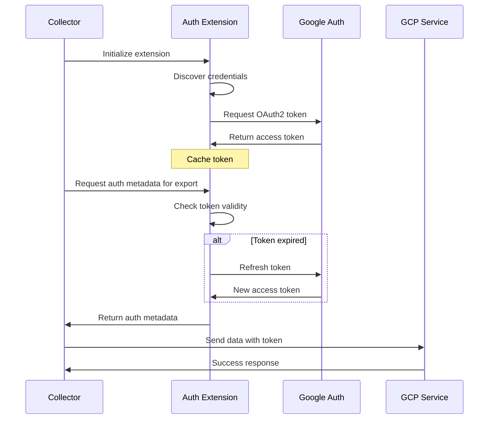

# How to Configure Google Client Auth Extension in the OpenTelemetry Collector

Author: [nawazdhandala](https://www.github.com/nawazdhandala)

Tags: OpenTelemetry, Collector, Extension, Google Cloud, Authentication, GCP, Security

Description: Learn how to configure the Google Client Auth extension in OpenTelemetry Collector to authenticate with Google Cloud services using OAuth2, service accounts, and application default credentials.

When sending telemetry data from your OpenTelemetry Collector to Google Cloud services like Cloud Monitoring, Cloud Trace, or Cloud Logging through the OTLP Telemetry API, you need proper authentication. The Google Client Auth extension provides a robust authentication mechanism that integrates seamlessly with Google Cloud's identity and access management systems.

## What is the Google Client Auth Extension?

The Google Client Auth extension is an authenticator extension that enables the OpenTelemetry Collector to authenticate HTTP and gRPC exporters with Google Cloud Platform services. It uses application default credentials (ADC), which can come from service account keys, workload identity, or other supported Google Cloud environments.

This extension implements the OAuth2 flow and automatically handles token refresh, making it ideal for production environments where long-running collectors need to maintain authenticated connections to Google Cloud services.

## Authentication Methods Supported

The extension uses application default credentials, which can come from these common sources:

**Service Account Keys**: JSON key files downloaded from Google Cloud Console containing credentials for a specific service account and exposed to ADC through the `GOOGLE_APPLICATION_CREDENTIALS` environment variable.

**Application Default Credentials (ADC)**: Automatically discovers credentials from the environment, including Compute Engine, Cloud Run, GKE, and local development environments configured with the gcloud CLI.

**Workload Identity Federation for GKE**: The recommended approach for applications running on GKE, allowing Kubernetes service accounts to authenticate to Google Cloud APIs without managing keys.

## Basic Configuration

Here's a minimal configuration for the Google Client Auth extension using application default credentials.

```yaml
# collector-config.yaml

extensions:
  # Configure the Google Client Auth extension
  googleclientauth:
    # Use application default credentials (discovers from environment)
    # This works on GCE, GKE, Cloud Run, and with gcloud CLI
    project: "your-gcp-project-id"

receivers:
  otlp:
    protocols:
      grpc:
        endpoint: 0.0.0.0:4317

processors:
  batch:
    timeout: 10s

exporters:
  # Send OTLP data to Google Cloud's Telemetry API
  otlphttp:
    endpoint: https://telemetry.googleapis.com
    encoding: proto
    auth:
      authenticator: googleclientauth

service:
  extensions: [googleclientauth]
  pipelines:
    traces:
      receivers: [otlp]
      processors: [batch]
      exporters: [otlphttp]
```

In this configuration, the extension automatically discovers credentials from the environment. The `auth` field in the exporter references the extension by name.

## Using Service Account Keys

For environments where ambient ADC is not available, point ADC to a service account key file before starting the Collector.

```bash
export GOOGLE_APPLICATION_CREDENTIALS="/path/to/service-account-key.json"
```

```yaml
extensions:
  googleclientauth:
    # The extension reads the key through ADC.
    # It does not have a credentials_file option.
    project: "your-gcp-project-id"

receivers:
  otlp:
    protocols:
      grpc:
        endpoint: 0.0.0.0:4317

processors:
  batch:
    timeout: 10s

exporters:
  otlphttp:
    endpoint: https://telemetry.googleapis.com
    encoding: proto
    auth:
      authenticator: googleclientauth

  # You can also use it with other HTTP or gRPC exporters that support auth extensions
  otlphttp/secondary:
    endpoint: https://telemetry.googleapis.com
    encoding: proto
    auth:
      authenticator: googleclientauth

service:
  extensions: [googleclientauth]
  pipelines:
    traces:
      receivers: [otlp]
      processors: [batch]
      exporters: [otlphttp]
    logs:
      receivers: [otlp]
      processors: [batch]
      exporters: [otlphttp/secondary]
```

The service account must have appropriate IAM permissions for the services you're accessing. For Cloud Monitoring, you typically need the `roles/monitoring.metricWriter` role. For Cloud Trace, use `roles/cloudtrace.agent`. For Cloud Logging, use `roles/logging.logWriter`.

## Configuring with Workload Identity Federation on GKE

When running on Google Kubernetes Engine, Workload Identity Federation for GKE is the most secure approach as it eliminates the need to manage service account keys.

First, configure Workload Identity Federation for your GKE cluster and namespace. Then use this configuration:

```yaml
extensions:
  googleclientauth:
    # When using Workload Identity Federation, credentials are automatically discovered
    # The Kubernetes service account is mapped to a GCP service account
    project: "your-gcp-project-id"

    # Optional: specify scopes if you need specific permissions
    scopes:
      - "https://www.googleapis.com/auth/cloud-platform"
      - "https://www.googleapis.com/auth/monitoring.write"
      - "https://www.googleapis.com/auth/trace.append"

receivers:
  otlp:
    protocols:
      grpc:
        endpoint: 0.0.0.0:4317

processors:
  batch:
    timeout: 10s

  # Add resource detection to enrich with GKE metadata
  resourcedetection:
    detectors: [gcp]
    timeout: 5s

exporters:
  otlphttp:
    endpoint: https://telemetry.googleapis.com
    encoding: proto
    auth:
      authenticator: googleclientauth

service:
  extensions: [googleclientauth]
  pipelines:
    traces:
      receivers: [otlp]
      processors: [resourcedetection, batch]
      exporters: [otlphttp]
```

In your Kubernetes deployment, ensure the service account annotation is set:

```yaml
apiVersion: v1
kind: ServiceAccount
metadata:
  name: otel-collector
  namespace: monitoring
  annotations:
    iam.gke.io/gcp-service-account: otel-collector@your-gcp-project-id.iam.gserviceaccount.com
```

## Authentication Flow Visualization

The following diagram illustrates how the Google Client Auth extension handles authentication:


```mermaid
sequenceDiagram
    participant C as Collector
    participant E as Auth Extension
    participant G as Google Auth
    participant S as GCP Service

    C->>E: Initialize extension
    E->>E: Discover credentials
    E->>G: Request OAuth2 token
    G->>E: Return access token
    Note over E: Cache token

    C->>E: Request auth metadata for export
    E->>E: Check token validity
    alt Token expired
        E->>G: Refresh token
        G->>E: New access token
    end
    E->>C: Return auth metadata
    C->>S: Send data with token
    S->>C: Success response
```

## Multiple Authentication Configurations

You can configure multiple instances of the Google Client Auth extension for different projects, quota projects, scopes, or token settings:

```yaml
extensions:
  # Primary project authentication
  googleclientauth/primary:
    project: "production-project"

  # Secondary project authentication
  googleclientauth/secondary:
    project: "backup-project"

receivers:
  otlp:
    protocols:
      grpc:
        endpoint: 0.0.0.0:4317

processors:
  batch:
    timeout: 10s

exporters:
  # Export to primary project
  otlphttp/primary:
    endpoint: https://telemetry.googleapis.com
    encoding: proto
    auth:
      authenticator: googleclientauth/primary

  # Export to secondary project
  otlphttp/secondary:
    endpoint: https://telemetry.googleapis.com
    encoding: proto
    auth:
      authenticator: googleclientauth/secondary

service:
  extensions: [googleclientauth/primary, googleclientauth/secondary]
  pipelines:
    traces:
      receivers: [otlp]
      processors: [batch]
      # Send to both projects
      exporters: [otlphttp/primary, otlphttp/secondary]
```

This configuration allows you to send telemetry data to multiple Google Cloud projects simultaneously, useful for backup scenarios or multi-tenant architectures. If you need different service account keys for different destinations, run separate Collector instances with different ADC environments.

## Security Best Practices

When using the Google Client Auth extension, follow these security guidelines:

**Use Workload Identity Federation when possible**: This eliminates the need to manage service account keys and reduces the risk of credential leakage.

**Apply principle of least privilege**: Grant only the minimum IAM permissions required for your collector's operations.

**Rotate service account keys regularly**: If you must use key files, implement a rotation schedule (recommended every 90 days).

**Secure key file storage**: Store service account keys in encrypted volumes or secret management systems like Kubernetes Secrets or Google Secret Manager.

**Monitor authentication failures**: Set up alerts for authentication errors to detect potential security issues.

## Troubleshooting Common Issues

**"Application Default Credentials not found" error**: This occurs when ADC is not configured. Install and authenticate with gcloud CLI (`gcloud auth application-default login`) or provide a credentials file.

**Permission denied errors**: Verify the service account has the required IAM roles. Use `gcloud projects get-iam-policy` to check current permissions.

**Token refresh failures**: Ensure your collector has network access to Google's OAuth2 endpoints. Check firewall rules and proxy configurations.

**Project ID mismatch**: Ensure the `project` in the extension matches the Google Cloud project you intend to send telemetry to.

## Integration with Other Extensions

The Google Client Auth extension works well with other collector extensions. Here's an example combining it with health check and zpages extensions:

```yaml
extensions:
  googleclientauth:
    project: "your-gcp-project-id"

  health_check:
    endpoint: 0.0.0.0:13133

  zpages:
    endpoint: 0.0.0.0:55679

receivers:
  otlp:
    protocols:
      grpc:
        endpoint: 0.0.0.0:4317

processors:
  batch:
    timeout: 10s

exporters:
  otlphttp:
    endpoint: https://telemetry.googleapis.com
    encoding: proto
    auth:
      authenticator: googleclientauth

service:
  extensions: [googleclientauth, health_check, zpages]
  pipelines:
    traces:
      receivers: [otlp]
      processors: [batch]
      exporters: [otlphttp]
```

## Conclusion

The Google Client Auth extension is essential for securely connecting OTLP HTTP and gRPC exporters in your OpenTelemetry Collector to Google Cloud services. By using ADC and handling token management automatically, it simplifies the deployment of collectors in various environments from local development to production Kubernetes clusters.

For more information on OpenTelemetry authentication, see the related guides on [Azure Auth Extension](https://oneuptime.com/blog/post/2026-02-06-azure-auth-extension-opentelemetry-collector/view) and [storage extension configuration](https://oneuptime.com/blog/post/2026-02-06-storage-extension-opentelemetry-collector/view).
