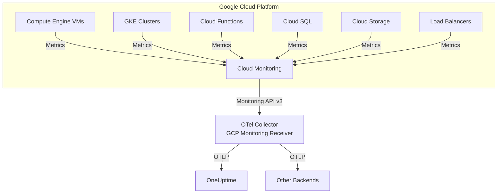

# How to Configure the Google Cloud Monitoring Receiver in the OpenTelemetry Collector

Author: [nawazdhandala](https://www.github.com/nawazdhandala)

Tags: OpenTelemetry, Collector, Google Cloud, GCP, Cloud Monitoring, Metrics, Observability

Description: Configure the Google Cloud Monitoring Receiver in OpenTelemetry Collector to pull metrics from Google Cloud Monitoring with authentication, query patterns, and production deployment examples.

---

> Using Google Cloud but want observability flexibility? The Google Cloud Monitoring Receiver lets you pull metrics from Cloud Monitoring into OpenTelemetry, enabling vendor-neutral analysis while leveraging GCP's native monitoring capabilities.

The Google Cloud Monitoring Receiver (formerly Stackdriver Receiver) is an OpenTelemetry Collector component that queries Google Cloud Monitoring APIs to retrieve metrics from GCP resources. This receiver enables you to consolidate Google Cloud metrics with telemetry from other sources in a unified observability platform, breaking free from vendor lock-in.

---

## What is the Google Cloud Monitoring Receiver?

Google Cloud Monitoring (formerly Stackdriver) collects metrics from Compute Engine VMs, Kubernetes Engine clusters, Cloud Functions, Cloud SQL databases, and dozens of other GCP services. The Google Cloud Monitoring Receiver queries these metrics via GCP APIs and converts them into OpenTelemetry format.

This receiver is essential for:

- **Multi-cloud observability**: Unify GCP metrics with AWS and Azure data
- **Cost optimization**: Export metrics to more affordable storage platforms
- **Vendor independence**: Avoid Cloud Monitoring lock-in
- **Custom processing**: Apply transformations before storage
- **Extended retention**: Store metrics beyond Cloud Monitoring's retention limits
- **Hybrid cloud**: Monitor GCP resources alongside on-premises infrastructure

### Key Features

- Query any metric type from Cloud Monitoring
- Support for custom metrics and user-defined metrics
- Multiple authentication methods (service account, workload identity, ADC)
- Resource filtering by project, labels, and resource types
- Configurable aggregation and alignment
- Built-in rate limiting to avoid quota exhaustion

---

## Architecture Overview

Here's how the Google Cloud Monitoring Receiver integrates into your observability pipeline:



The receiver periodically queries Cloud Monitoring APIs for specified metric types and resources, transforms the responses into OpenTelemetry metrics, and sends them through the collector pipeline.

---

## Prerequisites

Before configuring the receiver, ensure you have:

1. **Google Cloud Project** with resources to monitor
2. **Authentication credentials** - Service account or workload identity
3. **IAM permissions** - `monitoring.metricDescriptors.list`, `monitoring.timeSeries.list`
4. **Cloud Monitoring API** enabled in your project
5. **OpenTelemetry Collector** version 0.80.0 or later with googlecloudmonitoring receiver component

---

## Authentication Setup

The receiver supports multiple authentication methods:

### Method 1: Application Default Credentials (ADC)

When running on GCP (Compute Engine, GKE, Cloud Run), ADC automatically uses the instance's service account:

```bash
# No additional setup needed - ADC is automatic on GCP
# The receiver will use the default service account
```

### Method 2: Service Account Key File

For running outside GCP or using a specific service account:

1. Create a service account in GCP Console:

```bash
gcloud iam service-accounts create otel-collector \
  --description="OpenTelemetry Collector service account" \
  --display-name="OTel Collector"
```

2. Grant required permissions:

```bash
# Grant Monitoring Viewer role
gcloud projects add-iam-policy-binding PROJECT_ID \
  --member="serviceAccount:otel-collector@PROJECT_ID.iam.gserviceaccount.com" \
  --role="roles/monitoring.viewer"
```

3. Create and download key file:

```bash
gcloud iam service-accounts keys create otel-collector-key.json \
  --iam-account=otel-collector@PROJECT_ID.iam.gserviceaccount.com
```

4. Set environment variable:

```bash
export GOOGLE_APPLICATION_CREDENTIALS="/path/to/otel-collector-key.json"
```

### Method 3: Workload Identity (GKE)

For running on Google Kubernetes Engine with Workload Identity:

```bash
# Bind Kubernetes service account to GCP service account
gcloud iam service-accounts add-iam-policy-binding \
  otel-collector@PROJECT_ID.iam.gserviceaccount.com \
  --role roles/iam.workloadIdentityUser \
  --member "serviceAccount:PROJECT_ID.svc.id.goog[NAMESPACE/KSA_NAME]"
```

---

## Basic Configuration

Here's a minimal configuration to start collecting Compute Engine VM metrics:

```yaml
# Configure the Google Cloud Monitoring receiver
receivers:
  # The googlecloudmonitoring receiver queries Cloud Monitoring APIs
  googlecloudmonitoring:
    # GCP project ID to query metrics from
    project: my-gcp-project

    # Authentication via Application Default Credentials (auto-detected)
    # No explicit credentials needed when running on GCP

    # How often to scrape metrics from Cloud Monitoring
    collection_interval: 60s

    # Metric types to collect
    metric_types:
      # Compute Engine CPU utilization
      - compute.googleapis.com/instance/cpu/utilization
      # Compute Engine disk read bytes
      - compute.googleapis.com/instance/disk/read_bytes_count
      # Compute Engine disk write bytes
      - compute.googleapis.com/instance/disk/write_bytes_count
      # Compute Engine network received bytes
      - compute.googleapis.com/instance/network/received_bytes_count
      # Compute Engine network sent bytes
      - compute.googleapis.com/instance/network/sent_bytes_count

# Configure where to send metrics
exporters:
  otlphttp:
    endpoint: https://oneuptime.com/otlp
    headers:
      x-oneuptime-token: ${ONEUPTIME_TOKEN}

# Define the metrics pipeline
service:
  pipelines:
    metrics:
      receivers: [googlecloudmonitoring]
      exporters: [otlphttp]
```

This basic configuration collects key Compute Engine metrics every 60 seconds and exports them to OneUptime. Application Default Credentials handle authentication automatically when running on GCP.

---

## Production Configuration with Multiple Resource Types

For production environments, monitor multiple GCP resource types with filtering and processing:

```yaml
receivers:
  googlecloudmonitoring:
    # Project ID (can also use environment variable)
    project: ${GCP_PROJECT_ID}

    # Explicit service account key file (optional, uses ADC if omitted)
    credentials_file: ${GOOGLE_APPLICATION_CREDENTIALS}

    # Scrape interval
    collection_interval: 60s

    # Comprehensive metric types across GCP services
    metric_types:
      # Compute Engine
      - compute.googleapis.com/instance/cpu/utilization
      - compute.googleapis.com/instance/cpu/reserved_cores
      - compute.googleapis.com/instance/memory/balloon/ram_used
      - compute.googleapis.com/instance/disk/read_bytes_count
      - compute.googleapis.com/instance/disk/write_bytes_count
      - compute.googleapis.com/instance/disk/read_ops_count
      - compute.googleapis.com/instance/disk/write_ops_count
      - compute.googleapis.com/instance/network/received_bytes_count
      - compute.googleapis.com/instance/network/sent_bytes_count
      - compute.googleapis.com/instance/uptime

      # Google Kubernetes Engine
      - container.googleapis.com/container/cpu/limit_utilization
      - container.googleapis.com/container/memory/limit_utilization
      - container.googleapis.com/container/cpu/request_utilization
      - container.googleapis.com/container/memory/request_utilization
      - container.googleapis.com/container/restart_count
      - container.googleapis.com/pod/network/received_bytes_count
      - container.googleapis.com/pod/network/sent_bytes_count

      # Cloud SQL
      - cloudsql.googleapis.com/database/cpu/utilization
      - cloudsql.googleapis.com/database/memory/utilization
      - cloudsql.googleapis.com/database/disk/utilization
      - cloudsql.googleapis.com/database/disk/bytes_used
      - cloudsql.googleapis.com/database/network/connections
      - cloudsql.googleapis.com/database/network/received_bytes_count
      - cloudsql.googleapis.com/database/network/sent_bytes_count

      # Cloud Storage
      - storage.googleapis.com/storage/total_bytes
      - storage.googleapis.com/api/request_count
      - storage.googleapis.com/network/sent_bytes_count
      - storage.googleapis.com/network/received_bytes_count

      # Cloud Load Balancing
      - loadbalancing.googleapis.com/https/request_count
      - loadbalancing.googleapis.com/https/request_bytes_count
      - loadbalancing.googleapis.com/https/response_bytes_count
      - loadbalancing.googleapis.com/https/backend_latencies
      - loadbalancing.googleapis.com/https/total_latencies

      # Cloud Functions
      - cloudfunctions.googleapis.com/function/execution_count
      - cloudfunctions.googleapis.com/function/execution_times
      - cloudfunctions.googleapis.com/function/user_memory_bytes
      - cloudfunctions.googleapis.com/function/active_instances

    # Filter resources by labels (optional)
    resource_filters:
      # Only monitor production environment
      - resource.type = "gce_instance"
        AND resource.labels.environment = "production"
      # Only monitor specific GKE clusters
      - resource.type = "k8s_cluster"
        AND resource.labels.cluster_name = "prod-cluster-1"

    # Query configuration
    query:
      # Time alignment for data points (how to aggregate within period)
      # Options: ALIGN_NONE, ALIGN_DELTA, ALIGN_RATE, ALIGN_INTERPOLATE,
      #          ALIGN_NEXT_OLDER, ALIGN_MIN, ALIGN_MAX, ALIGN_MEAN,
      #          ALIGN_COUNT, ALIGN_SUM, ALIGN_STDDEV, ALIGN_COUNT_TRUE, etc.
      per_series_aligner: ALIGN_MEAN

      # Alignment period (time window for aggregation)
      alignment_period: 60s

      # Cross-series reducer (how to combine multiple time series)
      # Options: REDUCE_NONE, REDUCE_MEAN, REDUCE_MIN, REDUCE_MAX,
      #          REDUCE_SUM, REDUCE_STDDEV, REDUCE_COUNT, etc.
      cross_series_reducer: REDUCE_NONE

processors:
  # Protect collector from memory issues
  memory_limiter:
    limit_mib: 2048
    spike_limit_mib: 512
    check_interval: 5s

  # Add resource attributes
  resource:
    attributes:
      - key: source.type
        value: gcp_monitoring
        action: insert
      - key: cloud.provider
        value: gcp
        action: insert
      - key: gcp.project.id
        value: ${GCP_PROJECT_ID}
        action: insert

  # Transform metric names to follow conventions
  metricstransform:
    transforms:
      # Normalize GCP metric names
      - include: "^compute\\.googleapis\\.com/(.*)$"
        match_type: regexp
        action: update
        new_name: "gcp.compute.$$1"

      - include: "^container\\.googleapis\\.com/(.*)$"
        match_type: regexp
        action: update
        new_name: "gcp.gke.$$1"

      - include: "^cloudsql\\.googleapis\\.com/(.*)$"
        match_type: regexp
        action: update
        new_name: "gcp.cloudsql.$$1"

  # Filter out metrics you don't need
  filter/unnecessary:
    metrics:
      exclude:
        match_type: regexp
        metric_names:
          # Example: Exclude uptime metrics if not needed
          - ".*uptime$"
        resource_attributes:
          # Example: Exclude test instances
          - key: resource.labels.instance_name
            value: ".*test.*"

  # Batch metrics for efficiency
  batch:
    timeout: 30s
    send_batch_size: 1000
    send_batch_max_size: 2000

exporters:
  # Primary export to OneUptime
  otlphttp/oneuptime:
    endpoint: https://oneuptime.com/otlp
    headers:
      x-oneuptime-token: ${ONEUPTIME_TOKEN}
    compression: gzip
    timeout: 30s
    retry_on_failure:
      enabled: true
      initial_interval: 5s
      max_interval: 30s
      max_elapsed_time: 300s

  # Backup to Cloud Monitoring (for redundancy)
  googlecloud:
    project: ${GCP_PROJECT_ID}
    metric_prefix: custom.googleapis.com/otel

  # Export to Prometheus for local monitoring
  prometheus:
    endpoint: :9090

service:
  # Enable collector telemetry
  telemetry:
    logs:
      level: info
    metrics:
      address: :8888
      level: detailed

  # Enable extensions
  extensions: [health_check, pprof]

  pipelines:
    metrics:
      receivers: [googlecloudmonitoring]
      processors:
        - memory_limiter
        - resource
        - metricstransform
        - filter/unnecessary
        - batch
      exporters:
        - otlphttp/oneuptime
        - googlecloud
        - prometheus

extensions:
  health_check:
    endpoint: :13133

  pprof:
    endpoint: localhost:1777
```

This production configuration demonstrates:

- **Multi-service monitoring**: Compute Engine, GKE, Cloud SQL, Storage, Load Balancers, Functions
- **Resource filtering**: Use labels to select specific resources
- **Query optimization**: Configure alignment and aggregation
- **Metric transformation**: Normalize GCP metric names
- **Multiple exporters**: Send to OneUptime, Cloud Monitoring, and Prometheus

---

## Custom and User-Defined Metrics

Query custom metrics written to Cloud Monitoring by your applications:

```yaml
receivers:
  googlecloudmonitoring:
    project: ${GCP_PROJECT_ID}
    collection_interval: 60s

    metric_types:
      # Custom application metrics
      - custom.googleapis.com/myapp/orders_processed
      - custom.googleapis.com/myapp/payment_success_rate
      - custom.googleapis.com/myapp/user_signups
      - custom.googleapis.com/myapp/api_latency

      # User-defined metrics from Cloud Logging
      - logging.googleapis.com/user/error_count
      - logging.googleapis.com/user/warning_count

    # Filter custom metrics by resource
    resource_filters:
      - resource.type = "generic_task"
        AND resource.labels.namespace = "production"

processors:
  # Add application-specific attributes
  attributes/app:
    actions:
      - key: application
        value: myapp
        action: insert
      - key: metric_source
        value: custom
        action: insert

  batch:
    timeout: 30s

exporters:
  otlphttp:
    endpoint: https://oneuptime.com/otlp
    headers:
      x-oneuptime-token: ${ONEUPTIME_TOKEN}

service:
  pipelines:
    metrics:
      receivers: [googlecloudmonitoring]
      processors: [attributes/app, batch]
      exporters: [otlphttp]
```

This configuration collects custom metrics that your applications write to Cloud Monitoring, enabling consolidation of built-in and custom metrics in a unified platform.

---

## Monitoring Multiple Projects

Query metrics from multiple GCP projects by defining multiple receivers:

```yaml
receivers:
  # Production project
  googlecloudmonitoring/prod:
    project: prod-project-id
    collection_interval: 60s
    metric_types:
      - compute.googleapis.com/instance/cpu/utilization
      - cloudsql.googleapis.com/database/cpu/utilization

  # Staging project
  googlecloudmonitoring/staging:
    project: staging-project-id
    collection_interval: 120s  # Less frequent for staging
    metric_types:
      - compute.googleapis.com/instance/cpu/utilization

  # Shared services project
  googlecloudmonitoring/shared:
    project: shared-services-project-id
    collection_interval: 60s
    metric_types:
      - storage.googleapis.com/storage/total_bytes
      - loadbalancing.googleapis.com/https/request_count

processors:
  # Tag production metrics
  resource/prod:
    attributes:
      - key: environment
        value: production
        action: insert

  # Tag staging metrics
  resource/staging:
    attributes:
      - key: environment
        value: staging
        action: insert

  # Tag shared services metrics
  resource/shared:
    attributes:
      - key: environment
        value: shared
        action: insert

  batch:
    timeout: 30s

exporters:
  otlphttp:
    endpoint: https://oneuptime.com/otlp
    headers:
      x-oneuptime-token: ${ONEUPTIME_TOKEN}

service:
  pipelines:
    # Production pipeline
    metrics/prod:
      receivers: [googlecloudmonitoring/prod]
      processors: [resource/prod, batch]
      exporters: [otlphttp]

    # Staging pipeline
    metrics/staging:
      receivers: [googlecloudmonitoring/staging]
      processors: [resource/staging, batch]
      exporters: [otlphttp]

    # Shared services pipeline
    metrics/shared:
      receivers: [googlecloudmonitoring/shared]
      processors: [resource/shared, batch]
      exporters: [otlphttp]
```

Ensure the service account has `monitoring.viewer` role on all projects you want to monitor.

---

## Advanced Query Configuration

Fine-tune how metrics are queried and aggregated:

```yaml
receivers:
  googlecloudmonitoring:
    project: ${GCP_PROJECT_ID}
    collection_interval: 60s

    metric_types:
      - compute.googleapis.com/instance/cpu/utilization

    # Advanced query settings
    query:
      # Alignment: How to aggregate data points within the alignment period
      per_series_aligner: ALIGN_MEAN  # Average values within period

      # Alignment period: Time window for aggregation (must be multiple of 60s)
      alignment_period: 60s

      # Cross-series reduction: How to combine multiple time series
      # REDUCE_NONE: Keep all time series separate
      # REDUCE_MEAN: Average across time series
      # REDUCE_SUM: Sum across time series
      cross_series_reducer: REDUCE_NONE

      # Group by labels: Which labels to group by when reducing
      group_by_fields:
        - resource.instance_id
        - resource.zone

      # Time range: How far back to query (from collection time)
      # Useful for backfilling or catching up
      time_range:
        start_time_offset: 5m  # Query last 5 minutes of data
        end_time_offset: 0m    # Up to current time

    # Resource filtering with MQL-like syntax
    resource_filters:
      # Complex filter combining multiple conditions
      - |
        resource.type = "gce_instance"
        AND (resource.labels.zone = "us-central1-a"
             OR resource.labels.zone = "us-central1-b")
        AND metric.labels.instance_name =~ "prod-.*"

processors:
  batch:
    timeout: 30s

exporters:
  otlphttp:
    endpoint: https://oneuptime.com/otlp
    headers:
      x-oneuptime-token: ${ONEUPTIME_TOKEN}

service:
  pipelines:
    metrics:
      receivers: [googlecloudmonitoring]
      processors: [batch]
      exporters: [otlphttp]
```

This advanced configuration provides fine-grained control over how metrics are queried, aggregated, and filtered.

---

## Cost Optimization Strategies

Cloud Monitoring API calls and data transfer incur costs. Optimize with these strategies:

### 1. Increase Scrape Intervals

Collect metrics less frequently for non-critical resources:

```yaml
receivers:
  # Critical resources: every minute
  googlecloudmonitoring/critical:
    project: ${GCP_PROJECT_ID}
    collection_interval: 60s
    resource_filters:
      - resource.labels.criticality = "high"

  # Normal resources: every 5 minutes
  googlecloudmonitoring/normal:
    project: ${GCP_PROJECT_ID}
    collection_interval: 300s
    resource_filters:
      - resource.labels.criticality = "normal"

  # Development resources: every 15 minutes
  googlecloudmonitoring/dev:
    project: ${GCP_PROJECT_ID}
    collection_interval: 900s
    resource_filters:
      - resource.labels.environment = "development"
```

### 2. Select Only Necessary Metrics

Don't collect every available metric:

```yaml
receivers:
  googlecloudmonitoring:
    project: ${GCP_PROJECT_ID}
    metric_types:
      # Only essential metrics
      - compute.googleapis.com/instance/cpu/utilization
      - compute.googleapis.com/instance/memory/balloon/ram_used
      # Skip: disk, network, uptime if not needed
```

### 3. Use Aggregation

Reduce data points with aggregation:

```yaml
receivers:
  googlecloudmonitoring:
    project: ${GCP_PROJECT_ID}
    metric_types:
      - compute.googleapis.com/instance/cpu/utilization
    query:
      # Use larger alignment period to reduce data points
      alignment_period: 300s  # 5-minute aggregation
      per_series_aligner: ALIGN_MEAN
```

### 4. Filter Resources

Monitor only specific resources:

```yaml
receivers:
  googlecloudmonitoring:
    project: ${GCP_PROJECT_ID}
    resource_filters:
      # Only production instances with monitoring enabled
      - |
        resource.type = "gce_instance"
        AND resource.labels.environment = "production"
        AND resource.labels.monitoring = "enabled"
```

---

## Monitoring Receiver Performance

Monitor the Google Cloud Monitoring Receiver's health:

```yaml
service:
  telemetry:
    logs:
      level: info
    metrics:
      address: :8888
      level: detailed

  extensions: [health_check, pprof]

extensions:
  health_check:
    endpoint: :13133
    check_collector_pipeline:
      enabled: true
      interval: 5m
      exporter_failure_threshold: 5

  pprof:
    endpoint: localhost:1777
```

### Key Metrics to Monitor

- `googlecloudmonitoring_scrape_duration_seconds` - Time to complete scraping
- `googlecloudmonitoring_api_calls_total` - Number of Cloud Monitoring API calls
- `googlecloudmonitoring_api_errors_total` - API call failures
- `otelcol_receiver_accepted_metric_points` - Metrics successfully received
- `otelcol_receiver_refused_metric_points` - Metrics rejected

Set up alerts in OneUptime:

- **High API error rate**: Alert when error rate > 5%
- **Slow scrapes**: Alert when scrape duration > 30s
- **Quota exhaustion**: Alert when approaching API quota limits
- **No data received**: Alert when no metrics received for 10 minutes

---

## Troubleshooting Common Issues

### Issue: Authentication Failures

**Cause**: Missing IAM permissions or incorrect credentials

**Solution**: Verify service account permissions:

```bash
# Check service account IAM roles
gcloud projects get-iam-policy PROJECT_ID \
  --flatten="bindings[].members" \
  --filter="bindings.members:serviceAccount:otel-collector@PROJECT_ID.iam.gserviceaccount.com"

# Expected: roles/monitoring.viewer (or roles/monitoring.metricReader)
```

Grant required permissions:

```bash
gcloud projects add-iam-policy-binding PROJECT_ID \
  --member="serviceAccount:otel-collector@PROJECT_ID.iam.gserviceaccount.com" \
  --role="roles/monitoring.viewer"
```

### Issue: Quota Exceeded

**Cause**: Too many API calls

**Solution**: Increase scrape interval and reduce metric types:

```yaml
receivers:
  googlecloudmonitoring:
    collection_interval: 120s  # Increase from 60s
    metric_types:
      # Reduce to essential metrics only
      - compute.googleapis.com/instance/cpu/utilization
```

Request quota increase in GCP Console if needed.

### Issue: Missing Metrics

**Cause**: Incorrect metric type names or filters

**Solution**: Verify metric type names:

```bash
# List available metric types
gcloud monitoring metric-descriptors list \
  --filter="metric.type:compute.googleapis.com" \
  --format="table(type)"
```

Enable debug logging to see API responses:

```yaml
service:
  telemetry:
    logs:
      level: debug
```

### Issue: High Memory Usage

**Cause**: Querying too many metrics or resources

**Solution**: Add memory limiter and reduce scope:

```yaml
processors:
  memory_limiter:
    limit_mib: 1024
    check_interval: 1s

receivers:
  googlecloudmonitoring:
    # Reduce scope with filters
    resource_filters:
      - resource.labels.zone = "us-central1-a"  # Single zone only
```

---

## Integration with OneUptime

OneUptime provides native support for OpenTelemetry metrics from Google Cloud Monitoring. Once configured:

1. **Visualize GCP metrics**: Create dashboards for GCP resource health
2. **Set up alerts**: Alert on GCP resource anomalies
3. **Correlate data**: Link GCP metrics with application traces and logs
4. **Multi-cloud views**: Combine GCP, AWS, and Azure metrics in single dashboards

Example OneUptime alert for high CPU:

- **Metric**: `gcp.compute.instance.cpu.utilization`
- **Condition**: Average > 80% for 5 minutes
- **Scope**: `gcp.project.id = "prod-project" AND resource.labels.environment = "production"`
- **Action**: Page on-call engineer

---

## Related Resources

- [How to Configure Google Cloud Pub/Sub Receiver](https://oneuptime.com/blog/post/2026-02-06-google-cloud-pubsub-receiver-opentelemetry-collector/view)
- [How to Configure Azure Monitor Receiver](https://oneuptime.com/blog/post/2026-02-06-azure-monitor-receiver-opentelemetry-collector/view)
- [OpenTelemetry Collector: What It Is and When You Need It](https://oneuptime.com/blog/post/2025-09-18-what-is-opentelemetry-collector-and-why-use-one/view)

---

## Conclusion

The Google Cloud Monitoring Receiver provides a powerful way to extract metrics from Cloud Monitoring into OpenTelemetry pipelines. By querying GCP's native monitoring APIs, you maintain visibility into Google Cloud resources while gaining the flexibility to send data to any OpenTelemetry-compatible backend.

Start with basic metric collection for key resources like Compute Engine and GKE, then expand to comprehensive monitoring across projects with advanced filtering and processing. With proper authentication, cost optimization, and monitoring, you'll have production-grade GCP telemetry ingestion that scales with your infrastructure.

The combination of Cloud Monitoring's comprehensive resource coverage with OpenTelemetry's vendor neutrality gives you native GCP insights without platform lock-in.

---

**Ready to export your GCP metrics?** OneUptime provides seamless integration with OpenTelemetry, making it easy to analyze Cloud Monitoring data alongside metrics, logs, and traces from any source. Get started with unified multi-cloud observability today.
