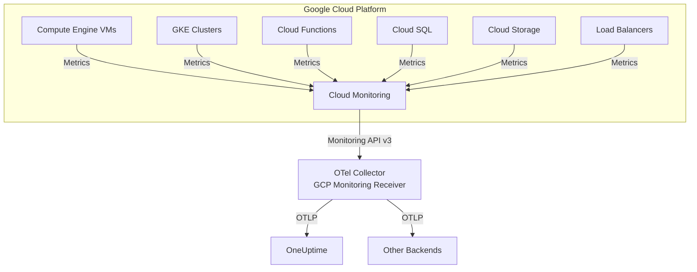

# How to Configure the Google Cloud Monitoring Receiver

Author: [nawazdhandala](https://www.github.com/nawazdhandala)

Tags: OpenTelemetry, Collector, Google Cloud, GCP, Cloud Monitoring, Metric, Observability

Description: Configure the Google Cloud Monitoring Receiver in OpenTelemetry Collector to pull metrics from Google Cloud Monitoring with authentication, query patterns, and production deployment examples.

---

> Using Google Cloud but want observability flexibility? The Google Cloud Monitoring Receiver lets you pull metrics from Cloud Monitoring into OpenTelemetry, enabling vendor-neutral analysis while leveraging GCP's native monitoring capabilities.

The Google Cloud Monitoring Receiver (formerly Stackdriver Receiver) is an OpenTelemetry Collector component that queries Google Cloud Monitoring APIs to retrieve metrics from GCP resources. This receiver enables you to consolidate Google Cloud metrics with telemetry from other sources in a unified observability platform, breaking free from vendor lock-in.

---

## What is the Google Cloud Monitoring Receiver?

Google Cloud Monitoring (formerly Stackdriver) collects metrics from Compute Engine VMs, Kubernetes Engine clusters, Cloud Functions, Cloud SQL databases, and dozens of other GCP services. The Google Cloud Monitoring Receiver queries these metrics via GCP APIs and converts them into OpenTelemetry format.

This receiver is essential for:

- **Multi-cloud observability**: Unify GCP metrics with AWS and Azure data
- **Cost optimization**: Export metrics to more affordable storage platforms
- **Vendor independence**: Avoid Cloud Monitoring lock-in
- **Custom processing**: Apply transformations before storage
- **Extended retention**: Store metrics beyond Cloud Monitoring's retention limits
- **Hybrid cloud**: Monitor GCP resources alongside on-premises infrastructure

### Key Features

- Query any metric type from Cloud Monitoring
- Support for custom metrics and user-defined metrics
- Multiple authentication methods (service account, workload identity, ADC)
- Metric selection by explicit metric name or metric descriptor filter
- Configurable collection interval, startup delay, and request timeout
- Application Default Credentials support for service accounts, workload identity, and local credential files

---

## Architecture Overview

Here's how the Google Cloud Monitoring Receiver integrates into your observability pipeline:


```mermaid
graph TB
    subgraph Google Cloud Platform
        A[Compute Engine VMs] -->|Metrics| B[Cloud Monitoring]
        C[GKE Clusters] -->|Metrics| B
        D[Cloud Functions] -->|Metrics| B
        E[Cloud SQL] -->|Metrics| B
        F[Cloud Storage] -->|Metrics| B
        G[Load Balancers] -->|Metrics| B
    end
    B -->|Monitoring API v3| H[OTel Collector<br/>GCP Monitoring Receiver]
    H -->|OTLP| I[OneUptime]
    H -->|OTLP| J[Other Backends]
```

The receiver periodically queries Cloud Monitoring APIs for specified metric types and resources, transforms the responses into OpenTelemetry metrics, and sends them through the collector pipeline.

---

## Prerequisites

Before configuring the receiver, ensure you have:

1. **Google Cloud Project** with resources to monitor
2. **Authentication credentials** - Service account or workload identity
3. **IAM permissions** - `monitoring.metricDescriptors.list`, `monitoring.timeSeries.list`
4. **Cloud Monitoring API** enabled in your project
5. **OpenTelemetry Collector Contrib** distribution with the alpha `googlecloudmonitoring` receiver component

---

## Authentication Setup

The receiver supports multiple authentication methods:

### Method 1: Application Default Credentials (ADC)

When running on GCP (Compute Engine, GKE, Cloud Run), ADC automatically uses the instance's service account:

```bash
# No additional setup needed - ADC is automatic on GCP

# The receiver will use the default service account
```

### Method 2: Service Account Key File

For running outside GCP or using a specific service account:

1. Create a service account in GCP Console:

```bash
gcloud iam service-accounts create otel-collector \
  --description="OpenTelemetry Collector service account" \
  --display-name="OTel Collector"
```

2. Grant required permissions:

```bash
# Grant Monitoring Viewer role
gcloud projects add-iam-policy-binding PROJECT_ID \
  --member="serviceAccount:otel-collector@PROJECT_ID.iam.gserviceaccount.com" \
  --role="roles/monitoring.viewer"
```

3. Create and download key file:

```bash
gcloud iam service-accounts keys create otel-collector-key.json \
  --iam-account=otel-collector@PROJECT_ID.iam.gserviceaccount.com
```

4. Set environment variable:

```bash
export GOOGLE_APPLICATION_CREDENTIALS="/path/to/otel-collector-key.json"
```

### Method 3: Workload Identity (GKE)

For running on Google Kubernetes Engine with Workload Identity:

```bash
# Bind Kubernetes service account to GCP service account
gcloud iam service-accounts add-iam-policy-binding \
  otel-collector@PROJECT_ID.iam.gserviceaccount.com \
  --role roles/iam.workloadIdentityUser \
  --member "serviceAccount:PROJECT_ID.svc.id.goog[NAMESPACE/KSA_NAME]"
```

---

## Basic Configuration

Here's a minimal configuration to start collecting Compute Engine VM metrics:

```yaml
# Configure the Google Cloud Monitoring receiver
receivers:
  # The googlecloudmonitoring receiver queries Cloud Monitoring APIs
  googlecloudmonitoring:
    # GCP project ID to query metrics from
    project_id: my-gcp-project

    # Authentication via Application Default Credentials (auto-detected)
    # No explicit credentials needed when running on GCP

    # How often to scrape metrics from Cloud Monitoring
    collection_interval: 60s

    # Metric types to collect
    metrics_list:
      # Compute Engine CPU utilization
      - metric_name: compute.googleapis.com/instance/cpu/utilization
      # Compute Engine disk read bytes
      - metric_name: compute.googleapis.com/instance/disk/read_bytes_count
      # Compute Engine disk write bytes
      - metric_name: compute.googleapis.com/instance/disk/write_bytes_count
      # Compute Engine network received bytes
      - metric_name: compute.googleapis.com/instance/network/received_bytes_count
      # Compute Engine network sent bytes
      - metric_name: compute.googleapis.com/instance/network/sent_bytes_count

# Configure where to send metrics
exporters:
  otlphttp:
    endpoint: https://oneuptime.com/otlp
    headers:
      x-oneuptime-token: ${ONEUPTIME_TOKEN}

# Define the metrics pipeline
service:
  pipelines:
    metrics:
      receivers: [googlecloudmonitoring]
      exporters: [otlphttp]
```

This basic configuration collects key Compute Engine metrics every 60 seconds and exports them to OneUptime. Application Default Credentials handle authentication automatically when running on GCP.

---

## Production Configuration with Multiple Resource Types

For production environments, monitor multiple GCP resource types with filtering and processing:

```yaml
receivers:
  googlecloudmonitoring:
    # Project ID (can also use environment variable)
    project_id: ${GCP_PROJECT_ID}

    # Scrape interval
    collection_interval: 60s

    # Comprehensive metric types across GCP services
    metrics_list:
      # Compute Engine
      - metric_name: compute.googleapis.com/instance/cpu/utilization
      - metric_name: compute.googleapis.com/instance/cpu/reserved_cores
      - metric_name: compute.googleapis.com/instance/memory/balloon/ram_used
      - metric_name: compute.googleapis.com/instance/disk/read_bytes_count
      - metric_name: compute.googleapis.com/instance/disk/write_bytes_count
      - metric_name: compute.googleapis.com/instance/disk/read_ops_count
      - metric_name: compute.googleapis.com/instance/disk/write_ops_count
      - metric_name: compute.googleapis.com/instance/network/received_bytes_count
      - metric_name: compute.googleapis.com/instance/network/sent_bytes_count
      - metric_name: compute.googleapis.com/instance/uptime

      # Google Kubernetes Engine
      - metric_name: container.googleapis.com/container/cpu/limit_utilization
      - metric_name: container.googleapis.com/container/memory/limit_utilization
      - metric_name: container.googleapis.com/container/cpu/request_utilization
      - metric_name: container.googleapis.com/container/memory/request_utilization
      - metric_name: container.googleapis.com/container/restart_count
      - metric_name: container.googleapis.com/pod/network/received_bytes_count
      - metric_name: container.googleapis.com/pod/network/sent_bytes_count

      # Cloud SQL
      - metric_name: cloudsql.googleapis.com/database/cpu/utilization
      - metric_name: cloudsql.googleapis.com/database/memory/utilization
      - metric_name: cloudsql.googleapis.com/database/disk/utilization
      - metric_name: cloudsql.googleapis.com/database/disk/bytes_used
      - metric_name: cloudsql.googleapis.com/database/network/connections
      - metric_name: cloudsql.googleapis.com/database/network/received_bytes_count
      - metric_name: cloudsql.googleapis.com/database/network/sent_bytes_count

      # Cloud Storage
      - metric_name: storage.googleapis.com/storage/total_bytes
      - metric_name: storage.googleapis.com/api/request_count
      - metric_name: storage.googleapis.com/network/sent_bytes_count
      - metric_name: storage.googleapis.com/network/received_bytes_count

      # Cloud Load Balancing
      - metric_name: loadbalancing.googleapis.com/https/request_count
      - metric_name: loadbalancing.googleapis.com/https/request_bytes_count
      - metric_name: loadbalancing.googleapis.com/https/response_bytes_count
      - metric_name: loadbalancing.googleapis.com/https/backend_latencies
      - metric_name: loadbalancing.googleapis.com/https/total_latencies

      # Cloud Functions
      - metric_name: cloudfunctions.googleapis.com/function/execution_count
      - metric_name: cloudfunctions.googleapis.com/function/execution_times
      - metric_name: cloudfunctions.googleapis.com/function/user_memory_bytes
      - metric_name: cloudfunctions.googleapis.com/function/active_instances

processors:
  # Protect collector from memory issues
  memory_limiter:
    limit_mib: 2048
    spike_limit_mib: 512
    check_interval: 5s

  # Add resource attributes
  resource:
    attributes:
      - key: source.type
        value: gcp_monitoring
        action: insert
      - key: cloud.provider
        value: gcp
        action: insert
      - key: gcp.project.id
        value: ${GCP_PROJECT_ID}
        action: insert

  # Transform metric names to follow conventions
  metricstransform:
    transforms:
      # Normalize GCP metric names
      - include: "^compute\\.googleapis\\.com/(.*)$$"
        match_type: regexp
        action: update
        new_name: "gcp.compute.$${1}"

      - include: "^container\\.googleapis\\.com/(.*)$$"
        match_type: regexp
        action: update
        new_name: "gcp.gke.$${1}"

      - include: "^cloudsql\\.googleapis\\.com/(.*)$$"
        match_type: regexp
        action: update
        new_name: "gcp.cloudsql.$${1}"

  # Filter out metrics you don't need
  filter/unnecessary:
    error_mode: ignore
    metric_conditions:
      # Example: Exclude uptime metrics if not needed
      - IsMatch(metric.name, ".*uptime$")
      # Example: Exclude test instances after collection
      - resource.attributes["resource.labels.instance_name"] != nil and IsMatch(resource.attributes["resource.labels.instance_name"], ".*test.*")

  # Batch metrics for efficiency
  batch:
    timeout: 30s
    send_batch_size: 1000
    send_batch_max_size: 2000

exporters:
  # Primary export to OneUptime
  otlphttp/oneuptime:
    endpoint: https://oneuptime.com/otlp
    headers:
      x-oneuptime-token: ${ONEUPTIME_TOKEN}
    compression: gzip
    timeout: 30s
    retry_on_failure:
      enabled: true
      initial_interval: 5s
      max_interval: 30s
      max_elapsed_time: 300s

  # Backup to Cloud Monitoring (for redundancy)
  googlecloud:
    project: ${GCP_PROJECT_ID}
    metric:
      prefix: custom.googleapis.com/otel

  # Export to Prometheus for local monitoring
  prometheus:
    endpoint: :9090

service:
  # Enable collector telemetry
  telemetry:
    logs:
      level: info
    metrics:
      level: detailed
      readers:
        - pull:
            exporter:
              prometheus:
                host: 0.0.0.0
                port: 8888

  # Enable extensions
  extensions: [health_check, pprof]

  pipelines:
    metrics:
      receivers: [googlecloudmonitoring]
      processors:
        - memory_limiter
        - resource
        - metricstransform
        - filter/unnecessary
        - batch
      exporters:
        - otlphttp/oneuptime
        - googlecloud
        - prometheus

extensions:
  health_check:
    endpoint: :13133

  pprof:
    endpoint: localhost:1777
```

This production configuration demonstrates:

- **Multi-service monitoring**: Compute Engine, GKE, Cloud SQL, Storage, Load Balancers, Functions
- **Explicit metric selection**: List the Cloud Monitoring metric types to collect
- **Post-collection filtering**: Drop unneeded metrics or resource attributes in the collector pipeline
- **Metric transformation**: Normalize GCP metric names
- **Multiple exporters**: Send to OneUptime, Cloud Monitoring, and Prometheus

---

## Custom and User-Defined Metrics

Query custom metrics written to Cloud Monitoring by your applications:

```yaml
receivers:
  googlecloudmonitoring:
    project_id: ${GCP_PROJECT_ID}
    collection_interval: 60s

    metrics_list:
      # Custom application metrics
      - metric_name: custom.googleapis.com/myapp/orders_processed
      - metric_name: custom.googleapis.com/myapp/payment_success_rate
      - metric_name: custom.googleapis.com/myapp/user_signups
      - metric_name: custom.googleapis.com/myapp/api_latency

      # User-defined metrics from Cloud Logging
      - metric_name: logging.googleapis.com/user/error_count
      - metric_name: logging.googleapis.com/user/warning_count

processors:
  # Add application-specific attributes
  attributes/app:
    actions:
      - key: application
        value: myapp
        action: insert
      - key: metric_source
        value: custom
        action: insert

  batch:
    timeout: 30s

  filter/production:
    error_mode: ignore
    metric_conditions:
      - resource.attributes["resource.labels.namespace"] != nil and resource.attributes["resource.labels.namespace"] != "production"

exporters:
  otlphttp:
    endpoint: https://oneuptime.com/otlp
    headers:
      x-oneuptime-token: ${ONEUPTIME_TOKEN}

service:
  pipelines:
    metrics:
      receivers: [googlecloudmonitoring]
      processors: [attributes/app, filter/production, batch]
      exporters: [otlphttp]
```

This configuration collects custom metrics that your applications write to Cloud Monitoring, enabling consolidation of built-in and custom metrics in a unified platform.

---

## Monitoring Multiple Projects

Query metrics from multiple GCP projects by defining multiple receivers:

```yaml
receivers:
  # Production project
  googlecloudmonitoring/prod:
    project_id: prod-project-id
    collection_interval: 60s
    metrics_list:
      - metric_name: compute.googleapis.com/instance/cpu/utilization
      - metric_name: cloudsql.googleapis.com/database/cpu/utilization

  # Staging project
  googlecloudmonitoring/staging:
    project_id: staging-project-id
    collection_interval: 120s  # Less frequent for staging
    metrics_list:
      - metric_name: compute.googleapis.com/instance/cpu/utilization

  # Shared services project
  googlecloudmonitoring/shared:
    project_id: shared-services-project-id
    collection_interval: 60s
    metrics_list:
      - metric_name: storage.googleapis.com/storage/total_bytes
      - metric_name: loadbalancing.googleapis.com/https/request_count

processors:
  # Tag production metrics
  resource/prod:
    attributes:
      - key: environment
        value: production
        action: insert

  # Tag staging metrics
  resource/staging:
    attributes:
      - key: environment
        value: staging
        action: insert

  # Tag shared services metrics
  resource/shared:
    attributes:
      - key: environment
        value: shared
        action: insert

  batch:
    timeout: 30s

exporters:
  otlphttp:
    endpoint: https://oneuptime.com/otlp
    headers:
      x-oneuptime-token: ${ONEUPTIME_TOKEN}

service:
  pipelines:
    # Production pipeline
    metrics/prod:
      receivers: [googlecloudmonitoring/prod]
      processors: [resource/prod, batch]
      exporters: [otlphttp]

    # Staging pipeline
    metrics/staging:
      receivers: [googlecloudmonitoring/staging]
      processors: [resource/staging, batch]
      exporters: [otlphttp]

    # Shared services pipeline
    metrics/shared:
      receivers: [googlecloudmonitoring/shared]
      processors: [resource/shared, batch]
      exporters: [otlphttp]
```

Ensure the service account has `monitoring.viewer` role on all projects you want to monitor.

---

## Metric Descriptor Filtering

Fine-tune which metric descriptors are queried:

```yaml
receivers:
  googlecloudmonitoring:
    project_id: ${GCP_PROJECT_ID}
    collection_interval: 60s

    metrics_list:
      # A single metric type
      - metric_name: compute.googleapis.com/instance/cpu/utilization

      # All metrics whose descriptors match this filter
      # The receiver supports project and metric.type filter objects here.
      - metric_descriptor_filter: 'metric.type = starts_with("cloudsql.googleapis.com")'

processors:
  filter/production:
    error_mode: ignore
    metric_conditions:
      # Drop non-production data after collection if the resource attribute is present.
      - resource.attributes["resource.labels.environment"] != nil and resource.attributes["resource.labels.environment"] != "production"

  batch:
    timeout: 30s

exporters:
  otlphttp:
    endpoint: https://oneuptime.com/otlp
    headers:
      x-oneuptime-token: ${ONEUPTIME_TOKEN}

service:
  pipelines:
    metrics:
      receivers: [googlecloudmonitoring]
      processors: [filter/production, batch]
      exporters: [otlphttp]
```

This configuration provides fine-grained control over metric selection and post-collection filtering in the collector pipeline.

---

## Cost Optimization Strategies

Cloud Monitoring API calls and data transfer incur costs. Optimize with these strategies:

### 1. Increase Scrape Intervals

Collect metrics less frequently for non-critical resources:

```yaml
receivers:
  # Critical resources: every minute
  googlecloudmonitoring/critical:
    project_id: ${GCP_PROJECT_ID}
    collection_interval: 60s
    metrics_list:
      - metric_name: compute.googleapis.com/instance/cpu/utilization

  # Normal resources: every 5 minutes
  googlecloudmonitoring/normal:
    project_id: ${GCP_PROJECT_ID}
    collection_interval: 300s
    metrics_list:
      - metric_name: compute.googleapis.com/instance/disk/read_bytes_count

  # Development resources: every 15 minutes
  googlecloudmonitoring/dev:
    project_id: ${GCP_PROJECT_ID}
    collection_interval: 900s
    metrics_list:
      - metric_name: compute.googleapis.com/instance/uptime
```

### 2. Select Only Necessary Metrics

Don't collect every available metric:

```yaml
receivers:
  googlecloudmonitoring:
    project_id: ${GCP_PROJECT_ID}
    metrics_list:
      # Only essential metrics
      - metric_name: compute.googleapis.com/instance/cpu/utilization
      - metric_name: compute.googleapis.com/instance/memory/balloon/ram_used
      # Skip: disk, network, uptime if not needed
```

### 3. Use Descriptor Filters

Select metric families with descriptor filters instead of listing every metric manually:

```yaml
receivers:
  googlecloudmonitoring:
    project_id: ${GCP_PROJECT_ID}
    collection_interval: 300s
    metrics_list:
      - metric_descriptor_filter: 'metric.type = starts_with("compute.googleapis.com/instance/cpu")'
```

### 4. Filter After Collection

Drop unwanted metrics or resources in the collector pipeline after collection:

```yaml
receivers:
  googlecloudmonitoring:
    project_id: ${GCP_PROJECT_ID}
    metrics_list:
      - metric_name: compute.googleapis.com/instance/cpu/utilization

processors:
  filter/nonprod:
    error_mode: ignore
    metric_conditions:
      - resource.attributes["resource.labels.environment"] != nil and resource.attributes["resource.labels.environment"] != "production"
```

---

## Monitoring Receiver Performance

Monitor the Google Cloud Monitoring Receiver's health:

```yaml
service:
  telemetry:
    logs:
      level: info
    metrics:
      level: detailed
      readers:
        - pull:
            exporter:
              prometheus:
                host: 0.0.0.0
                port: 8888

  extensions: [health_check, pprof]

extensions:
  health_check:
    endpoint: :13133

  pprof:
    endpoint: localhost:1777
```

### Key Metrics to Monitor

- `otelcol_scraper_scraped_metric_points` - Metric points scraped by scraper-based receivers
- `otelcol_scraper_errored_metric_points` - Metric points that could not be scraped
- `otelcol_receiver_accepted_metric_points` - Metrics successfully received
- `otelcol_receiver_refused_metric_points` - Metrics rejected

Set up alerts in OneUptime:

- **High scrape error rate**: Alert when scrape error rate > 5%
- **Scrape errors**: Alert when errored scraped metric points increase
- **Quota exhaustion**: Alert when approaching API quota limits
- **No data received**: Alert when no metrics received for 10 minutes

---

## Troubleshooting Common Issues

### Issue: Authentication Failures

**Cause**: Missing IAM permissions or incorrect credentials

**Solution**: Verify service account permissions:

```bash
# Check service account IAM roles
gcloud projects get-iam-policy PROJECT_ID \
  --flatten="bindings[].members" \
  --filter="bindings.members:serviceAccount:otel-collector@PROJECT_ID.iam.gserviceaccount.com"

# Expected: roles/monitoring.viewer (or roles/monitoring.metricReader)
```

Grant required permissions:

```bash
gcloud projects add-iam-policy-binding PROJECT_ID \
  --member="serviceAccount:otel-collector@PROJECT_ID.iam.gserviceaccount.com" \
  --role="roles/monitoring.viewer"
```

### Issue: Quota Exceeded

**Cause**: Too many API calls

**Solution**: Increase scrape interval and reduce metric types:

```yaml
receivers:
  googlecloudmonitoring:
    project_id: ${GCP_PROJECT_ID}
    collection_interval: 120s  # Increase from 60s
    metrics_list:
      # Reduce to essential metrics only
      - metric_name: compute.googleapis.com/instance/cpu/utilization
```

Request quota increase in GCP Console if needed.

### Issue: Missing Metrics

**Cause**: Incorrect metric type names or filters

**Solution**: Verify metric type names:

```bash
# List available metric types
gcloud monitoring metric-descriptors list \
  --filter="type:compute.googleapis.com" \
  --format="table(type)"
```

Enable debug logging to see API responses:

```yaml
service:
  telemetry:
    logs:
      level: debug
```

### Issue: High Memory Usage

**Cause**: Querying too many metrics or resources

**Solution**: Add memory limiter and reduce scope:

```yaml
processors:
  memory_limiter:
    limit_mib: 1024
    check_interval: 1s

receivers:
  googlecloudmonitoring:
    project_id: ${GCP_PROJECT_ID}
    # Reduce scope to essential metrics only
    metrics_list:
      - metric_name: compute.googleapis.com/instance/cpu/utilization
```

---

## Integration with OneUptime

OneUptime provides native support for OpenTelemetry metrics from Google Cloud Monitoring. Once configured:

1. **Visualize GCP metrics**: Create dashboards for GCP resource health
2. **Set up alerts**: Alert on GCP resource anomalies
3. **Correlate data**: Link GCP metrics with application traces and logs
4. **Multi-cloud views**: Combine GCP, AWS, and Azure metrics in single dashboards

Example OneUptime alert for high CPU:

- **Metric**: `gcp.compute.instance.cpu.utilization`
- **Condition**: Average > 80% for 5 minutes
- **Scope**: `gcp.project.id = "prod-project" AND resource.labels.environment = "production"`
- **Action**: Page on-call engineer

---

## Related Resources

- [How to Configure Google Cloud Pub/Sub Receiver](https://oneuptime.com/blog/post/2026-02-06-google-cloud-pubsub-receiver-opentelemetry-collector/view)
- [How to Configure Azure Monitor Receiver](https://oneuptime.com/blog/post/2026-02-06-azure-monitor-receiver-opentelemetry-collector/view)
- [OpenTelemetry Collector: What It Is and When You Need It](https://oneuptime.com/blog/post/2025-09-18-what-is-opentelemetry-collector-and-why-use-one/view)

---

## Conclusion

The Google Cloud Monitoring Receiver provides a powerful way to extract metrics from Cloud Monitoring into OpenTelemetry pipelines. By querying GCP's native monitoring APIs, you maintain visibility into Google Cloud resources while gaining the flexibility to send data to any OpenTelemetry-compatible backend.

Start with basic metric collection for key resources like Compute Engine and GKE, then expand to comprehensive monitoring across projects with advanced filtering and processing. With proper authentication, cost optimization, and monitoring, you'll have production-grade GCP telemetry ingestion that scales with your infrastructure.

The combination of Cloud Monitoring's comprehensive resource coverage with OpenTelemetry's vendor neutrality gives you native GCP insights without platform lock-in.

---

**Ready to export your GCP metrics?** OneUptime provides seamless integration with OpenTelemetry, making it easy to analyze Cloud Monitoring data alongside metrics, logs, and traces from any source. Get started with unified multi-cloud observability today.
