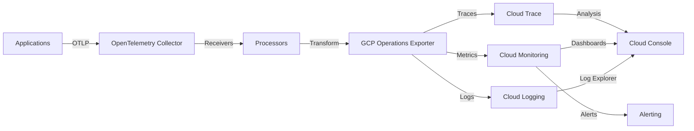

# How to Configure the Google Cloud Operations Exporter in the OpenTelemetry Collector

Author: [nawazdhandala](https://www.github.com/nawazdhandala)

Tags: OpenTelemetry, Collector, Exporters, Google Cloud, GCP, Cloud Monitoring, Cloud Trace, Cloud Logging

Description: Complete guide to configuring the Google Cloud Operations exporter for sending OpenTelemetry data to Google Cloud Monitoring, Cloud Trace, and Cloud Logging.

Google Cloud Operations (formerly Stackdriver) provides a comprehensive suite of monitoring, logging, and tracing services for applications running on Google Cloud Platform and beyond. The OpenTelemetry Collector's Google Cloud Operations exporter enables seamless integration with Cloud Monitoring, Cloud Trace, and Cloud Logging, providing native observability for your applications.

## Understanding the Google Cloud Operations Exporter

The Google Cloud Operations exporter translates OpenTelemetry telemetry data into Google Cloud's native formats. It sends traces to Cloud Trace, metrics to Cloud Monitoring, and logs to Cloud Logging. This integration allows you to leverage Google Cloud's powerful observability tools, including Service Monitoring, Error Reporting, and integrated dashboards.

The exporter handles automatic authentication, resource detection for Google Cloud environments, and efficient batching of telemetry data.

## Architecture Overview

Here's how the Google Cloud Operations exporter integrates with Google Cloud services:



## Prerequisites

Before configuring the Google Cloud Operations exporter, you need:

- A Google Cloud project with billing enabled
- Cloud Trace, Cloud Monitoring, and Cloud Logging APIs enabled
- Service account credentials with appropriate permissions
- OpenTelemetry Collector Contrib installed (version 0.80.0 or later)

## Setting Up Google Cloud Permissions

Enable the required APIs:

```bash
# Enable Cloud Trace API
gcloud services enable cloudtrace.googleapis.com

# Enable Cloud Monitoring API
gcloud services enable monitoring.googleapis.com

# Enable Cloud Logging API
gcloud services enable logging.googleapis.com
```

Create a service account with necessary permissions:

```bash
# Create service account
gcloud iam service-accounts create otel-collector \
  --display-name="OpenTelemetry Collector" \
  --project=my-project

# Grant Cloud Trace Agent role
gcloud projects add-iam-policy-binding my-project \
  --member="serviceAccount:otel-collector@my-project.iam.gserviceaccount.com" \
  --role="roles/cloudtrace.agent"

# Grant Monitoring Metric Writer role
gcloud projects add-iam-policy-binding my-project \
  --member="serviceAccount:otel-collector@my-project.iam.gserviceaccount.com" \
  --role="roles/monitoring.metricWriter"

# Grant Logging Writer role
gcloud projects add-iam-policy-binding my-project \
  --member="serviceAccount:otel-collector@my-project.iam.gserviceaccount.com" \
  --role="roles/logging.logWriter"

# Create and download key
gcloud iam service-accounts keys create key.json \
  --iam-account=otel-collector@my-project.iam.gserviceaccount.com
```

## Basic Configuration

Here's a minimal configuration for the Google Cloud Operations exporter:

```yaml
# OpenTelemetry Collector configuration for Google Cloud Operations
receivers:
  otlp:
    protocols:
      grpc:
        endpoint: 0.0.0.0:4317
      http:
        endpoint: 0.0.0.0:4318

processors:
  batch:
    # Batch data for efficient transmission
    timeout: 10s
    send_batch_size: 1024

exporters:
  googlecloud:
    # Google Cloud project ID
    project: "my-project-id"

    # Path to service account key file
    # Leave empty to use Application Default Credentials
    credentials_file: "/path/to/key.json"

    # Enable trace export to Cloud Trace
    trace:
      endpoint: "cloudtrace.googleapis.com:443"

    # Enable metrics export to Cloud Monitoring
    metric:
      endpoint: "monitoring.googleapis.com:443"

    # Enable logs export to Cloud Logging
    log:
      endpoint: "logging.googleapis.com:443"

service:
  pipelines:
    traces:
      receivers: [otlp]
      processors: [batch]
      exporters: [googlecloud]
    metrics:
      receivers: [otlp]
      processors: [batch]
      exporters: [googlecloud]
    logs:
      receivers: [otlp]
      processors: [batch]
      exporters: [googlecloud]
```

This configuration creates pipelines for traces, metrics, and logs that export to their respective Google Cloud services.

## Using Application Default Credentials

For applications running on Google Cloud (GCE, GKE, Cloud Run), use Application Default Credentials instead of service account keys:

```yaml
exporters:
  googlecloud:
    project: "my-project-id"
    # No credentials_file needed - will use Application Default Credentials

    trace:
      endpoint: "cloudtrace.googleapis.com:443"
    metric:
      endpoint: "monitoring.googleapis.com:443"
    log:
      endpoint: "logging.googleapis.com:443"
```

When running on GKE, assign the appropriate service account to your workload:

```bash
# Create Kubernetes service account
kubectl create serviceaccount otel-collector

# Bind to Google Cloud service account
gcloud iam service-accounts add-iam-policy-binding \
  otel-collector@my-project.iam.gserviceaccount.com \
  --role roles/iam.workloadIdentityUser \
  --member "serviceAccount:my-project.svc.id.goog[default/otel-collector]"

# Annotate Kubernetes service account
kubectl annotate serviceaccount otel-collector \
  iam.gke.io/gcp-service-account=otel-collector@my-project.iam.gserviceaccount.com
```

## Advanced Configuration Options

For production deployments, customize additional parameters:

```yaml
exporters:
  googlecloud:
    project: "my-project-id"

    # Use environment variable for credentials
    # credentials_file: "${GOOGLE_APPLICATION_CREDENTIALS}"

    # Trace configuration
    trace:
      endpoint: "cloudtrace.googleapis.com:443"

      # Use insecure connection (not recommended for production)
      # use_insecure: false

      # Compression (gzip or none)
      compression: "gzip"

      # Timeout for export operations
      timeout: 30s

      # Number of spans to buffer
      queue_size: 10000

    # Metrics configuration
    metric:
      endpoint: "monitoring.googleapis.com:443"
      compression: "gzip"
      timeout: 30s

      # Metric prefix for custom metrics
      prefix: "custom.googleapis.com"

      # Skip CreateMetricDescriptor calls
      # use_insecure_metric_descriptor_lookup: false

      # Resource filters
      resource_filters:
        - prefix: "service."

    # Logs configuration
    log:
      endpoint: "logging.googleapis.com:443"
      compression: "gzip"
      timeout: 30s

      # Default log name
      default_log_name: "projects/my-project-id/logs/otel-logs"

    # Retry configuration
    retry_on_failure:
      enabled: true
      initial_interval: 5s
      max_interval: 30s
      max_elapsed_time: 300s

    # Queue settings
    sending_queue:
      enabled: true
      num_consumers: 10
      queue_size: 5000
```

## Resource Detection for Google Cloud

The collector can automatically detect Google Cloud resources and add appropriate labels:

```yaml
processors:
  # Detect Google Cloud resource attributes
  resourcedetection:
    detectors: [gcp]
    timeout: 5s
    override: false

  # Add custom resource attributes
  resource:
    attributes:
      - key: service.name
        value: "${SERVICE_NAME}"
        action: upsert
      - key: service.version
        value: "${SERVICE_VERSION}"
        action: upsert
      - key: deployment.environment
        value: "${ENVIRONMENT}"
        action: upsert

  batch:
    timeout: 10s
    send_batch_size: 1024

exporters:
  googlecloud:
    project: "my-project-id"

service:
  pipelines:
    traces:
      receivers: [otlp]
      processors: [resourcedetection, resource, batch]
      exporters: [googlecloud]
```

This automatically adds GCP resource labels like project ID, instance ID, zone, and cluster name.

## Configuring Trace Sampling

Control trace volume with sampling strategies:

```yaml
processors:
  # Probabilistic sampling
  probabilistic_sampler:
    sampling_percentage: 10

  # Tail sampling with intelligent decisions
  tail_sampling:
    decision_wait: 10s
    num_traces: 100000
    expected_new_traces_per_sec: 1000
    policies:
      # Always sample errors
      - name: error-traces
        type: status_code
        status_code:
          status_codes: [ERROR]

      # Sample slow requests
      - name: slow-traces
        type: latency
        latency:
          threshold_ms: 1000

      # Sample 5% of normal traces
      - name: sampled-traces
        type: probabilistic
        probabilistic:
          sampling_percentage: 5

  batch:
    timeout: 10s
    send_batch_size: 1024

exporters:
  googlecloud:
    project: "my-project-id"

service:
  pipelines:
    traces:
      receivers: [otlp]
      processors: [tail_sampling, batch]
      exporters: [googlecloud]
```

## Metric Configuration and Custom Metrics

Configure how metrics are exported to Cloud Monitoring:

```yaml
exporters:
  googlecloud:
    project: "my-project-id"

    metric:
      endpoint: "monitoring.googleapis.com:443"

      # Prefix for custom metrics
      prefix: "custom.googleapis.com/opentelemetry"

      # Skip automatic metric descriptor creation
      skip_create_descriptor: false

      # Service resource for metrics
      service_resource_labels: true

      # Instrumentation library labels
      instrumentation_library_labels: true

      # Create service timeseries for compatibility
      create_service_timeseries: true

      # Resource filters (include only specific attributes)
      resource_filters:
        - prefix: "service."
        - prefix: "deployment."

processors:
  # Transform metrics for Google Cloud
  metricstransform:
    transforms:
      # Rename metric
      - include: "http.server.duration"
        action: update
        new_name: "http_request_duration"

      # Aggregate metrics
      - include: "cpu.utilization"
        action: update
        aggregation_type: mean

  batch:
    timeout: 10s
    send_batch_size: 512

service:
  pipelines:
    metrics:
      receivers: [otlp]
      processors: [metricstransform, batch]
      exporters: [googlecloud]
```

## Log Configuration

Configure log export to Cloud Logging:

```yaml
exporters:
  googlecloud:
    project: "my-project-id"

    log:
      endpoint: "logging.googleapis.com:443"

      # Default log name
      default_log_name: "projects/my-project-id/logs/otel-logs"

      # Use resource labels for log routing
      use_insecure: false

processors:
  # Filter out noisy logs
  filter/logs:
    logs:
      log_record:
        - 'severity_number < SEVERITY_NUMBER_INFO'
        - 'attributes["message"] == "health check"'

  # Add log attributes
  attributes/logs:
    actions:
      - key: log.source
        value: "opentelemetry-collector"
        action: insert

  batch:
    timeout: 5s
    send_batch_size: 256

service:
  pipelines:
    logs:
      receivers: [otlp]
      processors: [filter/logs, attributes/logs, batch]
      exporters: [googlecloud]
```

## Multi-Project Configuration

For organizations using multiple Google Cloud projects:

```yaml
exporters:
  # Production project
  googlecloud/prod:
    project: "production-project-id"
    trace:
      endpoint: "cloudtrace.googleapis.com:443"
    metric:
      endpoint: "monitoring.googleapis.com:443"
      prefix: "custom.googleapis.com/prod"
    log:
      endpoint: "logging.googleapis.com:443"
      default_log_name: "projects/production-project-id/logs/otel"

  # Development project
  googlecloud/dev:
    project: "development-project-id"
    trace:
      endpoint: "cloudtrace.googleapis.com:443"
    metric:
      endpoint: "monitoring.googleapis.com:443"
      prefix: "custom.googleapis.com/dev"
    log:
      endpoint: "logging.googleapis.com:443"
      default_log_name: "projects/development-project-id/logs/otel"

processors:
  # Route by environment
  routing:
    from_attribute: "deployment.environment"
    table:
      - value: "production"
        exporters: [googlecloud/prod]
      - value: "development"
        exporters: [googlecloud/dev]

  batch:
    timeout: 10s
    send_batch_size: 1024

service:
  pipelines:
    traces:
      receivers: [otlp]
      processors: [routing, batch]
      exporters: [googlecloud/prod, googlecloud/dev]
```

## Querying Data in Google Cloud Console

Once data is exported, query it using Cloud Console:

**Query traces in Cloud Trace:**

Navigate to Cloud Trace in the console and use filters:
- Filter by service name
- Filter by latency range
- Filter by status code
- Filter by time range

**Query metrics in Cloud Monitoring:**

Use Metrics Explorer with MQL (Monitoring Query Language):

```sql
fetch k8s_container
| metric 'custom.googleapis.com/opentelemetry/http_request_duration'
| filter resource.namespace_name == 'production'
| group_by 1m, [value_http_request_duration_mean: mean(value.http_request_duration)]
| every 1m
```

**Query logs in Cloud Logging:**

Use Log Explorer with filter expressions:

```
resource.type="k8s_container"
resource.labels.namespace_name="production"
severity>=WARNING
timestamp>="2026-02-06T00:00:00Z"
```

## Creating Alerts and SLOs

Set up monitoring alerts based on your telemetry:

**Create a latency alert:**

```bash
gcloud alpha monitoring policies create \
  --notification-channels=CHANNEL_ID \
  --display-name="High Latency Alert" \
  --condition-display-name="Request latency above threshold" \
  --condition-threshold-value=1000 \
  --condition-threshold-duration=300s \
  --condition-expression='
    metric.type="custom.googleapis.com/opentelemetry/http_request_duration"
    AND resource.type="k8s_container"
  '
```

**Create an error rate alert:**

```bash
gcloud alpha monitoring policies create \
  --notification-channels=CHANNEL_ID \
  --display-name="High Error Rate" \
  --condition-display-name="Error rate above 5%" \
  --condition-threshold-value=0.05 \
  --condition-threshold-duration=300s \
  --condition-expression='
    metric.type="custom.googleapis.com/opentelemetry/error_rate"
    AND resource.type="k8s_container"
  '
```

**Create an SLO:**

Define Service Level Objectives using Cloud Monitoring:

```yaml
# Example SLO configuration
service_level_indicator:
  request_based:
    good_total_ratio:
      good_service_filter: |
        metric.type="custom.googleapis.com/opentelemetry/http_request_duration"
        AND metric.labels.http_status_code<"500"
      total_service_filter: |
        metric.type="custom.googleapis.com/opentelemetry/http_request_duration"

goal: 0.995  # 99.5% availability
rolling_period: 30d
```

## Performance Optimization

Optimize the exporter for high-throughput environments:

```yaml
processors:
  # Larger batches reduce API calls
  batch:
    timeout: 30s
    send_batch_size: 4096

  # Memory limiter prevents OOM
  memory_limiter:
    check_interval: 1s
    limit_mib: 512
    spike_limit_mib: 128

exporters:
  googlecloud:
    project: "my-project-id"

    # Increase queue sizes
    sending_queue:
      enabled: true
      num_consumers: 20
      queue_size: 10000

    # Optimize timeouts
    trace:
      timeout: 60s
      compression: "gzip"

    metric:
      timeout: 60s
      compression: "gzip"
      # Skip descriptor creation for better performance
      skip_create_descriptor: true

    log:
      timeout: 60s
      compression: "gzip"

service:
  pipelines:
    traces:
      receivers: [otlp]
      processors: [memory_limiter, batch]
      exporters: [googlecloud]
```

## Cost Management

Google Cloud Operations pricing is based on data volume. Reduce costs with these strategies:

**1. Implement Sampling:**

```yaml
processors:
  probabilistic_sampler:
    sampling_percentage: 10  # Sample 10% of traces
```

**2. Filter Unnecessary Data:**

```yaml
processors:
  filter/healthcheck:
    traces:
      span:
        - 'attributes["http.target"] == "/health"'
        - 'attributes["http.target"] == "/ready"'
```

**3. Use Metric Aggregation:**

```yaml
processors:
  spanmetrics:
    metrics_exporter: googlecloud
    dimensions:
      - name: http.method
      - name: http.status_code
    # Only export aggregated metrics, not individual spans
```

**4. Configure Log Retention:**

```bash
# Set log retention to 30 days
gcloud logging buckets update _Default \
  --location=global \
  --retention-days=30
```

## Security Best Practices

Secure your telemetry pipeline:

**1. Use Workload Identity on GKE:**

```yaml
# Kubernetes deployment with Workload Identity
apiVersion: v1
kind: ServiceAccount
metadata:
  name: otel-collector
  annotations:
    iam.gke.io/gcp-service-account: otel-collector@my-project.iam.gserviceaccount.com
```

**2. Restrict Service Account Permissions:**

Grant only necessary roles, avoid using Owner or Editor roles.

**3. Enable VPC Service Controls:**

Protect your Google Cloud resources with VPC Service Controls perimeter.

**4. Use Private Google Access:**

Keep traffic within Google's network when running on GCP.

## Complete Production Example

Here's a comprehensive configuration for production deployment:

```yaml
receivers:
  otlp:
    protocols:
      grpc:
        endpoint: 0.0.0.0:4317
      http:
        endpoint: 0.0.0.0:4318

processors:
  # Memory protection
  memory_limiter:
    check_interval: 1s
    limit_mib: 512
    spike_limit_mib: 128

  # Detect GCP resources
  resourcedetection:
    detectors: [gcp]
    timeout: 5s

  # Add custom attributes
  resource:
    attributes:
      - key: service.name
        value: "${SERVICE_NAME}"
        action: upsert
      - key: service.version
        value: "${SERVICE_VERSION}"
        action: upsert
      - key: deployment.environment
        value: "${ENVIRONMENT}"
        action: upsert

  # Filter health checks
  filter/healthcheck:
    traces:
      span:
        - 'attributes["http.target"] == "/health"'
        - 'attributes["http.target"] == "/ready"'

  # Intelligent sampling
  tail_sampling:
    decision_wait: 10s
    num_traces: 100000
    expected_new_traces_per_sec: 1000
    policies:
      - name: error-traces
        type: status_code
        status_code:
          status_codes: [ERROR]
      - name: slow-traces
        type: latency
        latency:
          threshold_ms: 1000
      - name: sampled-traces
        type: probabilistic
        probabilistic:
          sampling_percentage: 5

  # Generate metrics from spans
  spanmetrics:
    metrics_exporter: googlecloud
    dimensions:
      - name: http.method
      - name: http.status_code
      - name: service.name

  # Batch for efficiency
  batch:
    timeout: 30s
    send_batch_size: 4096

exporters:
  googlecloud:
    project: "${GCP_PROJECT_ID}"

    trace:
      endpoint: "cloudtrace.googleapis.com:443"
      compression: "gzip"
      timeout: 60s

    metric:
      endpoint: "monitoring.googleapis.com:443"
      compression: "gzip"
      timeout: 60s
      prefix: "custom.googleapis.com/otel"
      skip_create_descriptor: false
      service_resource_labels: true

    log:
      endpoint: "logging.googleapis.com:443"
      compression: "gzip"
      timeout: 60s
      default_log_name: "projects/${GCP_PROJECT_ID}/logs/otel"

    sending_queue:
      enabled: true
      num_consumers: 20
      queue_size: 10000

    retry_on_failure:
      enabled: true
      initial_interval: 5s
      max_interval: 30s
      max_elapsed_time: 300s

service:
  pipelines:
    traces:
      receivers: [otlp]
      processors: [memory_limiter, resourcedetection, resource, filter/healthcheck, tail_sampling, spanmetrics, batch]
      exporters: [googlecloud]

    metrics:
      receivers: [otlp]
      processors: [memory_limiter, resourcedetection, resource, batch]
      exporters: [googlecloud]

    logs:
      receivers: [otlp]
      processors: [memory_limiter, resourcedetection, resource, batch]
      exporters: [googlecloud]

  telemetry:
    logs:
      level: info
    metrics:
      address: 0.0.0.0:8888
```

## Troubleshooting Common Issues

**Issue: Authentication errors**

Solutions:
- Verify service account has correct permissions
- Check credentials file path is correct
- Ensure Application Default Credentials are properly configured
- Verify APIs are enabled in the project

**Issue: Data not appearing in Cloud Console**

Check:
- Project ID is correct in configuration
- There are no errors in collector logs
- APIs are enabled (Cloud Trace, Monitoring, Logging)
- Service account has proper IAM roles

**Issue: High latency or timeouts**

Optimize:
- Increase batch size to reduce API calls
- Enable compression
- Increase timeout values
- Check network connectivity to Google Cloud APIs

**Issue: Quota exceeded errors**

Solutions:
- Implement sampling to reduce data volume
- Request quota increase in Cloud Console
- Filter unnecessary telemetry data
- Use aggregated metrics instead of raw data

## Conclusion

The Google Cloud Operations exporter provides seamless integration between OpenTelemetry and Google Cloud's observability services. By following the configuration patterns and best practices in this guide, you can build a robust monitoring solution that leverages Cloud Trace, Cloud Monitoring, and Cloud Logging.

For more information on OpenTelemetry exporters, check out these related articles:
- https://oneuptime.com/blog/post/google-managed-prometheus-exporter-opentelemetry-collector/view
- https://oneuptime.com/blog/post/azure-monitor-exporter-opentelemetry-collector/view

For detailed information about the Google Cloud Operations exporter configuration options, refer to the official OpenTelemetry Collector documentation.
