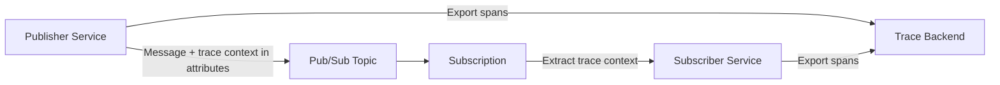

# How to Use Google Cloud Pub/Sub with OpenTelemetry Tracing

Author: [nawazdhandala](https://www.github.com/nawazdhandala)

Tags: OpenTelemetry, Google Cloud Pub/Sub, Tracing, Distributed Systems, Messaging

Description: Learn how to trace messages through Google Cloud Pub/Sub using OpenTelemetry for end-to-end visibility across publishers and subscribers.

---

Google Cloud Pub/Sub is one of the most widely used messaging services for decoupling microservices. Messages go in on one side and come out on the other, but what happens in between is often a black box. When a message fails to process or takes too long, you are left guessing which publisher sent it, how long it sat in the queue, and where the subscriber choked.

OpenTelemetry fixes this by letting you propagate trace context through Pub/Sub messages. A trace that starts in the publisher continues into the subscriber, giving you a single view of the entire message lifecycle. This guide shows you how to set it up in practice.

## The Tracing Challenge with Messaging

With HTTP services, trace context propagation is simple. The `traceparent` header travels with every request, and downstream services pick it up automatically. Messaging systems like Pub/Sub break this chain because there is no direct connection between the publisher and the subscriber. The message sits in a topic until a subscriber pulls it, and by that time the original HTTP context is long gone.

The solution is to inject the trace context into the Pub/Sub message attributes when publishing, and extract it when consuming. This creates a link between the publisher's span and the subscriber's span.



## Prerequisites

- A Google Cloud project with the Pub/Sub API enabled.
- A Pub/Sub topic and subscription already created.
- Python 3.9+ (the examples use Python, but the concepts apply to any language).
- An OpenTelemetry backend for viewing traces.

## Setting Up the Project

Install all the required packages. We need the OpenTelemetry SDK, the Pub/Sub client library, and the OTLP exporter.

```bash
# Install OpenTelemetry and Google Cloud Pub/Sub dependencies
pip install opentelemetry-api \
  opentelemetry-sdk \
  opentelemetry-exporter-otlp-proto-grpc \
  google-cloud-pubsub
```

Create a shared tracing configuration that both the publisher and subscriber will use.

```python
# tracing_config.py - Shared OpenTelemetry setup
from opentelemetry import trace
from opentelemetry.sdk.trace import TracerProvider
from opentelemetry.sdk.trace.export import BatchSpanProcessor
from opentelemetry.exporter.otlp.proto.grpc.trace_exporter import OTLPSpanExporter
from opentelemetry.sdk.resources import Resource

def configure_tracing(service_name: str) -> trace.Tracer:
    """Set up OpenTelemetry tracing for the given service."""
    resource = Resource.create({
        "service.name": service_name,
        "cloud.provider": "gcp",
        "messaging.system": "gcp_pubsub",
    })

    provider = TracerProvider(resource=resource)

    # Export spans to an OTLP-compatible backend
    exporter = OTLPSpanExporter(endpoint="localhost:4317", insecure=True)
    provider.add_span_processor(BatchSpanProcessor(exporter))

    trace.set_tracer_provider(provider)
    return trace.get_tracer(service_name)
```

## Instrumenting the Publisher

The publisher needs to do two things: create a span for the publish operation and inject the current trace context into the message attributes. This is how the subscriber will know which trace to join.

```python
# publisher.py - Publish messages with trace context
import json
from google.cloud import pubsub_v1
from opentelemetry import context, trace
from opentelemetry.trace import SpanKind
from opentelemetry.propagate import inject
from tracing_config import configure_tracing

# Initialize tracing for the publisher service
tracer = configure_tracing("order-publisher")

# Create the Pub/Sub publisher client
publisher = pubsub_v1.PublisherClient()
topic_path = publisher.topic_path("your-project-id", "orders-topic")


def publish_order(order: dict):
    """Publish an order message with OpenTelemetry trace context."""

    # Start a PRODUCER span for the publish operation
    with tracer.start_as_current_span(
        "orders-topic publish",
        kind=SpanKind.PRODUCER,
        attributes={
            "messaging.system": "gcp_pubsub",
            "messaging.destination.name": "orders-topic",
            "messaging.operation": "publish",
        },
    ) as span:
        # Prepare the message attributes dict
        attributes = {}

        # Inject the current trace context into the message attributes
        # This adds traceparent and tracestate keys
        inject(attributes)

        # Add any business-level attributes
        attributes["order_type"] = order.get("type", "standard")

        # Serialize and publish the message
        message_data = json.dumps(order).encode("utf-8")
        span.set_attribute("messaging.message.payload_size_bytes", len(message_data))

        future = publisher.publish(
            topic_path,
            data=message_data,
            **attributes,  # Trace context travels as message attributes
        )

        # Record the message ID once publishing completes
        message_id = future.result()
        span.set_attribute("messaging.message.id", message_id)
        print(f"Published message {message_id}")


# Example usage
if __name__ == "__main__":
    publish_order({
        "id": "ORD-12345",
        "type": "express",
        "total": 99.95,
        "items": ["widget-a", "widget-b"],
    })
```

## Instrumenting the Subscriber

The subscriber extracts the trace context from the message attributes and uses it to create a child span. This links the subscriber's processing span to the publisher's span, forming a complete trace.

```python
# subscriber.py - Consume messages and continue the trace
import json
from google.cloud import pubsub_v1
from opentelemetry import context, trace
from opentelemetry.trace import SpanKind, StatusCode
from opentelemetry.propagate import extract
from opentelemetry.context import attach, detach
from tracing_config import configure_tracing

# Initialize tracing for the subscriber service
tracer = configure_tracing("order-processor")

# Create the subscriber client
subscriber = pubsub_v1.SubscriberClient()
subscription_path = subscriber.subscription_path("your-project-id", "orders-subscription")


def process_message(message: pubsub_v1.subscriber.message.Message):
    """Process a Pub/Sub message with trace context from the publisher."""
    # Extract trace context from the message attributes
    # This retrieves the traceparent and tracestate injected by the publisher
    ctx = extract(message.attributes)

    # Attach the extracted context so the new span becomes a child of the publisher span
    token = attach(ctx)

    try:
        with tracer.start_as_current_span(
            "orders-subscription process",
            kind=SpanKind.CONSUMER,
            attributes={
                "messaging.system": "gcp_pubsub",
                "messaging.destination.name": "orders-topic",
                "messaging.operation": "process",
                "messaging.message.id": message.message_id,
            },
        ) as span:
            # Parse the message body
            order = json.loads(message.data.decode("utf-8"))
            span.set_attribute("order.id", order.get("id", "unknown"))
            span.set_attribute("order.total", order.get("total", 0))

            # Process the order in a child span
            with tracer.start_as_current_span("validate-order") as validate_span:
                validate_order(order)
                validate_span.set_attribute("order.valid", True)

            with tracer.start_as_current_span("save-order") as save_span:
                save_order(order)
                save_span.set_attribute("order.saved", True)

            span.set_status(StatusCode.OK)
            message.ack()

    except Exception as e:
        span.set_status(StatusCode.ERROR, str(e))
        span.record_exception(e)
        message.nack()  # Negative ack so the message gets redelivered
    finally:
        # Detach the context to restore the previous one
        detach(token)


def validate_order(order: dict):
    """Validate order data. Raises ValueError if invalid."""
    if not order.get("id"):
        raise ValueError("Order missing ID")
    if order.get("total", 0) <= 0:
        raise ValueError("Order total must be positive")


def save_order(order: dict):
    """Save the order to a database (placeholder)."""
    pass


# Start listening for messages
if __name__ == "__main__":
    streaming_pull = subscriber.subscribe(subscription_path, callback=process_message)
    print(f"Listening on {subscription_path}")

    try:
        streaming_pull.result()
    except KeyboardInterrupt:
        streaming_pull.cancel()
        streaming_pull.result()
```

## The Complete Trace

After running both the publisher and subscriber, you should see a trace in your backend that looks something like this:

```mermaid
gantt
    title Pub/Sub Message Trace
    dateFormat X
    axisFormat %s

    section Publisher
    orders-topic publish        :0, 50

    section Subscriber
    orders-subscription process :55, 200
    validate-order              :60, 100
    save-order                  :105, 180
```



The publisher's span and the subscriber's span are connected through the trace context that traveled inside the Pub/Sub message attributes. In your trace viewer, you will see them as part of the same distributed trace, even though the two services have no direct network connection.

## Handling Batch Publishing

If you publish messages in batches, you should create a span for each individual message, not one span for the entire batch. Each message might be consumed independently by different subscribers, so each needs its own trace context.

```python
def publish_batch(orders: list[dict]):
    """Publish a batch of orders, each with its own trace context."""
    futures = []

    for order in orders:
        # Each message gets its own producer span and trace context
        with tracer.start_as_current_span(
            "orders-topic publish",
            kind=SpanKind.PRODUCER,
            attributes={
                "messaging.system": "gcp_pubsub",
                "messaging.destination.name": "orders-topic",
                "messaging.batch.message_count": len(orders),
                "order.id": order.get("id", "unknown"),
            },
        ):
            attributes = {}
            inject(attributes)
            attributes["order_type"] = order.get("type", "standard")

            data = json.dumps(order).encode("utf-8")
            future = publisher.publish(topic_path, data=data, **attributes)
            futures.append(future)

    # Wait for all publishes to complete
    for future in futures:
        future.result()
```

## Dead Letter Topics

When a message fails processing too many times, Pub/Sub can route it to a dead letter topic. The trace context is preserved in the message attributes, so when you process dead letter messages, you can still link them back to the original publisher's trace. This is incredibly useful for debugging why a particular message keeps failing.

```python
def process_dead_letter(message):
    """Process a dead letter message while preserving the original trace link."""
    # Extract the original trace context - same as with normal messages
    ctx = extract(message.attributes)
    token = attach(ctx)

    try:
        with tracer.start_as_current_span(
            "dead-letter process",
            kind=SpanKind.CONSUMER,
            attributes={
                "messaging.system": "gcp_pubsub",
                "messaging.destination.name": "orders-dead-letter",
                # Record how many times delivery was attempted
                "messaging.delivery_attempt": message.delivery_attempt,
            },
        ) as span:
            # Log the failed message for investigation
            span.add_event("Dead letter received", {
                "message.id": message.message_id,
                "delivery_attempt": message.delivery_attempt,
            })
            # Handle the dead letter (store it, alert, etc.)
            message.ack()
    finally:
        detach(token)
```

## Best Practices

Here are some things to keep in mind when tracing Pub/Sub workflows.

Use `SpanKind.PRODUCER` for publish operations and `SpanKind.CONSUMER` for subscribe operations. This follows the OpenTelemetry messaging semantic conventions and helps backends render the trace correctly.

Always include `messaging.system`, `messaging.destination.name`, and `messaging.operation` as span attributes. These are part of the semantic conventions and make your traces consistent with other messaging systems.

Be careful with attribute cardinality. Do not put high-cardinality values like user IDs or session tokens directly on spans if you plan to use them for metrics. Use span events or log correlation for that kind of data.

Set reasonable timeouts on your subscriber's span. If a message sits in processing for too long, the span will be huge and might get dropped by some backends with span size limits.

## Summary

Tracing Pub/Sub messages with OpenTelemetry closes the observability gap that messaging systems create in distributed architectures. By injecting trace context into message attributes on the publish side and extracting it on the subscribe side, you get end-to-end visibility across asynchronous boundaries. The setup requires some manual context propagation, but once it is in place, debugging message processing issues becomes dramatically easier.
