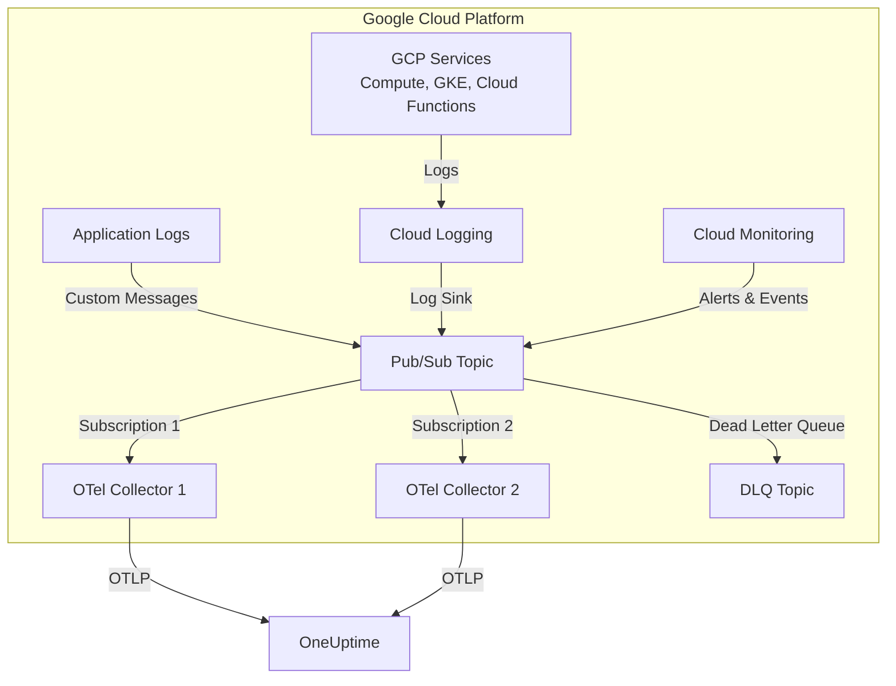

# How to Configure the Google Cloud Pub/Sub Receiver in the OpenTelemetry Collector

Author: [nawazdhandala](https://www.github.com/nawazdhandala)

Tags: OpenTelemetry, Collector, Google Cloud, GCP, Pub/Sub, Messaging, Streaming, Observability

Description: Configure the Google Cloud Pub/Sub Receiver in OpenTelemetry Collector to consume streaming telemetry data from Pub/Sub topics with authentication, subscription management, and production patterns.

---

> Streaming telemetry through Google Cloud Pub/Sub but need vendor-neutral observability? The Google Cloud Pub/Sub Receiver bridges the gap, transforming message streams into OpenTelemetry signals with production-grade reliability and exactly-once processing semantics.

Google Cloud Pub/Sub is a fully managed messaging service capable of handling millions of messages per second. The Google Cloud Pub/Sub Receiver in OpenTelemetry Collector allows you to consume telemetry data from Pub/Sub topics and route it to any OpenTelemetry-compatible backend, providing a vendor-neutral path from GCP services to your observability stack.

---

## What is the Google Cloud Pub/Sub Receiver?

The Google Cloud Pub/Sub Receiver is an OpenTelemetry Collector component that consumes messages from Pub/Sub subscriptions and converts them into OpenTelemetry logs, metrics, or traces. This receiver is essential for organizations that:

- Export GCP service logs to Pub/Sub for processing
- Stream application telemetry through Pub/Sub
- Build event-driven observability pipelines
- Consolidate multiple GCP services' telemetry into a unified platform
- Need scalable, durable ingestion for high-volume telemetry
- Implement exactly-once processing semantics for critical telemetry

### Key Features

- **Subscription-based consumption**: Multiple collectors can share workload
- **Automatic acknowledgment**: Manages message lifecycle
- **Dead letter queue support**: Handle failed messages gracefully
- **Multiple authentication methods**: Service accounts, workload identity, ADC
- **Format flexibility**: JSON, Protocol Buffers, raw text, and custom parsing
- **Horizontal scalability**: Scale by adding collector instances

---

## Architecture Overview

Here's how the Google Cloud Pub/Sub Receiver integrates into your observability pipeline:



The receiver leverages Pub/Sub's subscription model to enable horizontal scaling. Multiple collector instances can consume from the same subscription in parallel, with Pub/Sub automatically distributing messages across instances for high throughput and fault tolerance.

---

## Prerequisites

Before configuring the receiver, ensure you have:

1. **Google Cloud Project** with Pub/Sub API enabled
2. **Pub/Sub topic** with messages containing telemetry data
3. **Pub/Sub subscription** created for the OpenTelemetry Collector
4. **Authentication credentials** - Service account, workload identity, or ADC
5. **IAM permissions** - `pubsub.subscriptions.consume`, `pubsub.subscriptions.get`
6. **OpenTelemetry Collector** version 0.80.0 or later with googlepubsub receiver component

---

## Authentication Setup

The receiver supports multiple authentication methods:

### Method 1: Application Default Credentials (ADC)

When running on GCP (Compute Engine, GKE, Cloud Run), ADC automatically uses the instance's service account:

```bash
# No additional setup needed - ADC is automatic on GCP
# The receiver will use the default service account
```

Ensure the service account has required permissions:

```bash
gcloud projects add-iam-policy-binding PROJECT_ID \
  --member="serviceAccount:SERVICE_ACCOUNT@PROJECT_ID.iam.gserviceaccount.com" \
  --role="roles/pubsub.subscriber"
```

### Method 2: Service Account Key File

For running outside GCP or using a specific service account:

1. Create a service account:

```bash
gcloud iam service-accounts create otel-collector-pubsub \
  --description="OTel Collector Pub/Sub consumer" \
  --display-name="OTel Collector Pub/Sub"
```

2. Grant required permissions:

```bash
# Grant Pub/Sub Subscriber role
gcloud projects add-iam-policy-binding PROJECT_ID \
  --member="serviceAccount:otel-collector-pubsub@PROJECT_ID.iam.gserviceaccount.com" \
  --role="roles/pubsub.subscriber"
```

3. Create and download key file:

```bash
gcloud iam service-accounts keys create otel-pubsub-key.json \
  --iam-account=otel-collector-pubsub@PROJECT_ID.iam.gserviceaccount.com
```

4. Set environment variable:

```bash
export GOOGLE_APPLICATION_CREDENTIALS="/path/to/otel-pubsub-key.json"
```

### Method 3: Workload Identity (GKE)

For running on Google Kubernetes Engine:

```bash
# Bind Kubernetes service account to GCP service account
gcloud iam service-accounts add-iam-policy-binding \
  otel-collector-pubsub@PROJECT_ID.iam.gserviceaccount.com \
  --role roles/iam.workloadIdentityUser \
  --member "serviceAccount:PROJECT_ID.svc.id.goog[NAMESPACE/KSA_NAME]"
```

---

## Basic Configuration

Here's a minimal configuration to start consuming logs from a Pub/Sub subscription:

```yaml
# Configure the Google Cloud Pub/Sub receiver
receivers:
  # The googlepubsub receiver consumes from Pub/Sub subscriptions
  googlepubsub:
    # GCP project ID containing the subscription
    project: my-gcp-project

    # Subscription ID to consume from
    # Create this subscription in GCP Console or with gcloud
    subscription: projects/my-gcp-project/subscriptions/otel-telemetry-sub

    # Authentication via Application Default Credentials (auto-detected)
    # No explicit credentials needed when running on GCP

    # Message encoding format
    # Options: json, raw_text, proto
    encoding: json

    # Compression (if messages are compressed)
    # Options: none, gzip
    compression: none

# Configure where to send processed logs
exporters:
  otlphttp:
    endpoint: https://oneuptime.com/otlp
    headers:
      x-oneuptime-token: ${ONEUPTIME_TOKEN}

# Define the logs pipeline
service:
  pipelines:
    logs:
      receivers: [googlepubsub]
      exporters: [otlphttp]
```

This basic configuration consumes JSON-encoded messages from a Pub/Sub subscription and exports them as logs to OneUptime. Application Default Credentials handle authentication automatically when running on GCP.

---

## Production Configuration with Advanced Features

For production environments, add error handling, dead letter queues, and message transformation:

```yaml
receivers:
  googlepubsub:
    # Project and subscription
    project: ${GCP_PROJECT_ID}
    subscription: projects/${GCP_PROJECT_ID}/subscriptions/prod-telemetry-sub

    # Explicit service account key file (optional, uses ADC if omitted)
    credentials_file: ${GOOGLE_APPLICATION_CREDENTIALS}

    # Message format
    encoding: json
    compression: gzip  # If messages are gzipped

    # Consumer configuration
    consumer:
      # Maximum number of messages to fetch concurrently
      # Higher values increase throughput but consume more memory
      max_outstanding_messages: 1000

      # Maximum bytes to fetch concurrently
      # Prevents memory exhaustion with large messages
      max_outstanding_bytes: 1000000000  # 1 GB

      # Number of goroutines to use for message processing
      # Increase for higher throughput
      num_goroutines: 10

      # Timeout for receiving messages
      # Messages not acknowledged within this time are redelivered
      max_extension: 600s  # 10 minutes

      # Synchronous mode (wait for message processing to complete)
      # Set to false for asynchronous processing (higher throughput)
      synchronous: false

    # Attribute mapping for log messages
    logs:
      # Parse JSON messages and map fields to OpenTelemetry attributes
      # JSON field containing the log body
      body_field: message

      # JSON field containing timestamp
      timestamp_field: timestamp
      timestamp_format: "2006-01-02T15:04:05.000Z"

      # Map JSON fields to OpenTelemetry attributes
      attributes:
        - source_key: severity
          target_key: severity_text
        - source_key: labels.compute.googleapis.com/resource_name
          target_key: gcp.resource.name
        - source_key: resource.type
          target_key: gcp.resource.type
        - source_key: resource.labels.project_id
          target_key: gcp.project.id
        - source_key: logName
          target_key: gcp.log.name

processors:
  # Protect collector from memory exhaustion
  memory_limiter:
    limit_mib: 2048
    spike_limit_mib: 512
    check_interval: 5s

  # Add resource attributes
  resource:
    attributes:
      - key: source.type
        value: gcp_pubsub
        action: insert
      - key: cloud.provider
        value: gcp
        action: insert
      - key: pubsub.subscription
        value: prod-telemetry-sub
        action: insert

  # Parse GCP Cloud Logging format
  attributes/gcp_logs:
    actions:
      # Extract log level from severity
      - key: severity_number
        from_attribute: severity_text
        action: convert
        converted_type: int

      # Extract resource labels
      - key: resource.labels
        from_attribute: resource.labels
        action: insert

  # Filter out noisy logs
  filter/noise:
    logs:
      exclude:
        match_type: regexp
        # Exclude health check logs
        body:
          - "healthcheck"
          - "healthz"
          - "ping"
        # Exclude debug logs in production
        resource_attributes:
          - key: severity_text
            value: "DEBUG"

  # Batch for efficiency
  batch:
    timeout: 10s
    send_batch_size: 1000
    send_batch_max_size: 2000

exporters:
  # Primary export to OneUptime
  otlphttp/oneuptime:
    endpoint: https://oneuptime.com/otlp
    headers:
      x-oneuptime-token: ${ONEUPTIME_TOKEN}
    compression: gzip
    timeout: 30s
    retry_on_failure:
      enabled: true
      initial_interval: 5s
      max_interval: 30s
      max_elapsed_time: 300s

  # Backup export to Cloud Logging
  googlecloud:
    project: ${GCP_PROJECT_ID}
    log_name: otel-processed-logs

service:
  # Enable collector self-monitoring
  telemetry:
    logs:
      level: info
    metrics:
      address: :8888
      level: detailed

  pipelines:
    logs:
      receivers: [googlepubsub]
      processors:
        - memory_limiter
        - resource
        - attributes/gcp_logs
        - filter/noise
        - batch
      exporters:
        - otlphttp/oneuptime
        - googlecloud
```

This production configuration includes:

- **High throughput settings**: Optimized for large message volumes
- **Memory protection**: Prevents collector from consuming too much memory
- **GCP log format parsing**: Handles Cloud Logging JSON structure
- **Filtering**: Removes noisy logs to control costs
- **Multiple exporters**: Primary and backup destinations
- **Comprehensive monitoring**: Exposes collector metrics

---

## Processing GCP Cloud Logging Messages

GCP services export logs to Pub/Sub via Cloud Logging sinks. Here's a configuration optimized for Cloud Logging format:

```yaml
receivers:
  googlepubsub:
    project: ${GCP_PROJECT_ID}
    subscription: projects/${GCP_PROJECT_ID}/subscriptions/cloud-logging-sub

    encoding: json

    # Cloud Logging messages have specific structure
    logs:
      # The main log entry is in the message
      body_field: jsonPayload.message

      # Timestamp field
      timestamp_field: timestamp
      timestamp_format: "2006-01-02T15:04:05.000000000Z"

      attributes:
        # Standard Cloud Logging fields
        - source_key: severity
          target_key: severity_text
        - source_key: logName
          target_key: gcp.log.name
        - source_key: resource.type
          target_key: gcp.resource.type
        - source_key: resource.labels.project_id
          target_key: gcp.project.id
        - source_key: resource.labels.zone
          target_key: cloud.availability_zone
        - source_key: resource.labels.instance_id
          target_key: gcp.instance.id
        - source_key: labels
          target_key: gcp.labels
          flatten: true
        # JSON payload fields
        - source_key: jsonPayload
          target_key: log.attributes
          flatten: true

processors:
  # Transform GCP severity to OpenTelemetry conventions
  transform/severity:
    log_statements:
      - context: log
        statements:
          # Map GCP severity levels to OTel severity numbers
          - set(severity_number, 1) where severity_text == "DEFAULT"
          - set(severity_number, 5) where severity_text == "DEBUG"
          - set(severity_number, 9) where severity_text == "INFO"
          - set(severity_number, 10) where severity_text == "NOTICE"
          - set(severity_number, 13) where severity_text == "WARNING"
          - set(severity_number, 17) where severity_text == "ERROR"
          - set(severity_number, 19) where severity_text == "CRITICAL"
          - set(severity_number, 21) where severity_text == "ALERT"
          - set(severity_number, 23) where severity_text == "EMERGENCY"

  batch:
    timeout: 10s

exporters:
  otlphttp:
    endpoint: https://oneuptime.com/otlp
    headers:
      x-oneuptime-token: ${ONEUPTIME_TOKEN}

service:
  pipelines:
    logs:
      receivers: [googlepubsub]
      processors: [transform/severity, batch]
      exporters: [otlphttp]
```

This configuration properly parses Cloud Logging's JSON structure and maps GCP-specific fields to OpenTelemetry semantic conventions.

---

## Multiple Subscriptions Configuration

Process telemetry from multiple Pub/Sub subscriptions by defining multiple receivers:

```yaml
receivers:
  # Application logs subscription
  googlepubsub/app_logs:
    project: ${GCP_PROJECT_ID}
    subscription: projects/${GCP_PROJECT_ID}/subscriptions/app-logs-sub
    encoding: json
    logs:
      body_field: message
      timestamp_field: timestamp

  # Infrastructure metrics subscription
  googlepubsub/infra_metrics:
    project: ${GCP_PROJECT_ID}
    subscription: projects/${GCP_PROJECT_ID}/subscriptions/infra-metrics-sub
    encoding: json
    metrics:
      # Parse metrics from JSON
      value_field: value
      timestamp_field: timestamp

  # Security events subscription
  googlepubsub/security:
    project: ${GCP_PROJECT_ID}
    subscription: projects/${GCP_PROJECT_ID}/subscriptions/security-events-sub
    encoding: json
    logs:
      body_field: event
      timestamp_field: timestamp

processors:
  # Tag application logs
  resource/app:
    attributes:
      - key: telemetry.type
        value: application_logs
        action: insert

  # Tag infrastructure metrics
  resource/infra:
    attributes:
      - key: telemetry.type
        value: infrastructure_metrics
        action: insert

  # Tag security events
  resource/security:
    attributes:
      - key: telemetry.type
        value: security_events
        action: insert
      - key: priority
        value: high
        action: insert

  batch:
    timeout: 10s

exporters:
  # General observability data
  otlphttp/oneuptime:
    endpoint: https://oneuptime.com/otlp
    headers:
      x-oneuptime-token: ${ONEUPTIME_TOKEN}

  # Security events to SIEM
  otlphttp/siem:
    endpoint: https://siem.company.com/otlp
    headers:
      authorization: Bearer ${SIEM_TOKEN}

service:
  pipelines:
    # Application logs pipeline
    logs/app:
      receivers: [googlepubsub/app_logs]
      processors: [resource/app, batch]
      exporters: [otlphttp/oneuptime]

    # Infrastructure metrics pipeline
    metrics:
      receivers: [googlepubsub/infra_metrics]
      processors: [resource/infra, batch]
      exporters: [otlphttp/oneuptime]

    # Security events pipeline
    logs/security:
      receivers: [googlepubsub/security]
      processors: [resource/security, batch]
      exporters:
        - otlphttp/oneuptime
        - otlphttp/siem
```

This multi-subscription configuration allows you to:
- Separate concerns by telemetry type
- Apply different processing rules per stream
- Route to different destinations based on data type
- Scale independently for different data volumes

---

## Dead Letter Queue Configuration

Handle failed messages gracefully with a dead letter queue:

```yaml
receivers:
  googlepubsub:
    project: ${GCP_PROJECT_ID}
    subscription: projects/${GCP_PROJECT_ID}/subscriptions/telemetry-sub

    encoding: json

    # Dead letter queue configuration
    # Messages that fail processing are sent to DLQ
    dead_letter_topic: projects/${GCP_PROJECT_ID}/topics/telemetry-dlq

    # Maximum delivery attempts before sending to DLQ
    max_delivery_attempts: 5

    logs:
      body_field: message
      timestamp_field: timestamp

processors:
  # Validate messages
  filter/invalid:
    logs:
      include:
        # Only include valid messages
        match_type: regexp
        body:
          - ".*"
      exclude:
        # Exclude malformed messages
        match_type: regexp
        body:
          - "^$"  # Empty messages
          - "null"  # Null messages

  batch:
    timeout: 10s

exporters:
  otlphttp:
    endpoint: https://oneuptime.com/otlp
    headers:
      x-oneuptime-token: ${ONEUPTIME_TOKEN}

service:
  pipelines:
    logs:
      receivers: [googlepubsub]
      processors: [filter/invalid, batch]
      exporters: [otlphttp]
```

Set up the dead letter queue in GCP:

```bash
# Create DLQ topic
gcloud pubsub topics create telemetry-dlq

# Create DLQ subscription for monitoring
gcloud pubsub subscriptions create telemetry-dlq-monitor \
  --topic=telemetry-dlq

# Update main subscription with DLQ
gcloud pubsub subscriptions update telemetry-sub \
  --dead-letter-topic=telemetry-dlq \
  --max-delivery-attempts=5
```

---

## Scaling and High Availability

Scale horizontally by deploying multiple collector instances:

```yaml
# Deploy this configuration on multiple collector instances
receivers:
  googlepubsub:
    project: ${GCP_PROJECT_ID}
    # All instances consume from the same subscription
    # Pub/Sub automatically distributes messages
    subscription: projects/${GCP_PROJECT_ID}/subscriptions/high-volume-sub

    encoding: json

    consumer:
      # High throughput settings
      max_outstanding_messages: 2000
      max_outstanding_bytes: 2000000000  # 2 GB
      num_goroutines: 20
      synchronous: false

processors:
  batch:
    timeout: 5s
    send_batch_size: 2000
    send_batch_max_size: 5000

exporters:
  otlphttp:
    endpoint: https://oneuptime.com/otlp
    headers:
      x-oneuptime-token: ${ONEUPTIME_TOKEN}

service:
  pipelines:
    logs:
      receivers: [googlepubsub]
      processors: [batch]
      exporters: [otlphttp]
```

### Kubernetes Deployment for High Availability

Deploy on GKE with Horizontal Pod Autoscaler:

```yaml
apiVersion: apps/v1
kind: Deployment
metadata:
  name: otel-collector-pubsub
spec:
  replicas: 3  # Start with 3 instances
  selector:
    matchLabels:
      app: otel-collector
  template:
    metadata:
      labels:
        app: otel-collector
    spec:
      serviceAccountName: otel-collector
      containers:
      - name: otel-collector
        image: otel/opentelemetry-collector-contrib:0.93.0
        args: ["--config=/conf/otel-config.yaml"]
        resources:
          requests:
            memory: "2Gi"
            cpu: "1000m"
          limits:
            memory: "4Gi"
            cpu: "2000m"
        volumeMounts:
        - name: config
          mountPath: /conf
      volumes:
      - name: config
        configMap:
          name: otel-collector-config
---
apiVersion: v1
kind: Service
metadata:
  name: otel-collector-metrics
spec:
  selector:
    app: otel-collector
  ports:
  - name: metrics
    port: 8888
    targetPort: 8888
---
apiVersion: autoscaling/v2
kind: HorizontalPodAutoscaler
metadata:
  name: otel-collector-hpa
spec:
  scaleTargetRef:
    apiVersion: apps/v1
    kind: Deployment
    name: otel-collector-pubsub
  minReplicas: 3
  maxReplicas: 20
  metrics:
  - type: Resource
    resource:
      name: cpu
      target:
        type: Utilization
        averageUtilization: 70
  - type: Resource
    resource:
      name: memory
      target:
        type: Utilization
        averageUtilization: 80
  - type: Pods
    pods:
      metric:
        name: pubsub_subscription_num_undelivered_messages
      target:
        type: AverageValue
        averageValue: "1000"
```

Pub/Sub automatically distributes messages across all collector instances consuming from the same subscription, providing both scalability and fault tolerance.

---

## Monitoring Receiver Performance

Monitor the Pub/Sub receiver's health:

```yaml
service:
  telemetry:
    logs:
      level: info
    metrics:
      address: :8888
      level: detailed

  extensions: [pprof, health_check]

extensions:
  pprof:
    endpoint: localhost:1777

  health_check:
    endpoint: :13133
```

### Key Metrics to Monitor

Export collector metrics to OneUptime for monitoring:

- `otelcol_receiver_accepted_log_records_total` - Logs received from Pub/Sub
- `otelcol_receiver_refused_log_records_total` - Logs rejected due to errors
- `otelcol_exporter_sent_log_records_total` - Logs successfully exported
- `pubsub_receiver_messages_received` - Messages pulled from subscription
- `pubsub_receiver_messages_acknowledged` - Messages successfully processed
- `pubsub_receiver_pull_count` - Number of pull requests
- `pubsub_receiver_subscription_num_undelivered_messages` - Backlog size

Create alerts in OneUptime:

- **High backlog**: Alert when undelivered messages > 10000 (processing lag)
- **No messages received**: Alert when no messages received for 5+ minutes
- **High refusal rate**: Alert when refusal rate > 5% (parsing errors)
- **Dead letter queue activity**: Alert when messages arrive in DLQ

---

## Troubleshooting Common Issues

### Issue: Messages Not Being Consumed

**Cause**: IAM permissions missing or subscription doesn't exist

**Solution**: Verify subscription exists and check permissions:

```bash
# Check if subscription exists
gcloud pubsub subscriptions describe telemetry-sub

# Check IAM permissions
gcloud pubsub subscriptions get-iam-policy telemetry-sub
```

Grant required permissions:

```bash
gcloud pubsub subscriptions add-iam-policy-binding telemetry-sub \
  --member="serviceAccount:otel-collector@PROJECT_ID.iam.gserviceaccount.com" \
  --role="roles/pubsub.subscriber"
```

### Issue: High Memory Usage

**Cause**: Too many outstanding messages

**Solution**: Reduce outstanding limits:

```yaml
receivers:
  googlepubsub:
    consumer:
      max_outstanding_messages: 500  # Reduce from default
      max_outstanding_bytes: 500000000  # Reduce from default

processors:
  memory_limiter:
    limit_mib: 2048
    check_interval: 1s
```

### Issue: Message Processing Lag

**Cause**: Not enough collector instances or processing is too slow

**Solution**: Scale horizontally or increase goroutines:

```yaml
receivers:
  googlepubsub:
    consumer:
      num_goroutines: 30  # Increase from default
```

Deploy more collector instances to share the load.

### Issue: Duplicate Messages

**Cause**: Message acknowledgment timeout exceeded

**Solution**: Increase max extension time:

```yaml
receivers:
  googlepubsub:
    consumer:
      max_extension: 600s  # Increase from default 60s
```

Or enable synchronous mode for guaranteed processing:

```yaml
receivers:
  googlepubsub:
    consumer:
      synchronous: true  # Wait for full processing before ack
```

---

## Cost Optimization

Pub/Sub costs scale with message volume and storage. Optimize costs:

### 1. Use Message Batching

Batch messages before publishing to Pub/Sub to reduce message count:

```yaml
processors:
  batch:
    timeout: 30s  # Wait longer to build larger batches
    send_batch_size: 5000
```

### 2. Optimize Subscription Configuration

Configure appropriate message retention:

```bash
# Set message retention to 1 day instead of default 7 days
gcloud pubsub subscriptions update telemetry-sub \
  --message-retention-duration=1d
```

### 3. Filter Before Publishing

Use Cloud Logging filters to send only necessary logs to Pub/Sub:

```bash
# Create log sink with filter
gcloud logging sinks create otel-telemetry-sink \
  pubsub.googleapis.com/projects/PROJECT_ID/topics/telemetry \
  --log-filter='severity >= ERROR'  # Only errors and above
```

### 4. Use Compression

Compress messages before publishing:

```yaml
receivers:
  googlepubsub:
    encoding: json
    compression: gzip  # Decompress gzipped messages
```

---

## Integration with OneUptime

OneUptime seamlessly ingests logs and metrics from the Pub/Sub receiver. Once configured:

1. **Search real-time logs**: Query logs streamed through Pub/Sub
2. **Create dashboards**: Visualize trends from streaming data
3. **Set up alerts**: Alert on patterns in Pub/Sub-sourced telemetry
4. **Correlate with other data**: Combine Pub/Sub data with metrics and traces

Example OneUptime query:

```
source.type = "gcp_pubsub" AND
severity_text = "ERROR" AND
gcp.resource.type = "gce_instance"
```

---

## Related Resources

- [How to Configure Google Cloud Monitoring Receiver](https://oneuptime.com/blog/post/2026-02-06-google-cloud-monitoring-receiver-opentelemetry-collector/view)
- [How to Configure Azure Event Hub Receiver](https://oneuptime.com/blog/post/2026-02-06-azure-event-hub-receiver-opentelemetry-collector/view)
- [OpenTelemetry Collector: What It Is and When You Need It](https://oneuptime.com/blog/post/2025-09-18-what-is-opentelemetry-collector-and-why-use-one/view)

---

## Conclusion

The Google Cloud Pub/Sub Receiver provides a scalable, reliable way to ingest streaming telemetry from GCP services into OpenTelemetry. By leveraging Pub/Sub's durable messaging and exactly-once delivery semantics, you can build production-grade pipelines that handle millions of messages per second while maintaining data integrity.

Start with basic subscription consumption and message parsing, then add dead letter queues, filtering, and horizontal scaling as your needs grow. With proper monitoring and tuning, you'll have a robust GCP telemetry ingestion pipeline that scales with your infrastructure.

The combination of Pub/Sub for durable streaming and OpenTelemetry for vendor-neutral processing gives you the flexibility to analyze GCP telemetry in any backend without lock-in.

---

**Ready to stream GCP telemetry?** OneUptime provides seamless integration with OpenTelemetry, making it easy to analyze logs, metrics, and traces from Google Cloud Pub/Sub with powerful querying, dashboards, and alerting capabilities.
