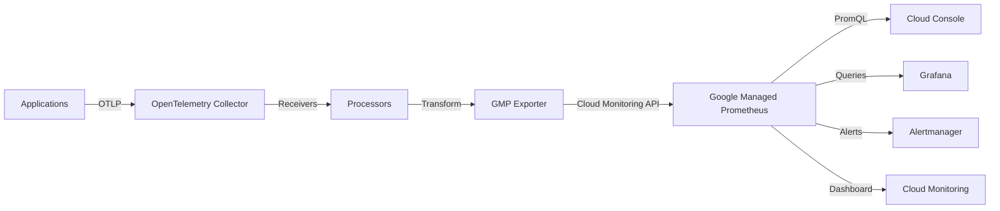

# How to Configure the Google Managed Prometheus Exporter

Author: [nawazdhandala](https://www.github.com/nawazdhandala)

Tags: OpenTelemetry, Collector, Exporter, Google Cloud, GCP, Prometheus, Managed Prometheus, GMP, Monitoring

Description: Complete guide to configuring the Google Managed Prometheus exporter in the OpenTelemetry Collector for scalable metrics monitoring on Google Cloud Platform.

Google Managed Service for Prometheus (GMP) is a fully managed, globally scalable, and highly available Prometheus-compatible monitoring solution. The OpenTelemetry Collector's Google Managed Prometheus exporter enables you to send metrics data to GMP, providing a scalable alternative to self-hosted Prometheus with the familiar PromQL query language and Grafana integration.

## Understanding Google Managed Prometheus

Google Managed Prometheus is built on top of Google Cloud Monitoring and provides a managed Prometheus experience. It offers virtually unlimited scale, global availability, and integration with Google Cloud services, while maintaining compatibility with existing Prometheus configurations and queries.

The exporter converts OpenTelemetry metrics to Prometheus format and sends them to GMP's ingestion endpoint, where they can be queried using PromQL in the Cloud Console or Grafana.

## Architecture Overview

Here's how the Google Managed Prometheus exporter integrates with Google Cloud:


```mermaid
graph LR
    A[Applications] -->|OTLP| B[OpenTelemetry Collector]
    B -->|Receivers| C[Processors]
    C -->|Transform| D[GMP Exporter]
    D -->|Cloud Monitoring API| E[Google Managed Prometheus]
    E -->|PromQL| F[Cloud Console]
    E -->|Queries| G[Grafana]
    E -->|Alerts| H[Alertmanager]
    E -->|Dashboard| I[Cloud Monitoring]
```

## Prerequisites

Before configuring the Google Managed Prometheus exporter, you need:

- A Google Cloud project with billing enabled
- Google Managed Prometheus enabled in your project
- Service account with Monitoring Metric Writer role
- OpenTelemetry Collector Contrib installed (version 0.146.0 or later)
- GKE cluster (optional, for Kubernetes deployments)

## Setting Up Google Managed Prometheus

Enable Google Managed Prometheus in your project:

```bash
# Enable the Monitoring API

gcloud services enable monitoring.googleapis.com

# For GKE clusters, enable managed collection
gcloud container clusters update CLUSTER_NAME \
  --enable-managed-prometheus \
  --zone=ZONE
```

Create a service account with necessary permissions:

```bash
# Create service account
gcloud iam service-accounts create otel-gmp-collector \
  --display-name="OpenTelemetry GMP Collector" \
  --project=my-project

# Grant Monitoring Metric Writer role
gcloud projects add-iam-policy-binding my-project \
  --member="serviceAccount:otel-gmp-collector@my-project.iam.gserviceaccount.com" \
  --role="roles/monitoring.metricWriter"

# Create and download key
gcloud iam service-accounts keys create gmp-key.json \
  --iam-account=otel-gmp-collector@my-project.iam.gserviceaccount.com
```

## Basic Configuration

Here's a minimal configuration for the Google Managed Prometheus exporter:

```yaml
# OpenTelemetry Collector configuration for Google Managed Prometheus
receivers:
  otlp:
    protocols:
      grpc:
        endpoint: 0.0.0.0:4317
      http:
        endpoint: 0.0.0.0:4318

  # Prometheus receiver for scraping
  prometheus:
    config:
      scrape_configs:
        - job_name: 'otel-collector'
          scrape_interval: 30s
          static_configs:
            - targets: ['localhost:8888']

processors:
  batch:
    # Batch metrics for efficient transmission
    timeout: 10s
    send_batch_size: 1024

exporters:
  googlemanagedprometheus:
    # Google Cloud project ID
    project: "my-project-id"

    # Credentials are read from Application Default Credentials.
    # For service account keys, set GOOGLE_APPLICATION_CREDENTIALS.

service:
  pipelines:
    metrics:
      receivers: [otlp, prometheus]
      processors: [batch]
      exporters: [googlemanagedprometheus]
```

This configuration sets up a metrics pipeline that receives OTLP metrics and exports them to Google Managed Prometheus.

## Using Application Default Credentials

For applications running on Google Cloud, use Application Default Credentials:

```yaml
exporters:
  googlemanagedprometheus:
    project: "my-project-id"
    # No exporter credential field needed - uses Application Default Credentials
```

For GKE workloads with Workload Identity:

```bash
# Create Kubernetes service account
kubectl create serviceaccount otel-gmp-collector

# Bind to Google Cloud service account
gcloud iam service-accounts add-iam-policy-binding \
  otel-gmp-collector@my-project.iam.gserviceaccount.com \
  --role roles/iam.workloadIdentityUser \
  --member "serviceAccount:my-project.svc.id.goog[default/otel-gmp-collector]"

# Annotate Kubernetes service account
kubectl annotate serviceaccount otel-gmp-collector \
  iam.gke.io/gcp-service-account=otel-gmp-collector@my-project.iam.gserviceaccount.com
```

## Advanced Configuration Options

For production deployments, customize additional parameters:

```yaml
exporters:
  googlemanagedprometheus:
    project: "my-project-id"

    # User agent string for tracking
    user_agent: "opentelemetry-collector/1.0"

    metric:
      # Endpoint is optional; the default sends to Cloud Monitoring.
      # endpoint: "monitoring.googleapis.com:443"

      # Compression for metrics gRPC requests
      compression: "gzip"

      # Include selected resource attributes as metric labels
      resource_filters:
        - prefix: "cloud"
        - prefix: "k8s"
        - regex: "host.name"

    # Queue batches before sending
    sending_queue:
      enabled: true
      num_consumers: 10
      queue_size: 1000
```

Resource Detection and Labels

Add resource attributes used by the `prometheus_target` monitored resource, and include selected resource attributes as Prometheus labels:

```yaml
processors:
  # Detect GCP resource attributes
  resourcedetection:
    detectors: [gcp, env, system]
    timeout: 5s
    override: false

  # Add custom resource attributes
  resource:
    attributes:
      - key: service.name
        value: "${SERVICE_NAME}"
        action: upsert
      - key: service.version
        value: "${SERVICE_VERSION}"
        action: upsert
      - key: deployment.environment
        value: "${ENVIRONMENT}"
        action: upsert
      - key: k8s.cluster.name
        value: "${CLUSTER_NAME}"
        action: upsert

  batch:
    timeout: 10s
    send_batch_size: 1024

exporters:
  googlemanagedprometheus:
    project: "my-project-id"
    metric:
      resource_filters:
        - regex: "service.name"
        - regex: "service.version"
        - regex: "deployment.environment"

service:
  pipelines:
    metrics:
      receivers: [otlp]
      processors: [resourcedetection, resource, batch]
      exporters: [googlemanagedprometheus]
```

## Metric Transformation and Filtering

Transform and filter metrics before export:

```yaml
processors:
  # Filter out unnecessary metrics
  filter/metrics:
    error_mode: ignore
    metric_conditions:
      # Exclude metrics by name
      - 'metric.name == "up"'
      - 'metric.name == "scrape_duration_seconds"'

  # Transform metric names and labels
  metricstransform:
    transforms:
      # Rename metric
      - include: "http.server.duration"
        action: update
        new_name: "http_request_duration_seconds"

      # Convert units
      - include: "http_request_duration_seconds"
        action: update
        operations:
          - action: experimental_scale_value
            experimental_scale: 0.001  # Convert ms to seconds

      # Add prefix to metrics
      - include: "^(.*)$"
        match_type: regexp
        action: update
        new_name: "otel_$$1"

      # Aggregate metric by labels
      - include: "request_count"
        action: update
        operations:
          - action: aggregate_labels
            label_set: [http_method, status_code]
            aggregation_type: sum

  # Cumulative to delta conversion
  cumulativetodelta:
    include:
      metrics:
        - http_requests_total
        - request_duration_sum
      match_type: strict

  batch:
    timeout: 10s
    send_batch_size: 512

exporters:
  googlemanagedprometheus:
    project: "my-project-id"

service:
  pipelines:
    metrics:
      receivers: [otlp]
      processors: [filter/metrics, metricstransform, cumulativetodelta, batch]
      exporters: [googlemanagedprometheus]
```

## Scraping Prometheus Endpoints

Configure the collector to scrape Prometheus endpoints:

```yaml
receivers:
  # OTLP receiver for push-based metrics
  otlp:
    protocols:
      grpc:
        endpoint: 0.0.0.0:4317
      http:
        endpoint: 0.0.0.0:4318

  # Prometheus receiver for scraping
  prometheus:
    config:
      global:
        scrape_interval: 30s
        evaluation_interval: 30s

      scrape_configs:
        # Scrape collector's own metrics
        - job_name: 'otel-collector'
          scrape_interval: 30s
          static_configs:
            - targets: ['localhost:8888']
              labels:
                service: 'otel-collector'

        # Scrape application endpoints
        - job_name: 'app-metrics'
          scrape_interval: 15s
          static_configs:
            - targets: ['app-service:8080']
              labels:
                environment: 'production'

        # Kubernetes service discovery
        - job_name: 'kubernetes-pods'
          kubernetes_sd_configs:
            - role: pod
          relabel_configs:
            - source_labels: [__meta_kubernetes_pod_annotation_prometheus_io_scrape]
              action: keep
              regex: true
            - source_labels: [__meta_kubernetes_pod_annotation_prometheus_io_path]
              action: replace
              target_label: __metrics_path__
              regex: (.+)
            - source_labels: [__address__, __meta_kubernetes_pod_annotation_prometheus_io_port]
              action: replace
              regex: ([^:]+)(?::\d+)?;(\d+)
              replacement: $$1:$$2
              target_label: __address__

processors:
  batch:
    timeout: 10s
    send_batch_size: 1024

exporters:
  googlemanagedprometheus:
    project: "my-project-id"

service:
  pipelines:
    metrics:
      receivers: [otlp, prometheus]
      processors: [batch]
      exporters: [googlemanagedprometheus]
```

## Querying Metrics with PromQL

Once metrics are in Google Managed Prometheus, query them using PromQL:

**Query in Cloud Console:**

Navigate to Cloud Monitoring > Metrics Explorer and select "PromQL" as the query language:

```promql
# Query HTTP request rate
rate(http_requests_total[5m])

# Query by labels
http_request_duration_seconds{environment="production", service_name="payment-service"}

# Aggregate across labels
sum(rate(http_requests_total[5m])) by (service_name, http_method)

# Calculate percentiles
histogram_quantile(0.95, rate(http_request_duration_seconds_bucket[5m]))

# Query error rate
sum(rate(http_requests_total{status_code=~"5.."}[5m])) /
sum(rate(http_requests_total[5m]))
```

**Using PromQL in Grafana:**

Configure Grafana with a Prometheus datasource, then run the GMP data source syncer so Grafana has OAuth2 credentials and the Cloud Monitoring Prometheus API URL:

```yaml
apiVersion: 1
datasources:
  - name: Google Managed Prometheus
    type: prometheus
    access: proxy
    url: http://localhost:9090
    jsonData:
      httpMethod: GET
    editable: false
```

## Creating Recording Rules

Define recording rules to pre-compute expensive queries:

```yaml
apiVersion: monitoring.googleapis.com/v1
kind: Rules
metadata:
  namespace: default
  name: request-metrics
spec:
  groups:
    - name: request_metrics
      interval: 30s
      rules:
        # Pre-compute request rate
        - record: job:http_requests:rate5m
          expr: sum(rate(http_requests_total[5m])) by (job)

        # Pre-compute error rate
        - record: job:http_errors:rate5m
          expr: sum(rate(http_requests_total{status_code=~"5.."}[5m])) by (job)

        # Pre-compute latency percentiles
        - record: job:http_request_duration:p95
          expr: histogram_quantile(0.95, sum(rate(http_request_duration_seconds_bucket[5m])) by (job, le))
```

Apply recording rules using kubectl:

```bash
kubectl apply -n default -f recording-rules.yaml
```

## Setting Up Alerts

Configure alerting rules based on your metrics:

```yaml
apiVersion: monitoring.googleapis.com/v1
kind: Rules
metadata:
  namespace: default
  name: service-alerts
spec:
  groups:
    - name: service_alerts
      interval: 30s
      rules:
        # High error rate alert
        - alert: HighErrorRate
          expr: |
            sum(rate(http_requests_total{status_code=~"5.."}[5m])) by (service_name) /
            sum(rate(http_requests_total[5m])) by (service_name) > 0.05
          for: 5m
          labels:
            severity: critical
          annotations:
            summary: "High error rate on {{ $labels.service_name }}"
            description: "Error rate is {{ $value | humanizePercentage }} on {{ $labels.service_name }}"

        # High latency alert
        - alert: HighLatency
          expr: |
            histogram_quantile(0.95,
              sum(rate(http_request_duration_seconds_bucket[5m])) by (service_name, le)
            ) > 1.0
          for: 5m
          labels:
            severity: warning
          annotations:
            summary: "High latency on {{ $labels.service_name }}"
            description: "P95 latency is {{ $value }}s on {{ $labels.service_name }}"

        # Service down alert
        - alert: ServiceDown
          expr: up == 0
          for: 5m
          labels:
            severity: critical
          annotations:
            summary: "Service {{ $labels.job }} is down"
            description: "{{ $labels.job }} has been down for more than 5 minutes"
```

## Performance Optimization

Optimize the exporter for high-throughput environments:

```yaml
processors:
  # Batch metrics aggressively
  batch:
    timeout: 30s
    send_batch_size: 4096

  # Memory limiter to prevent OOM
  memory_limiter:
    check_interval: 1s
    limit_mib: 512
    spike_limit_mib: 128

exporters:
  googlemanagedprometheus:
    project: "my-project-id"

    metric:
      compression: "gzip"

    sending_queue:
      enabled: true
      num_consumers: 20
      queue_size: 20000

service:
  pipelines:
    metrics:
      receivers: [otlp, prometheus]
      processors: [memory_limiter, batch]
      exporters: [googlemanagedprometheus]

  # Tune collector telemetry
  telemetry:
    logs:
      level: info
    metrics:
      level: detailed
      readers:
        - pull:
            exporter:
              prometheus:
                host: 0.0.0.0
                port: 8888
```

## Cost Management

Google Managed Prometheus pricing is based on the number of samples ingested. Reduce costs:

**1. Reduce Scrape Frequency:**

```yaml
receivers:
  prometheus:
    config:
      scrape_configs:
        - job_name: 'app'
          scrape_interval: 60s  # Increase from default 15s
```

**2. Filter Out High-Cardinality Metrics:**

```yaml
processors:
  filter/metrics:
    error_mode: ignore
    metric_conditions:
      - 'metric.name == "high_cardinality_metric"'
      # Filter by label values
      - 'datapoint.attributes["user_id"] != nil'
```

**3. Aggregate Metrics:**

```yaml
processors:
  metricstransform:
    transforms:
      - include: "request_count"
        action: update
        aggregation_type: sum
        # Remove high-cardinality labels
        operations:
          - action: aggregate_labels
            label_set: [http_method, status_code]
            aggregation_type: sum
```

**4. Use Recording Rules:**

Pre-compute expensive aggregations to reduce query costs.

## Multi-Cluster Configuration

For multiple Kubernetes clusters, configure cluster-specific labels:

```yaml
processors:
  resource:
    attributes:
      - key: cluster
        value: "${CLUSTER_NAME}"
        action: upsert
      - key: location
        value: "${REGION}"
        action: upsert

exporters:
  googlemanagedprometheus:
    project: "my-project-id"

service:
  pipelines:
    metrics:
      receivers: [otlp, prometheus]
      processors: [resource, batch]
      exporters: [googlemanagedprometheus]
```

Query across clusters:

```promql
# Query metrics from all clusters
sum(rate(http_requests_total[5m])) by (cluster, service_name)

# Query specific cluster
http_requests_total{cluster="production-us-central1"}
```

## Integration with Grafana

Deploy Grafana with Google Managed Prometheus datasource:

```yaml
apiVersion: apps/v1
kind: Deployment
metadata:
  name: grafana
spec:
  replicas: 1
  selector:
    matchLabels:
      app: grafana
  template:
    metadata:
      labels:
        app: grafana
    spec:
      serviceAccountName: grafana
      containers:
      - name: grafana
        image: grafana/grafana:latest
        ports:
        - containerPort: 3000
        env:
        - name: GF_AUTH_GOOGLE_ENABLED
          value: "true"
        - name: GF_AUTH_GOOGLE_CLIENT_ID
          valueFrom:
            secretKeyRef:
              name: grafana-secrets
              key: client-id
        - name: GF_AUTH_GOOGLE_CLIENT_SECRET
          valueFrom:
            secretKeyRef:
              name: grafana-secrets
              key: client-secret
        volumeMounts:
        - name: grafana-datasources
          mountPath: /etc/grafana/provisioning/datasources
      volumes:
      - name: grafana-datasources
        configMap:
          name: grafana-datasources

---
apiVersion: v1
kind: ConfigMap
metadata:
  name: grafana-datasources
data:
  datasources.yaml: |
    apiVersion: 1
    datasources:
      - name: Google Managed Prometheus
        type: prometheus
        access: proxy
        url: http://localhost:9090
        isDefault: true
        jsonData:
          httpMethod: GET
        editable: false
```

## Complete Production Example

Here's a comprehensive configuration for production:

```yaml
receivers:
  otlp:
    protocols:
      grpc:
        endpoint: 0.0.0.0:4317
      http:
        endpoint: 0.0.0.0:4318

  prometheus:
    config:
      global:
        scrape_interval: 30s
        evaluation_interval: 30s

      scrape_configs:
        - job_name: 'otel-collector'
          static_configs:
            - targets: ['localhost:8888']

        - job_name: 'kubernetes-pods'
          kubernetes_sd_configs:
            - role: pod
          relabel_configs:
            - source_labels: [__meta_kubernetes_pod_annotation_prometheus_io_scrape]
              action: keep
              regex: true
            - source_labels: [__meta_kubernetes_pod_annotation_prometheus_io_path]
              action: replace
              target_label: __metrics_path__
              regex: (.+)
            - source_labels: [__address__, __meta_kubernetes_pod_annotation_prometheus_io_port]
              action: replace
              regex: ([^:]+)(?::\d+)?;(\d+)
              replacement: $$1:$$2
              target_label: __address__
            - source_labels: [__meta_kubernetes_namespace]
              action: replace
              target_label: namespace
            - source_labels: [__meta_kubernetes_pod_name]
              action: replace
              target_label: pod

processors:
  # Memory protection
  memory_limiter:
    check_interval: 1s
    limit_mib: 512
    spike_limit_mib: 128

  # Resource detection
  resourcedetection:
    detectors: [gcp, env, system]
    timeout: 5s

  # Add resource attributes
  resource:
    attributes:
      - key: cluster
        value: "${CLUSTER_NAME}"
        action: upsert
      - key: environment
        value: "${ENVIRONMENT}"
        action: upsert

  # Filter high-cardinality metrics
  filter/metrics:
    error_mode: ignore
    metric_conditions:
      - 'metric.name == "up"'
      - 'IsMatch(metric.name, "^scrape_.*")'
      - 'datapoint.attributes["user_id"] != nil'

  # Transform metrics
  metricstransform:
    transforms:
      - include: "^http_server_duration$"
        match_type: regexp
        action: update
        new_name: "http_request_duration_seconds"
        operations:
          - action: experimental_scale_value
            experimental_scale: 0.001

  # Batch for efficiency
  batch:
    timeout: 30s
    send_batch_size: 4096

exporters:
  googlemanagedprometheus:
    project: "${GCP_PROJECT_ID}"

    metric:
      compression: "gzip"
      resource_filters:
        - regex: "cluster"
        - regex: "environment"

    sending_queue:
      enabled: true
      num_consumers: 20
      queue_size: 20000

service:
  pipelines:
    metrics:
      receivers: [otlp, prometheus]
      processors: [memory_limiter, resourcedetection, resource, filter/metrics, metricstransform, batch]
      exporters: [googlemanagedprometheus]

  telemetry:
    logs:
      level: info
    metrics:
      readers:
        - pull:
            exporter:
              prometheus:
                host: 0.0.0.0
                port: 8888
```

## Troubleshooting Common Issues

**Issue: Authentication errors**

Solutions:
- Verify service account has `roles/monitoring.metricWriter` role
- Check that Application Default Credentials are configured correctly
- Ensure Application Default Credentials are set up
- Verify project ID is correct

**Issue: Metrics not appearing in Cloud Console**

Check:
- Metrics are being received by the collector
- No errors in collector logs
- Project ID is correct
- Monitoring API is enabled

**Issue: High memory usage**

Optimize:
- Enable memory limiter processor
- Reduce batch size
- Filter unnecessary metrics
- Increase scrape intervals

**Issue: Rate limiting errors**

Solutions:
- Reduce metric cardinality
- Increase batch intervals
- Filter high-frequency metrics
- Request quota increase

## Conclusion

Google Managed Prometheus provides a scalable, fully managed solution for Prometheus-based monitoring on Google Cloud. By using the OpenTelemetry Collector with the GMP exporter, you can leverage the power of Prometheus without the operational overhead of managing infrastructure.

For more information on OpenTelemetry exporters, check out these related articles:
- https://oneuptime.com/blog/post/2026-02-06-google-cloud-operations-exporter-opentelemetry-collector/view
- https://oneuptime.com/blog/post/2026-02-06-influxdb-exporter-opentelemetry-collector/view

For detailed information about the Google Managed Prometheus exporter configuration options, refer to the official OpenTelemetry Collector documentation.
