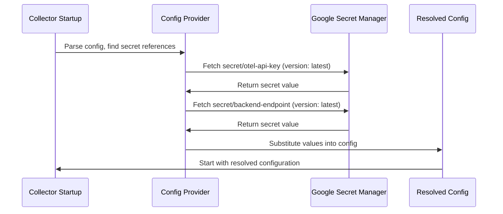
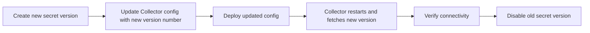

# How to Use Google Secret Manager Provider for Sensitive Collector Config

Author: [nawazdhandala](https://www.github.com/nawazdhandala)

Tags: OpenTelemetry, Google Cloud, Secret Manager, Collector, Security, GCP

Description: Learn how to use the Google Secret Manager config provider to securely inject secrets into your OpenTelemetry Collector configuration without hardcoding credentials.

---

Running the OpenTelemetry Collector on Google Cloud means you likely have API keys, authentication tokens, and endpoint credentials scattered across your configuration files. The Google Secret Manager config provider lets you reference secrets stored in Google Secret Manager directly from your Collector configuration. Secrets are fetched at startup, resolved in place, and never written to disk in plaintext.

This guide walks through setting up the provider from scratch, including GCP permissions, Collector configuration, and common patterns for different deployment scenarios.

## How the Secret Manager Provider Works

The config provider acts as a bridge between your Collector configuration and Google Secret Manager. When the Collector starts, it scans the configuration for references using the `googlesecretmanager:` URI scheme. It then calls the Secret Manager API to fetch each referenced secret and substitutes the values into the configuration before the Collector initializes its components.



The key benefit is that your configuration files remain safe to commit to version control. They contain only references to secrets, not the secrets themselves.

## Prerequisites

Before you start, you need a few things in place:

1. A GCP project with the Secret Manager API enabled
2. Secrets already created in Secret Manager
3. A service account (or workload identity) with appropriate permissions
4. The OpenTelemetry Collector Contrib distribution (the core distribution does not include this provider)

## Step 1: Create Secrets in Google Secret Manager

First, create the secrets you need in Google Secret Manager. You can do this through the GCP Console or the gcloud CLI.

These commands create secrets for common Collector configuration values.

```bash
# Enable the Secret Manager API if not already enabled
gcloud services enable secretmanager.googleapis.com

# Create a secret for the telemetry backend API key
echo -n "sk-abc123def456ghi789" | gcloud secrets create otel-exporter-api-key \
  --project=my-project \
  --replication-policy=automatic \
  --data-file=-

# Create a secret for the backend endpoint URL
echo -n "https://telemetry-backend.example.com:4317" | gcloud secrets create otel-backend-endpoint \
  --project=my-project \
  --replication-policy=automatic \
  --data-file=-

# Create a secret for the bearer token used in authentication
echo -n "eyJhbGciOiJSUzI1NiIsInR5cCI6IkpXVCJ9..." | gcloud secrets create otel-auth-token \
  --project=my-project \
  --replication-policy=automatic \
  --data-file=-

# Create a secret for the Prometheus remote write password
echo -n "prom-write-password-xyz" | gcloud secrets create prometheus-write-password \
  --project=my-project \
  --replication-policy=automatic \
  --data-file=-
```

## Step 2: Configure IAM Permissions

The Collector needs permission to read secrets from Secret Manager. Create a service account with the `secretmanager.secretAccessor` role, or grant the role to an existing service account.

These commands set up the minimum required IAM permissions for the Collector.

```bash
# Create a dedicated service account for the Collector
gcloud iam service-accounts create otel-collector \
  --project=my-project \
  --display-name="OpenTelemetry Collector"

# Grant the secret accessor role - this is the minimum required permission
gcloud projects add-iam-policy-binding my-project \
  --member="serviceAccount:otel-collector@my-project.iam.gserviceaccount.com" \
  --role="roles/secretmanager.secretAccessor"
```

For more granular control, you can grant access to individual secrets instead of all secrets in the project.

This command grants access to a single specific secret.

```bash
# Grant access to only the specific secrets the Collector needs
gcloud secrets add-iam-policy-binding otel-exporter-api-key \
  --project=my-project \
  --member="serviceAccount:otel-collector@my-project.iam.gserviceaccount.com" \
  --role="roles/secretmanager.secretAccessor"

gcloud secrets add-iam-policy-binding otel-backend-endpoint \
  --project=my-project \
  --member="serviceAccount:otel-collector@my-project.iam.gserviceaccount.com" \
  --role="roles/secretmanager.secretAccessor"
```

## Step 3: Configure the Collector with Secret References

Now update your Collector configuration to reference secrets using the `googlesecretmanager:` URI scheme. The format is:

```
${googlesecretmanager:projects/PROJECT_ID/secrets/SECRET_NAME/versions/VERSION}
```

This Collector configuration uses Google Secret Manager references instead of hardcoded values.

```yaml
# collector-config.yaml
# All sensitive values are fetched from Google Secret Manager at startup
exporters:
  otlp/backend:
    # Endpoint URL pulled from Secret Manager
    endpoint: "${googlesecretmanager:projects/my-project/secrets/otel-backend-endpoint/versions/latest}"
    headers:
      # API key pulled from Secret Manager
      api-key: "${googlesecretmanager:projects/my-project/secrets/otel-exporter-api-key/versions/latest}"
    tls:
      insecure: false

  prometheusremotewrite:
    endpoint: "https://prometheus.example.com/api/v1/write"
    headers:
      # Prometheus auth from Secret Manager
      Authorization: "Basic ${googlesecretmanager:projects/my-project/secrets/prometheus-write-password/versions/latest}"

extensions:
  bearertokenauth:
    # Auth token from Secret Manager
    token: "${googlesecretmanager:projects/my-project/secrets/otel-auth-token/versions/latest}"

receivers:
  otlp:
    protocols:
      grpc:
        endpoint: 0.0.0.0:4317
        auth:
          authenticator: bearertokenauth

service:
  extensions: [bearertokenauth]
  pipelines:
    traces:
      receivers: [otlp]
      processors: [batch]
      exporters: [otlp/backend]
    metrics:
      receivers: [otlp]
      processors: [batch]
      exporters: [prometheusremotewrite]
```

## Step 4: Deploy on Google Kubernetes Engine

When running on GKE, the recommended approach is to use Workload Identity instead of service account key files. Workload Identity maps a Kubernetes service account to a GCP service account without requiring any key files.

These commands configure Workload Identity for the Collector.

```bash
# Enable Workload Identity on the GKE cluster (if not already enabled)
gcloud container clusters update my-cluster \
  --project=my-project \
  --zone=us-central1-a \
  --workload-pool=my-project.svc.id.goog

# Create a Kubernetes service account for the Collector
kubectl create serviceaccount otel-collector -n observability

# Bind the Kubernetes service account to the GCP service account
gcloud iam service-accounts add-iam-policy-binding \
  otel-collector@my-project.iam.gserviceaccount.com \
  --role="roles/iam.workloadIdentityUser" \
  --member="serviceAccount:my-project.svc.id.goog[observability/otel-collector]"

# Annotate the Kubernetes service account with the GCP service account
kubectl annotate serviceaccount otel-collector \
  -n observability \
  iam.gke.io/gcp-service-account=otel-collector@my-project.iam.gserviceaccount.com
```

Then deploy the Collector using the configured service account.

This Kubernetes Deployment uses Workload Identity to authenticate with Secret Manager.

```yaml
# collector-gke-deployment.yaml
apiVersion: apps/v1
kind: Deployment
metadata:
  name: otel-collector
  namespace: observability
spec:
  replicas: 2
  selector:
    matchLabels:
      app: otel-collector
  template:
    metadata:
      labels:
        app: otel-collector
    spec:
      # Use the service account with Workload Identity binding
      serviceAccountName: otel-collector
      containers:
        - name: otel-collector
          image: otel/opentelemetry-collector-contrib:latest
          args:
            - "--config=/etc/otelcol/config.yaml"
          volumeMounts:
            - name: config
              mountPath: /etc/otelcol
          resources:
            requests:
              cpu: 200m
              memory: 256Mi
            limits:
              cpu: 1000m
              memory: 512Mi
      volumes:
        - name: config
          configMap:
            # The config file with secret references is safe to store in a ConfigMap
            name: otel-collector-config
```

The ConfigMap containing the Collector config is safe to create because it only contains references to secrets, not actual secret values.

```bash
# Create ConfigMap from the Collector config file
# This is safe because the file only contains secret references, not values
kubectl create configmap otel-collector-config \
  -n observability \
  --from-file=config.yaml=collector-config.yaml
```

## Step 5: Deploy on Compute Engine

For Collectors running on Compute Engine VMs, attach the service account to the VM instance. This lets the Collector authenticate automatically through the VM's metadata service.

This command creates a VM with the Collector service account attached.

```bash
# Create a Compute Engine instance with the Collector service account
gcloud compute instances create otel-collector-vm \
  --project=my-project \
  --zone=us-central1-a \
  --machine-type=e2-medium \
  --service-account=otel-collector@my-project.iam.gserviceaccount.com \
  --scopes=cloud-platform \
  --image-family=ubuntu-2204-lts \
  --image-project=ubuntu-os-cloud
```

On the VM, install the Collector and place your configuration file. The secret references will be resolved automatically through the instance's default credentials.

## Step 6: Version Pinning and Secret Rotation

Using `versions/latest` is convenient, but for production you might want to pin specific versions to control when secret changes take effect.

This configuration pins secrets to specific versions for predictable deployments.

```yaml
# collector-config-pinned.yaml
exporters:
  otlp/backend:
    # Pin to version 3 of the API key - update this when rotating secrets
    endpoint: "${googlesecretmanager:projects/my-project/secrets/otel-backend-endpoint/versions/3}"
    headers:
      api-key: "${googlesecretmanager:projects/my-project/secrets/otel-exporter-api-key/versions/5}"
```

When you rotate a secret, the workflow looks like this:



To rotate a secret, create a new version and then update your Collector configuration.

```bash
# Add a new version of the API key secret
echo -n "sk-new-rotated-key-abc123" | gcloud secrets versions add otel-exporter-api-key \
  --project=my-project \
  --data-file=-

# The new version is now "latest"
# If using version pinning, update your config to reference the new version number
# Then redeploy the Collector
```

## Troubleshooting

A few common issues you might run into:

**Permission denied errors**: Make sure the service account has the `secretmanager.secretAccessor` role. Check that you are granting access at the right level (project-wide vs. individual secret).

**Secret not found**: Verify the project ID, secret name, and version in your reference string. Remember that secret names are case-sensitive.

**Provider not available**: The Google Secret Manager provider is only included in the Collector Contrib distribution. If you are using the core distribution, you need to switch to Contrib or build a custom distribution that includes the provider.

**Slow startup**: The Collector needs to make API calls to resolve each secret during startup. If you have many secrets, this can add a few seconds to the startup time. This is normal and only happens once at startup.

## Summary

The Google Secret Manager provider keeps your Collector configuration files free of hardcoded credentials. Secrets are fetched at startup, resolved in memory, and never persisted to disk. Combined with Workload Identity on GKE or attached service accounts on Compute Engine, you get a clean separation between configuration and credentials.

Start by creating your secrets in Secret Manager, granting the minimum required IAM permissions, and replacing hardcoded values with `googlesecretmanager:` references. The config file becomes safe to store in version control, and secret rotation is as simple as adding a new version and restarting the Collector.
