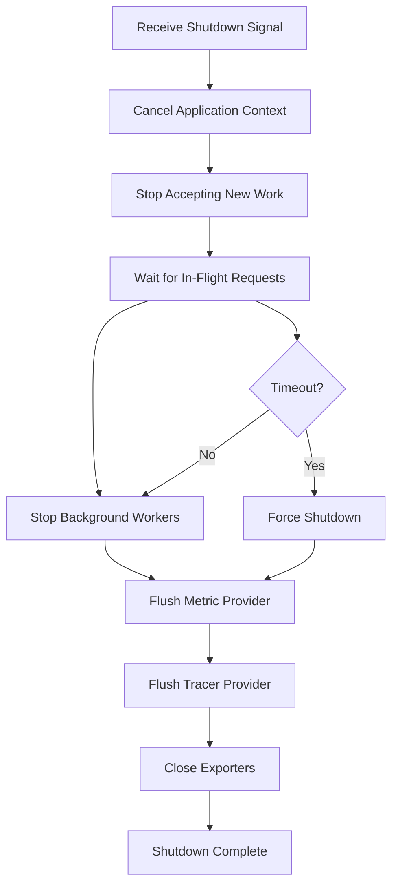

# How to Implement Graceful Shutdown for OpenTelemetry in Go Applications

Author: [nawazdhandala](https://www.github.com/nawazdhandala)

Tags: OpenTelemetry, Go, Graceful Shutdown, Lifecycle, Best Practices

Description: Master graceful shutdown patterns for OpenTelemetry in Go to ensure all telemetry data is exported before application termination and prevent data loss.

Applications terminate for many reasons: deployments, scaling events, crashes, or manual stops. When an application exits without properly shutting down OpenTelemetry, in-flight telemetry data gets lost. Traces disappear mid-execution, metrics never reach your backend, and logs vanish before export. This data loss makes debugging production issues nearly impossible.

Graceful shutdown ensures OpenTelemetry components flush all pending data before the application terminates. The tracer provider exports remaining spans, the meter provider sends final metrics, and log processors write buffered logs. Implementing proper shutdown requires coordinating multiple components, handling timeouts, and managing concurrent operations.

This guide covers graceful shutdown patterns for Go applications using OpenTelemetry, from basic implementations to production-ready solutions that handle complex scenarios.

## Why Graceful Shutdown Matters

OpenTelemetry components buffer telemetry data before export. Tracers batch spans to reduce network overhead, meter readers collect metrics at intervals, and log processors aggregate logs. When an application terminates abruptly, this buffered data remains unprocessed.

**Data Loss** occurs when applications exit before exporters send buffered data. That critical trace showing why your service failed? Lost. The metric spike indicating resource exhaustion? Missing. The error log explaining the crash? Never recorded.

**Incomplete Traces** result when parent spans export but child spans remain buffered. You see a request started but never completed, making it impossible to determine if the operation succeeded or where it failed.

**Metric Accuracy** suffers when final measurements never reach your backend. Cumulative counters miss their last values, gauges show stale readings, and histograms lack the data points that would reveal the actual distribution.

**Resource Leaks** happen when OpenTelemetry components maintain connections, file handles, or goroutines that never clean up properly.

## Basic Shutdown Pattern

Start with a simple shutdown implementation:

```go
package main

import (
    "context"
    "log"
    "time"

    "go.opentelemetry.io/otel"
    "go.opentelemetry.io/otel/exporters/otlp/otlptrace/otlptracegrpc"
    "go.opentelemetry.io/otel/sdk/resource"
    sdktrace "go.opentelemetry.io/otel/sdk/trace"
    semconv "go.opentelemetry.io/otel/semconv/v1.24.0"
)

func main() {
    ctx := context.Background()

    // Initialize OpenTelemetry
    tp, err := initTracer(ctx)
    if err != nil {
        log.Fatal(err)
    }

    // Ensure tracer provider shuts down gracefully
    // defer ensures shutdown happens even if main() panics
    defer func() {
        // Create shutdown context with timeout
        shutdownCtx, cancel := context.WithTimeout(context.Background(), 10*time.Second)
        defer cancel()

        // Shutdown flushes all pending spans
        if err := tp.Shutdown(shutdownCtx); err != nil {
            log.Printf("Error shutting down tracer provider: %v", err)
        }
    }()

    // Run your application
    runApplication()
}

func initTracer(ctx context.Context) (*sdktrace.TracerProvider, error) {
    exporter, err := otlptracegrpc.New(ctx,
        otlptracegrpc.WithEndpoint("localhost:4317"),
        otlptracegrpc.WithInsecure(),
    )
    if err != nil {
        return nil, err
    }

    res, err := resource.New(ctx,
        resource.WithAttributes(
            semconv.ServiceNameKey.String("my-service"),
        ),
    )
    if err != nil {
        return nil, err
    }

    tp := sdktrace.NewTracerProvider(
        sdktrace.WithBatcher(exporter),
        sdktrace.WithResource(res),
    )

    otel.SetTracerProvider(tp)
    return tp, nil
}
```

This pattern ensures the tracer provider shuts down when `main()` returns. The timeout prevents hanging if export takes too long.

## Handling Multiple Providers

Production applications use traces, metrics, and logs. Coordinate shutdown across all providers:

```go
package telemetry

import (
    "context"
    "fmt"
    "time"

    "go.opentelemetry.io/otel"
    "go.opentelemetry.io/otel/exporters/otlp/otlpmetric/otlpmetricgrpc"
    "go.opentelemetry.io/otel/exporters/otlp/otlptrace/otlptracegrpc"
    "go.opentelemetry.io/otel/sdk/metric"
    "go.opentelemetry.io/otel/sdk/resource"
    sdktrace "go.opentelemetry.io/otel/sdk/trace"
)

// TelemetryShutdown manages shutdown for all OpenTelemetry providers
type TelemetryShutdown struct {
    tracerProvider *sdktrace.TracerProvider
    meterProvider  *metric.MeterProvider
}

// InitTelemetry initializes all OpenTelemetry components
func InitTelemetry(ctx context.Context, serviceName string) (*TelemetryShutdown, error) {
    res, err := createResource(ctx, serviceName)
    if err != nil {
        return nil, err
    }

    // Initialize tracing
    tp, err := initTracerProvider(ctx, res)
    if err != nil {
        return nil, err
    }
    otel.SetTracerProvider(tp)

    // Initialize metrics
    mp, err := initMeterProvider(ctx, res)
    if err != nil {
        // Clean up tracer provider on error
        tp.Shutdown(ctx)
        return nil, err
    }
    otel.SetMeterProvider(mp)

    return &TelemetryShutdown{
        tracerProvider: tp,
        meterProvider:  mp,
    }, nil
}

// Shutdown gracefully shuts down all telemetry providers
// It shuts down providers in reverse initialization order
func (ts *TelemetryShutdown) Shutdown(ctx context.Context) error {
    var errs []error

    // Shutdown meter provider first to stop metric collection
    if ts.meterProvider != nil {
        if err := ts.meterProvider.Shutdown(ctx); err != nil {
            errs = append(errs, fmt.Errorf("meter provider shutdown: %w", err))
        }
    }

    // Shutdown tracer provider to flush remaining spans
    if ts.tracerProvider != nil {
        if err := ts.tracerProvider.Shutdown(ctx); err != nil {
            errs = append(errs, fmt.Errorf("tracer provider shutdown: %w", err))
        }
    }

    if len(errs) > 0 {
        return fmt.Errorf("shutdown errors: %v", errs)
    }

    return nil
}

func initTracerProvider(ctx context.Context, res *resource.Resource) (*sdktrace.TracerProvider, error) {
    exporter, err := otlptracegrpc.New(ctx,
        otlptracegrpc.WithEndpoint("localhost:4317"),
        otlptracegrpc.WithInsecure(),
    )
    if err != nil {
        return nil, err
    }

    tp := sdktrace.NewTracerProvider(
        sdktrace.WithBatcher(exporter,
            // Configure batching for faster shutdown
            sdktrace.WithBatchTimeout(2*time.Second),
            sdktrace.WithMaxExportBatchSize(512),
        ),
        sdktrace.WithResource(res),
    )

    return tp, nil
}

func initMeterProvider(ctx context.Context, res *resource.Resource) (*metric.MeterProvider, error) {
    exporter, err := otlpmetricgrpc.New(ctx,
        otlpmetricgrpc.WithEndpoint("localhost:4317"),
        otlpmetricgrpc.WithInsecure(),
    )
    if err != nil {
        return nil, err
    }

    mp := metric.NewMeterProvider(
        metric.WithReader(
            metric.NewPeriodicReader(exporter,
                metric.WithInterval(15*time.Second),
            ),
        ),
        metric.WithResource(res),
    )

    return mp, nil
}

func createResource(ctx context.Context, serviceName string) (*resource.Resource, error) {
    return resource.New(ctx,
        resource.WithAttributes(
            semconv.ServiceNameKey.String(serviceName),
        ),
    )
}
```

Use this in your application:

```go
package main

import (
    "context"
    "log"
    "time"

    "your-app/telemetry"
)

func main() {
    ctx := context.Background()

    // Initialize all telemetry
    shutdown, err := telemetry.InitTelemetry(ctx, "my-service")
    if err != nil {
        log.Fatal(err)
    }

    // Ensure graceful shutdown
    defer func() {
        shutdownCtx, cancel := context.WithTimeout(context.Background(), 15*time.Second)
        defer cancel()

        if err := shutdown.Shutdown(shutdownCtx); err != nil {
            log.Printf("Shutdown error: %v", err)
        }
    }()

    runApplication()
}
```

## Signal-Based Shutdown

Production services need to handle OS signals for graceful termination:

```go
package main

import (
    "context"
    "log"
    "os"
    "os/signal"
    "syscall"
    "time"

    "your-app/telemetry"
)

func main() {
    ctx, cancel := context.WithCancel(context.Background())
    defer cancel()

    // Initialize telemetry
    shutdown, err := telemetry.InitTelemetry(ctx, "my-service")
    if err != nil {
        log.Fatal(err)
    }

    // Setup signal handling
    sigChan := make(chan os.Signal, 1)
    signal.Notify(sigChan, os.Interrupt, syscall.SIGTERM)

    // Run application in goroutine
    errChan := make(chan error, 1)
    go func() {
        errChan <- runApplication(ctx)
    }()

    // Wait for shutdown signal or application error
    select {
    case sig := <-sigChan:
        log.Printf("Received signal: %v", sig)
        cancel() // Cancel application context
    case err := <-errChan:
        if err != nil {
            log.Printf("Application error: %v", err)
        }
    }

    // Perform graceful shutdown
    log.Println("Shutting down...")
    shutdownCtx, shutdownCancel := context.WithTimeout(context.Background(), 30*time.Second)
    defer shutdownCancel()

    if err := shutdown.Shutdown(shutdownCtx); err != nil {
        log.Printf("Telemetry shutdown error: %v", err)
        os.Exit(1)
    }

    log.Println("Shutdown complete")
}

func runApplication(ctx context.Context) error {
    // Application logic runs until context cancels
    <-ctx.Done()
    return ctx.Err()
}
```

## HTTP Server Shutdown

Web services need to drain connections before shutting down telemetry:

```go
package main

import (
    "context"
    "log"
    "net/http"
    "os"
    "os/signal"
    "syscall"
    "time"

    "your-app/telemetry"
)

func main() {
    ctx := context.Background()

    // Initialize telemetry
    shutdown, err := telemetry.InitTelemetry(ctx, "web-service")
    if err != nil {
        log.Fatal(err)
    }

    // Create HTTP server
    mux := http.NewServeMux()
    mux.HandleFunc("/health", healthHandler)
    mux.HandleFunc("/api/data", dataHandler)

    server := &http.Server{
        Addr:    ":8080",
        Handler: mux,
    }

    // Start server in goroutine
    go func() {
        log.Println("Server starting on :8080")
        if err := server.ListenAndServe(); err != http.ErrServerClosed {
            log.Fatalf("Server error: %v", err)
        }
    }()

    // Wait for shutdown signal
    sigChan := make(chan os.Signal, 1)
    signal.Notify(sigChan, os.Interrupt, syscall.SIGTERM)
    <-sigChan

    log.Println("Shutdown signal received")

    // Create shutdown context with timeout
    shutdownCtx, cancel := context.WithTimeout(context.Background(), 30*time.Second)
    defer cancel()

    // Shutdown HTTP server first to stop accepting requests
    log.Println("Stopping HTTP server...")
    if err := server.Shutdown(shutdownCtx); err != nil {
        log.Printf("HTTP server shutdown error: %v", err)
    }

    // All requests completed, now shutdown telemetry
    log.Println("Flushing telemetry...")
    if err := shutdown.Shutdown(shutdownCtx); err != nil {
        log.Printf("Telemetry shutdown error: %v", err)
        os.Exit(1)
    }

    log.Println("Shutdown complete")
}
```

## Worker Pool Shutdown

Applications with background workers need coordinated shutdown:

```go
package worker

import (
    "context"
    "log"
    "sync"
    "time"

    "go.opentelemetry.io/otel"
    "go.opentelemetry.io/otel/trace"
)

// WorkerPool manages concurrent workers with graceful shutdown
type WorkerPool struct {
    workers int
    jobs    chan Job
    wg      sync.WaitGroup
    tracer  trace.Tracer
}

type Job struct {
    ID   string
    Data interface{}
}

// NewWorkerPool creates a worker pool
func NewWorkerPool(workers int) *WorkerPool {
    return &WorkerPool{
        workers: workers,
        jobs:    make(chan Job, 100),
        tracer:  otel.Tracer("worker-pool"),
    }
}

// Start begins worker goroutines
func (wp *WorkerPool) Start(ctx context.Context) {
    for i := 0; i < wp.workers; i++ {
        wp.wg.Add(1)
        go wp.worker(ctx, i)
    }
}

// worker processes jobs until context cancels
func (wp *WorkerPool) worker(ctx context.Context, id int) {
    defer wp.wg.Done()

    log.Printf("Worker %d started", id)

    for {
        select {
        case <-ctx.Done():
            log.Printf("Worker %d stopping", id)
            return
        case job, ok := <-wp.jobs:
            if !ok {
                // Jobs channel closed
                return
            }
            wp.processJob(ctx, job)
        }
    }
}

// processJob handles a single job with tracing
func (wp *WorkerPool) processJob(ctx context.Context, job Job) {
    ctx, span := wp.tracer.Start(ctx, "worker.process_job")
    defer span.End()

    // Process the job
    time.Sleep(100 * time.Millisecond)
}

// Shutdown gracefully stops all workers
func (wp *WorkerPool) Shutdown(timeout time.Duration) error {
    log.Println("Shutting down worker pool...")

    // Close jobs channel to signal no more work
    close(wp.jobs)

    // Wait for workers to finish with timeout
    done := make(chan struct{})
    go func() {
        wp.wg.Wait()
        close(done)
    }()

    select {
    case <-done:
        log.Println("All workers stopped gracefully")
        return nil
    case <-time.After(timeout):
        return fmt.Errorf("worker shutdown timeout after %v", timeout)
    }
}
```

Integrate worker pool shutdown:

```go
package main

import (
    "context"
    "log"
    "os"
    "os/signal"
    "syscall"
    "time"

    "your-app/telemetry"
    "your-app/worker"
)

func main() {
    ctx, cancel := context.WithCancel(context.Background())
    defer cancel()

    // Initialize telemetry
    shutdown, err := telemetry.InitTelemetry(ctx, "worker-service")
    if err != nil {
        log.Fatal(err)
    }

    // Create and start worker pool
    pool := worker.NewWorkerPool(10)
    pool.Start(ctx)

    // Wait for shutdown signal
    sigChan := make(chan os.Signal, 1)
    signal.Notify(sigChan, os.Interrupt, syscall.SIGTERM)
    <-sigChan

    log.Println("Shutdown initiated")

    // Cancel context to stop workers
    cancel()

    // Shutdown worker pool with timeout
    if err := pool.Shutdown(10 * time.Second); err != nil {
        log.Printf("Worker pool shutdown error: %v", err)
    }

    // Shutdown telemetry after workers stop
    shutdownCtx, shutdownCancel := context.WithTimeout(context.Background(), 15*time.Second)
    defer shutdownCancel()

    if err := shutdown.Shutdown(shutdownCtx); err != nil {
        log.Printf("Telemetry shutdown error: %v", err)
        os.Exit(1)
    }

    log.Println("Shutdown complete")
}
```

## Handling Panics During Shutdown

Ensure telemetry flushes even when the application panics:

```go
package main

import (
    "context"
    "log"
    "time"

    "your-app/telemetry"
)

func main() {
    ctx := context.Background()

    shutdown, err := telemetry.InitTelemetry(ctx, "my-service")
    if err != nil {
        log.Fatal(err)
    }

    // Setup panic recovery that ensures shutdown
    defer func() {
        if r := recover(); r != nil {
            log.Printf("Panic recovered: %v", r)

            // Still attempt graceful shutdown
            shutdownCtx, cancel := context.WithTimeout(context.Background(), 10*time.Second)
            defer cancel()

            if err := shutdown.Shutdown(shutdownCtx); err != nil {
                log.Printf("Shutdown error after panic: %v", err)
            }

            // Re-panic after cleanup
            panic(r)
        }
    }()

    // Normal shutdown path
    defer func() {
        shutdownCtx, cancel := context.WithTimeout(context.Background(), 10*time.Second)
        defer cancel()

        if err := shutdown.Shutdown(shutdownCtx); err != nil {
            log.Printf("Shutdown error: %v", err)
        }
    }()

    runApplication()
}
```

## Shutdown Flow Visualization



## Shutdown Best Practices

**Timeout Configuration**: Set shutdown timeouts based on your export configuration. If metrics collect every 30 seconds, allow at least 35 seconds for shutdown.

**Shutdown Order**: Shut down components in reverse initialization order. Stop metric collection before flushing traces to prevent incomplete data.

**Context Usage**: Use separate contexts for application logic and shutdown. Application context cancels to stop work, shutdown context controls cleanup timeout.

**Error Handling**: Log shutdown errors but don't panic. Partial shutdown is better than no shutdown.

**Testing**: Test shutdown paths regularly. Many shutdown bugs only appear under specific timing conditions.

**Resource Cleanup**: Ensure exporters close network connections and file handles. Resource leaks accumulate across deployments.

**Kubernetes Considerations**: Configure `terminationGracePeriodSeconds` longer than your shutdown timeout. Otherwise Kubernetes force-kills the pod before telemetry flushes.

**Monitoring**: Track shutdown duration metrics to detect when shutdown takes longer than expected.

## Production-Ready Shutdown

Here's a complete production-ready implementation:

```go
package main

import (
    "context"
    "fmt"
    "log"
    "os"
    "os/signal"
    "syscall"
    "time"

    "your-app/telemetry"
)

const (
    shutdownTimeout = 30 * time.Second
)

func main() {
    if err := run(); err != nil {
        log.Fatal(err)
    }
}

func run() error {
    ctx, cancel := context.WithCancel(context.Background())
    defer cancel()

    // Initialize telemetry
    shutdown, err := telemetry.InitTelemetry(ctx, "production-service")
    if err != nil {
        return fmt.Errorf("telemetry init: %w", err)
    }

    // Ensure shutdown on exit
    defer func() {
        shutdownCtx, shutdownCancel := context.WithTimeout(
            context.Background(),
            shutdownTimeout,
        )
        defer shutdownCancel()

        if err := shutdown.Shutdown(shutdownCtx); err != nil {
            log.Printf("Shutdown error: %v", err)
        }
    }()

    // Setup signal handling
    sigChan := make(chan os.Signal, 1)
    signal.Notify(sigChan, os.Interrupt, syscall.SIGTERM)

    // Run application
    errChan := make(chan error, 1)
    go func() {
        errChan <- runApplication(ctx)
    }()

    // Wait for completion or signal
    select {
    case err := <-errChan:
        return err
    case sig := <-sigChan:
        log.Printf("Received signal: %v", sig)
        cancel()
        // Wait a bit for graceful completion
        time.Sleep(1 * time.Second)
        return nil
    }
}
```

Graceful shutdown is essential for maintaining telemetry data integrity. Without it, you lose critical observability data precisely when you need it most. Implement these patterns to ensure every trace, metric, and log reaches your backend before your application exits.
