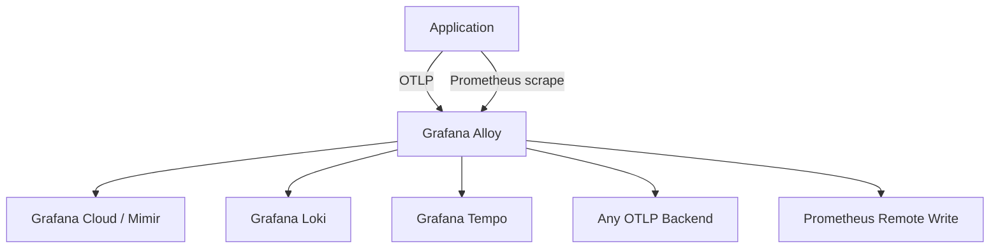
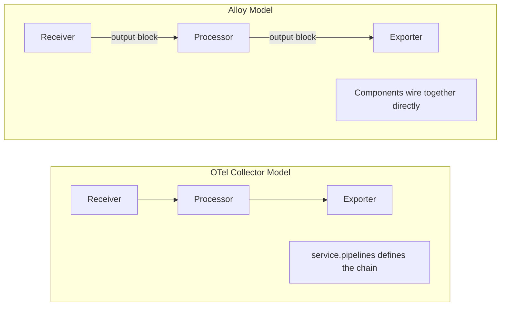

# How to Use Grafana Alloy as an OpenTelemetry Collector Alternative

Author: [nawazdhandala](https://www.github.com/nawazdhandala)

Tags: OpenTelemetry, Grafana, Alloy, Observability, Monitoring, Prometheus

Description: Learn how to set up Grafana Alloy as an alternative to the OpenTelemetry Collector with practical configuration examples and pipeline comparisons.

---

Grafana Alloy is Grafana Labs' telemetry collector that supports OpenTelemetry, Prometheus, Loki, and Pyroscope natively. It replaces the older Grafana Agent and brings a new configuration language called River (now just called Alloy configuration syntax) that is quite different from the YAML-based config used by the standard OpenTelemetry Collector.

If you are in the Grafana ecosystem, Alloy is a strong option. But it works as a general-purpose collector too, and you can send data to any OTLP-compatible backend. Let's walk through how to set it up and how it compares to the upstream OpenTelemetry Collector.

## How Alloy Fits In

Alloy is not a fork of the OpenTelemetry Collector. It is a separate codebase that wraps OpenTelemetry Collector components using its own configuration syntax. Think of it as a different frontend to many of the same underlying components.



## Installing Alloy

### On Linux

Install Alloy using the Grafana APT or RPM repository:

```bash
# Add the Grafana GPG key and repository
sudo mkdir -p /etc/apt/keyrings/
wget -q -O - https://apt.grafana.com/gpg.key | gpg --dearmor | sudo tee /etc/apt/keyrings/grafana.gpg > /dev/null
echo "deb [signed-by=/etc/apt/keyrings/grafana.gpg] https://apt.grafana.com stable main" | sudo tee /etc/apt/sources.list.d/grafana.list

# Install Alloy
sudo apt-get update
sudo apt-get install -y alloy
```

### On Kubernetes with Helm

Deploy Alloy as a DaemonSet in your Kubernetes cluster:

```bash
# Add the Grafana Helm repository
helm repo add grafana https://grafana.github.io/helm-charts
helm repo update

# Install Alloy with default settings
helm install alloy grafana/alloy \
  --namespace monitoring \
  --create-namespace
```

### Using Docker

Run Alloy in a container for local testing:

```bash
# Run Alloy with a custom config file mounted in
docker run -d \
  --name alloy \
  -p 4317:4317 \
  -p 4318:4318 \
  -p 12345:12345 \
  -v ./config.alloy:/etc/alloy/config.alloy \
  grafana/alloy:latest \
  run /etc/alloy/config.alloy
```

## Alloy Configuration Syntax

The biggest difference from the OTel Collector is the configuration language. Instead of YAML pipelines, Alloy uses a block-based syntax where components are connected explicitly.

Here is a basic pipeline that receives OTLP data and exports it to an OTLP endpoint:

```hcl
// Accept incoming OTLP traces and metrics over gRPC
otelcol.receiver.otlp "default" {
  grpc {
    endpoint = "0.0.0.0:4317"
  }
  http {
    endpoint = "0.0.0.0:4318"
  }

  // Forward received data to the batch processor
  output {
    traces  = [otelcol.processor.batch.default.input]
    metrics = [otelcol.processor.batch.default.input]
    logs    = [otelcol.processor.batch.default.input]
  }
}

// Batch telemetry before exporting to reduce network calls
otelcol.processor.batch "default" {
  timeout = "5s"
  send_batch_size = 1024

  // Forward batched data to the OTLP exporter
  output {
    traces  = [otelcol.exporter.otlphttp.backend.input]
    metrics = [otelcol.exporter.otlphttp.backend.input]
    logs    = [otelcol.exporter.otlphttp.backend.input]
  }
}

// Export to an OTLP-compatible backend like OneUptime
otelcol.exporter.otlphttp "backend" {
  client {
    endpoint = "https://otlp.oneuptime.com"
    headers = {
      "x-oneuptime-token" = "your-token-here",
    }
  }
}
```

## Equivalent OTel Collector Config

For comparison, here is the same pipeline using the standard OTel Collector YAML syntax:

```yaml
# Standard OTel Collector config for the same pipeline
receivers:
  otlp:
    protocols:
      grpc:
        endpoint: 0.0.0.0:4317
      http:
        endpoint: 0.0.0.0:4318

processors:
  batch:
    timeout: 5s
    send_batch_size: 1024

exporters:
  otlphttp:
    endpoint: https://otlp.oneuptime.com
    headers:
      x-oneuptime-token: "your-token-here"

service:
  pipelines:
    traces:
      receivers: [otlp]
      processors: [batch]
      exporters: [otlphttp]
    metrics:
      receivers: [otlp]
      processors: [batch]
      exporters: [otlphttp]
    logs:
      receivers: [otlp]
      processors: [batch]
      exporters: [otlphttp]
```

## The Pipeline Model Difference

The OTel Collector defines pipelines in a `service` block where you list receivers, processors, and exporters by name. Alloy connects components directly through output blocks. Each component references the next one in the chain.



This direct wiring in Alloy makes it easier to build complex pipelines where data fans out to different processors or exporters based on signal type.

## Prometheus Scraping with Alloy

One area where Alloy really shines is Prometheus scraping. Since it has native Prometheus support, you can scrape Prometheus metrics and convert them to OTLP in one collector.

This config scrapes Prometheus targets and exports the metrics as OTLP:

```hcl
// Discover Kubernetes pods that have Prometheus annotations
discovery.kubernetes "pods" {
  role = "pod"
}

// Filter for pods that have the prometheus.io/scrape annotation
discovery.relabel "prometheus_pods" {
  targets = discovery.kubernetes.pods.targets

  rule {
    source_labels = ["__meta_kubernetes_pod_annotation_prometheus_io_scrape"]
    regex         = "true"
    action        = "keep"
  }

  rule {
    source_labels = ["__meta_kubernetes_pod_annotation_prometheus_io_port"]
    target_label  = "__address__"
    regex         = "(.+)"
    replacement   = "${1}"
  }
}

// Scrape the discovered targets
prometheus.scrape "pods" {
  targets    = discovery.relabel.prometheus_pods.output
  forward_to = [prometheus.remote_write.mimir.receiver]
}

// Send scraped metrics to Grafana Mimir or any Prometheus remote write endpoint
prometheus.remote_write "mimir" {
  endpoint {
    url = "https://mimir.example.com/api/v1/push"
  }
}
```

## Converting Prometheus Metrics to OTLP

You can also take Prometheus metrics and route them through the OTLP pipeline. This is handy when you want to send Prometheus metrics to an OTLP backend:

```hcl
// Scrape a local Prometheus target
prometheus.scrape "app" {
  targets = [
    {"__address__" = "localhost:9090"},
  ]
  // Send to the converter instead of remote write
  forward_to = [otelcol.receiver.prometheus.default.receiver]
}

// Convert Prometheus metrics into OTLP format
otelcol.receiver.prometheus "default" {
  output {
    metrics = [otelcol.processor.batch.default.input]
  }
}

// Batch before exporting
otelcol.processor.batch "default" {
  timeout = "10s"

  output {
    metrics = [otelcol.exporter.otlphttp.backend.input]
  }
}

// Export as OTLP
otelcol.exporter.otlphttp "backend" {
  client {
    endpoint = "https://otlp.oneuptime.com"
  }
}
```

## Alloy's Built-in UI

Alloy ships with a built-in web UI on port 12345 that lets you visualize the component graph, check component health, and debug pipeline issues. The OTel Collector has an extension for this (`zpages`), but Alloy's UI is more polished.

Access it at `http://localhost:12345` after starting Alloy.

## Kubernetes DaemonSet Deployment

Here is a full Alloy configuration for a Kubernetes DaemonSet that collects traces, metrics, and logs:

```hcl
// Receive OTLP from application pods
otelcol.receiver.otlp "default" {
  grpc {
    endpoint = "0.0.0.0:4317"
  }
  http {
    endpoint = "0.0.0.0:4318"
  }

  output {
    traces  = [otelcol.processor.k8sattributes.default.input]
    metrics = [otelcol.processor.k8sattributes.default.input]
    logs    = [otelcol.processor.k8sattributes.default.input]
  }
}

// Enrich telemetry with Kubernetes metadata like pod name and namespace
otelcol.processor.k8sattributes "default" {
  extract {
    metadata = [
      "k8s.pod.name",
      "k8s.namespace.name",
      "k8s.deployment.name",
      "k8s.node.name",
    ]
  }

  output {
    traces  = [otelcol.processor.batch.default.input]
    metrics = [otelcol.processor.batch.default.input]
    logs    = [otelcol.processor.batch.default.input]
  }
}

// Batch data before sending
otelcol.processor.batch "default" {
  timeout         = "5s"
  send_batch_size = 2048

  output {
    traces  = [otelcol.exporter.otlphttp.primary.input]
    metrics = [otelcol.exporter.otlphttp.primary.input]
    logs    = [otelcol.exporter.otlphttp.primary.input]
  }
}

// Export everything to the backend
otelcol.exporter.otlphttp "primary" {
  client {
    endpoint = "https://otlp.oneuptime.com"
    headers = {
      "x-oneuptime-token" = env("ONEUPTIME_TOKEN"),
    }
  }
}
```

## Alloy vs Upstream OTel Collector

| Feature | Grafana Alloy | Upstream OTel Collector |
|---------|--------------|------------------------|
| Config language | HCL-like (River/Alloy) | YAML |
| Prometheus native | Yes | Via receiver only |
| Loki native | Yes | Via exporter |
| Built-in UI | Yes (port 12345) | zpages extension |
| Component wiring | Explicit references | Pipeline declarations |
| Hot reload | Yes | Yes (with flag) |
| Community | Grafana community | OTel community |
| Vendor lock-in | Low (OTLP support) | None |

## When to Pick Alloy

Choose Grafana Alloy when:

- You are already using the Grafana stack (Mimir, Loki, Tempo)
- You need native Prometheus scraping alongside OTLP collection
- You prefer the component-graph configuration style
- You want a built-in UI for pipeline debugging

## When to Stick with Upstream

Stay with the upstream OTel Collector when:

- You want the standard YAML configuration that every OTel tutorial uses
- You need broad community support and documentation
- You are not using the Grafana stack
- You want to avoid learning a new configuration syntax

Both collectors are solid choices. Alloy just happens to integrate more tightly with the Grafana ecosystem while still supporting standard OTLP workflows.
