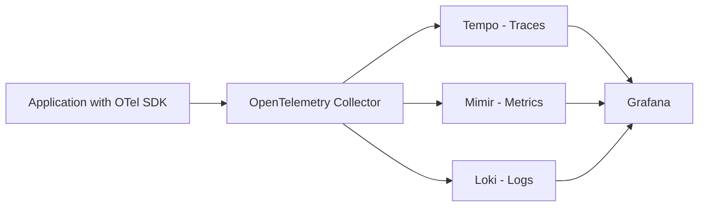
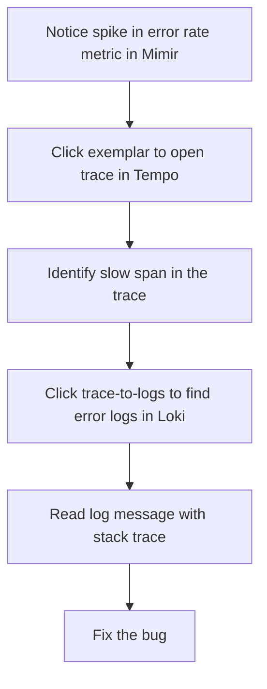

# How to Set Up Grafana with OpenTelemetry for Traces, Metrics, and Logs

Author: [nawazdhandala](https://www.github.com/nawazdhandala)

Tags: OpenTelemetry, Grafana, Observability, Traces, Metrics, Logs

Description: A practical guide to setting up Grafana with OpenTelemetry for unified observability across traces, metrics, and logs using the LGTM stack.

---

Grafana has become the go-to visualization platform for observability data. When you pair it with OpenTelemetry, you get a vendor-neutral pipeline that feeds traces, metrics, and logs into a single pane of glass. This guide walks you through the entire setup, from deploying the OpenTelemetry Collector to configuring Grafana data sources so you can correlate all three signal types in one dashboard.

## Why Grafana and OpenTelemetry Work Well Together

OpenTelemetry handles instrumentation and data collection. Grafana handles visualization. Neither tries to do the other's job, which makes the integration clean and predictable. OpenTelemetry gives you a single SDK and collector that emits traces, metrics, and logs in standardized formats. Grafana reads from multiple backends and lets you jump between signals seamlessly.

The typical architecture looks like this:



Your applications send telemetry to the OpenTelemetry Collector. The Collector routes traces to Tempo, metrics to Mimir, and logs to Loki. Grafana queries all three backends and displays them together.

## Prerequisites

Before starting, make sure you have Docker and Docker Compose installed. We will use containers for every component. You also need a basic application instrumented with an OpenTelemetry SDK. If you do not have one yet, any simple HTTP server with the OTel auto-instrumentation agent will work.

## Setting Up the OpenTelemetry Collector

The Collector is the central hub. It receives data from your applications and exports it to the right backends. Here is a configuration file that handles all three signals.

```yaml
# otel-collector-config.yaml
# This config receives OTLP data and routes traces, metrics, and logs
# to their respective Grafana backends.

receivers:
  otlp:
    protocols:
      grpc:
        endpoint: 0.0.0.0:4317
      http:
        endpoint: 0.0.0.0:4318

processors:
  batch:
    # Batch telemetry before sending to reduce network overhead
    send_batch_size: 1024
    timeout: 5s

  resource:
    attributes:
      - key: service.environment
        value: production
        action: upsert

exporters:
  otlphttp/tempo:
    # Send traces to Grafana Tempo
    endpoint: http://tempo:4318

  prometheusremotewrite:
    # Send metrics to Grafana Mimir using Prometheus remote write
    endpoint: http://mimir:9009/api/v1/push

  loki:
    # Send logs to Grafana Loki
    endpoint: http://loki:3100/loki/api/v1/push

service:
  pipelines:
    traces:
      receivers: [otlp]
      processors: [batch, resource]
      exporters: [otlphttp/tempo]
    metrics:
      receivers: [otlp]
      processors: [batch, resource]
      exporters: [prometheusremotewrite]
    logs:
      receivers: [otlp]
      processors: [batch, resource]
      exporters: [loki]
```

The key thing here is that each pipeline maps one signal type to one exporter. Traces go to Tempo, metrics go to Mimir via Prometheus remote write, and logs go to Loki. The batch processor groups data before sending it out, which reduces the number of network calls and improves throughput.

## Docker Compose for the Full Stack

Here is a Docker Compose file that brings up every component. This gives you a working local environment in a single command.

```yaml
# docker-compose.yaml
# Launches the full Grafana + OTel observability stack

version: "3.8"

services:
  otel-collector:
    image: otel/opentelemetry-collector-contrib:latest
    # Mount the collector config we defined above
    volumes:
      - ./otel-collector-config.yaml:/etc/otelcol-contrib/config.yaml
    ports:
      - "4317:4317"   # OTLP gRPC receiver
      - "4318:4318"   # OTLP HTTP receiver
    depends_on:
      - tempo
      - mimir
      - loki

  tempo:
    image: grafana/tempo:latest
    # Tempo config for receiving OTLP traces
    command: ["-config.file=/etc/tempo.yaml"]
    volumes:
      - ./tempo-config.yaml:/etc/tempo.yaml
    ports:
      - "3200:3200"   # Tempo query frontend

  mimir:
    image: grafana/mimir:latest
    # Mimir config for receiving Prometheus remote write metrics
    command: ["-config.file=/etc/mimir.yaml", "-target=all"]
    volumes:
      - ./mimir-config.yaml:/etc/mimir.yaml
    ports:
      - "9009:9009"   # Mimir HTTP API

  loki:
    image: grafana/loki:latest
    # Loki config for receiving logs
    command: ["-config.file=/etc/loki.yaml"]
    volumes:
      - ./loki-config.yaml:/etc/loki.yaml
    ports:
      - "3100:3100"   # Loki HTTP API

  grafana:
    image: grafana/grafana:latest
    # Pre-provision data sources so Grafana is ready on first boot
    volumes:
      - ./grafana-datasources.yaml:/etc/grafana/provisioning/datasources/datasources.yaml
    ports:
      - "3000:3000"   # Grafana web UI
    environment:
      - GF_SECURITY_ADMIN_PASSWORD=admin
    depends_on:
      - tempo
      - mimir
      - loki
```

Run `docker-compose up -d` and all five services will start. The Collector listens on ports 4317 and 4318 for incoming telemetry. Grafana will be available at `http://localhost:3000`.

## Configuring Grafana Data Sources

You can configure data sources through the Grafana UI, but provisioning them via a YAML file is more reproducible. Here is a provisioning file that connects Grafana to all three backends.

```yaml
# grafana-datasources.yaml
# Provisions Tempo, Mimir, and Loki as data sources in Grafana

apiVersion: 1

datasources:
  - name: Tempo
    type: tempo
    access: proxy
    # Points Grafana to the Tempo query frontend
    url: http://tempo:3200
    jsonData:
      tracesToMetrics:
        datasourceUid: mimir
      tracesToLogs:
        datasourceUid: loki
        tags: ['service.name']

  - name: Mimir
    type: prometheus
    access: proxy
    # Mimir is Prometheus-compatible, so use the Prometheus data source type
    url: http://mimir:9009/prometheus
    jsonData:
      exemplarTraceIdDestinations:
        - name: traceID
          datasourceUid: tempo

  - name: Loki
    type: loki
    access: proxy
    # Points Grafana to the Loki API
    url: http://loki:3100
    jsonData:
      derivedFields:
        - datasourceUid: tempo
          matcherRegex: "traceID=(\\w+)"
          name: TraceID
          url: "$${__value.raw}"
```

This configuration does more than just connect data sources. It also sets up cross-signal correlation. The `tracesToMetrics` field on Tempo lets you jump from a trace to related metrics. The `tracesToLogs` field links traces to logs. The `exemplarTraceIdDestinations` on Mimir lets you click an exemplar on a metric chart and go straight to the trace. And the `derivedFields` on Loki extract trace IDs from log lines and link them back to Tempo.

## Correlating Signals in Grafana

Once everything is running, the real power shows up in how you can navigate between signals. Here is a typical debugging workflow:



You start with a metric that shows something is wrong. An exemplar on that metric contains a trace ID. Clicking it opens the full trace in Tempo, where you can see which span was slow or errored. From that span, you jump to Loki and see the actual log message, including the stack trace. This flow is only possible because all three backends share trace IDs and service names as common identifiers.

## Instrumenting Your Application

For the correlation to work, your application needs to emit all three signal types with consistent resource attributes. Here is a minimal Node.js setup using OpenTelemetry.

```javascript
// tracing.js
// Initializes the OpenTelemetry SDK with trace, metric, and log exporters

const { NodeSDK } = require('@opentelemetry/sdk-node');
const { OTLPTraceExporter } = require('@opentelemetry/exporter-trace-otlp-grpc');
const { OTLPMetricExporter } = require('@opentelemetry/exporter-metrics-otlp-grpc');
const { OTLPLogExporter } = require('@opentelemetry/exporter-logs-otlp-grpc');
const { PeriodicExportingMetricReader } = require('@opentelemetry/sdk-metrics');
const { SimpleLogRecordProcessor } = require('@opentelemetry/sdk-logs');

const sdk = new NodeSDK({
  // All exporters point to the OTel Collector on the default gRPC port
  traceExporter: new OTLPTraceExporter({
    url: 'http://localhost:4317',
  }),
  metricReader: new PeriodicExportingMetricReader({
    exporter: new OTLPMetricExporter({
      url: 'http://localhost:4317',
    }),
    // Export metrics every 15 seconds
    exportIntervalMillis: 15000,
  }),
  logRecordProcessor: new SimpleLogRecordProcessor(
    new OTLPLogExporter({
      url: 'http://localhost:4317',
    })
  ),
  // Resource attributes that tie all signals together
  resourceAttributes: {
    'service.name': 'my-web-app',
    'service.version': '1.0.0',
  },
});

// Start the SDK before your application code runs
sdk.start();
```

The critical detail is the `service.name` resource attribute. It must be the same across traces, metrics, and logs for Grafana to correlate them. Without it, clicking from a trace to logs will not find matching results.

## Verifying the Setup

After starting everything, send some traffic to your instrumented application and then check each backend.

For traces, open Grafana and navigate to the Explore view. Select the Tempo data source and search by service name. You should see traces appear within a few seconds.

For metrics, switch to the Mimir data source in the Explore view and run a PromQL query like `rate(http_server_request_duration_seconds_count[5m])`. If metrics are flowing, you will see results.

For logs, switch to the Loki data source and query `{service_name="my-web-app"}`. Your application logs should show up here.

If any signal is missing, check the Collector logs first. The Collector outputs clear error messages when it cannot reach a backend. Common issues include wrong endpoints, network connectivity between containers, and missing authentication headers in cloud-hosted environments.

## Production Considerations

This setup works great for local development and testing. For production, you should consider a few additional things. Run the Collector as a DaemonSet in Kubernetes so each node has its own instance. Use the memory limiter processor to prevent the Collector from consuming too much RAM. Enable TLS between the Collector and your backends. And configure proper storage backends for Tempo, Mimir, and Loki instead of relying on local filesystem storage, which does not scale.

Grafana paired with OpenTelemetry gives you a complete, vendor-neutral observability stack. The setup requires some initial configuration, but once the pieces are connected, you get seamless correlation between traces, metrics, and logs. That is the kind of observability that actually helps you debug production issues fast.
