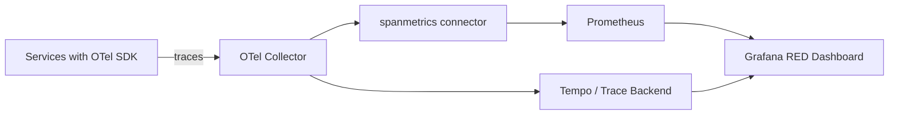

# How to Build a Grafana RED Metrics Dashboard (Rate, Errors, Duration) from OpenTelemetry Span Metrics

Author: [nawazdhandala](https://www.github.com/nawazdhandala)

Tags: OpenTelemetry, Grafana, RED Metrics, Span Metrics

Description: Build a complete Grafana dashboard displaying Rate, Errors, and Duration metrics derived from OpenTelemetry span data using the spanmetrics connector.

The RED method - Rate, Errors, Duration - is one of the most effective ways to monitor request-driven services. It answers three questions: how many requests are we handling, how many of those are failing, and how long do they take? OpenTelemetry traces already contain all of this information in span data. The spanmetrics connector in the Collector extracts it into Prometheus-compatible metrics that Grafana can visualize directly.

## Architecture



## Step 1: Configure the Spanmetrics Connector

The spanmetrics connector sits in the Collector pipeline and generates metrics from every span it processes. Configure it to produce histogram metrics with meaningful dimensions:

```yaml
# otel-collector-config.yaml
# Generate RED metrics from trace spans using the spanmetrics connector
receivers:
  otlp:
    protocols:
      grpc:
        endpoint: "0.0.0.0:4317"

connectors:
  spanmetrics:
    # Histogram buckets for duration measurement (in seconds)
    histogram:
      explicit:
        buckets: [0.005, 0.01, 0.025, 0.05, 0.1, 0.25, 0.5, 1.0, 2.5, 5.0, 10.0]
    # Dimensions to include as metric labels
    dimensions:
      - name: http.method
      - name: http.route
      - name: http.status_code
      - name: rpc.method
      - name: rpc.service
    # Only generate metrics from server and consumer spans (skip internal spans)
    dimensions_cache_size: 1000
    aggregation_temporality: "AGGREGATION_TEMPORALITY_CUMULATIVE"
    metrics_flush_interval: 15s

processors:
  batch:
    timeout: 10s

exporters:
  prometheus:
    endpoint: "0.0.0.0:8889"
    resource_to_telemetry_conversion:
      enabled: true
  otlp/tempo:
    endpoint: "tempo:4317"
    tls:
      insecure: true

service:
  pipelines:
    traces:
      receivers: [otlp]
      processors: [batch]
      exporters: [otlp/tempo, spanmetrics]
    metrics:
      receivers: [spanmetrics]
      processors: [batch]
      exporters: [prometheus]
```

The spanmetrics connector produces two key metrics:

- `duration_milliseconds_bucket` / `duration_milliseconds_count` / `duration_milliseconds_sum` - a histogram of span durations
- `calls_total` - a counter of span events with a `status.code` label

## Step 2: Build the Rate Panel

The Rate panel shows request throughput per second, broken down by service and optionally by endpoint. In Grafana, create a Time Series panel with this PromQL query:

```promql
# Request rate per second, grouped by service
# This uses the calls_total counter generated by spanmetrics
sum by (service_name) (
  rate(calls_total{span_kind="SPAN_KIND_SERVER"}[5m])
)
```

For a per-endpoint breakdown, add `http_route` to the grouping:

```promql
# Request rate per endpoint for a specific service
sum by (http_route) (
  rate(calls_total{
    service_name="checkout-service",
    span_kind="SPAN_KIND_SERVER"
  }[5m])
)
```

## Step 3: Build the Errors Panel

The Errors panel shows the error rate as a percentage of total requests. The spanmetrics connector labels errors with `status_code="STATUS_CODE_ERROR"`:

```promql
# Error rate as a percentage, grouped by service
100 * (
  sum by (service_name) (
    rate(calls_total{
      span_kind="SPAN_KIND_SERVER",
      status_code="STATUS_CODE_ERROR"
    }[5m])
  )
  /
  sum by (service_name) (
    rate(calls_total{
      span_kind="SPAN_KIND_SERVER"
    }[5m])
  )
)
```

For HTTP-specific error breakdown by status code:

```promql
# HTTP error rate broken down by status code family
sum by (service_name, http_status_code) (
  rate(calls_total{
    span_kind="SPAN_KIND_SERVER",
    http_status_code=~"5.."
  }[5m])
)
```

## Step 4: Build the Duration Panel

The Duration panel shows latency percentiles using the histogram data from spanmetrics. Use `histogram_quantile` to extract p50, p95, and p99:

```promql
# P50 latency (median) by service
histogram_quantile(0.5,
  sum by (service_name, le) (
    rate(duration_milliseconds_bucket{
      span_kind="SPAN_KIND_SERVER"
    }[5m])
  )
)
```

```promql
# P95 latency by service
histogram_quantile(0.95,
  sum by (service_name, le) (
    rate(duration_milliseconds_bucket{
      span_kind="SPAN_KIND_SERVER"
    }[5m])
  )
)
```

```promql
# P99 latency by service
histogram_quantile(0.99,
  sum by (service_name, le) (
    rate(duration_milliseconds_bucket{
      span_kind="SPAN_KIND_SERVER"
    }[5m])
  )
)
```

Display all three percentiles as separate series on the same panel. Set the Y-axis unit to milliseconds.

## Step 5: Provision the Dashboard as Code

Rather than building the dashboard manually in the Grafana UI, provision it as JSON. Here is the Grafana provisioning config and a condensed dashboard definition:

```yaml
# grafana/provisioning/dashboards/dashboards.yaml
# Tells Grafana to load dashboard JSON from a directory
apiVersion: 1
providers:
  - name: 'RED Metrics'
    orgId: 1
    folder: 'OpenTelemetry'
    type: file
    disableDeletion: false
    editable: true
    options:
      path: /var/lib/grafana/dashboards
      foldersFromFilesStructure: true
```

```json
{
  "dashboard": {
    "title": "RED Metrics - OpenTelemetry Span Metrics",
    "tags": ["opentelemetry", "red", "spanmetrics"],
    "templating": {
      "list": [
        {
          "name": "service",
          "type": "query",
          "query": "label_values(calls_total{span_kind=\"SPAN_KIND_SERVER\"}, service_name)",
          "refresh": 2
        }
      ]
    },
    "panels": [
      {
        "title": "Request Rate (req/s)",
        "type": "timeseries",
        "gridPos": {"h": 8, "w": 8, "x": 0, "y": 0},
        "targets": [
          {
            "expr": "sum by (service_name) (rate(calls_total{service_name=~\"$service\", span_kind=\"SPAN_KIND_SERVER\"}[5m]))",
            "legendFormat": "{{service_name}}"
          }
        ]
      },
      {
        "title": "Error Rate (%)",
        "type": "timeseries",
        "gridPos": {"h": 8, "w": 8, "x": 8, "y": 0},
        "targets": [
          {
            "expr": "100 * sum by (service_name) (rate(calls_total{service_name=~\"$service\", span_kind=\"SPAN_KIND_SERVER\", status_code=\"STATUS_CODE_ERROR\"}[5m])) / sum by (service_name) (rate(calls_total{service_name=~\"$service\", span_kind=\"SPAN_KIND_SERVER\"}[5m]))",
            "legendFormat": "{{service_name}}"
          }
        ]
      },
      {
        "title": "Latency Percentiles (ms)",
        "type": "timeseries",
        "gridPos": {"h": 8, "w": 8, "x": 16, "y": 0},
        "targets": [
          {
            "expr": "histogram_quantile(0.5, sum by (le) (rate(duration_milliseconds_bucket{service_name=~\"$service\", span_kind=\"SPAN_KIND_SERVER\"}[5m])))",
            "legendFormat": "p50"
          },
          {
            "expr": "histogram_quantile(0.95, sum by (le) (rate(duration_milliseconds_bucket{service_name=~\"$service\", span_kind=\"SPAN_KIND_SERVER\"}[5m])))",
            "legendFormat": "p95"
          },
          {
            "expr": "histogram_quantile(0.99, sum by (le) (rate(duration_milliseconds_bucket{service_name=~\"$service\", span_kind=\"SPAN_KIND_SERVER\"}[5m])))",
            "legendFormat": "p99"
          }
        ]
      }
    ]
  }
}
```

## Linking Panels to Traces

One of the strengths of building RED metrics from span data is that you can link back to the traces. In Grafana, configure a data link on each panel that opens Tempo filtered to the same service and time range. This lets an operator click on a latency spike in the RED dashboard and immediately see the actual traces that caused it. Set the data link URL to:

```
/explore?left={"datasource":"Tempo","queries":[{"refId":"A","queryType":"traceqlsearch","serviceName":"${__field.labels.service_name}"}],"range":{"from":"${__from}","to":"${__to}"}}
```

This closes the loop between aggregate metrics and individual request traces, giving you both the overview and the ability to drill into specific issues from a single dashboard.
