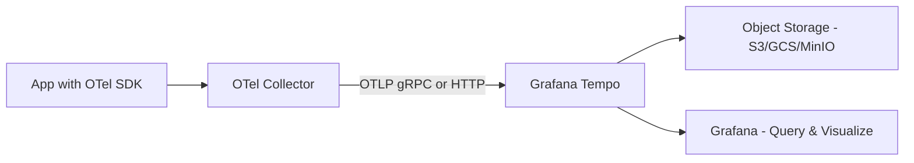

# How to Configure Grafana Tempo as an OpenTelemetry Trace Backend

Author: [nawazdhandala](https://www.github.com/nawazdhandala)

Tags: OpenTelemetry, Grafana Tempo, Distributed Tracing, Observability, Traces

Description: Learn how to configure Grafana Tempo as a trace backend for OpenTelemetry, including Collector setup, storage options, and querying traces.

---

Grafana Tempo is a distributed tracing backend that stores traces at scale without requiring an index. Unlike older tracing systems like Jaeger or Zipkin that need Elasticsearch or Cassandra for indexing, Tempo uses object storage directly and relies on trace IDs for lookups. This makes it cheap to operate and simple to maintain. In this guide, we will set up Tempo as the trace backend for an OpenTelemetry pipeline.

## How Tempo Fits into the OpenTelemetry Ecosystem

Tempo natively speaks OTLP (OpenTelemetry Protocol). Your instrumented applications send traces through the OpenTelemetry Collector, which forwards them to Tempo over OTLP. Grafana then queries Tempo to display traces. The architecture is straightforward.



Tempo accepts traces via several protocols, including OTLP, Jaeger, and Zipkin. We will focus on OTLP since that is the native OpenTelemetry format and gives you the best compatibility.

## Setting Up Grafana Tempo

Let's start with the Tempo configuration. Tempo needs a config file that defines how it receives traces, where it stores them, and how queries are handled.

```yaml
# tempo-config.yaml
# Configures Tempo to receive OTLP traces and store them locally

server:
  http_listen_port: 3200

distributor:
  receivers:
    otlp:
      protocols:
        # Accept traces over both gRPC and HTTP
        grpc:
          endpoint: 0.0.0.0:4317
        http:
          endpoint: 0.0.0.0:4318

ingester:
  # How long traces stay in the ingester before being flushed to storage
  max_block_duration: 5m

compactor:
  compaction:
    # Merge small blocks into larger ones for better query performance
    block_retention: 48h

storage:
  trace:
    backend: local
    # Local storage is fine for development and testing
    local:
      path: /var/tempo/traces
    wal:
      # Write-ahead log ensures data durability
      path: /var/tempo/wal

metrics_generator:
  # Generate RED metrics from traces automatically
  registry:
    external_labels:
      source: tempo
  storage:
    path: /var/tempo/generator/wal
    remote_write:
      # Send generated metrics to a Prometheus-compatible backend
      - url: http://mimir:9009/api/v1/push
        send_exemplars: true

overrides:
  defaults:
    metrics_generator:
      processors: [service-graphs, span-metrics]
```

A few things to note here. The `distributor` section configures the OTLP receiver directly inside Tempo, which means you can send traces to Tempo without going through the OpenTelemetry Collector at all. However, using the Collector is still recommended because it gives you processing capabilities like batching, sampling, and attribute manipulation. The `metrics_generator` section is optional but very useful. It automatically creates service graph and span metrics from your traces and pushes them to Mimir or Prometheus.

## Configuring the OpenTelemetry Collector for Tempo

While Tempo can receive OTLP directly, routing through the OpenTelemetry Collector gives you more control. Here is a Collector configuration focused on the trace pipeline.

```yaml
# otel-collector-config.yaml
# Routes traces through the Collector to Tempo with tail sampling

receivers:
  otlp:
    protocols:
      grpc:
        endpoint: 0.0.0.0:4317
      http:
        endpoint: 0.0.0.0:4318

processors:
  batch:
    # Batch traces to reduce the number of export calls
    send_batch_size: 512
    timeout: 5s

  tail_sampling:
    # Keep all error traces and sample 10% of successful ones
    # This reduces storage costs while preserving important data
    decision_wait: 10s
    policies:
      - name: errors-policy
        type: status_code
        status_code:
          status_codes: [ERROR]
      - name: probabilistic-policy
        type: probabilistic
        probabilistic:
          sampling_percentage: 10

  resource:
    attributes:
      # Add a cluster identifier to all traces
      - key: deployment.environment
        value: staging
        action: upsert

exporters:
  otlp/tempo:
    # Send traces to Tempo's OTLP gRPC endpoint
    endpoint: tempo:4317
    tls:
      insecure: true

service:
  pipelines:
    traces:
      receivers: [otlp]
      processors: [tail_sampling, batch, resource]
      exporters: [otlp/tempo]
```

The tail sampling processor is particularly valuable here. In production, you probably do not want to store every single trace. Tail sampling lets you make decisions after the trace is complete, so you can keep all error traces while only sampling a percentage of successful ones. This dramatically reduces storage costs without losing the traces that matter most.

## Running with Docker Compose

Here is a Docker Compose file to run Tempo alongside the Collector and Grafana.

```yaml
# docker-compose.yaml
# Runs Tempo, the OTel Collector, and Grafana for trace visualization

version: "3.8"

services:
  tempo:
    image: grafana/tempo:latest
    command: ["-config.file=/etc/tempo.yaml"]
    volumes:
      - ./tempo-config.yaml:/etc/tempo.yaml
      - tempo-data:/var/tempo
    ports:
      - "3200:3200"   # Tempo HTTP API and query frontend

  otel-collector:
    image: otel/opentelemetry-collector-contrib:latest
    volumes:
      - ./otel-collector-config.yaml:/etc/otelcol-contrib/config.yaml
    ports:
      - "4317:4317"   # OTLP gRPC - your apps connect here
      - "4318:4318"   # OTLP HTTP - alternative protocol
    depends_on:
      - tempo

  grafana:
    image: grafana/grafana:latest
    ports:
      - "3000:3000"
    environment:
      - GF_SECURITY_ADMIN_PASSWORD=admin
    volumes:
      - ./grafana-datasources.yaml:/etc/grafana/provisioning/datasources/datasources.yaml
    depends_on:
      - tempo

volumes:
  tempo-data:
```

## Provisioning the Tempo Data Source in Grafana

To query traces in Grafana, you need to add Tempo as a data source. The provisioning file below does this automatically.

```yaml
# grafana-datasources.yaml
# Configures Tempo as a data source in Grafana with TraceQL support

apiVersion: 1

datasources:
  - name: Tempo
    type: tempo
    access: proxy
    url: http://tempo:3200
    jsonData:
      # Enable TraceQL for powerful trace querying
      tracesToLogsV2:
        datasourceUid: ''
      serviceMap:
        datasourceUid: ''
      nodeGraph:
        enabled: true
      search:
        filters:
          - tag: service.name
            operator: "="
            scope: resource
```

The `nodeGraph` setting enables the service graph visualization, which shows you how services communicate with each other. The search filters let you quickly filter traces by service name in the Grafana UI.

## Querying Traces with TraceQL

Tempo supports TraceQL, a query language specifically designed for traces. It is much more powerful than simple tag-based search. Here are some practical examples.

To find all traces from a specific service that took longer than 500 milliseconds:

```
# TraceQL query to find slow traces for a specific service
{ resource.service.name = "payment-service" && duration > 500ms }
```

To find traces that contain an error span within a particular operation:

```
# Find traces where the checkout operation had an error
{ span.http.route = "/api/checkout" && status = error }
```

To find traces that span multiple services (useful for debugging distributed issues):

```
# Find traces that involve both the API gateway and the database service
{ resource.service.name = "api-gateway" } && { resource.service.name = "database-service" }
```

TraceQL operates on span sets. Each expression in curly braces selects spans that match the criteria. When you chain them with `&&` outside the braces, you are saying "find traces that contain spans matching both conditions."

## Using Object Storage in Production

For production deployments, local storage is not sufficient. Tempo supports S3, GCS, and Azure Blob Storage. Here is how to configure S3 as the storage backend.

```yaml
# tempo-config-production.yaml (storage section only)
# Configures Tempo to use S3 for production trace storage

storage:
  trace:
    backend: s3
    s3:
      bucket: my-tempo-traces
      endpoint: s3.us-east-1.amazonaws.com
      region: us-east-1
      # Use IAM roles in production instead of access keys
      # access_key and secret_key are shown here for completeness
      access_key: ${S3_ACCESS_KEY}
      secret_key: ${S3_SECRET_KEY}
    wal:
      path: /var/tempo/wal
    blocklist_poll: 5m
```

Object storage is where Tempo really shines compared to alternatives. Since Tempo does not maintain a separate index, your storage costs are essentially just the cost of storing compressed trace data in S3 or GCS. For many organizations, this is an order of magnitude cheaper than running Elasticsearch clusters for Jaeger.

## Performance Tuning Tips

There are a few settings worth tuning for production workloads. First, increase the `max_block_duration` in the ingester if your trace volume is high. This reduces the number of blocks created and improves compaction efficiency. Second, configure the compactor to run on dedicated nodes if you are using the microservices deployment mode. Compaction is I/O-heavy and can affect query performance if it shares resources with the query frontend. Third, set appropriate `max_bytes_per_trace` limits to prevent runaway traces from consuming too much memory in the ingester.

```yaml
# Overrides section for production trace limits
overrides:
  defaults:
    ingestion:
      # Maximum size of a single trace in bytes (10 MB)
      max_bytes_per_trace: 10000000
      # Maximum number of spans per trace
      max_spans_per_trace: 50000
    global:
      # Maximum traces per second across the entire cluster
      max_traces_per_user: 200000
```

## Verifying the Pipeline

After deploying everything, send some test traces and verify the pipeline works end to end. Point your application's OTLP exporter at the Collector's gRPC endpoint (`localhost:4317`). Wait a few seconds for the batch processor to flush. Then open Grafana, go to the Explore view, select Tempo, and search for your service name. You should see traces populate.

If traces are not appearing, check the Collector logs first. A common mistake is forgetting to set `tls.insecure: true` on the OTLP exporter when connecting to Tempo over plain gRPC. Another frequent issue is the Collector not being able to resolve the Tempo hostname, which happens when services are not on the same Docker network.

Tempo is a solid choice for an OpenTelemetry trace backend. It is cost-effective, scales well, and integrates tightly with the rest of the Grafana ecosystem. Once you have traces flowing into Tempo, you can start building dashboards that combine trace data with metrics and logs for a complete picture of your system's behavior.
