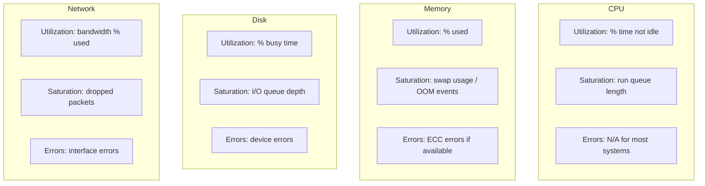

# How to Build a Grafana USE Method Dashboard (Utilization, Saturation, Errors) from OpenTelemetry Host Metrics

Author: [nawazdhandala](https://www.github.com/nawazdhandala)

Tags: OpenTelemetry, Grafana, USE Method, Host Metrics

Description: Create a Grafana dashboard implementing the USE method for infrastructure monitoring using host metrics collected by the OpenTelemetry Collector's hostmetrics receiver.

The USE method, developed by Brendan Gregg, monitors three dimensions for every resource in your infrastructure: Utilization (how busy is it), Saturation (how much extra work is queued), and Errors (how many failures occur). OpenTelemetry's hostmetrics receiver collects CPU, memory, disk, and network metrics from each host in a standardized format. This post walks through building a Grafana dashboard that applies the USE method to these metrics.

## Understanding USE for Each Resource Type



## Step 1: Configure the Hostmetrics Receiver

The OpenTelemetry Collector's `hostmetrics` receiver collects system-level metrics. Enable all the scrapers needed for USE analysis:

```yaml
# otel-collector-config.yaml
# Collect host-level metrics for USE method dashboard
receivers:
  hostmetrics:
    collection_interval: 15s
    scrapers:
      # CPU metrics for utilization and per-core breakdown
      cpu:
        metrics:
          system.cpu.utilization:
            enabled: true
      # Memory metrics for utilization and saturation
      memory:
        metrics:
          system.memory.utilization:
            enabled: true
      # Disk I/O metrics for utilization and saturation
      disk: {}
      # Filesystem metrics for capacity utilization
      filesystem: {}
      # Network metrics for utilization, saturation, and errors
      network: {}
      # Load average for CPU saturation signal
      load: {}
      # Paging/swap metrics for memory saturation
      paging: {}
      # Process metrics for additional context
      processes: {}

processors:
  # Add host identification to all metrics
  resourcedetection:
    detectors: [system, env]
    system:
      hostname_sources: ["os"]
      resource_attributes:
        host.name:
          enabled: true
        os.type:
          enabled: true

  batch:
    timeout: 15s

exporters:
  prometheus:
    endpoint: "0.0.0.0:8889"
    resource_to_telemetry_conversion:
      enabled: true

service:
  pipelines:
    metrics:
      receivers: [hostmetrics]
      processors: [resourcedetection, batch]
      exporters: [prometheus]
```

## Step 2: CPU - Utilization, Saturation, Errors

**CPU Utilization** - the percentage of time the CPU is doing work (anything other than idle):

```promql
# CPU utilization as a percentage across all cores per host
# system.cpu.utilization reports per-state values; we subtract idle from 1
100 * (1 - avg by (host_name) (
  system_cpu_utilization{state="idle"}
))
```

**CPU Saturation** - how much work is waiting. The load average compared to CPU count gives a saturation signal:

```promql
# CPU saturation: load average (1min) normalized by CPU count
# Values above 1.0 indicate saturation
system_cpu_load_average_1m{}
/
count by (host_name) (system_cpu_utilization{state="idle"})
```

For the Grafana panel, set threshold lines at 0.7 (warning) and 1.0 (critical) to visualize when CPUs are overloaded.

## Step 3: Memory - Utilization, Saturation, Errors

**Memory Utilization** - percentage of physical memory in use:

```promql
# Memory utilization percentage per host
100 * system_memory_utilization{state="used"}
```

**Memory Saturation** - swap activity indicates memory pressure. The paging rate (pages swapped in/out per second) is the best saturation signal:

```promql
# Memory saturation: page fault rate (swap activity)
# High values indicate memory pressure forcing swap usage
sum by (host_name) (
  rate(system_paging_operations_total[5m])
)
```

Also track the swap utilization as a secondary saturation metric:

```promql
# Swap space utilization - high values mean memory is saturated
100 * (
  system_paging_usage{state="used"}
  /
  (system_paging_usage{state="used"} + system_paging_usage{state="free"})
)
```

## Step 4: Disk - Utilization, Saturation, Errors

**Disk Utilization** - how busy the disk is servicing I/O:

```promql
# Disk utilization: fraction of time the disk is busy
# Calculated from I/O time counter
100 * rate(system_disk_io_time_total[5m])
```

**Disk Saturation** - the I/O queue depth shows how many operations are waiting:

```promql
# Disk saturation: weighted I/O time indicates queue depth
# Higher values mean more operations waiting in queue
rate(system_disk_weighted_io_time_total[5m])
```

**Filesystem capacity** - while not strictly I/O saturation, running out of disk space is a critical resource constraint:

```promql
# Filesystem utilization by mount point
100 * (
  system_filesystem_usage{state="used"}
  /
  (system_filesystem_usage{state="used"} + system_filesystem_usage{state="free"})
)
```

## Step 5: Network - Utilization, Saturation, Errors

**Network Utilization** - bytes transmitted as a fraction of interface capacity:

```promql
# Network throughput per interface (bytes/sec)
sum by (host_name, device) (
  rate(system_network_io_total{direction="transmit"}[5m])
  +
  rate(system_network_io_total{direction="receive"}[5m])
)
```

**Network Saturation** - dropped packets indicate the interface cannot keep up:

```promql
# Network saturation: dropped packets per second
sum by (host_name, device) (
  rate(system_network_dropped_total[5m])
)
```

**Network Errors** - interface errors per second:

```promql
# Network errors per second by interface
sum by (host_name, device) (
  rate(system_network_errors_total[5m])
)
```

## Step 6: Dashboard Layout

Organize the dashboard as a grid where each row is a resource type and each column is a USE dimension:

```yaml
# Dashboard layout structure
# Each row covers one resource, each column one USE dimension
rows:
  - title: "CPU"
    panels:
      - {title: "CPU Utilization %", width: 8}
      - {title: "CPU Saturation (Load/Cores)", width: 8}
      - {title: "CPU Errors", width: 8}  # Usually empty, placeholder

  - title: "Memory"
    panels:
      - {title: "Memory Utilization %", width: 8}
      - {title: "Swap Activity (pages/s)", width: 8}
      - {title: "Swap Utilization %", width: 8}

  - title: "Disk"
    panels:
      - {title: "Disk I/O Utilization %", width: 8}
      - {title: "I/O Queue Depth", width: 8}
      - {title: "Filesystem Usage %", width: 8}

  - title: "Network"
    panels:
      - {title: "Network Throughput (bytes/s)", width: 8}
      - {title: "Dropped Packets/s", width: 8}
      - {title: "Interface Errors/s", width: 8}
```

Add a `host_name` template variable at the top of the dashboard so operators can filter to a single host or view all hosts simultaneously:

```promql
# Template variable query to populate the host selector dropdown
label_values(system_cpu_utilization, host_name)
```

## Adding Alert Thresholds to the Dashboard

Mark threshold lines on each panel to show when values enter warning or critical territory. Typical thresholds for USE metrics:

| Resource | Metric | Warning | Critical |
|----------|--------|---------|----------|
| CPU | Utilization | 70% | 90% |
| CPU | Saturation (Load/Cores) | 0.7 | 1.0 |
| Memory | Utilization | 80% | 95% |
| Memory | Swap Activity | 100 pages/s | 1000 pages/s |
| Disk | I/O Utilization | 70% | 90% |
| Disk | Filesystem Usage | 80% | 95% |
| Network | Dropped Packets | 1/s | 10/s |
| Network | Errors | 1/s | 10/s |

These thresholds vary by workload. A database server will have different normal disk utilization than a stateless API server. Use the Grafana threshold annotations to visually mark these levels, and pair them with Prometheus alert rules for automated notification.

The USE method gives a systematic way to check every physical resource for bottlenecks. With OpenTelemetry hostmetrics feeding the data and Grafana rendering it, you get a single dashboard that answers "is any resource on any host constrained?" at a glance.
