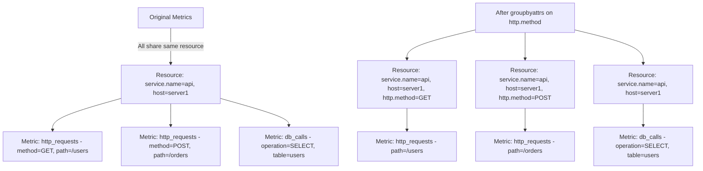

# How to Configure the Group by Attributes Processor in the OpenTelemetry Collector

Author: [nawazdhandala](https://www.github.com/nawazdhandala)

Tags: OpenTelemetry, Collector, Processors, Attributes, Grouping, Metrics, Resource, Cardinality

Description: Learn how to configure the group-by-attributes processor in OpenTelemetry Collector to reorganize telemetry attributes, reduce cardinality, optimize storage costs, and improve query performance by grouping metrics and logs by specific attribute keys.

---

Telemetry data in OpenTelemetry is organized into resource attributes (describing the source, like service name or host) and data point attributes (describing individual measurements, like HTTP method or status code). Sometimes you need to reorganize these attributes - move them from resource to data point level or vice versa - to optimize for storage, querying, or cardinality management.

The group-by-attributes processor (also called groupbyattrs) enables you to group telemetry by specific attribute keys and restructure how attributes are distributed between resource and data point levels. This processor is essential for controlling cardinality, optimizing storage costs, and ensuring your telemetry is structured for efficient querying.

## Understanding Resource vs Data Point Attributes

OpenTelemetry organizes attributes at two levels:

**Resource attributes** are common to all telemetry from a source:
- `service.name`: "checkout-service"
- `service.version`: "1.2.3"
- `host.name`: "prod-web-01"
- `k8s.pod.name`: "checkout-abc123"

**Data point attributes** (or span/log attributes) are specific to individual measurements:
- `http.method`: "POST"
- `http.status_code`: "200"
- `db.statement`: "SELECT * FROM orders"



The group-by-attributes processor moves specified attributes to the resource level, creating separate resource groups for each unique combination of those attributes. This reorganization affects how data is stored, indexed, and queried.

## Why You Need This Processor

The group-by-attributes processor solves several critical problems in production observability:

**Cardinality Reduction**: By moving high-cardinality attributes to the resource level, you can aggregate metrics more effectively. Instead of storing one time series per unique combination of all attributes, you group related series together.

**Storage Optimization**: Backends often charge based on the number of unique time series. Grouping by resource attributes can significantly reduce series count by consolidating related metrics under common resources.

**Query Performance**: When attributes are organized properly at the resource level, queries filtering by those attributes become much faster because the backend can quickly identify relevant resource groups.

**Backend Compatibility**: Some backends have specific requirements about attribute organization. This processor ensures your telemetry matches those requirements.

## Basic Configuration

The processor requires you to specify which attributes should be used for grouping. These attributes are promoted to the resource level.

Here is a basic configuration that groups metrics by service name and deployment environment:

```yaml
# RECEIVERS: Accept metrics via OTLP
receivers:
  otlp:
    protocols:
      grpc:
        endpoint: 0.0.0.0:4317

# PROCESSORS: Group metrics by specific attributes
processors:
  # Group all metrics by service.name and deployment.environment
  groupbyattrs:
    keys:
      - service.name          # Promote service name to resource level
      - deployment.environment # Promote environment to resource level

  # Batch for efficiency
  batch:
    send_batch_max_size: 1024
    timeout: 10s

# EXPORTERS: Send to backend
exporters:
  otlphttp:
    endpoint: https://oneuptime.com/otlp/v1/metrics
    headers:
      x-oneuptime-token: ${ONEUPTIME_TOKEN}

# SERVICE: Define the metrics pipeline
service:
  pipelines:
    metrics:
      receivers: [otlp]
      processors: [groupbyattrs, batch]
      exporters: [otlphttp]
```

This configuration receives metrics and groups them so that all metrics sharing the same service name and deployment environment are organized under a common resource. If a metric doesn't have these attributes, it remains in its original resource group.

## Reducing Cardinality for Cost Optimization

High-cardinality metrics can explode your observability costs. A single counter with 10 different labels, each with 10 possible values, creates 10^10 potential time series. The group-by-attributes processor helps by consolidating related series.

Consider HTTP request metrics with these attributes: service, endpoint, method, status_code, user_id. The user_id creates unbounded cardinality. Here is how to handle it:

```yaml
processors:
  # First, drop the high-cardinality user_id attribute
  attributes/drop_user_id:
    actions:
      - key: user_id
        action: delete

  # Group by service and endpoint to organize remaining metrics
  groupbyattrs:
    keys:
      - service.name
      - http.target    # Group by endpoint

  # This creates resource groups like:
  # Resource 1: service.name=api, http.target=/users
  # Resource 2: service.name=api, http.target=/orders
  # Each resource contains metrics with method and status_code as data attributes

  batch:
    send_batch_max_size: 1024
    timeout: 10s

exporters:
  otlphttp:
    endpoint: https://oneuptime.com/otlp/v1/metrics
    headers:
      x-oneuptime-token: ${ONEUPTIME_TOKEN}

service:
  pipelines:
    metrics:
      receivers: [otlp]
      processors: [attributes/drop_user_id, groupbyattrs, batch]
      exporters: [otlphttp]
```

By dropping user_id and grouping by service and endpoint, you reduce cardinality from potentially millions of series (one per user per endpoint) to dozens (one per endpoint), while still maintaining useful metrics about request counts and error rates per endpoint.

## Grouping with Compaction for Maximum Efficiency

The processor supports a `compact` mode that goes further: it moves ALL matching attributes from data points to the resource level, reducing redundancy.

Here is a configuration using compaction:

```yaml
processors:
  # Group by region and availability zone, with compaction
  groupbyattrs:
    keys:
      - cloud.region
      - cloud.availability_zone
      - service.name

    # IMPORTANT: Enable compaction mode
    # This moves the grouping keys from ALL data points to resource level
    # Reduces data size but changes attribute organization
    compact: true

  batch:
    send_batch_max_size: 1024
    timeout: 10s

exporters:
  otlphttp:
    endpoint: https://oneuptime.com/otlp/v1/metrics
    headers:
      x-oneuptime-token: ${ONEUPTIME_TOKEN}

service:
  pipelines:
    metrics:
      receivers: [otlp]
      processors: [groupbyattrs, batch]
      exporters: [otlphttp]
```

With `compact: true`, if all data points in a resource group share the same value for a grouping key, that attribute is removed from the data points and exists only at the resource level. This significantly reduces payload size.

**Without compaction**:
- Resource: (empty)
- Data point 1: service.name=api, region=us-east-1, http.method=GET
- Data point 2: service.name=api, region=us-east-1, http.method=POST
- Data point 3: service.name=api, region=us-east-1, http.method=DELETE

**With compaction**:
- Resource: service.name=api, region=us-east-1
- Data point 1: http.method=GET
- Data point 2: http.method=POST
- Data point 3: http.method=DELETE

The redundant service.name and region attributes are removed from data points, reducing payload size by 30-50% in typical scenarios.

## Multi-Level Grouping for Complex Hierarchies

In microservices architectures, you often have hierarchical organization: region → cluster → namespace → service → instance. The group-by-attributes processor can model this hierarchy.

Here is a configuration for Kubernetes environments:

```yaml
processors:
  # Group by Kubernetes hierarchy
  groupbyattrs/k8s:
    keys:
      - k8s.cluster.name      # Top level: cluster
      - k8s.namespace.name    # Second level: namespace
      - k8s.deployment.name   # Third level: deployment
      - k8s.pod.name          # Fourth level: individual pod

    # Don't compact because we want flexibility in querying
    compact: false

  # Separate grouping for application-level attributes
  groupbyattrs/app:
    keys:
      - service.name
      - service.version
      - deployment.environment

  batch:
    send_batch_max_size: 1024
    timeout: 10s

exporters:
  otlphttp:
    endpoint: https://oneuptime.com/otlp/v1/metrics
    headers:
      x-oneuptime-token: ${ONEUPTIME_TOKEN}

service:
  pipelines:
    metrics:
      receivers: [otlp]
      processors:
        - groupbyattrs/k8s     # First group by infrastructure
        - groupbyattrs/app     # Then group by application
        - batch
      exporters: [otlphttp]
```

This configuration creates a rich resource hierarchy. Metrics are first organized by Kubernetes infrastructure (cluster, namespace, deployment, pod), then further organized by application identity (service, version, environment). This structure enables efficient queries at any level of the hierarchy.

## Selective Grouping with Filtering

You might want to group only specific types of metrics. Combine the group-by-attributes processor with the filter processor for targeted grouping.

This configuration groups only HTTP metrics by endpoint but leaves database metrics untouched:

```yaml
processors:
  # Filter to select only HTTP metrics
  filter/http_only:
    metrics:
      include:
        match_type: regexp
        metric_names:
          - ^http\..*$

  # Group HTTP metrics by endpoint
  groupbyattrs/http:
    keys:
      - http.target
      - http.method
    compact: true

  batch:
    send_batch_max_size: 1024
    timeout: 10s

exporters:
  otlphttp/http:
    endpoint: https://oneuptime.com/otlp/v1/metrics
    headers:
      x-oneuptime-token: ${ONEUPTIME_TOKEN}

service:
  pipelines:
    # Pipeline for HTTP metrics (grouped)
    metrics/http:
      receivers: [otlp]
      processors: [filter/http_only, groupbyattrs/http, batch]
      exporters: [otlphttp/http]

    # Pipeline for all other metrics (not grouped)
    metrics/other:
      receivers: [otlp]
      processors: [batch]
      exporters: [otlphttp/http]
```

This pattern is useful when you have heterogeneous metrics with different attribute structures and only want to apply grouping to specific subsets.

## Combining with Resource Detection

The resource detection processor discovers attributes about the environment (cloud provider, host, Kubernetes metadata). Combine it with group-by-attributes for powerful automatic organization.

Here is a complete configuration for cloud deployments:

```yaml
receivers:
  otlp:
    protocols:
      grpc:
        endpoint: 0.0.0.0:4317

processors:
  # Detect cloud and Kubernetes resource attributes
  resourcedetection:
    detectors: [env, system, docker, gcp, ec2, eks]
    timeout: 5s

  # Group by detected cloud attributes
  groupbyattrs:
    keys:
      - cloud.provider        # AWS, GCP, Azure
      - cloud.region          # us-east-1, europe-west1, etc.
      - cloud.account.id      # Account/project identifier
      - service.name          # Application service name
    compact: true

  batch:
    send_batch_max_size: 1024
    timeout: 10s

exporters:
  otlphttp:
    endpoint: https://oneuptime.com/otlp/v1/metrics
    headers:
      x-oneuptime-token: ${ONEUPTIME_TOKEN}

service:
  pipelines:
    metrics:
      receivers: [otlp]
      processors:
        - resourcedetection   # First detect resource attributes
        - groupbyattrs        # Then group by them
        - batch
      exporters: [otlphttp]
```

The resource detection processor automatically populates cloud provider, region, and account attributes. The group-by-attributes processor then organizes metrics by these discovered attributes, creating a natural hierarchy without manual configuration in your applications.

## Handling Missing Attributes

Not all metrics have all attributes. The group-by-attributes processor handles missing attributes gracefully: metrics without the specified grouping keys remain in their original resource group.

This configuration shows explicit handling of missing attributes:

```yaml
processors:
  # Add default values for missing attributes
  resource/defaults:
    attributes:
      - key: deployment.environment
        value: "unknown"
        action: insert    # Only insert if not already present

      - key: service.version
        value: "unversioned"
        action: insert

  # Now group with confidence that attributes exist
  groupbyattrs:
    keys:
      - service.name
      - deployment.environment
      - service.version
    compact: true

  batch:
    send_batch_max_size: 1024
    timeout: 10s

service:
  pipelines:
    metrics:
      receivers: [otlp]
      processors:
        - resource/defaults   # First ensure attributes exist
        - groupbyattrs        # Then group by them
        - batch
      exporters: [otlphttp]
```

By using the resource processor to insert default values for missing attributes, you ensure consistent grouping even when some telemetry sources don't emit all expected attributes.

## Performance and Memory Considerations

The group-by-attributes processor maintains in-memory state for each unique resource group. In high-cardinality scenarios, this can consume significant memory.

Here is a production configuration with memory protection:

```yaml
processors:
  # Protect collector from memory exhaustion
  memory_limiter:
    limit_mib: 1024          # Hard limit: 1GB
    spike_limit_mib: 256     # Allow temporary spikes
    check_interval: 1s

  # Limit attribute values before grouping to control cardinality
  attributes/limit_cardinality:
    actions:
      # Replace high-cardinality IDs with "redacted"
      - key: user_id
        action: delete
      - key: session_id
        action: delete
      - key: request_id
        action: delete

  # Group by controlled set of attributes
  groupbyattrs:
    keys:
      - service.name
      - deployment.environment
      - http.target    # Endpoint - bounded cardinality
    compact: true

  batch:
    send_batch_max_size: 2048
    timeout: 5s

service:
  pipelines:
    metrics:
      receivers: [otlp]
      processors:
        - memory_limiter                # First line of defense
        - attributes/limit_cardinality  # Reduce cardinality
        - groupbyattrs                  # Then group
        - batch
      exporters: [otlphttp]
```

The memory_limiter processor protects the entire collector. The attributes processor removes high-cardinality attributes that would create too many resource groups. Only then does the group-by-attributes processor organize the remaining, bounded-cardinality attributes.

## Working with Logs and Traces

While the examples above focus on metrics, the group-by-attributes processor works with logs and traces too. The configuration is identical.

Here is a configuration for grouping logs by severity and service:

```yaml
processors:
  # Group logs by severity level and service
  groupbyattrs:
    keys:
      - service.name
      - severity          # INFO, WARN, ERROR, etc.
      - deployment.environment

  batch:
    send_batch_max_size: 1024
    timeout: 10s

exporters:
  otlphttp:
    endpoint: https://oneuptime.com/otlp/v1/logs
    headers:
      x-oneuptime-token: ${ONEUPTIME_TOKEN}

service:
  pipelines:
    logs:
      receivers: [otlp]
      processors: [groupbyattrs, batch]
      exporters: [otlphttp]
```

This groups logs so that all ERROR logs from a particular service in a particular environment are organized under one resource group, making it efficient to query "show me all errors from production checkout service."

## Debugging and Validation

To verify the processor is working correctly, use the logging exporter to inspect how attributes are organized.

Add this to your configuration:

```yaml
exporters:
  logging:
    loglevel: debug
    sampling_initial: 100   # Log first 100 items
    sampling_thereafter: 0  # Then stop logging

service:
  telemetry:
    logs:
      level: debug

  pipelines:
    metrics:
      receivers: [otlp]
      processors: [groupbyattrs, batch]
      exporters: [otlphttp, logging]  # Add logging exporter
```

The logging exporter prints metrics to stdout with full resource and attribute details, allowing you to verify that grouping is happening as expected and attributes are at the correct level.

## Common Pitfalls and Solutions

**Problem**: Grouping creates too many resource groups, increasing cardinality instead of reducing it.

**Solution**: You've chosen attributes with high cardinality (like user IDs, session IDs, or request IDs). Review your grouping keys and select only bounded-cardinality attributes like service name, environment, region, or endpoint path patterns.

**Problem**: Queries are slower after implementing grouping.

**Solution**: Your backend might not be optimized for resource-level attributes. Check your backend's documentation - some systems perform better with data-point-level attributes for certain query patterns. Consider whether compaction is appropriate for your use case.

**Problem**: Metrics are missing after adding the processor.

**Solution**: The processor doesn't drop metrics, but it reorganizes them. Verify that your backend and queries are correctly handling the new resource structure. Use the logging exporter to confirm metrics are being processed and exported.

## Integration with OneUptime

OneUptime efficiently handles both resource-level and data-point-level attributes, making it ideal for use with the group-by-attributes processor. The platform automatically indexes resource attributes for fast filtering.

Here is a complete configuration optimized for OneUptime:

```yaml
receivers:
  otlp:
    protocols:
      grpc:
        endpoint: 0.0.0.0:4317
      http:
        endpoint: 0.0.0.0:4318

processors:
  memory_limiter:
    limit_mib: 512
    spike_limit_mib: 128

  resourcedetection:
    detectors: [env, system, docker, gcp, ec2, eks]
    timeout: 5s

  groupbyattrs:
    keys:
      - service.name
      - service.version
      - deployment.environment
      - cloud.region
      - cloud.availability_zone
    compact: true

  batch:
    send_batch_max_size: 1024
    timeout: 10s

exporters:
  otlphttp:
    endpoint: https://oneuptime.com/otlp/v1/metrics
    headers:
      x-oneuptime-token: ${ONEUPTIME_TOKEN}
    retry_on_failure:
      enabled: true
      initial_interval: 5s
      max_interval: 30s

service:
  pipelines:
    metrics:
      receivers: [otlp]
      processors:
        - memory_limiter
        - resourcedetection
        - groupbyattrs
        - batch
      exporters: [otlphttp]
```

This configuration automatically detects cloud and infrastructure attributes, groups metrics by service and deployment characteristics, compacts the data for efficient transmission, and exports to OneUptime with retry logic for reliability.

## Related Resources

For more information on OpenTelemetry Collector processors and attribute management:

- [OpenTelemetry Collector: What It Is, When You Need It, and When You Don't](https://oneuptime.com/blog/post/what-is-opentelemetry-collector-and-why-use-one/view)
- [How to Structure Logs Properly in OpenTelemetry](https://oneuptime.com/blog/post/2025-08-28-how-to-structure-logs-properly-in-opentelemetry/view)
- [How to Reduce Noise in OpenTelemetry](https://oneuptime.com/blog/post/2025-08-25-how-to-reduce-noise-in-opentelemetry/view)
- [Keep PII Out of Observability Telemetry](https://oneuptime.com/blog/post/2025-11-13-keep-pii-out-of-observability-telemetry/view)

## Conclusion

The group-by-attributes processor is a powerful tool for organizing telemetry in OpenTelemetry. By moving attributes to the resource level and optionally compacting them, you can significantly reduce cardinality, optimize storage costs, and improve query performance.

Configure it thoughtfully: choose grouping keys with bounded cardinality, use compaction when appropriate, combine with resource detection for automatic organization, and always protect against unbounded memory growth. With OneUptime as your backend, you get a platform that efficiently handles resource-level attributes and makes full use of the organization this processor provides.
