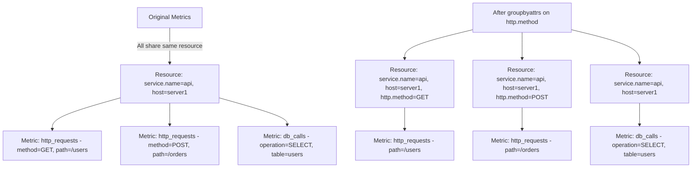

# How to Configure the Group by Attributes Processor

Author: [nawazdhandala](https://www.github.com/nawazdhandala)

Tags: OpenTelemetry, Collector, Processor, Attribute, Grouping, Metric, Resource, Cardinality

Description: Learn how to configure the group-by-attributes processor in OpenTelemetry Collector to reorganize telemetry attributes, reduce cardinality, optimize storage costs.

---

Telemetry data in OpenTelemetry is organized into resource attributes (describing the source, like service name or host) and data point attributes (describing individual measurements, like HTTP method or status code). Sometimes you need to reorganize these attributes - for example, move selected record or data point attributes to the resource level - to optimize for storage, querying, or attribute organization.

The group-by-attributes processor (also called groupbyattrs) enables you to group telemetry by specific attribute keys and restructure how selected attributes are represented at the resource level. This processor is useful for controlling resource grouping, optimizing payload shape, and ensuring your telemetry is structured for efficient querying.

## Understanding Resource vs Data Point Attributes

OpenTelemetry organizes attributes at two levels:

**Resource attributes** are common to all telemetry from a source:
- `service.name`: "checkout-service"
- `service.version`: "1.2.3"
- `host.name`: "prod-web-01"
- `k8s.pod.name`: "checkout-abc123"

**Data point attributes** (or span/log attributes) are specific to individual measurements:
- `http.method`: "POST"
- `http.status_code`: "200"
- `db.statement`: "SELECT * FROM orders"


```mermaid
graph TD
    A[Original Metrics] -->|All share same resource| B[Resource: service.name=api, host=server1]
    B --> C[Metric: http_requests - method=GET, path=/users]
    B --> D[Metric: http_requests - method=POST, path=/orders]
    B --> E[Metric: db_calls - operation=SELECT, table=users]

    F[After groupbyattrs on http.method] --> G[Resource: service.name=api, host=server1, http.method=GET]
    G --> H[Metric: http_requests - path=/users]

    F --> I[Resource: service.name=api, host=server1, http.method=POST]
    I --> J[Metric: http_requests - path=/orders]

    F --> K[Resource: service.name=api, host=server1]
    K --> L[Metric: db_calls - operation=SELECT, table=users]
```

The group-by-attributes processor moves specified attributes to the resource level, creating separate resource groups for each unique combination of those attributes. This reorganization affects how data is stored, indexed, and queried.

## Why You Need This Processor

The group-by-attributes processor solves several practical problems in production observability:

**Attribute Organization**: By moving selected attributes to the resource level, you can make telemetry from the same logical source easier to group and inspect. Avoid grouping on unbounded identifiers, because those values still create many resource groups.

**Storage Optimization**: Backends often charge based on the number of unique time series or amount of ingested data. Dropping high-cardinality attributes reduces series count, while groupbyattrs can reduce repeated attributes in payloads by moving grouping keys from records to resources.

**Query Performance**: When attributes are organized properly at the resource level, some backends can filter or index those attributes more efficiently. The exact impact depends on the backend's data model.

**Backend Compatibility**: Some backends have specific requirements about attribute organization. This processor ensures your telemetry matches those requirements.

## Basic Configuration

The processor requires you to specify which record or metric data point attributes should be used for grouping. These attributes are moved to the resource level when they are present on the processed telemetry.

Here is a basic configuration that groups metrics by service name and deployment environment when those keys are present as metric data point attributes:

```yaml
# RECEIVERS: Accept metrics via OTLP

receivers:
  otlp:
    protocols:
      grpc:
        endpoint: 0.0.0.0:4317

# PROCESSORS: Group metrics by specific attributes
processors:
  # Group metrics by service.name and deployment.environment data point attributes
  groupbyattrs:
    keys:
      - service.name          # Move service name to resource level
      - deployment.environment # Move environment to resource level

  # Batch for efficiency
  batch:
    send_batch_size: 1024
    send_batch_max_size: 1024
    timeout: 10s

# EXPORTERS: Send to backend
exporters:
  otlphttp:
    endpoint: https://oneuptime.com/otlp/v1/metrics
    headers:
      x-oneuptime-token: ${ONEUPTIME_TOKEN}

# SERVICE: Define the metrics pipeline
service:
  pipelines:
    metrics:
      receivers: [otlp]
      processors: [groupbyattrs, batch]
      exporters: [otlphttp]
```

This configuration receives metrics and groups data points that share the same service name and deployment environment attributes under a common resource. If a metric data point doesn't have any of these attributes, it remains in its original resource group.

## Reducing Cardinality for Cost Optimization

High-cardinality metrics can explode your observability costs. A single counter with 10 different labels, each with 10 possible values, creates 10^10 potential label combinations. The group-by-attributes processor can help reorganize the remaining attributes after you remove or normalize unbounded values.

Consider HTTP request metrics with these attributes: service, endpoint, method, status_code, user_id. The user_id creates unbounded cardinality. Here is how to handle it:

```yaml
processors:
  # First, drop the high-cardinality user_id attribute
  attributes/drop_user_id:
    actions:
      - key: user_id
        action: delete

  # Group by service and endpoint to organize remaining metrics
  groupbyattrs:
    keys:
      - service.name
      - http.target    # Group by endpoint

  # This creates resource groups like:
  # Resource 1: service.name=api, http.target=/users
  # Resource 2: service.name=api, http.target=/orders
  # Each resource contains metrics with method and status_code as data attributes

  batch:
    send_batch_size: 1024
    send_batch_max_size: 1024
    timeout: 10s

exporters:
  otlphttp:
    endpoint: https://oneuptime.com/otlp/v1/metrics
    headers:
      x-oneuptime-token: ${ONEUPTIME_TOKEN}

service:
  pipelines:
    metrics:
      receivers: [otlp]
      processors: [attributes/drop_user_id, groupbyattrs, batch]
      exporters: [otlphttp]
```

By dropping user_id, you reduce metric cardinality from potentially millions of series (one per user per endpoint) to a bounded set based on endpoint, method, status code, and other remaining attributes, while still maintaining useful metrics about request counts and error rates per endpoint.

## Grouping to Reduce Redundant Attributes

When `groupbyattrs` moves grouping keys from records or metric data points to the resource level, it removes those keys from the records or data points. This reduces redundancy for the selected keys. The processor can also compact data that already has matching resource and scope properties by running with no `keys`.

Here is a configuration that groups by region and service attributes:

```yaml
processors:
  # Group by region, availability zone, and service
  groupbyattrs:
    keys:
      - cloud.region
      - cloud.availability_zone
      - service.name

  batch:
    send_batch_size: 1024
    send_batch_max_size: 1024
    timeout: 10s

exporters:
  otlphttp:
    endpoint: https://oneuptime.com/otlp/v1/metrics
    headers:
      x-oneuptime-token: ${ONEUPTIME_TOKEN}

service:
  pipelines:
    metrics:
      receivers: [otlp]
      processors: [groupbyattrs, batch]
      exporters: [otlphttp]
```

After grouping, the grouping keys are removed from the data points that contained them and are set on the resource instead. This can reduce payload size when those keys were repeated across many data points.

**Before grouping**:
- Resource: (empty)
- Data point 1: service.name=api, region=us-east-1, http.method=GET
- Data point 2: service.name=api, region=us-east-1, http.method=POST
- Data point 3: service.name=api, region=us-east-1, http.method=DELETE

**After grouping by service.name and region**:
- Resource: service.name=api, region=us-east-1
- Data point 1: http.method=GET
- Data point 2: http.method=POST
- Data point 3: http.method=DELETE

The redundant service.name and region attributes are removed from data points. The exact payload-size reduction depends on the number of records, the number of repeated attributes, and the exporter encoding.

## Multi-Level Grouping for Complex Hierarchies

In microservices architectures, you often have hierarchical organization: region → cluster → namespace → service → instance. The group-by-attributes processor can attach selected infrastructure and application attributes to resources so backends can filter by these levels.

Here is a configuration for Kubernetes environments:

```yaml
processors:
  # Group by Kubernetes hierarchy
  groupbyattrs/k8s:
    keys:
      - k8s.cluster.name      # Top level: cluster
      - k8s.namespace.name    # Second level: namespace
      - k8s.deployment.name   # Third level: deployment
      - k8s.pod.name          # Fourth level: individual pod

  # Separate grouping for application-level attributes
  groupbyattrs/app:
    keys:
      - service.name
      - service.version
      - deployment.environment

  batch:
    send_batch_size: 1024
    send_batch_max_size: 1024
    timeout: 10s

exporters:
  otlphttp:
    endpoint: https://oneuptime.com/otlp/v1/metrics
    headers:
      x-oneuptime-token: ${ONEUPTIME_TOKEN}

service:
  pipelines:
    metrics:
      receivers: [otlp]
      processors:
        - groupbyattrs/k8s     # First group by infrastructure
        - groupbyattrs/app     # Then group by application
        - batch
      exporters: [otlphttp]
```

This configuration creates resource groups that include both Kubernetes infrastructure attributes (cluster, namespace, deployment, pod) and application identity (service, version, environment). This structure can enable efficient queries at those levels when your backend indexes resource attributes.

## Selective Grouping with Filtering

You might want to group only specific types of metrics. Combine the group-by-attributes processor with the filter processor for targeted grouping.

This configuration groups only HTTP metrics by endpoint but leaves database metrics untouched:

```yaml
processors:
  # Drop non-HTTP metrics from the HTTP pipeline
  filter/http_only:
    error_mode: ignore
    metric_conditions:
      - 'IsMatch(metric.name, "^http\\..*$") == false'

  # Drop HTTP metrics from the ungrouped pipeline
  filter/non_http:
    error_mode: ignore
    metric_conditions:
      - 'IsMatch(metric.name, "^http\\..*$")'

  # Group HTTP metrics by endpoint
  groupbyattrs/http:
    keys:
      - http.target
      - http.method

  batch/http:
    send_batch_size: 1024
    send_batch_max_size: 1024
    timeout: 10s

  batch/other:
    send_batch_size: 1024
    send_batch_max_size: 1024
    timeout: 10s

exporters:
  otlphttp/http:
    endpoint: https://oneuptime.com/otlp/v1/metrics
    headers:
      x-oneuptime-token: ${ONEUPTIME_TOKEN}

service:
  pipelines:
    # Pipeline for HTTP metrics (grouped)
    metrics/http:
      receivers: [otlp]
      processors: [filter/http_only, groupbyattrs/http, batch/http]
      exporters: [otlphttp/http]

    # Pipeline for all other metrics (not grouped)
    metrics/other:
      receivers: [otlp]
      processors: [filter/non_http, batch/other]
      exporters: [otlphttp/http]
```

This pattern is useful when you have heterogeneous metrics with different attribute structures and only want to apply grouping to specific subsets.

## Combining with Resource Detection

The resource detection processor discovers attributes about the environment (cloud provider, host, Kubernetes metadata). Combine it with group-by-attributes when you also receive flat telemetry where some source-identifying values arrive as record or data point attributes.

Here is a complete configuration for cloud deployments:

```yaml
receivers:
  otlp:
    protocols:
      grpc:
        endpoint: 0.0.0.0:4317

processors:
  # Detect cloud and host resource attributes
  resource_detection:
    detectors: [env, system, docker, gcp, ec2]
    timeout: 5s

  # Group flat metric attributes into resources
  groupbyattrs:
    keys:
      - service.name          # Application service name, if present on data points
      - deployment.environment
      - http.target           # Endpoint, if present on data points
  batch:
    send_batch_size: 1024
    send_batch_max_size: 1024
    timeout: 10s

exporters:
  otlphttp:
    endpoint: https://oneuptime.com/otlp/v1/metrics
    headers:
      x-oneuptime-token: ${ONEUPTIME_TOKEN}

service:
  pipelines:
    metrics:
      receivers: [otlp]
      processors:
        - resource_detection  # First detect resource attributes
        - groupbyattrs        # Then group by them
        - batch
      exporters: [otlphttp]
```

The resource detection processor automatically populates cloud provider, region, and account attributes when the selected detectors can discover them. The group-by-attributes processor then organizes metrics by matching attributes present on records or data points, complementing the resource attributes detected from the environment.

## Handling Missing Attributes

Not all metrics have all attributes. The group-by-attributes processor handles missing attributes gracefully: metrics without the specified grouping keys remain in their original resource group.

This configuration shows explicit handling of missing attributes:

```yaml
processors:
  # Add default values for missing metric attributes
  attributes/defaults:
    actions:
      - key: deployment.environment
        value: "unknown"
        action: insert    # Only insert if not already present

      - key: service.version
        value: "unversioned"
        action: insert

      - key: service.name
        value: "unknown-service"
        action: insert

  # Now group with confidence that these data point attributes exist
  groupbyattrs:
    keys:
      - service.name
      - deployment.environment
      - service.version
  batch:
    send_batch_size: 1024
    send_batch_max_size: 1024
    timeout: 10s

service:
  pipelines:
    metrics:
      receivers: [otlp]
      processors:
        - attributes/defaults # First ensure data point attributes exist
        - groupbyattrs        # Then group by them
        - batch
      exporters: [otlphttp]
```

By using the attributes processor to insert default values, you ensure consistent grouping even when some telemetry sources don't emit all expected data point attributes.

## Performance and Memory Considerations

The group-by-attributes processor can create many resource groups when grouping keys have many distinct values. In high-cardinality scenarios, this can consume additional memory and produce fragmented output.

Here is a production configuration with memory protection:

```yaml
processors:
  # Protect collector from memory exhaustion
  memory_limiter:
    limit_mib: 1024          # Hard limit: 1GB
    spike_limit_mib: 256     # Allow temporary spikes
    check_interval: 1s

  # Limit attribute values before grouping to control cardinality
  attributes/limit_cardinality:
    actions:
      # Delete high-cardinality IDs before grouping
      - key: user_id
        action: delete
      - key: session_id
        action: delete
      - key: request_id
        action: delete

  # Group by controlled set of attributes
  groupbyattrs:
    keys:
      - service.name
      - deployment.environment
      - http.target    # Endpoint - bounded cardinality
  batch:
    send_batch_size: 2048
    send_batch_max_size: 2048
    timeout: 5s

service:
  pipelines:
    metrics:
      receivers: [otlp]
      processors:
        - memory_limiter                # First line of defense
        - attributes/limit_cardinality  # Reduce cardinality
        - groupbyattrs                  # Then group
        - batch
      exporters: [otlphttp]
```

The memory_limiter processor protects the entire collector. The attributes processor removes high-cardinality attributes that would create too many resource groups. Only then does the group-by-attributes processor organize the remaining, bounded-cardinality attributes.

## Working with Logs and Traces

While the examples above focus on metrics, the group-by-attributes processor works with logs and traces too. The configuration is identical.

Here is a configuration for grouping logs by a log level attribute and service:

```yaml
processors:
  # Group logs by service and a log level attribute
  groupbyattrs:
    keys:
      - service.name
      - log.level         # INFO, WARN, ERROR, etc., if emitted as an attribute
      - deployment.environment

  batch:
    send_batch_size: 1024
    send_batch_max_size: 1024
    timeout: 10s

exporters:
  otlphttp:
    endpoint: https://oneuptime.com/otlp/v1/logs
    headers:
      x-oneuptime-token: ${ONEUPTIME_TOKEN}

service:
  pipelines:
    logs:
      receivers: [otlp]
      processors: [groupbyattrs, batch]
      exporters: [otlphttp]
```

This groups logs so that records with a `log.level` attribute from a particular service in a particular environment are organized under one resource group, making it efficient to query "show me all errors from production checkout service" in backends that index resource attributes.

## Debugging and Validation

To verify the processor is working correctly, use the debug exporter to inspect how attributes are organized.

Add this to your configuration:

```yaml
exporters:
  debug:
    verbosity: detailed
    sampling_initial: 100     # Log up to 100 messages per second initially
    sampling_thereafter: 1000 # Then log every 1000th message

service:
  telemetry:
    logs:
      level: debug

  pipelines:
    metrics:
      receivers: [otlp]
      processors: [groupbyattrs, batch]
      exporters: [otlphttp, debug]  # Add debug exporter
```

The debug exporter prints metrics to stdout with resource and attribute details, allowing you to verify that grouping is happening as expected and attributes are at the correct level.

## Common Pitfalls and Solutions

**Problem**: Grouping creates too many resource groups, increasing cardinality instead of reducing it.

**Solution**: You've chosen attributes with high cardinality (like user IDs, session IDs, or request IDs). Review your grouping keys and select only bounded-cardinality attributes like service name, environment, region, or endpoint path patterns.

**Problem**: Queries are slower after implementing grouping.

**Solution**: Your backend might not be optimized for resource-level attributes. Check your backend's documentation - some systems perform better with data-point-level attributes for certain query patterns. Consider whether grouping those attributes is appropriate for your use case.

**Problem**: Metrics are missing after adding the processor.

**Solution**: The processor doesn't drop metrics, but it reorganizes them. Verify that your backend and queries are correctly handling the new resource structure. Use the debug exporter to confirm metrics are being processed and exported.

## Integration with OneUptime

OneUptime efficiently handles both resource-level and data-point-level attributes, making it ideal for use with the group-by-attributes processor. The platform automatically indexes resource attributes for fast filtering.

Here is a complete configuration optimized for OneUptime:

```yaml
receivers:
  otlp:
    protocols:
      grpc:
        endpoint: 0.0.0.0:4317
      http:
        endpoint: 0.0.0.0:4318

processors:
  memory_limiter:
    limit_mib: 512
    spike_limit_mib: 128
    check_interval: 1s

  resource_detection:
    detectors: [env, system, docker, gcp, ec2]
    timeout: 5s

  groupbyattrs:
    keys:
      - service.name
      - service.version
      - deployment.environment
      - http.target
  batch:
    send_batch_size: 1024
    send_batch_max_size: 1024
    timeout: 10s

exporters:
  otlphttp:
    endpoint: https://oneuptime.com/otlp/v1/metrics
    headers:
      x-oneuptime-token: ${ONEUPTIME_TOKEN}
    retry_on_failure:
      enabled: true
      initial_interval: 5s
      max_interval: 30s

service:
  pipelines:
    metrics:
      receivers: [otlp]
      processors:
        - memory_limiter
        - resource_detection
        - groupbyattrs
        - batch
      exporters: [otlphttp]
```

This configuration automatically detects cloud and infrastructure resource attributes, groups metrics by service and deployment characteristics when matching attributes are present on the metric data points, and exports to OneUptime with retry logic for reliability.

## Related Resources

For more information on OpenTelemetry Collector processors and attribute management:

- [OpenTelemetry Collector: What It Is, When You Need It, and When You Don't](https://oneuptime.com/blog/post/2025-09-18-what-is-opentelemetry-collector-and-why-use-one/view)
- [How to Structure Logs Properly in OpenTelemetry](https://oneuptime.com/blog/post/2025-08-28-how-to-structure-logs-properly-in-opentelemetry/view)
- [How to Reduce Noise in OpenTelemetry](https://oneuptime.com/blog/post/2025-08-25-how-to-reduce-noise-in-opentelemetry/view)
- [Keep PII Out of Observability Telemetry](https://oneuptime.com/blog/post/2025-11-13-keep-pii-out-of-observability-telemetry/view)

## Conclusion

The group-by-attributes processor is a powerful tool for organizing telemetry in OpenTelemetry. By moving selected record or data point attributes to the resource level, you can reduce repeated attributes in payloads, optimize telemetry structure, and improve query performance in backends that index resource attributes efficiently.

Configure it thoughtfully: choose grouping keys with bounded cardinality, use an empty `keys` list only when you want to compact already-fragmented data with matching resources and scopes, combine with resource detection for automatic organization, and always protect against unbounded memory growth. With OneUptime as your backend, you get a platform that efficiently handles resource-level attributes and makes full use of the organization this processor provides.
