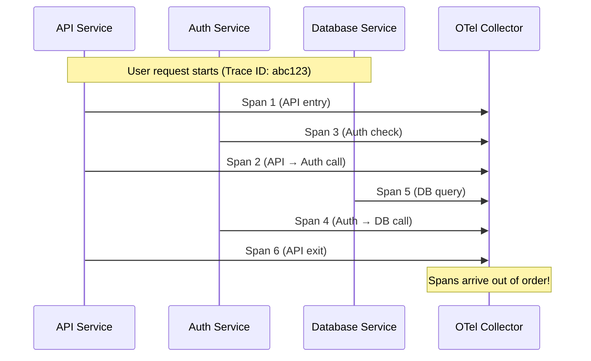
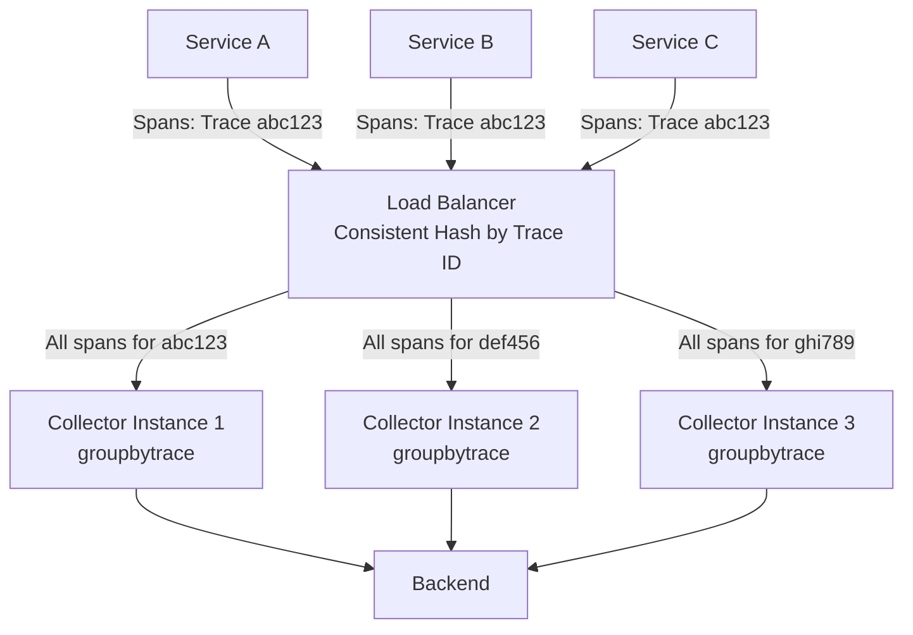

# How to Configure the Group by Trace Processor in the OpenTelemetry Collector

Author: [nawazdhandala](https://www.github.com/nawazdhandala)

Tags: OpenTelemetry, Collector, Processor, Trace, Grouping, Distributed Tracing, Tail Sampling

Description: Learn how to configure the group-by-trace processor in OpenTelemetry Collector to group spans by trace ID, enable trace-aware processing, and prepare traces for tail sampling, filtering.

---

Distributed tracing generates spans across multiple services, and these spans arrive at the OpenTelemetry Collector out of order and from different sources. A single trace - representing one user request through your system - might generate dozens of spans that arrive milliseconds or even seconds apart.

The group-by-trace processor (groupbytrace) solves a critical problem: it collects all spans belonging to the same trace and groups them together before passing them to downstream processors. This grouping enables trace-aware operations for processors that need a whole-trace view, such as per-trace metrics processors or custom processors that analyze complete traces.

## Understanding Trace Fragmentation

In a distributed system, a single user request generates multiple spans across services. These spans flow through your observability pipeline independently.


```mermaid
sequenceDiagram
    participant API as API Service
    participant Auth as Auth Service
    participant DB as Database Service
    participant Collector as OTel Collector

    Note over API,DB: User request starts (Trace ID: abc123)

    API->>Collector: Span 1 (API entry)
    Auth->>Collector: Span 3 (Auth check)
    API->>Collector: Span 2 (API → Auth call)
    DB->>Collector: Span 5 (DB query)
    Auth->>Collector: Span 4 (Auth → DB call)
    API->>Collector: Span 6 (API exit)

    Note over Collector: Spans arrive out of order!
```

Without grouping, downstream processors see individual spans in arrival order: Span 1, Span 3, Span 2, Span 5, Span 4, Span 6. They have no context about which spans belong together or whether all spans for a trace have arrived.

The group-by-trace processor buffers spans and groups them by trace ID, enabling processors downstream to receive spans from the same trace together: Trace abc123 with all 6 spans together when they arrive within the wait window.

## Why You Need This Processor

The group-by-trace processor enables several critical capabilities:

**Tail Sampling**: Make sampling decisions based on the complete trace. Keep all traces with errors, slow traces, or traces matching specific patterns, while dropping normal successful traces. The tail sampling processor has its own trace grouping mechanism, so groupbytrace is not required when tail_sampling is the only downstream processor that needs grouped traces.

**Trace-Aware Processing**: Send each trace as a grouped batch to downstream processors or exporters that work better when all spans for a trace arrive together.

**Trace Analysis**: Calculate trace-level metrics like total duration, span count, service depth, or error propagation. This requires having all spans together.

**Grouped Trace Export**: Send backends grouped traces instead of fragments when spans arrive within the configured wait window. Some analysis tools benefit from receiving trace spans together to build accurate service maps and dependency graphs.

**Batching Control**: By grouping spans before export, you can batch whole trace groups more predictably than individual spans.

## Basic Configuration

The processor requires minimal configuration to start. At minimum, you specify how long to wait for all spans of a trace to arrive.

Here is a basic configuration:

```yaml
# RECEIVERS: Accept traces via OTLP

receivers:
  otlp:
    protocols:
      grpc:
        endpoint: 0.0.0.0:4317

# PROCESSORS: Group spans by trace ID
processors:
  # Group spans belonging to the same trace
  groupbytrace:
    # Maximum time to wait for all spans of a trace
    # After this duration, release the trace even if incomplete
    wait_duration: 10s

  # Batch for efficiency
  batch:
    send_batch_size: 1024
    send_batch_max_size: 1024
    timeout: 10s

# EXPORTERS: Send to backend
exporters:
  otlphttp:
    endpoint: https://oneuptime.com/otlp
    encoding: json
    headers:
      Content-Type: application/json
      x-oneuptime-token: ${ONEUPTIME_TOKEN}

# SERVICE: Define the traces pipeline
service:
  pipelines:
    traces:
      receivers: [otlp]
      processors: [groupbytrace, batch]
      exporters: [otlphttp]
```

The `wait_duration` parameter controls how long the processor waits for spans. Set it based on your system's trace latency - how long it takes for the slowest span in a trace to arrive. For most systems, 10 seconds is sufficient. For complex distributed systems with high latency, you might need 30-60 seconds.

## Enabling Tail Sampling with Trace Grouping

Tail sampling makes sampling decisions after seeing the complete trace, allowing you to keep all error traces and slow traces while sampling normal traces. The tail sampling processor groups spans by trace ID before making decisions, so you can use it directly without adding groupbytrace.

Here is a configuration using tail sampling directly:

```yaml
receivers:
  otlp:
    protocols:
      grpc:
        endpoint: 0.0.0.0:4317

processors:
  # Make tail sampling decisions on grouped traces
  tail_sampling:
    decision_wait: 10s
    num_traces: 100000

    policies:
      # Policy 1: Always keep error traces
      - name: errors
        type: status_code
        status_code:
          status_codes: [ERROR]

      # Policy 2: Keep slow traces (>1 second)
      - name: slow_traces
        type: latency
        latency:
          threshold_ms: 1000

      # Policy 3: Sample 10% of normal traces
      - name: probabilistic
        type: probabilistic
        probabilistic:
          sampling_percentage: 10

  batch:
    send_batch_size: 1024
    send_batch_max_size: 1024
    timeout: 10s

exporters:
  otlphttp:
    endpoint: https://oneuptime.com/otlp
    encoding: json
    headers:
      Content-Type: application/json
      x-oneuptime-token: ${ONEUPTIME_TOKEN}

service:
  pipelines:
    traces:
      receivers: [otlp]
      processors:
        - tail_sampling     # Groups spans by trace ID before deciding
        - batch
      exporters: [otlphttp]
```

This configuration lets the tail sampling processor make intelligent decisions: keep all error traces, keep all slow traces, but only sample 10% of normal fast traces. This dramatically reduces telemetry volume while preserving all problematic traces for debugging.

## Memory Management and Trace Limits

The groupbytrace processor maintains in-memory state for every trace it's tracking. In high-throughput systems, this can consume significant memory.

Here is a production configuration with memory protection:

```yaml
processors:
  # Protect collector from memory exhaustion
  memory_limiter:
    limit_mib: 2048          # Hard limit: 2GB
    spike_limit_mib: 512     # Allow temporary spikes
    check_interval: 1s

  # Group traces with strict limits
  groupbytrace:
    wait_duration: 10s

    # Maximum number of concurrent traces to track
    # Prevents memory exhaustion from trace ID explosion
    num_traces: 50000

    # Increase workers when trace grouping becomes CPU-bound
    num_workers: 2

  batch:
    send_batch_size: 1024
    send_batch_max_size: 1024
    timeout: 10s

exporters:
  otlphttp:
    endpoint: https://oneuptime.com/otlp
    encoding: json
    headers:
      Content-Type: application/json
      x-oneuptime-token: ${ONEUPTIME_TOKEN}

service:
  pipelines:
    traces:
      receivers: [otlp]
      processors:
        - memory_limiter     # First line of defense
        - groupbytrace       # Then group with limits
        - batch
      exporters: [otlphttp]
```

The `num_traces` parameter limits how many concurrent traces the processor tracks. If this limit is exceeded, the processor evicts traces due to capacity pressure, which is exposed through the `otelcol_processor_groupbytrace_traces_evicted` metric.

The `num_workers` parameter controls how many workers process the processor's internal event queue. Increasing it can help when grouping itself becomes a bottleneck, but it does not replace overall memory sizing and the memory limiter.

## Handling Incomplete Traces

Not all traces will have all their spans arrive within the wait duration. Network delays, service failures, or SDK bugs can cause spans to be lost or delayed beyond the wait window.

The processor releases whatever spans it has collected after `wait_duration`:

```yaml
processors:
  groupbytrace:
    wait_duration: 10s
    num_traces: 50000

  batch:
    send_batch_size: 1024
    send_batch_max_size: 1024
    timeout: 10s

exporters:
  otlphttp:
    endpoint: https://oneuptime.com/otlp
    encoding: json
    headers:
      Content-Type: application/json
      x-oneuptime-token: ${ONEUPTIME_TOKEN}

service:
  pipelines:
    traces:
      receivers: [otlp]
      processors: [groupbytrace, batch]
      exporters: [otlphttp]
```

After `wait_duration` expires, the processor releases the trace data it has and removes that trace from internal storage. Spans from the same trace that arrive after release are collected again for the full wait duration and then released as another grouped batch.

## Multi-Tenant Trace Grouping

In multi-tenant environments, you might want to group traces per tenant to ensure fair resource allocation and prevent one tenant from exhausting the processor's memory.

Here is a configuration for multi-tenant trace grouping:

```yaml
processors:
  # First, ensure tenant ID is available as an attribute
  resource/ensure_tenant:
    attributes:
      - key: tenant.id
        value: "default"
        action: insert    # Add default if missing

  # Group traces with per-tenant limits (requires custom configuration)
  groupbytrace:
    wait_duration: 10s
    num_traces: 50000    # Total across all tenants

  batch:
    send_batch_size: 1024
    send_batch_max_size: 1024
    timeout: 10s

exporters:
  otlphttp:
    endpoint: https://oneuptime.com/otlp
    encoding: json
    headers:
      Content-Type: application/json
      x-oneuptime-token: ${ONEUPTIME_TOKEN}

service:
  pipelines:
    traces:
      receivers: [otlp]
      processors:
        - resource/ensure_tenant
        - groupbytrace
        - batch
      exporters: [otlphttp]
```

The groupbytrace processor doesn't have built-in per-tenant limits, but you can combine it with the resource processor to ensure tenant identification. Downstream systems (like OneUptime) can then enforce per-tenant quotas and analysis.

## Combining with Trace-Aware Filtering

After grouping spans into complete traces, you can apply filtering to drop spans based on patterns. The filter processor drops matching spans; if you need to drop whole traces based on trace content, use a tail sampling drop policy.

Here is a configuration that drops health check spans:

```yaml
processors:
  # Group spans into complete traces
  groupbytrace:
    wait_duration: 10s
    num_traces: 50000

  # Filter out health check spans
  filter/drop_health_checks:
    error_mode: ignore
    trace_conditions:
      # Drop spans that match health check patterns
      - 'span.attributes["http.target"] == "/health"'
      - 'span.attributes["http.target"] == "/healthz"'
      - 'span.attributes["http.target"] == "/ready"'

  batch:
    send_batch_size: 1024
    send_batch_max_size: 1024
    timeout: 10s

exporters:
  otlphttp:
    endpoint: https://oneuptime.com/otlp
    encoding: json
    headers:
      Content-Type: application/json
      x-oneuptime-token: ${ONEUPTIME_TOKEN}

service:
  pipelines:
    traces:
      receivers: [otlp]
      processors:
        - groupbytrace              # First group
        - filter/drop_health_checks # Then filter complete traces
        - batch
      exporters: [otlphttp]
```

This configuration groups traces, then drops spans that match the health check patterns. Be careful with this pattern: dropping parent spans can leave orphaned spans in the same trace.

## Distributed Collector Architecture

In large-scale deployments, you might run multiple collector instances. Trace grouping requires all spans of a trace to reach the same collector instance for proper grouping.

Here is an architecture diagram:


```mermaid
graph TD
    A[Service A] -->|Spans: Trace abc123| B["Load Balancer<br/>Consistent Hash by Trace ID"]
    C[Service B] -->|Spans: Trace abc123| B
    D[Service C] -->|Spans: Trace abc123| B

    B -->|All spans for abc123| E["Collector Instance 1<br/>groupbytrace"]
    B -->|All spans for def456| F["Collector Instance 2<br/>groupbytrace"]
    B -->|All spans for ghi789| G["Collector Instance 3<br/>groupbytrace"]

    E --> H[Backend]
    F --> H
    G --> H
```

The load balancer uses consistent hashing on trace ID to route all spans of a trace to the same collector instance. This ensures the groupbytrace processor can see all spans together.

Here is a configuration for this architecture using a load balancing exporter:

```yaml
receivers:
  otlp:
    protocols:
      grpc:
        endpoint: 0.0.0.0:4317

processors:
  # No grouping at this layer - just forward
  batch:
    send_batch_size: 1024
    send_batch_max_size: 1024
    timeout: 10s

exporters:
  # Load balance to downstream collectors by trace ID
  load_balancing:
    protocol:
      otlp:
        tls:
          insecure: true

    resolver:
      dns:
        hostname: collector-cluster
        port: "4317"

    # CRITICAL: Route by trace ID for proper grouping
    routing_key: "traceID"

service:
  pipelines:
    traces:
      receivers: [otlp]
      processors: [batch]
      exporters: [load_balancing]
```

This is the configuration for the gateway collector tier. It receives spans and routes them to downstream collectors by trace ID.

Here is the configuration for the downstream collector tier that performs grouping:

```yaml
receivers:
  otlp:
    protocols:
      grpc:
        endpoint: 0.0.0.0:4317

processors:
  # Now group - all spans for a trace reach this instance
  groupbytrace:
    wait_duration: 10s
    num_traces: 50000

  tail_sampling:
    decision_wait: 10s
    num_traces: 50000
    policies:
      - name: errors
        type: status_code
        status_code:
          status_codes: [ERROR]
      - name: probabilistic
        type: probabilistic
        probabilistic:
          sampling_percentage: 10

  batch:
    send_batch_size: 1024
    send_batch_max_size: 1024
    timeout: 10s

exporters:
  otlphttp:
    endpoint: https://oneuptime.com/otlp
    encoding: json
    headers:
      Content-Type: application/json
      x-oneuptime-token: ${ONEUPTIME_TOKEN}

service:
  pipelines:
    traces:
      receivers: [otlp]
      processors:
        - groupbytrace
        - tail_sampling
        - batch
      exporters: [otlphttp]
```

This two-tier architecture enables horizontal scaling while maintaining trace grouping correctness.

## Optimizing Wait Duration

The `wait_duration` parameter is critical for performance and completeness. Too short and you'll process incomplete traces. Too long and you'll consume unnecessary memory and add latency.

Here is how to determine the right value:

**Measure your P99 trace duration**: The wait duration should be at least your P99 trace duration. If 99% of traces complete within 5 seconds, set wait_duration to at least 5 seconds.

**Add network and processing buffer**: Add 2-3 seconds for network latency and SDK buffering. If P99 trace duration is 5 seconds, use 7-8 seconds for wait_duration.

**Consider service failures**: When a service fails, its spans might never arrive. A longer wait_duration means holding incomplete traces longer. Balance between completeness and memory usage.

**Monitor grouping behavior**: Track groupbytrace internal metrics and backend-side partial traces. If many traces are evicted, increase `num_traces` or reduce `wait_duration`. If traces often appear split in the backend, increase `wait_duration` or check collector routing.

Here is a configuration with monitoring:

```yaml
processors:
  groupbytrace:
    wait_duration: 10s
    num_traces: 50000

  batch:
    send_batch_size: 1024
    send_batch_max_size: 1024
    timeout: 10s

exporters:
  otlphttp:
    endpoint: https://oneuptime.com/otlp
    encoding: json
    headers:
      Content-Type: application/json
      x-oneuptime-token: ${ONEUPTIME_TOKEN}

service:
  telemetry:
    metrics:
      level: detailed
      readers:
        - pull:
            exporter:
              prometheus:
                host: 0.0.0.0
                port: 8888

  pipelines:
    traces:
      receivers: [otlp]
      processors: [groupbytrace, batch]
      exporters: [otlphttp]
```

Monitor these metrics from the collector:
- `otelcol_processor_groupbytrace_traces_released`: Number of traces released
- `otelcol_processor_groupbytrace_spans_released`: Number of spans released
- `otelcol_processor_groupbytrace_traces_evicted`: Traces evicted due to limits

If `traces_evicted` is high, either increase `num_traces` or decrease `wait_duration` to process traces faster.

## Working with Large Traces

Some operations generate traces with hundreds or thousands of spans. A single batch job might create a trace with 10,000 spans. The groupbytrace processor needs protection against these.

Here is a configuration handling large traces:

```yaml
processors:
  memory_limiter:
    limit_mib: 4096          # 4GB for large trace environments
    spike_limit_mib: 1024

  groupbytrace:
    wait_duration: 30s       # Longer wait for large traces
    num_traces: 10000        # Fewer concurrent traces
    num_workers: 4           # More workers for the grouping queue

  batch:
    send_batch_size: 2048
    send_batch_max_size: 2048
    timeout: 10s

exporters:
  otlphttp:
    endpoint: https://oneuptime.com/otlp
    encoding: json
    headers:
      Content-Type: application/json
      x-oneuptime-token: ${ONEUPTIME_TOKEN}

service:
  pipelines:
    traces:
      receivers: [otlp]
      processors:
        - memory_limiter
        - groupbytrace
        - batch
      exporters: [otlphttp]
```

For systems that generate very large traces, allocate more memory to the collector and tune `num_traces` based on concurrency. Also increase `wait_duration` if large traces take longer to complete.

## Debugging and Validation

To verify trace grouping is working correctly, enable debug logging and use the debug exporter.

Here is a debugging configuration:

```yaml
receivers:
  otlp:
    protocols:
      grpc:
        endpoint: 0.0.0.0:4317

processors:
  groupbytrace:
    wait_duration: 10s
    num_traces: 50000

  batch:
    send_batch_size: 1024
    send_batch_max_size: 1024
    timeout: 10s

exporters:
  otlphttp:
    endpoint: https://oneuptime.com/otlp
    encoding: json
    headers:
      Content-Type: application/json
      x-oneuptime-token: ${ONEUPTIME_TOKEN}

  # Log traces to console for debugging
  debug:
    verbosity: detailed
    sampling_initial: 10     # Log first 10 traces
    sampling_thereafter: 100

service:
  telemetry:
    logs:
      level: debug

  pipelines:
    traces:
      receivers: [otlp]
      processors: [groupbytrace, batch]
      exporters: [otlphttp, debug]  # Add debug exporter
```

The debug exporter prints traces to stdout, showing spans grouped together. Verify that spans with the same trace ID appear together in the output.

## Common Pitfalls and Solutions

**Problem**: Traces are always incomplete, with missing spans.

**Solution**: Your wait_duration is too short. Measure your actual trace durations (P99) and set wait_duration to at least that value plus a few seconds buffer.

**Problem**: Collector memory usage keeps growing.

**Solution**: Set `num_traces` to limit concurrent traces. Also check for trace ID generation bugs in your instrumentation - if every span gets a unique trace ID, every span becomes its own "trace" and the processor tracks them all separately.

**Problem**: Tail sampling isn't working as expected.

**Solution**: Ensure all spans for a trace reach the same collector instance and tune `decision_wait` so the tail sampling processor has enough time to collect spans before deciding. The tail sampling processor groups spans internally and does not require groupbytrace.

**Problem**: Some traces are split across multiple exports.

**Solution**: In multi-collector deployments, ensure you're using consistent hashing by trace ID to route all spans of a trace to the same collector instance. Without this, spans of a trace hit different collectors and can't be grouped.

## Integration with OneUptime

OneUptime handles both complete and incomplete traces efficiently, but complete traces enable better analysis, service maps, and dependency graphs.

Here is a complete production configuration for OneUptime:

```yaml
receivers:
  otlp:
    protocols:
      grpc:
        endpoint: 0.0.0.0:4317
      http:
        endpoint: 0.0.0.0:4318

processors:
  memory_limiter:
    limit_mib: 2048
    spike_limit_mib: 512

  groupbytrace:
    wait_duration: 10s
    num_traces: 50000
    num_workers: 2

  tail_sampling:
    decision_wait: 10s
    num_traces: 50000
    policies:
      - name: errors
        type: status_code
        status_code:
          status_codes: [ERROR]
      - name: slow
        type: latency
        latency:
          threshold_ms: 1000
      - name: normal
        type: probabilistic
        probabilistic:
          sampling_percentage: 10

  batch:
    send_batch_size: 1024
    send_batch_max_size: 1024
    timeout: 10s

exporters:
  otlphttp:
    endpoint: https://oneuptime.com/otlp
    encoding: json
    headers:
      Content-Type: application/json
      x-oneuptime-token: ${ONEUPTIME_TOKEN}
    retry_on_failure:
      enabled: true
      initial_interval: 5s
      max_interval: 30s

service:
  pipelines:
    traces:
      receivers: [otlp]
      processors:
        - memory_limiter
        - groupbytrace
        - tail_sampling
        - batch
      exporters: [otlphttp]
```

This configuration groups traces before export and applies intelligent tail sampling to reduce volume while keeping all problematic traces for OneUptime analysis.

## Related Resources

For more information on trace processing and sampling in OpenTelemetry:

- [OpenTelemetry Collector: What It Is, When You Need It, and When You Don't](https://oneuptime.com/blog/post/2025-09-18-what-is-opentelemetry-collector-and-why-use-one/view)
- [How to Reduce Noise in OpenTelemetry](https://oneuptime.com/blog/post/2025-08-25-how-to-reduce-noise-in-opentelemetry/view)
- [Three Pillars of Observability: Logs, Metrics, Traces](https://oneuptime.com/blog/post/2025-08-20-three-pillars-of-observability-logs-metrics-traces/view)

## Conclusion

The group-by-trace processor is useful for trace-aware processing in OpenTelemetry when downstream components need grouped traces. It collects fragmented spans from distributed systems and releases them together after a configured wait duration, enabling complete trace export and comprehensive trace analysis.

Configure it with appropriate wait_duration based on your system's trace latency, protect against memory exhaustion with num_traces and the memory limiter, and place it before processors or exporters that need grouped traces. With OneUptime as your backend, you get a platform that efficiently handles and analyzes complete traces, making full use of the organization this processor provides.
