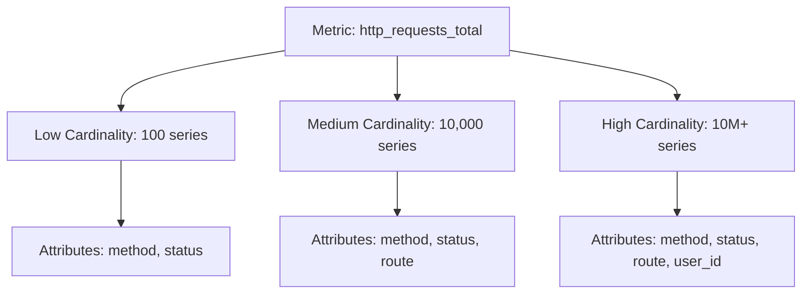

# Handle High-Cardinality Metrics in OpenTelemetry Without Blowing Your Budget

Author: [nawazdhandala](https://www.github.com/nawazdhandala)

Tags: OpenTelemetry, Performance, Metric, Cardinality, Cost Optimization

Description: Learn practical strategies to manage high-cardinality metrics in OpenTelemetry, including filtering, aggregation, and dimension reduction techniques that reduce costs by up to 70%.

High-cardinality metrics are one of the biggest cost drivers in observability systems. When you track metrics with attributes like user IDs, request IDs, or IP addresses, the number of unique time series explodes exponentially. A single metric with 10 high-cardinality attributes can generate millions of unique series, each costing money to store and query.

OpenTelemetry provides several mechanisms to handle high-cardinality metrics without sacrificing observability. This guide covers practical strategies to reduce cardinality while maintaining useful insights.

## Understanding Cardinality and Its Impact

Cardinality refers to the number of unique combinations of label values in your metrics. A metric with attributes `http.method`, `http.status_code`, and `http.route` has bounded cardinality because these values are limited. But add a `user.id` attribute, and cardinality explodes to the number of users in your system.


```mermaid
graph TD
    A[Metric: http_requests_total] --> B[Low Cardinality: 100 series]
    A --> C[Medium Cardinality: 10,000 series]
    A --> D[High Cardinality: 10M+ series]
    B --> E[Attributes: method, status]
    C --> F[Attributes: method, status, route]
    D --> G[Attributes: method, status, route, user_id]
```

Most observability backends charge based on the number of unique time series. High-cardinality metrics can consume 70-90% of your observability budget while providing limited value.

## Strategy 1: Drop High-Cardinality Attributes at Collection

The simplest approach is preventing high-cardinality attributes from entering your pipeline. Configure your OpenTelemetry SDK to exclude problematic attributes at instrumentation time.

```python
# Python SDK configuration to drop high-cardinality attributes

from opentelemetry import metrics
from opentelemetry.sdk.metrics import MeterProvider
from opentelemetry.sdk.metrics.view import View

# Define a view that drops user_id and request_id attributes
view = View(
    instrument_name="http.server.request.duration",
    attribute_keys={"http.method", "http.status_code", "http.route"},
    # Only these attributes will be retained, all others dropped
)

# Create meter provider with the view
provider = MeterProvider(views=[view])
metrics.set_meter_provider(provider)
```

This configuration ensures that only the specified attributes are retained. Any other attributes instrumented by libraries are dropped before metrics are exported.

## Strategy 2: Use the Filter Processor in Collector

The OpenTelemetry Collector's filter processor drops metrics based on patterns. This is useful when you cannot control SDK configuration or when using auto-instrumentation.

```yaml
# OpenTelemetry Collector configuration
processors:
  # Filter processor to drop high-cardinality metrics
  filter/drop_cardinality:
    error_mode: ignore
    # Drop metrics that match specific patterns
    metric_conditions:
      - 'IsMatch(metric.name, ".*user_id.*")'
      - 'IsMatch(metric.name, ".*session_id.*")'
      - 'IsMatch(metric.name, ".*request_id.*")'

      # Also use datapoint filtering to drop based on attributes
      - 'datapoint.attributes["user.id"] != nil'
      - 'datapoint.attributes["trace.id"] != nil'

  # Transform processor to remove specific attributes
  transform/remove_attributes:
    metric_statements:
      - context: datapoint
        statements:
          # Remove high-cardinality attributes from all metrics
          - delete_key(datapoint.attributes, "user.id")
          - delete_key(datapoint.attributes, "session.id")
          - delete_key(datapoint.attributes, "request.id")
          - delete_key(datapoint.attributes, "client.ip")

service:
  pipelines:
    metrics:
      processors: [filter/drop_cardinality, transform/remove_attributes, batch]
```

The filter processor completely drops metrics or datapoints, while the transform processor removes specific attributes while keeping the metric.

## Strategy 3: Aggregate High-Cardinality Dimensions

Instead of dropping attributes entirely, aggregate them into lower-cardinality buckets. This preserves some information while dramatically reducing series count.

```yaml
# Collector configuration for dimension aggregation
processors:
  # Transform processor for bucketing high-cardinality values
  transform/aggregate_dimensions:
    metric_statements:
      - context: datapoint
        statements:
          # Bucket HTTP status codes into ranges (2xx, 3xx, 4xx, 5xx)
          - set(datapoint.attributes["http.status_class"], Concat([Substring(String(datapoint.attributes["http.status_code"]), 0, 1), "xx"], ""))
          - delete_key(datapoint.attributes, "http.status_code")

          # Bucket routes with IDs into templates
          # /users/12345 becomes /users/{id}
          - replace_pattern(datapoint.attributes["http.route"], "/\\d+", "/{id}")

          # Convert IP addresses to /24 subnets
          # 192.168.1.123 becomes 192.168.1.0/24
          - set(datapoint.attributes["client.subnet"], String(datapoint.attributes["client.ip"]))
          - replace_pattern(datapoint.attributes["client.subnet"], "^(\\d+\\.\\d+\\.\\d+)\\.\\d+$", "$$1.0/24")
          - delete_key(datapoint.attributes, "client.ip")

service:
  pipelines:
    metrics:
      processors: [transform/aggregate_dimensions, batch]
```

This approach reduces cardinality while maintaining useful groupings for debugging and analysis.

## Strategy 4: Implement Metric Views with Aggregation

OpenTelemetry SDKs support Views, which define how metrics are aggregated before export. Views can reduce cardinality at the source.

```go
// Go SDK configuration with views for cardinality reduction
package main

import (
    "go.opentelemetry.io/otel/attribute"
    "go.opentelemetry.io/otel/sdk/metric"
)

func initMeterProvider() *metric.MeterProvider {
    // Create a view that aggregates request duration without user_id
    view := metric.NewView(
        metric.Instrument{Name: "http.server.request.duration"},
        metric.Stream{
            // Only keep low-cardinality attributes
            AttributeFilter: func(kv attribute.KeyValue) bool {
                key := string(kv.Key)
                // Drop high-cardinality attributes
                return key != "user.id" &&
                       key != "request.id" &&
                       key != "trace.id" &&
                       key != "client.ip"
            },
            // Use histogram with specific buckets to control cardinality
            Aggregation: metric.AggregationExplicitBucketHistogram{
                Boundaries: []float64{0.005, 0.01, 0.025, 0.05, 0.1, 0.25, 0.5, 1.0, 2.5, 5.0, 10.0},
            },
        },
    )

    return metric.NewMeterProvider(
        metric.WithView(view),
    )
}
```

Views provide fine-grained control over metric aggregation and can dramatically reduce exported series count.

## Strategy 5: Use Sampling for High-Cardinality Metrics

For metrics that must include high-cardinality attributes, use deterministic filtering to reduce volume while preserving repeatable cohorts. The Collector's `probabilistic_sampler` processor supports traces and logs, not metrics, so metric sampling is usually implemented at instrumentation time or with OTTL filters.

```yaml
# Collector configuration for deterministic metric filtering
processors:
  # Keep only a deterministic 1% cohort for datapoints with numeric user IDs
  filter/user_id_cohort:
    error_mode: ignore
    metric_conditions:
      # Drop datapoints with user.id unless the ID is evenly divisible by 100
      - 'metric.name == "http.server.request.duration" and datapoint.attributes["user.id"] != nil and Int(datapoint.attributes["user.id"]) / 100 * 100 != Int(datapoint.attributes["user.id"])'

service:
  pipelines:
    metrics/sampled:
      receivers: [otlp]
      processors: [filter/user_id_cohort, batch]
      exporters: [otlp/backend]
```

Sampling maintains visibility into trends while reducing the number of stored time series.

## Strategy 6: Implement Cardinality Limits in Collector

The OpenTelemetry Collector contrib repository has a development-stage Cardinality Guardian processor for catching cardinality explosions. It is not included in the standard Collector distributions, so you need a custom Collector build before using this configuration.

```yaml
# Development-stage cardinality guardian processor
processors:
  # Note: Requires a custom Collector build that includes cardinalityguardianprocessor
  cardinality_guardian:
    # Max new unique values per metric attribute per epoch
    max_cardinality_delta_per_epoch: 100

    # Epoch rotation interval in seconds
    epoch_duration_seconds: 300

    # Start in tag-only mode before enforcing drops
    enforcement_mode: tag_only

    # Labels that are never stripped regardless of cardinality
    never_drop_labels:
      - http.method
      - http.status_code
      - service.name

  # Alternative: use transform aggregation in metric context
  transform/reduce_cardinality:
    metric_statements:
      - context: metric
        statements:
          - aggregate_on_attributes("sum", ["http.method", "http.status_code", "service.name"])

service:
  pipelines:
    metrics:
      processors: [transform/reduce_cardinality, batch]
```

## Monitoring Your Cardinality

Track your cardinality to understand the impact of these strategies:

```yaml
# Monitor Collector throughput and backend series counts
# - otelcol_receiver_accepted_metric_points
# - otelcol_exporter_sent_metric_points
# - otelcol_processor_batch_batch_send_size
# - Unique time series per metric in your backend
# - Top attribute keys by unique value count in your backend
```

## Real-World Example: E-Commerce Platform

An e-commerce platform reduced their observability costs by 68% by implementing these strategies:

```yaml
# Production configuration for e-commerce metrics
processors:
  # Step 1: Remove customer-specific identifiers
  transform/anonymize:
    metric_statements:
      - context: datapoint
        statements:
          # Hash customer IDs into deterministic buckets
          - set(datapoint.attributes["customer.segment"], Concat(["bucket-", Substring(SHA256(String(datapoint.attributes["customer.id"])), 0, 2)], ""))
          - delete_key(datapoint.attributes, "customer.id")

          # Aggregate products into categories
          - set(datapoint.attributes["product.category"], datapoint.attributes["product.category_l1"])
          - delete_key(datapoint.attributes, "product.id")
          - delete_key(datapoint.attributes, "product.sku")

  # Step 2: Filter out unnecessary metrics
  filter/essential_only:
    error_mode: ignore
    metric_conditions:
      - 'not IsMatch(metric.name, "^http\\.server\\..*") and not IsMatch(metric.name, "^db\\.client\\..*") and not IsMatch(metric.name, "^service\\.latency\\..*")'

  # Step 3: Batch with appropriate sizing
  batch:
    send_batch_size: 1024
    timeout: 10s

service:
  pipelines:
    metrics:
      receivers: [otlp]
      processors: [transform/anonymize, filter/essential_only, batch]
      exporters: [prometheusremotewrite]
```

This configuration maintained full observability for system health while eliminating expensive per-customer metrics.

## Best Practices Summary

1. **Identify high-cardinality attributes early** - Use cardinality estimation tools during development
2. **Drop at the source** - Configure SDKs to never collect high-cardinality attributes
3. **Use Views strategically** - Define aggregation rules at instrumentation time
4. **Aggregate before export** - Transform high-cardinality dimensions into buckets
5. **Monitor cardinality continuously** - Set up alerts for unexpected cardinality growth
6. **Document your cardinality strategy** - Ensure team alignment on what attributes to track

## Related Resources

For more information on optimizing OpenTelemetry costs, see:
- https://oneuptime.com/blog/post/2026-02-06-delta-temporality-manage-cardinality-explosions/view
- https://oneuptime.com/blog/post/2026-02-06-cut-observability-costs-opentelemetry-filtering-sampling/view
- https://oneuptime.com/blog/post/2026-02-06-probabilistic-sampling-opentelemetry-cost-control/view

High-cardinality metrics are manageable with the right strategies. By implementing attribute filtering, aggregation, and sampling, you can maintain observability while keeping costs under control. The key is to be intentional about what you measure and how you aggregate it.
