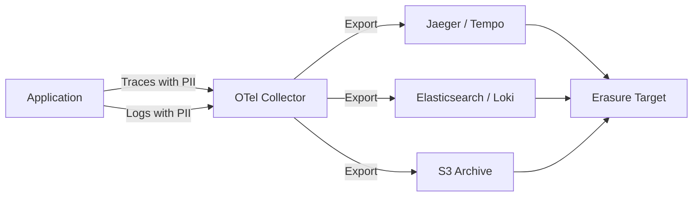
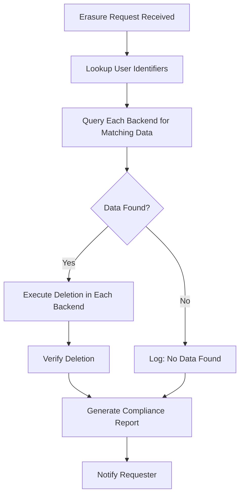

# How to Handle Right-to-Erasure Requests When Telemetry Data is in Storage

Author: [nawazdhandala](https://www.github.com/nawazdhandala)

Tags: OpenTelemetry, Privacy, GDPR, Data Erasure, Compliance, Observability

Description: A practical guide to handling GDPR right-to-erasure requests when telemetry data containing personal information is stored in your observability backends.

---

If you run OpenTelemetry pipelines in production, there is a good chance your traces, logs, and metrics contain personal data. User IDs embedded in span attributes, email addresses captured in log messages, IP addresses recorded as resource attributes - all of this falls under regulations like GDPR. When a user submits a right-to-erasure request (also known as the "right to be forgotten"), you need a plan for finding and removing their data from your telemetry storage.

This is not a simple DELETE query. Telemetry data is spread across multiple backends, stored in time-series databases, indexed in search engines, and sometimes archived in object storage. Let's walk through a practical approach to handling these requests without breaking your observability infrastructure.

## Understanding What Telemetry Data Falls Under Erasure

Not all telemetry data is subject to erasure requests. Metrics that are fully aggregated and contain no personal identifiers are generally fine. But traces and logs are a different story. Consider a typical span:

```json
{
  "traceId": "abc123def456",
  "spanId": "span789",
  "operationName": "POST /api/users/update",
  "attributes": {
    "user.id": "usr_42981",
    "user.email": "jane@example.com",
    "http.client_ip": "203.0.113.45",
    "enduser.id": "jane_doe"
  }
}
```

The `user.id`, `user.email`, `http.client_ip`, and `enduser.id` attributes all contain personal data. Under GDPR Article 17, when Jane requests erasure, you need to locate and remove or anonymize every occurrence of her data across your telemetry storage.

## Step 1: Build a Data Inventory for Telemetry

Before you can delete anything, you need to know where personal data lives. Create a mapping of which telemetry signals carry PII and where they end up.



Document every exporter destination in your collector configuration. If you use a gateway collector that fans out to multiple backends, each backend is a potential location for PII.

Here is a sample collector config that exports to multiple destinations. Each destination needs to be part of your erasure workflow.

```yaml
# OpenTelemetry Collector config showing multiple export destinations
# Each destination must be included in your data erasure inventory
exporters:
  otlp/jaeger:
    endpoint: jaeger-collector:4317
    tls:
      insecure: false

  elasticsearch:
    endpoints: ["https://es-cluster:9200"]
    logs_index: otel-logs
    traces_index: otel-traces

  awss3:
    s3uploader:
      region: us-east-1
      s3_bucket: telemetry-archive
      s3_prefix: raw-data

service:
  pipelines:
    traces:
      receivers: [otlp]
      processors: [batch]
      exporters: [otlp/jaeger, elasticsearch, awss3]
    logs:
      receivers: [otlp]
      processors: [batch]
      exporters: [elasticsearch, awss3]
```

## Step 2: Tag Telemetry Data with User Identifiers at Ingestion

Erasure requests reference a specific user, usually by email or user ID. If your telemetry uses internal identifiers that cannot be linked back to a user, you will struggle to find the right data.

Use a consistent identifier across all signals. The OpenTelemetry semantic conventions define `enduser.id` as the standard attribute for this purpose. Make sure every span and log record that touches user-specific operations includes this attribute.

```python
# Python instrumentation that adds a consistent user identifier
# to every span, making it searchable for erasure requests
from opentelemetry import trace

tracer = trace.get_tracer("user-service")

def handle_request(user):
    with tracer.start_as_current_span("process_order") as span:
        # Always use the same attribute key for user identification
        span.set_attribute("enduser.id", user.id)
        span.set_attribute("user.email_hash", hash_email(user.email))
        # Process the order...
```

Hashing the email at the instrumentation layer gives you a searchable pseudonym. Store the mapping between real emails and hashes in a separate lookup table that you control.

## Step 3: Implement Erasure in Each Backend

Each storage backend requires a different deletion strategy. Here are the most common ones.

### Elasticsearch / OpenSearch

Elasticsearch supports delete-by-query, which makes it relatively straightforward.

```bash
# Delete all trace documents containing the target user's identifier
# This searches across all OpenTelemetry trace indices
curl -X POST "https://es-cluster:9200/otel-traces-*/_delete_by_query" \
  -H "Content-Type: application/json" \
  -d '{
    "query": {
      "bool": {
        "should": [
          { "term": { "attributes.enduser.id": "usr_42981" } },
          { "term": { "attributes.user.email": "jane@example.com" } }
        ]
      }
    }
  }'

# Repeat for log indices
curl -X POST "https://es-cluster:9200/otel-logs-*/_delete_by_query" \
  -H "Content-Type: application/json" \
  -d '{
    "query": {
      "term": { "body": "jane@example.com" }
    }
  }'
```

### Grafana Tempo / Jaeger with Cassandra

These backends are trickier. Tempo stores traces as objects and does not support selective deletion within a trace. Your options are:

1. Delete the entire trace if it contains the user's data.
2. Set a short retention period and let TTL handle it.
3. Export, redact, and re-import (expensive but thorough).

For Jaeger backed by Cassandra, you can write a targeted deletion script.

```python
# Script to delete specific traces from Cassandra-backed Jaeger
# Finds traces by user attribute and removes them
from cassandra.cluster import Cluster

cluster = Cluster(["cassandra-node1", "cassandra-node2"])
session = cluster.connect("jaeger_v1_dc1")

# Find trace IDs associated with the user
rows = session.execute(
    "SELECT trace_id FROM tag_index WHERE tag_key = %s AND tag_value = %s",
    ("enduser.id", "usr_42981")
)

# Delete each trace and its associated spans
for row in rows:
    trace_id = row.trace_id
    session.execute("DELETE FROM traces WHERE trace_id = %s", (trace_id,))
    session.execute("DELETE FROM span_index WHERE trace_id = %s", (trace_id,))
    print(f"Deleted trace {trace_id}")

cluster.shutdown()
```

### S3 / Object Storage Archives

For archived telemetry in S3, you will need to scan objects, filter out matching records, and rewrite the files.

```python
# Process archived telemetry files in S3
# Reads each file, removes records matching the target user, and rewrites
import boto3
import json

s3 = boto3.client("s3")
bucket = "telemetry-archive"
prefix = "raw-data/"

# List all archived telemetry files
response = s3.list_objects_v2(Bucket=bucket, Prefix=prefix)

for obj in response.get("Contents", []):
    key = obj["Key"]
    data = s3.get_object(Bucket=bucket, Key=key)
    records = json.loads(data["Body"].read())

    # Filter out records belonging to the target user
    cleaned = [
        r for r in records
        if r.get("attributes", {}).get("enduser.id") != "usr_42981"
    ]

    # Only rewrite if records were actually removed
    if len(cleaned) < len(records):
        s3.put_object(
            Bucket=bucket,
            Key=key,
            Body=json.dumps(cleaned)
        )
        print(f"Cleaned {len(records) - len(cleaned)} records from {key}")
```

## Step 4: Automate the Erasure Workflow

Manual deletion does not scale. Build an automated pipeline that takes an erasure request and fans out deletions to every backend.



A simple orchestrator script ties this together.

```python
# Erasure request orchestrator
# Coordinates deletion across all telemetry backends
import logging

logger = logging.getLogger("erasure")

def process_erasure_request(user_id: str, user_email: str):
    """Run erasure across all registered telemetry backends."""
    backends = [
        ElasticsearchEraser(user_id, user_email),
        JaegerCassandraEraser(user_id),
        S3ArchiveEraser(user_id),
    ]

    results = {}
    for backend in backends:
        try:
            count = backend.delete()
            results[backend.name] = {"status": "completed", "records_deleted": count}
            logger.info(f"Deleted {count} records from {backend.name}")
        except Exception as e:
            results[backend.name] = {"status": "failed", "error": str(e)}
            logger.error(f"Erasure failed for {backend.name}: {e}")

    # Generate audit trail for compliance
    generate_compliance_report(user_id, results)
    return results
```

## Step 5: Prevent PII from Reaching Storage in the First Place

The best erasure strategy is to never store PII in telemetry data at all. Use the OpenTelemetry Collector's transform processor to strip or hash personal data before it hits your backends.

```yaml
# Collector config that redacts PII before export
# This reduces the scope of future erasure requests significantly
processors:
  transform:
    trace_statements:
      - context: span
        statements:
          # Hash the email attribute so the original value is not stored
          - set(attributes["user.email"], SHA256(attributes["user.email"]))
            where attributes["user.email"] != nil
          # Remove IP addresses entirely
          - delete_key(attributes, "http.client_ip")

  # Also filter sensitive log body content
  transform/logs:
    log_statements:
      - context: log
        statements:
          - replace_pattern(body, "\\b[A-Za-z0-9._%+-]+@[A-Za-z0-9.-]+\\.[A-Z|a-z]{2,}\\b", "[REDACTED_EMAIL]")

service:
  pipelines:
    traces:
      receivers: [otlp]
      processors: [transform, batch]
      exporters: [otlp/jaeger]
    logs:
      receivers: [otlp]
      processors: [transform/logs, batch]
      exporters: [elasticsearch]
```

By hashing emails and stripping IPs at the collector level, you dramatically reduce the amount of PII that ever reaches storage. Future erasure requests become much simpler because there is less raw personal data to find and delete.

## Retention Policies as a Safety Net

Set aggressive retention policies on your telemetry backends. If traces are automatically deleted after 30 days and logs after 90 days, then any PII that slips through will be removed on schedule. This does not replace targeted erasure (GDPR requires timely response, usually within 30 days), but it limits the blast radius.

```yaml
# Elasticsearch ILM policy for automatic telemetry cleanup
# Ensures data does not persist beyond the retention window
PUT _ilm/policy/telemetry-lifecycle
{
  "policy": {
    "phases": {
      "hot": { "min_age": "0ms", "actions": { "rollover": { "max_age": "1d" } } },
      "warm": { "min_age": "7d", "actions": { "shrink": { "number_of_shards": 1 } } },
      "delete": { "min_age": "30d", "actions": { "delete": {} } }
    }
  }
}
```

## Wrapping Up

Handling right-to-erasure requests for telemetry data requires preparation. You need to know where PII lives, maintain consistent user identifiers across signals, implement backend-specific deletion logic, and automate the whole workflow. The most effective strategy combines proactive PII reduction at the collector level with retention policies and targeted deletion capabilities. Start by auditing your current telemetry pipelines for personal data, then build out the deletion infrastructure before the first request arrives.
