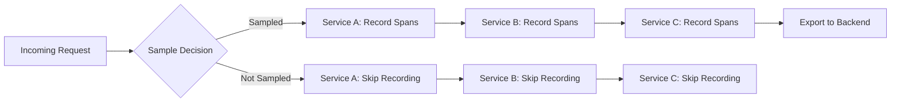
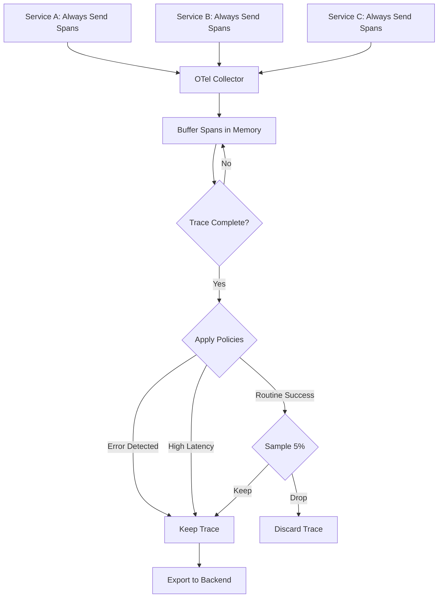

# How to Choose Between Head-Based and Tail-Based Sampling in OpenTelemetry

Author: [nawazdhandala](https://www.github.com/nawazdhandala)

Tags: OpenTelemetry, Sampling, Tracing, Observability, Head Sampling, Tail Sampling, Cost Optimization, Distributed Tracing

Description: A practical guide to choosing between head-based and tail-based sampling in OpenTelemetry, with decision frameworks, implementation examples, and real-world trade-offs.

---

Every distributed system that runs OpenTelemetry eventually faces the same question: should we sample at the beginning of a trace or at the end? The answer determines how much you spend on storage, whether you catch rare errors, and how much operational complexity you take on.

This post walks through both approaches in detail. You will see how each one works internally, when each makes sense, and how to implement both in a production setup. By the end, you will have a clear decision framework for your own system.

---

## Why Sampling Matters

A modest microservices application handling 10,000 requests per second can generate hundreds of thousands of spans per second. Sending all of that to a backend is expensive and often unnecessary. Most of those traces are routine successful requests that look identical to each other.

Sampling lets you keep the traces that matter while discarding the ones that do not add value. The question is not whether to sample, but how to sample intelligently.

---

## How Head-Based Sampling Works

Head-based sampling makes the keep-or-drop decision at the very start of a trace, before any work happens. The root service generates a trace ID, applies a sampling rule, and then propagates that decision to every downstream service through context headers.



The decision propagates through the W3C `traceparent` header. When a downstream service sees `sampled=1`, it records spans. When it sees `sampled=0`, it skips recording entirely.

### Implementing Head-Based Sampling in Python

```python
# tracing_setup.py
from opentelemetry import trace
from opentelemetry.sdk.trace import TracerProvider
from opentelemetry.sdk.trace.sampling import (
    ParentBasedTraceIdRatio,
    TraceIdRatioBased,
)
from opentelemetry.sdk.trace.export import BatchSpanProcessor
from opentelemetry.exporter.otlp.proto.grpc.trace_exporter import OTLPSpanExporter
from opentelemetry.sdk.resources import Resource

# Create a resource identifying our service
resource = Resource.create({
    "service.name": "order-service",
    "service.version": "1.4.2",
    "deployment.environment": "production",
})

# TraceIdRatioBased samples 10% of new traces.
# ParentBasedTraceIdRatio wraps it so that child spans
# respect the parent's sampling decision instead of
# rolling the dice again independently.
sampler = ParentBasedTraceIdRatio(0.1)

provider = TracerProvider(
    resource=resource,
    sampler=sampler,
)

# The OTLP exporter sends spans to the collector over gRPC.
exporter = OTLPSpanExporter(endpoint="http://localhost:4317")

# BatchSpanProcessor batches spans before export to reduce
# network overhead and improve throughput.
provider.add_span_processor(BatchSpanProcessor(exporter))

trace.set_tracer_provider(provider)
```

The `ParentBasedTraceIdRatio` sampler is the key here. It handles two scenarios. For root spans (no parent), it applies the 10% probability. For child spans, it follows whatever the parent decided. This ensures that if a trace is sampled, all of its spans across all services are collected, giving you complete traces rather than fragments.

### Head-Based Sampling in Node.js

```javascript
// tracing.js
const { NodeSDK } = require('@opentelemetry/sdk-node');
const { getNodeAutoInstrumentations } = require('@opentelemetry/auto-instrumentations-node');
const { OTLPTraceExporter } = require('@opentelemetry/exporter-trace-otlp-http');
const { Resource } = require('@opentelemetry/resources');
const {
  ParentBasedSampler,
  TraceIdRatioBasedSampler,
} = require('@opentelemetry/sdk-trace-base');

// TraceIdRatioBasedSampler uses a deterministic hash of the trace ID
// to decide sampling. This means the same trace ID always gets the
// same decision, which is important for consistency across retries.
const sampler = new ParentBasedSampler({
  root: new TraceIdRatioBasedSampler(0.1),
});

const sdk = new NodeSDK({
  resource: new Resource({
    'service.name': 'api-gateway',
    'deployment.environment': 'production',
  }),
  traceExporter: new OTLPTraceExporter({
    url: 'http://localhost:4318/v1/traces',
  }),
  sampler: sampler,
  instrumentations: [getNodeAutoInstrumentations()],
});

sdk.start();
```

The `TraceIdRatioBasedSampler` uses a deterministic algorithm. It hashes the trace ID and compares it against the ratio threshold. This means you do not need coordination between services. Two services that see the same trace ID and use the same ratio will independently arrive at the same sampling decision.

---

## How Tail-Based Sampling Works

Tail-based sampling flips the model. Instead of deciding at the start, it collects all spans from all services, waits for the trace to complete, and then examines the full picture before deciding whether to keep or drop it.

This happens in the OpenTelemetry Collector, not in your application code. The Collector buffers spans in memory, groups them by trace ID, and applies policies once a trace is considered complete.



### Implementing Tail-Based Sampling in the Collector

```yaml
# otel-collector-config.yaml
receivers:
  otlp:
    protocols:
      grpc:
        endpoint: 0.0.0.0:4317

processors:
  tail_sampling:
    # Wait 30 seconds for all spans in a trace to arrive.
    # This must be longer than your longest request latency.
    decision_wait: 30s

    # Maximum number of traces held in memory at any time.
    # Size this based on your traffic volume and decision_wait.
    num_traces: 200000

    # Helps the processor pre-allocate memory efficiently.
    expected_new_traces_per_sec: 5000

    policies:
      # Policy 1: Keep every trace that contains an error span.
      - name: keep-errors
        type: status_code
        status_code:
          status_codes: [ERROR]

      # Policy 2: Keep traces where any span exceeded 2 seconds.
      - name: keep-slow-traces
        type: latency
        latency:
          threshold_ms: 2000

      # Policy 3: For everything else, keep 5% randomly.
      - name: baseline-sample
        type: probabilistic
        probabilistic:
          sampling_percentage: 5

exporters:
  otlp:
    endpoint: "https://otel.your-backend.com:4317"
    tls:
      insecure: false

service:
  pipelines:
    traces:
      receivers: [otlp]
      processors: [tail_sampling]
      exporters: [otlp]
```

The `decision_wait` parameter is critical. It controls how long the Collector waits for spans before making a decision. If you set it too low, spans from slow downstream services might arrive after the decision, and those traces will be incomplete. If you set it too high, the Collector uses more memory. A good starting point is 2 to 3 times your p99 latency.

---

## The Trade-Off Matrix

Here is how the two approaches compare across the dimensions that matter most.

| Dimension | Head-Based | Tail-Based |
|---|---|---|
| Decision timing | Before trace starts | After trace completes |
| Error capture | Random chance | Guaranteed (policy-based) |
| Latency capture | Random chance | Guaranteed (threshold-based) |
| Infrastructure cost | Low (no buffering) | Higher (Collector memory) |
| Trace completeness | Always complete | Risk of incomplete if decision_wait is too short |
| Operational complexity | Minimal | Requires stateful Collector |
| Scaling model | Stateless, scales easily | Needs sticky routing by trace ID |

---

## Decision Framework

Use head-based sampling when:

- You are in early stages of observability adoption and want something simple
- Your traffic is relatively uniform and errors are not rare
- You cannot afford the operational overhead of a stateful Collector
- You are already getting enough error traces through random sampling

Use tail-based sampling when:

- Errors are rare (less than 1% of traffic) and you cannot afford to miss them
- You need to capture latency outliers reliably
- You have the infrastructure to run a stateful Collector cluster
- Compliance or debugging requirements demand that every error trace is retained

Use both together when:

- You want tail-based sampling for important pipelines but head-based sampling as a fallback for less critical services
- You are migrating gradually from head-based to tail-based

### A Hybrid Configuration

In practice, many teams run a two-tier Collector setup. Application SDKs do light head-based sampling (say 50%) to reduce network traffic, and then a gateway Collector applies tail-based sampling on what remains.

```yaml
# Application-side SDK config: sample 50% to reduce volume
# This is configured in the SDK, not the Collector

# Gateway Collector config: apply tail sampling on the 50% that arrives
processors:
  tail_sampling:
    decision_wait: 30s
    num_traces: 100000
    expected_new_traces_per_sec: 2500
    policies:
      # Within the 50% that arrived, keep all errors
      - name: keep-errors
        type: status_code
        status_code:
          status_codes: [ERROR]

      # Keep slow traces
      - name: keep-slow
        type: latency
        latency:
          threshold_ms: 1000

      # Sample 10% of the remainder
      - name: baseline
        type: probabilistic
        probabilistic:
          sampling_percentage: 10
```

The effective sampling rate for routine traces in this setup is 50% times 10%, which is 5%. But errors and slow traces get through at close to 50% of the original rate, which is much better than a flat 5%.

---

## Memory and Scaling Considerations

Tail-based sampling requires careful resource planning. The Collector must hold all spans for every in-flight trace until the `decision_wait` expires. A rough estimate for memory usage:

```
Memory = expected_new_traces_per_sec * decision_wait_seconds * avg_spans_per_trace * avg_span_size_bytes
```

For a system with 5,000 new traces per second, a 30-second wait, 8 spans per trace, and 2 KB per span, that works out to roughly 2.4 GB just for the span buffer.

You also need to ensure that all spans for a given trace arrive at the same Collector instance. This requires a load balancing strategy based on trace ID. The OpenTelemetry Collector contrib distribution includes a `loadbalancingexporter` that handles this.

---

## Conclusion

Head-based sampling is the right starting point for most teams. It is simple, predictable, and works without any special infrastructure. Tail-based sampling becomes necessary when you need guarantees about capturing errors, latency outliers, or specific business-critical transactions.

The good news is that you do not have to choose one forever. Many teams start with head-based sampling and add tail-based sampling as their observability practice matures. The OpenTelemetry Collector makes it straightforward to add tail sampling policies without changing any application code.

Pick the approach that matches your current needs and infrastructure capabilities, and revisit the decision as your system grows.
