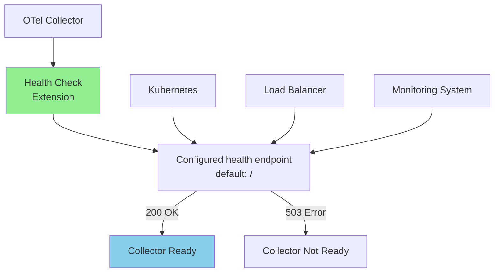

# How to Configure the Health Check Extension in the OpenTelemetry Collector

Author: [nawazdhandala](https://www.github.com/nawazdhandala)

Tags: OpenTelemetry, Collector, Extension, Health Check, Monitoring, Operation, Kubernetes, Production

Description: Learn how to configure the Health Check extension in OpenTelemetry Collector to monitor collector health and integrate with orchestration platforms like Kubernetes.

The Health Check extension is a critical component for production deployments of the OpenTelemetry Collector. It exposes an HTTP endpoint that reports the collector's service health status, enabling orchestration platforms like Kubernetes, load balancers, and monitoring systems to detect and respond to collector issues automatically. Proper health check configuration helps improve availability and reliability of your telemetry pipeline.

## Understanding the Health Check Extension

The Health Check extension provides an HTTP endpoint that returns the service health status of the collector. This endpoint follows standard health check patterns used by cloud-native platforms and can be consumed by various infrastructure components to make routing and scaling decisions.

The extension monitors:

- **Collector startup state**: Whether the collector has successfully initialized
- **Service readiness**: Whether the collector service has reported itself ready
- **Overall service health**: Whether the collector is ready to serve health checks

The legacy `check_collector_pipeline` option is retained for compatibility, but the OpenTelemetry Collector project warns that it does not work as expected and recommends not using it for pipeline health.

## Health Check Architecture

Here's how health checks integrate with your infrastructure:



## Prerequisites

Before configuring the Health Check extension:

1. OpenTelemetry Collector installed (core or contrib distribution)
2. Understanding of your orchestration platform's health check requirements
3. Network access to the health check port from monitoring systems
4. Familiarity with HTTP-based health check patterns

## Basic Configuration

Here's a minimal health check configuration:

```yaml
# Basic Health Check extension configuration

extensions:
  health_check:
    # Endpoint for health check HTTP server
    # Default is localhost:13133
    endpoint: 0.0.0.0:13133

receivers:
  otlp:
    protocols:
      grpc:
        endpoint: 0.0.0.0:4317

processors:
  batch:
    timeout: 10s
    send_batch_size: 1024

exporters:
  debug:
    verbosity: basic

# Enable the extension in the service section
service:
  extensions: [health_check]

  pipelines:
    traces:
      receivers: [otlp]
      processors: [batch]
      exporters: [debug]
```

With this configuration, the collector exposes a health check endpoint at:
- `http://localhost:13133/` - Root health endpoint when accessed locally

## Advanced Configuration with Custom Paths

Configure a custom path for the health check endpoint:

```yaml
extensions:
  health_check:
    # Bind to specific interface and port
    endpoint: 0.0.0.0:13133

    # TLS configuration for secure health checks
    tls:
      cert_file: /etc/otelcol/certs/server.crt
      key_file: /etc/otelcol/certs/server.key

    # Custom path configuration
    path: /health

receivers:
  otlp:
    protocols:
      grpc:
        endpoint: 0.0.0.0:4317
      http:
        endpoint: 0.0.0.0:4318

processors:
  batch:
    timeout: 10s
    send_batch_size: 1024

exporters:
  otlp:
    endpoint: backend.example.com:4317
    tls:
      insecure: false

service:
  extensions: [health_check]

  pipelines:
    traces:
      receivers: [otlp]
      processors: [batch]
      exporters: [otlp]

    metrics:
      receivers: [otlp]
      processors: [batch]
      exporters: [otlp]

    logs:
      receivers: [otlp]
      processors: [batch]
      exporters: [otlp]
```

## Kubernetes Integration

Configure health checks for Kubernetes liveness and readiness probes:

```yaml
# OpenTelemetry Collector configuration for Kubernetes
extensions:
  health_check:
    # Use a port that doesn't conflict with other services
    endpoint: 0.0.0.0:13133

    # Path for health checks
    path: /health

receivers:
  otlp:
    protocols:
      grpc:
        endpoint: 0.0.0.0:4317

processors:
  batch:
    timeout: 10s
    send_batch_size: 1024

  # Memory limiter to prevent OOM
  memory_limiter:
    check_interval: 1s
    limit_mib: 2048
    spike_limit_mib: 512

exporters:
  otlp:
    endpoint: observability-backend:4317

service:
  extensions: [health_check]

  pipelines:
    traces:
      receivers: [otlp]
      processors: [memory_limiter, batch]
      exporters: [otlp]
```

Corresponding Kubernetes deployment manifest:

```yaml
apiVersion: apps/v1
kind: Deployment
metadata:
  name: otel-collector
  namespace: observability
spec:
  replicas: 3
  selector:
    matchLabels:
      app: otel-collector
  template:
    metadata:
      labels:
        app: otel-collector
    spec:
      containers:
      - name: otel-collector
        image: otel/opentelemetry-collector-contrib:latest
        args: ["--config=/etc/otelcol/config.yaml"]
        ports:
        - containerPort: 4317
          name: otlp-grpc
          protocol: TCP
        - containerPort: 13133
          name: health-check
          protocol: TCP

        # Liveness probe checks if collector is alive
        # Restarts container if it fails
        livenessProbe:
          httpGet:
            path: /health
            port: 13133
          initialDelaySeconds: 10
          periodSeconds: 10
          timeoutSeconds: 5
          failureThreshold: 3

        # Readiness probe checks if collector is ready to accept traffic
        # Removes from service endpoints if it fails
        readinessProbe:
          httpGet:
            path: /health
            port: 13133
          initialDelaySeconds: 5
          periodSeconds: 5
          timeoutSeconds: 3
          failureThreshold: 3

        # Startup probe for slow-starting collectors
        startupProbe:
          httpGet:
            path: /health
            port: 13133
          initialDelaySeconds: 0
          periodSeconds: 2
          timeoutSeconds: 1
          failureThreshold: 30

        resources:
          requests:
            memory: "512Mi"
            cpu: "500m"
          limits:
            memory: "2Gi"
            cpu: "2000m"

        volumeMounts:
        - name: config
          mountPath: /etc/otelcol

      volumes:
      - name: config
        configMap:
          name: otel-collector-config
```

## Load Balancer Integration

Configure health checks for load balancer integration:

```yaml
extensions:
  health_check:
    # Bind to all interfaces for load balancer access
    endpoint: 0.0.0.0:13133

    # Health check path
    path: /health

    # Response configuration
    response_body:
      healthy: "OK"
      unhealthy: "Service Unavailable"

receivers:
  otlp:
    protocols:
      grpc:
        endpoint: 0.0.0.0:4317
      http:
        endpoint: 0.0.0.0:4318

processors:
  batch:
    timeout: 10s
    send_batch_size: 2048

  # Add load balancer routing metadata
  resource:
    attributes:
      - key: collector.instance
        value: ${env:HOSTNAME}
        action: upsert

exporters:
  # Primary backend
  otlp/primary:
    endpoint: backend-primary.example.com:4317
    tls:
      insecure: false

  # Backup backend
  otlp/backup:
    endpoint: backend-backup.example.com:4317
    tls:
      insecure: false

service:
  extensions: [health_check]

  pipelines:
    traces:
      receivers: [otlp]
      processors: [resource, batch]
      exporters: [otlp/primary, otlp/backup]
```

Example HAProxy configuration using the health check:

```text
# HAProxy configuration for OpenTelemetry Collector
backend otel_collectors
    mode http
    balance roundrobin

    # Health check configuration
    option httpchk GET /health
    http-check expect status 200

    # Collector instances
    server collector1 10.0.1.10:4318 check port 13133 inter 5s fall 3 rise 2
    server collector2 10.0.1.11:4318 check port 13133 inter 5s fall 3 rise 2
    server collector3 10.0.1.12:4318 check port 13133 inter 5s fall 3 rise 2
```

## Multi-Extension Configuration

Combine health checks with other extensions for comprehensive monitoring:

```yaml
extensions:
  # Health check extension
  health_check:
    endpoint: 0.0.0.0:13133
    path: /health

  # pprof extension for performance profiling
  pprof:
    endpoint: 0.0.0.0:1777

  # zpages extension for diagnostic information
  zpages:
    endpoint: 0.0.0.0:55679

receivers:
  otlp:
    protocols:
      grpc:
        endpoint: 0.0.0.0:4317

processors:
  batch:
    timeout: 10s
    send_batch_size: 1024

  memory_limiter:
    check_interval: 1s
    limit_mib: 2048

exporters:
  otlp:
    endpoint: backend.example.com:4317

service:
  # Enable all extensions
  extensions: [health_check, pprof, zpages]

  # Configure telemetry for the collector itself
  telemetry:
    logs:
      level: info
    metrics:
      level: detailed
      readers:
        - pull:
            exporter:
              prometheus:
                host: 0.0.0.0
                port: 8888
                without_type_suffix: true
                without_units: true

  pipelines:
    traces:
      receivers: [otlp]
      processors: [memory_limiter, batch]
      exporters: [otlp]
```

## Docker Compose Health Checks

Configure health checks in Docker Compose deployments using a collector image that includes `curl` or an equivalent HTTP client:

```yaml
version: '3.8'

services:
  otel-collector:
    image: otel/opentelemetry-collector-contrib:latest
    container_name: otel-collector
    command: ["--config=/etc/otelcol/config.yaml"]

    # Container health check using the extension
    healthcheck:
      test: ["CMD", "curl", "-f", "http://localhost:13133/health"]
      interval: 10s
      timeout: 5s
      retries: 3
      start_period: 10s

    ports:
      - "4317:4317"   # OTLP gRPC
      - "4318:4318"   # OTLP HTTP
      - "13133:13133" # Health check

    volumes:
      - ./otel-collector-config.yaml:/etc/otelcol/config.yaml

    environment:
      - BACKEND_ENDPOINT=backend:4317

    depends_on:
      backend:
        condition: service_healthy

    restart: unless-stopped

  # Dependent service
  backend:
    image: observability-backend:latest
    healthcheck:
      test: ["CMD", "curl", "-f", "http://localhost:8080/health"]
      interval: 10s
      timeout: 5s
      retries: 3
```

## Custom Health Check Responses

Configure custom health check response bodies:

```yaml
extensions:
  health_check:
    endpoint: 0.0.0.0:13133
    path: /health

    # Configure response behavior
    response_body:
      healthy: '{"status": "healthy", "version": "1.0.0"}'
      unhealthy: '{"status": "unhealthy", "message": "Collector is not ready"}'

receivers:
  otlp:
    protocols:
      grpc:
        endpoint: 0.0.0.0:4317

processors:
  batch:
    timeout: 10s
    send_batch_size: 1024

exporters:
  # Multiple exporters with different SLAs
  otlp/critical:
    endpoint: critical-backend.example.com:4317
    timeout: 30s
    retry_on_failure:
      enabled: true
      initial_interval: 5s
      max_interval: 30s

  otlp/best_effort:
    endpoint: best-effort-backend.example.com:4317
    timeout: 10s
    retry_on_failure:
      enabled: false

service:
  extensions: [health_check]

  pipelines:
    # Critical traces pipeline
    traces/critical:
      receivers: [otlp]
      processors: [batch]
      exporters: [otlp/critical]

    # Best effort metrics pipeline
    metrics/best_effort:
      receivers: [otlp]
      processors: [batch]
      exporters: [otlp/best_effort]
```

## Monitoring Collector Health

Set up monitoring for collector health using the collector's internal Prometheus metrics:

```yaml
# Prometheus scrape configuration
scrape_configs:
  - job_name: 'otel-collector-internal'
    scrape_interval: 15s
    metrics_path: /metrics

    static_configs:
      - targets:
        - 'otel-collector-1:8888'
        - 'otel-collector-2:8888'
        - 'otel-collector-3:8888'

    # Relabel to add health check information
    relabel_configs:
      - source_labels: [__address__]
        target_label: instance
      - source_labels: [__address__]
        regex: '(.*):.*'
        replacement: '${1}:13133'
        target_label: health_check_endpoint
```

Prometheus alerting rules for collector health:

```yaml
# Prometheus alerting rules
groups:
  - name: otel_collector_health
    interval: 30s
    rules:
      - alert: OTelCollectorDown
        expr: up{job="otel-collector-internal"} == 0
        for: 2m
        labels:
          severity: critical
        annotations:
          summary: "OpenTelemetry Collector is down"
          description: "Collector instance {{ $labels.instance }} has been down for more than 2 minutes"

      - alert: OTelCollectorExporterFailures
        expr: rate(otelcol_exporter_send_failed_spans[5m]) > 0.05
        for: 5m
        labels:
          severity: warning
        annotations:
          summary: "OpenTelemetry Collector exporter failures detected"
          description: "Collector {{ $labels.instance }} is experiencing exporter failures"
```

## Production Best Practices

1. **Separate Health Check Port**: Use a dedicated port for health checks separate from data ingestion ports.

2. **Configure Appropriate Timeouts**: Set timeouts based on your infrastructure's expected response times.

3. **Use Startup Probes**: In Kubernetes, use startup probes for collectors that take time to initialize.

4. **Monitor Health and Internal Metrics**: Track probe failures, probe response times, and collector internal metrics.

5. **Coordinate Graceful Shutdown**: Use readiness behavior and orchestrator settings so traffic is drained before the collector stops.

## Debugging Health Check Issues

Common issues and troubleshooting steps:

**Health Check Endpoint Not Accessible**: Verify the endpoint is configured correctly and the port is not blocked by firewalls.

**False Positive Health Failures**: Adjust Kubernetes, load balancer, or monitoring probe thresholds and intervals to account for transient issues.

**Health Check Passes But Collector Not Working**: Use collector internal telemetry, such as exporter send failure metrics, to detect pipeline or exporter failures.

**High Health Check Latency**: Increase probe timeouts or investigate collector performance issues.

**TLS Errors**: Verify certificate paths and permissions when using TLS for health checks.

## Security Considerations

Secure your health check endpoints:

```yaml
extensions:
  health_check:
    # Bind to localhost only if not needed externally
    endpoint: 127.0.0.1:13133

    # Enable TLS for external access
    tls:
      cert_file: /etc/otelcol/certs/server.crt
      key_file: /etc/otelcol/certs/server.key

      # Require client certificates for mutual TLS
      client_ca_file: /etc/otelcol/certs/ca.crt

    # Add authentication header requirement
    # (requires custom implementation or proxy)
```

Network policy for Kubernetes:

```yaml
apiVersion: networking.k8s.io/v1
kind: NetworkPolicy
metadata:
  name: otel-collector-health-check
  namespace: observability
spec:
  podSelector:
    matchLabels:
      app: otel-collector
  policyTypes:
  - Ingress
  ingress:
  # Allow health checks from monitoring or proxy pods.
  # Kubelet probes usually originate from node IPs, so Kubernetes probe traffic
  # may require CNI-specific network policy rules instead of a namespace selector.
  - from:
    - namespaceSelector:
        matchLabels:
          name: monitoring
    ports:
    - protocol: TCP
      port: 13133
```

## Testing Health Checks

Test your health check configuration:

```bash
# Basic health check test
curl -v http://localhost:13133/health

# Test with timeout
curl -v --max-time 2 http://localhost:13133/health

# Test from Kubernetes pod
kubectl run curl-test --image=curlimages/curl:latest --rm -it -- \
  curl -v http://otel-collector.observability.svc.cluster.local:13133/health

# Monitor health check over time
watch -n 1 'curl -s http://localhost:13133/health && echo " - $(date)"'
```

## Related Resources

Learn more about OpenTelemetry Collector operations:

- [OpenTelemetry Collector Production Deployment Guide](https://oneuptime.com/blog/post/2026-01-25-opentelemetry-collector-production-setup/view)
- [Monitoring OpenTelemetry Collector with Prometheus](https://oneuptime.com/blog/post/2026-02-06-dev-container-otel-collector-jaeger/view)

## Conclusion

The Health Check extension is essential for operating OpenTelemetry Collector reliably in production environments. By properly configuring health checks and integrating them with your orchestration platform, you can improve availability, enable automatic recovery from collector process failures, and maintain visibility into the collector's operational status. Start with basic configuration and progressively add monitoring, alerting, and automation based on your operational requirements.
