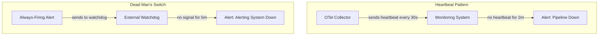

# How to Set Up Heartbeat and Dead Man's Switch Alerts for OpenTelemetry Pipeline Health

Author: [nawazdhandala](https://www.github.com/nawazdhandala)

Tags: OpenTelemetry, Pipeline Health, Heartbeat, Dead Man's Switch

Description: Configure heartbeat monitoring and dead man's switch alerts to detect when your OpenTelemetry Collector pipeline silently stops processing telemetry data.

The worst kind of outage in an observability system is the silent one. Your OpenTelemetry Collector stops receiving data, or a pipeline stalls, and nobody notices because the absence of data does not trigger any alert. By the time someone checks a dashboard and sees a gap, hours of telemetry are gone. Heartbeat monitoring and dead man's switch patterns catch these failures.

## The Silent Failure Problem

Standard alerting rules fire when a metric crosses a threshold. But what happens when the metric simply stops arriving? A query like `rate(http_requests_total[5m]) > 100` returns nothing if the time series disappears - it does not return zero, it returns empty. Most alerting systems treat empty query results as "no data" and do nothing.

## Heartbeat vs. Dead Man's Switch

These two patterns address the same problem from opposite directions:

- **Heartbeat**: A periodic signal that says "I am alive." If the signal stops, something is wrong.
- **Dead man's switch**: An alert that is always firing. If the alert stops firing, something is wrong.



## Step 1: Generate Heartbeat Metrics in the Collector

The OpenTelemetry Collector does not emit a built-in heartbeat metric by default, but you can generate one using the `count` connector or by configuring internal telemetry. The simplest approach uses the Collector's own internal metrics:

```yaml
# otel-collector-config.yaml
# Enable the Collector's internal metrics and expose them for scraping
service:
  telemetry:
    metrics:
      level: detailed
      address: "0.0.0.0:8888"
    logs:
      level: info

  pipelines:
    traces:
      receivers: [otlp]
      processors: [batch]
      exporters: [otlp/backend]
    metrics:
      receivers: [otlp, prometheus/internal]
      processors: [batch]
      exporters: [prometheus]

receivers:
  otlp:
    protocols:
      grpc:
        endpoint: "0.0.0.0:4317"

  # Scrape the Collector's own internal metrics as a heartbeat source
  prometheus/internal:
    config:
      scrape_configs:
        - job_name: 'otel-collector-internal'
          scrape_interval: 15s
          static_configs:
            - targets: ['localhost:8888']

processors:
  batch:
    timeout: 10s
    send_batch_size: 1024

exporters:
  otlp/backend:
    endpoint: "tempo:4317"
    tls:
      insecure: true
  prometheus:
    endpoint: "0.0.0.0:8889"
```

## Step 2: Create Heartbeat Alert Rules

Use the Collector's internal metrics to detect when the pipeline stops processing. The metric `otelcol_receiver_accepted_spans` tells you whether the traces pipeline is receiving data:

```yaml
# prometheus-rules/otel-heartbeat.yaml
# Alert rules that detect when the OTel Collector stops processing data
groups:
  - name: otel-pipeline-heartbeat
    interval: 30s
    rules:
      # Alert if the Collector stops accepting spans entirely
      - alert: OTelCollectorNoSpansReceived
        expr: |
          absent_over_time(
            otelcol_receiver_accepted_spans{receiver="otlp"}[5m]
          ) == 1
        for: 2m
        labels:
          severity: critical
          team: platform
        annotations:
          summary: "OTel Collector has not received any spans for 5 minutes"
          runbook_url: "https://wiki.internal/runbooks/otel-pipeline-down"

      # Alert if the Collector stops exporting metrics
      - alert: OTelCollectorNoMetricsExported
        expr: |
          absent_over_time(
            otelcol_exporter_sent_metric_points{exporter="prometheus"}[5m]
          ) == 1
        for: 2m
        labels:
          severity: critical
          team: platform
        annotations:
          summary: "OTel Collector has not exported any metrics for 5 minutes"

      # Alert if the Collector drops data (export failures)
      - alert: OTelCollectorExportFailures
        expr: |
          rate(otelcol_exporter_send_failed_spans[5m]) > 0
        for: 3m
        labels:
          severity: warning
          team: platform
        annotations:
          summary: "OTel Collector is failing to export spans"

      # Alert if the processing queue is consistently full
      - alert: OTelCollectorQueueSaturation
        expr: |
          otelcol_exporter_queue_size / otelcol_exporter_queue_capacity > 0.9
        for: 5m
        labels:
          severity: warning
          team: platform
        annotations:
          summary: "OTel Collector export queue is above 90% capacity"
```

## Step 3: Set Up the Dead Man's Switch

The dead man's switch protects against the scenario where your entire alerting pipeline fails. You create an alert that should always be firing and route it to an external watchdog service. If the watchdog stops receiving it, the alerting system itself is broken:

```yaml
# prometheus-rules/deadman-switch.yaml
# This alert must ALWAYS be firing - if it stops, the alerting system is broken
groups:
  - name: deadman-switch
    rules:
      - alert: DeadManSwitch
        expr: vector(1)
        labels:
          severity: none
          purpose: deadman
        annotations:
          summary: "Dead man's switch - this alert should always be firing"
```

Route this alert to a dedicated receiver in Alertmanager:

```yaml
# alertmanager.yaml
# Send the dead man's switch to an external watchdog, everything else to normal channels
route:
  receiver: 'default'
  routes:
    - match:
        purpose: deadman
      receiver: 'deadman-watchdog'
      group_wait: 0s
      group_interval: 1m
      repeat_interval: 1m

receivers:
  - name: 'default'
    slack_configs:
      - channel: '#alerts'

  - name: 'deadman-watchdog'
    webhook_configs:
      - url: 'https://watchdog.external-service.com/ping/your-token-here'
        send_resolved: false
```

## Step 4: Monitor Per-Service Data Freshness

Beyond pipeline-level heartbeats, you should also detect when individual services stop sending telemetry. This catches cases where a service crashes or loses its Collector endpoint while the pipeline itself remains healthy:

```yaml
# prometheus-rules/service-heartbeat.yaml
# Detect when specific services stop sending any telemetry data
groups:
  - name: service-data-freshness
    rules:
      # Alert if a critical service stops sending request metrics
      - alert: ServiceTelemetryMissing
        expr: |
          absent_over_time(
            http_server_request_duration_seconds_count{
              service_name=~"checkout-service|payments-service|auth-service"
            }[10m]
          ) == 1
        for: 5m
        labels:
          severity: warning
          team: platform
        annotations:
          summary: "No HTTP metrics received from {{ $labels.service_name }} for 10 minutes"

      # Detect sudden drops in telemetry volume (partial pipeline failure)
      - alert: TelemetryVolumeDropped
        expr: |
          (
            sum by (service_name) (rate(http_server_request_duration_seconds_count[5m]))
            /
            sum by (service_name) (rate(http_server_request_duration_seconds_count[5m] offset 1h))
          ) < 0.1
        for: 5m
        labels:
          severity: warning
        annotations:
          summary: "Telemetry volume from {{ $labels.service_name }} dropped by 90%"
```

## Testing Your Dead Man's Switch

The whole point of a dead man's switch is that it catches failures you did not anticipate. Test it by temporarily stopping your Alertmanager or Prometheus instance and verifying that the external watchdog sends a notification. Schedule this test quarterly - an untested dead man's switch is worse than none at all because it gives false confidence.

The combination of Collector-level heartbeats, per-service data freshness checks, and an external dead man's switch creates a layered defense against silent telemetry failures. When any layer of your OpenTelemetry pipeline stops working, you will know about it within minutes rather than discovering it hours later when someone opens an empty dashboard.
