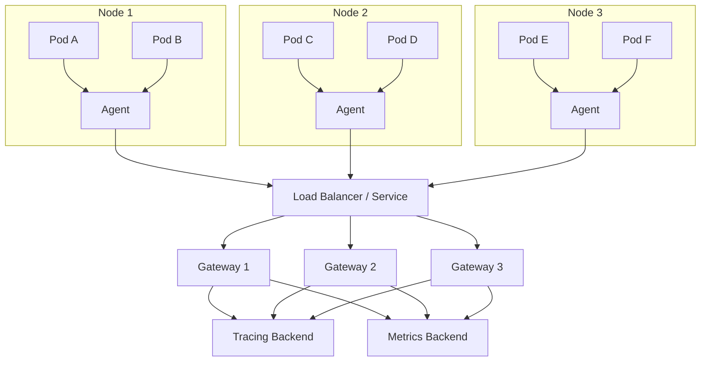
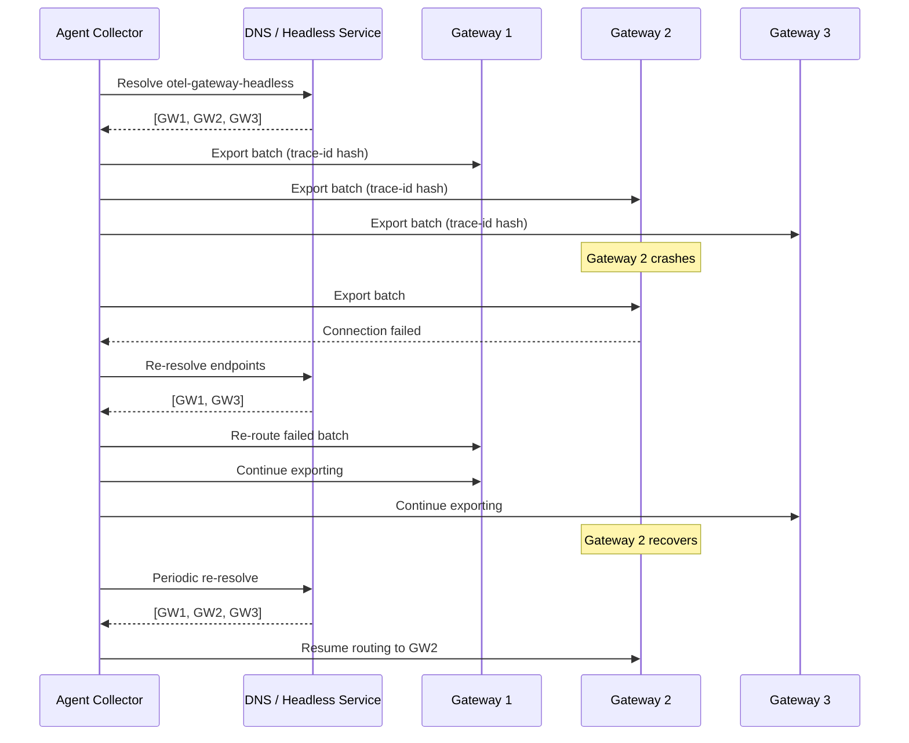

# How to Set Up High-Availability Collector Deployments with Agent-Gateway Pattern

Author: [nawazdhandala](https://www.github.com/nawazdhandala)

Tags: OpenTelemetry, High Availability, Collector, Agent-Gateway, Kubernetes

Description: A complete guide to deploying OpenTelemetry Collectors in an agent-gateway pattern for high availability, with load balancing, failover, and production-ready Kubernetes configurations.

---

Running a single OpenTelemetry Collector works fine for development. In production, it becomes a single point of failure that takes down your entire observability pipeline when it crashes. The agent-gateway pattern solves this by splitting collection into two tiers: lightweight agents running on every node and a pool of stateless gateways that handle the heavy lifting.

This guide shows you how to set up this pattern from scratch, with working Kubernetes manifests and collector configurations.

## What the Agent-Gateway Pattern Looks Like

The pattern is straightforward. Agents run as a DaemonSet so there is one on every node. They do minimal processing and forward telemetry to a pool of gateway collectors. Gateways are a Deployment that can scale horizontally. They handle batching, filtering, sampling, and export to backends.



## Why Two Tiers

You might wonder why not just run full collectors on every node. There are several good reasons:

**Resource efficiency**: Agents use minimal CPU and memory. The heavy processors (tail sampling, span-to-metrics conversion, complex routing) run only on the gateway tier, which is a much smaller set of pods.

**Centralized configuration**: When you need to change a sampling policy or add a new exporter, you update the gateway configuration. You do not have to roll out changes to every node in your cluster.

**Independent scaling**: Agents scale with your cluster (one per node via DaemonSet). Gateways scale with your telemetry volume. These two things grow at different rates.

**Blast radius**: If a gateway crashes, the agents can route to the remaining gateways. If a node-level agent crashes, only that node's telemetry is affected.

## Agent Configuration

The agent collector should be as lightweight as possible. Its job is to receive telemetry from local pods, add some resource attributes, and forward everything to the gateways.

```yaml
# agent-config.yaml
# Lightweight agent that runs on every node as a DaemonSet
receivers:
  otlp:
    protocols:
      grpc:
        endpoint: 0.0.0.0:4317
      http:
        endpoint: 0.0.0.0:4318

processors:
  # Memory limiter is critical on agents since they share
  # node resources with application workloads
  memory_limiter:
    check_interval: 1s
    limit_mib: 256
    spike_limit_mib: 64

  # Light batching to reduce the number of RPCs to the gateway
  batch:
    send_batch_size: 512
    timeout: 2s

  # Stamp each span with the node it came from
  # This helps with debugging pipeline issues later
  resource:
    attributes:
      - key: k8s.node.name
        value: ${env:K8S_NODE_NAME}
        action: upsert

exporters:
  # Use the load-balancing exporter to spread load across gateways
  # This is better than a Kubernetes Service because it can do
  # trace-aware routing (all spans for the same trace go to the
  # same gateway, which is required for tail sampling)
  loadbalancing:
    protocol:
      otlp:
        timeout: 10s
        tls:
          insecure: true
    resolver:
      dns:
        # This should point to a headless service so we get
        # individual pod IPs, not the ClusterIP
        hostname: otel-gateway-headless.observability.svc.cluster.local
        port: 4317

service:
  pipelines:
    traces:
      receivers: [otlp]
      processors: [memory_limiter, resource, batch]
      exporters: [loadbalancing]
    metrics:
      receivers: [otlp]
      processors: [memory_limiter, resource, batch]
      exporters: [loadbalancing]
    logs:
      receivers: [otlp]
      processors: [memory_limiter, resource, batch]
      exporters: [loadbalancing]
```

The `loadbalancing` exporter is important here. A regular Kubernetes Service does round-robin load balancing, which means spans from the same trace can end up on different gateways. If you are using tail-based sampling at the gateway tier, you need all spans from a trace on the same gateway. The load-balancing exporter hashes on the trace ID to achieve this.

## Gateway Configuration

The gateway does the heavy work: tail sampling, metric generation from spans, filtering, and exporting to backends.

```yaml
# gateway-config.yaml
# Full-featured gateway collector running as a Deployment
receivers:
  otlp:
    protocols:
      grpc:
        endpoint: 0.0.0.0:4317
        # Increase the max message size for large batches from agents
        max_recv_msg_size_mib: 16
      http:
        endpoint: 0.0.0.0:4318

processors:
  memory_limiter:
    check_interval: 1s
    limit_mib: 3072
    spike_limit_mib: 768

  batch:
    send_batch_size: 2048
    timeout: 10s

  # Tail-based sampling keeps all errors and slow traces,
  # and samples the rest at 10%
  tail_sampling:
    decision_wait: 30s
    policies:
      - name: errors
        type: status_code
        status_code:
          status_codes: [ERROR]
      - name: slow-traces
        type: latency
        latency:
          threshold_ms: 2000
      - name: probabilistic
        type: probabilistic
        probabilistic:
          sampling_percentage: 10

  # Generate RED metrics from span data so you get metrics
  # even for services that do not emit them directly
  spanmetrics:
    metrics_exporter: otlp/metrics
    dimensions:
      - name: http.method
      - name: http.status_code

exporters:
  otlp/traces:
    endpoint: tempo.observability.svc:4317
    tls:
      insecure: true
    retry_on_failure:
      enabled: true
      initial_interval: 5s
      max_interval: 60s
    sending_queue:
      enabled: true
      num_consumers: 10
      queue_size: 5000
      storage: file_storage

  otlp/metrics:
    endpoint: mimir.observability.svc:4317
    tls:
      insecure: true
    retry_on_failure:
      enabled: true
    sending_queue:
      enabled: true
      num_consumers: 10
      queue_size: 5000
      storage: file_storage

  otlp/logs:
    endpoint: loki.observability.svc:4317
    tls:
      insecure: true
    retry_on_failure:
      enabled: true
    sending_queue:
      enabled: true
      num_consumers: 10
      queue_size: 5000
      storage: file_storage

extensions:
  file_storage:
    directory: /var/lib/otel/queue
    max_file_size_mib: 4096

  # Health check endpoint for Kubernetes probes
  health_check:
    endpoint: 0.0.0.0:13133

service:
  extensions: [health_check, file_storage]
  pipelines:
    traces:
      receivers: [otlp]
      processors: [memory_limiter, tail_sampling, batch]
      exporters: [otlp/traces]
    metrics:
      receivers: [otlp]
      processors: [memory_limiter, batch]
      exporters: [otlp/metrics]
    logs:
      receivers: [otlp]
      processors: [memory_limiter, batch]
      exporters: [otlp/logs]
```

## Kubernetes Manifests

Here are the full Kubernetes resources for both tiers.

### Agent DaemonSet

```yaml
# agent-daemonset.yaml
apiVersion: apps/v1
kind: DaemonSet
metadata:
  name: otel-agent
  namespace: observability
  labels:
    app: otel-agent
spec:
  selector:
    matchLabels:
      app: otel-agent
  template:
    metadata:
      labels:
        app: otel-agent
    spec:
      # Use a service account with permissions to read pod metadata
      serviceAccountName: otel-agent
      containers:
        - name: otel-collector
          image: otel/opentelemetry-collector-contrib:0.96.0
          args: ["--config=/etc/otel/config.yaml"]
          env:
            # Pass the node name so the agent can stamp it
            # on outgoing telemetry
            - name: K8S_NODE_NAME
              valueFrom:
                fieldRef:
                  fieldPath: spec.nodeName
          ports:
            - containerPort: 4317
              name: otlp-grpc
              protocol: TCP
              hostPort: 4317
            - containerPort: 4318
              name: otlp-http
              protocol: TCP
              hostPort: 4318
          resources:
            requests:
              cpu: 100m
              memory: 128Mi
            limits:
              cpu: 250m
              memory: 384Mi
          livenessProbe:
            httpGet:
              path: /
              port: 13133
          readinessProbe:
            httpGet:
              path: /
              port: 13133
          volumeMounts:
            - name: config
              mountPath: /etc/otel
      volumes:
        - name: config
          configMap:
            name: otel-agent-config
```

### Gateway Deployment and Services

```yaml
# gateway-deployment.yaml
apiVersion: apps/v1
kind: Deployment
metadata:
  name: otel-gateway
  namespace: observability
  labels:
    app: otel-gateway
spec:
  # Start with 3 replicas for high availability
  replicas: 3
  selector:
    matchLabels:
      app: otel-gateway
  # Use RollingUpdate with maxUnavailable=1 to keep at least
  # 2 gateways running during deployments
  strategy:
    type: RollingUpdate
    rollingUpdate:
      maxUnavailable: 1
      maxSurge: 1
  template:
    metadata:
      labels:
        app: otel-gateway
    spec:
      terminationGracePeriodSeconds: 60
      # Spread gateway pods across different nodes for HA
      affinity:
        podAntiAffinity:
          preferredDuringSchedulingIgnoredDuringExecution:
            - weight: 100
              podAffinityTerm:
                labelSelector:
                  matchLabels:
                    app: otel-gateway
                topologyKey: kubernetes.io/hostname
      containers:
        - name: otel-collector
          image: otel/opentelemetry-collector-contrib:0.96.0
          args: ["--config=/etc/otel/config.yaml"]
          ports:
            - containerPort: 4317
              name: otlp-grpc
            - containerPort: 4318
              name: otlp-http
            - containerPort: 8888
              name: metrics
            - containerPort: 13133
              name: health
          resources:
            requests:
              cpu: "1"
              memory: 2Gi
            limits:
              cpu: "2"
              memory: 4Gi
          livenessProbe:
            httpGet:
              path: /
              port: 13133
            initialDelaySeconds: 10
            periodSeconds: 10
          readinessProbe:
            httpGet:
              path: /
              port: 13133
            initialDelaySeconds: 5
            periodSeconds: 5
          volumeMounts:
            - name: config
              mountPath: /etc/otel
            - name: queue-storage
              mountPath: /var/lib/otel/queue
      volumes:
        - name: config
          configMap:
            name: otel-gateway-config
        - name: queue-storage
          emptyDir:
            sizeLimit: 5Gi
---
# Headless service for the load-balancing exporter to discover
# individual gateway pod IPs
apiVersion: v1
kind: Service
metadata:
  name: otel-gateway-headless
  namespace: observability
spec:
  clusterIP: None
  selector:
    app: otel-gateway
  ports:
    - name: otlp-grpc
      port: 4317
      targetPort: 4317
---
# Regular service for direct access (used by external clients
# that do not need trace-aware routing)
apiVersion: v1
kind: Service
metadata:
  name: otel-gateway
  namespace: observability
spec:
  selector:
    app: otel-gateway
  ports:
    - name: otlp-grpc
      port: 4317
      targetPort: 4317
    - name: otlp-http
      port: 4318
      targetPort: 4318
```

## How Failover Works

When a gateway pod goes down, the system recovers automatically. Here is the sequence:



The load-balancing exporter periodically re-resolves DNS, so it automatically picks up new gateways and drops unhealthy ones. The default resolution interval is 5 seconds, which you can tune:

```yaml
exporters:
  loadbalancing:
    resolver:
      dns:
        hostname: otel-gateway-headless.observability.svc.cluster.local
        port: 4317
        # How often to re-resolve DNS to discover gateway changes
        interval: 5s
```

## Horizontal Pod Autoscaler

Scale the gateway tier based on CPU usage or incoming request rate:

```yaml
# gateway-hpa.yaml
apiVersion: autoscaling/v2
kind: HorizontalPodAutoscaler
metadata:
  name: otel-gateway-hpa
  namespace: observability
spec:
  scaleTargetRef:
    apiVersion: apps/v1
    kind: Deployment
    name: otel-gateway
  minReplicas: 3
  maxReplicas: 15
  behavior:
    # Scale up quickly when needed
    scaleUp:
      stabilizationWindowSeconds: 60
      policies:
        - type: Pods
          value: 3
          periodSeconds: 60
    # Scale down slowly to avoid flapping
    scaleDown:
      stabilizationWindowSeconds: 300
      policies:
        - type: Pods
          value: 1
          periodSeconds: 120
  metrics:
    - type: Resource
      resource:
        name: cpu
        target:
          type: Utilization
          # Scale up when average CPU across gateways exceeds 60%
          averageUtilization: 60
```

## Pod Disruption Budget

Make sure Kubernetes never takes down too many gateways at once during voluntary disruptions like node drains:

```yaml
# gateway-pdb.yaml
apiVersion: policy/v1
kind: PodDisruptionBudget
metadata:
  name: otel-gateway-pdb
  namespace: observability
spec:
  # Always keep at least 2 gateways running
  minAvailable: 2
  selector:
    matchLabels:
      app: otel-gateway
```

## Testing the Setup

Verify your high-availability setup by simulating failures:

```bash
# Check that all agents and gateways are running
kubectl get pods -n observability -l app=otel-agent
kubectl get pods -n observability -l app=otel-gateway

# Kill a gateway pod and watch it get replaced
kubectl delete pod -n observability -l app=otel-gateway --field-selector=metadata.name=otel-gateway-0

# Watch the agent logs to see it re-route traffic
kubectl logs -n observability -l app=otel-agent --tail=50 -f

# Verify no data loss by checking exporter metrics
kubectl port-forward -n observability svc/otel-gateway 8888:8888
# Then query: curl localhost:8888/metrics | grep otelcol_exporter_send_failed
```

## Wrapping Up

The agent-gateway pattern gives you a production-grade OpenTelemetry deployment that handles node failures, rolling updates, and traffic spikes without losing telemetry data. Agents stay lightweight and close to your applications while gateways handle the complex processing. The load-balancing exporter with DNS resolution provides automatic failover, and Kubernetes features like PodDisruptionBudgets and anti-affinity rules ensure your gateways are spread across failure domains. Start with three gateway replicas and scale from there based on your telemetry volume.
