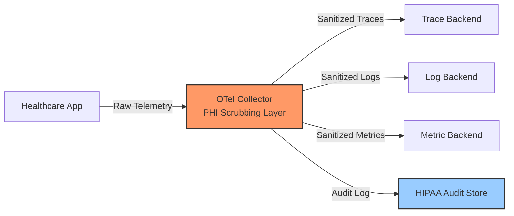
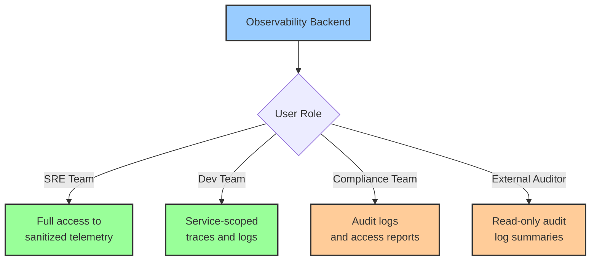

# How to Build HIPAA-Compliant Healthcare Observability with OpenTelemetry

Author: [nawazdhandala](https://www.github.com/nawazdhandala)

Tags: OpenTelemetry, HIPAA, Healthcare, Compliance, Observability, PHI, Security

Description: Learn how to build a HIPAA-compliant observability pipeline using OpenTelemetry to monitor healthcare applications while protecting patient health information.

---

Healthcare applications carry a unique burden. Every log line, every trace span, and every metric label could potentially contain Protected Health Information (PHI). The Health Insurance Portability and Accountability Act (HIPAA) mandates strict controls over how PHI is stored, transmitted, and accessed. Getting observability right in this context means building a pipeline that gives your engineering teams full visibility into system health without ever exposing patient data.

OpenTelemetry provides the instrumentation framework and collector pipeline to make this possible. In this guide, we will walk through the architecture, configuration, and code required to build a healthcare observability stack that satisfies HIPAA requirements.

## Understanding the HIPAA Observability Challenge

The core tension in healthcare observability is straightforward: you need detailed telemetry to diagnose production issues, but that telemetry must never contain PHI. Patient names, medical record numbers, dates of birth, Social Security numbers, diagnosis codes in certain contexts, and dozens of other data elements all fall under HIPAA protection.

The problem gets tricky because PHI can leak into observability data in unexpected places. A trace span might capture an HTTP request body containing a patient record. A log message might include a database query with a patient name in a WHERE clause. A metric label might use a patient ID as a dimension.

The architecture we need looks like this:



The collector sits between your applications and your backends, acting as a scrubbing layer that strips or redacts PHI before telemetry reaches any storage system.

## Instrumenting Healthcare Services Safely

The first line of defense is the application itself. When you instrument a healthcare service, you should avoid capturing PHI at the source whenever possible. Here is a Python example using the OpenTelemetry SDK for a patient lookup endpoint:

```python
# patient_service.py
# Instrument a healthcare API endpoint with PHI-safe span attributes

from opentelemetry import trace
from opentelemetry.trace import StatusCode

tracer = trace.get_tracer("patient-service", "1.0.0")

def get_patient_record(patient_id: str, requesting_user: str):
    """Fetch a patient record while keeping PHI out of telemetry."""

    # Start a span with only safe metadata
    with tracer.start_as_current_span("get_patient_record") as span:
        # Safe: use a hashed or tokenized patient identifier
        # Never put raw patient IDs directly into span attributes
        span.set_attribute("patient.id_hash", hash_identifier(patient_id))
        span.set_attribute("request.user", requesting_user)
        span.set_attribute("request.purpose", "treatment")

        try:
            record = database.fetch_patient(patient_id)

            # Safe: record the operation outcome without the data itself
            span.set_attribute("record.found", record is not None)
            span.set_attribute("record.section_count", len(record.sections) if record else 0)
            span.set_status(StatusCode.OK)

            return record

        except Exception as e:
            # Safe: log the error type but not the message, which may contain PHI
            span.set_attribute("error.type", type(e).__name__)
            span.set_status(StatusCode.ERROR, "Patient record lookup failed")
            raise
```

The key principle here is to record operational metadata (whether the record was found, how many sections it contained, who requested it) without recording the actual clinical data. The `hash_identifier` function converts the raw patient ID into a consistent but non-reversible token that lets you correlate spans without exposing the real identifier.

Here is the hashing utility:

```python
# phi_utils.py
# Utility functions for PHI-safe identifier handling

import hashlib
import os

# Load the salt from environment, never hardcode it
PHI_HASH_SALT = os.environ.get("PHI_HASH_SALT", "")

def hash_identifier(raw_id: str) -> str:
    """Create a one-way hash of a patient identifier.

    Uses SHA-256 with a salt to prevent rainbow table attacks.
    The same raw_id always produces the same hash, allowing
    correlation across spans without exposing the real ID.
    """
    salted = f"{PHI_HASH_SALT}{raw_id}".encode("utf-8")
    return hashlib.sha256(salted).hexdigest()[:16]
```

This salted hash approach lets you trace a single patient's journey through the system (by searching for the same hash) while making it computationally infeasible to reverse the hash back to the original ID.

## Configuring the Collector as a PHI Scrubbing Layer

Even with careful instrumentation, PHI can still slip through. Maybe a third-party library logs a full request body, or an error message includes a patient name from a database exception. The OpenTelemetry Collector acts as your safety net.

```yaml
# otel-collector-config.yaml
# HIPAA-compliant collector configuration with PHI scrubbing

receivers:
  otlp:
    protocols:
      grpc:
        # Use TLS for all inbound connections (HIPAA requires encryption in transit)
        endpoint: 0.0.0.0:4317
        tls:
          cert_file: /etc/otel/certs/collector.crt
          key_file: /etc/otel/certs/collector.key

processors:
  # Redact known PHI patterns from all telemetry
  transform/redact_phi:
    trace_statements:
      - context: span
        statements:
          # Redact Social Security Numbers (XXX-XX-XXXX pattern)
          - replace_pattern(attributes["http.request.body"], "\\d{3}-\\d{2}-\\d{4}", "[SSN-REDACTED]")
          # Redact Medical Record Numbers (MRN followed by digits)
          - replace_pattern(attributes["http.request.body"], "MRN\\d{6,10}", "[MRN-REDACTED]")
          # Redact email addresses
          - replace_pattern(attributes["http.request.body"], "[a-zA-Z0-9._%+-]+@[a-zA-Z0-9.-]+\\.[a-zA-Z]{2,}", "[EMAIL-REDACTED]")

    log_statements:
      - context: log
        statements:
          # Apply the same redaction patterns to log bodies
          - replace_pattern(body, "\\d{3}-\\d{2}-\\d{4}", "[SSN-REDACTED]")
          - replace_pattern(body, "MRN\\d{6,10}", "[MRN-REDACTED]")
          - replace_pattern(body, "[a-zA-Z0-9._%+-]+@[a-zA-Z0-9.-]+\\.[a-zA-Z]{2,}", "[EMAIL-REDACTED]")

  # Remove high-risk attributes entirely
  attributes/strip_phi:
    actions:
      # Delete any attribute that might contain raw patient data
      - key: http.request.body
        action: delete
      - key: http.response.body
        action: delete
      - key: db.statement
        action: delete
      - key: patient.name
        action: delete
      - key: patient.dob
        action: delete
      - key: patient.ssn
        action: delete

  # Memory limiter to prevent collector OOM under load
  memory_limiter:
    check_interval: 1s
    limit_mib: 2048
    spike_limit_mib: 512

  batch:
    timeout: 5s
    send_batch_size: 200

exporters:
  otlp/traces:
    endpoint: trace-backend.internal:4317
    tls:
      cert_file: /etc/otel/certs/collector.crt
      key_file: /etc/otel/certs/collector.key

  otlp/logs:
    endpoint: log-backend.internal:4317
    tls:
      cert_file: /etc/otel/certs/collector.crt
      key_file: /etc/otel/certs/collector.key

  otlp/metrics:
    endpoint: metric-backend.internal:4317
    tls:
      cert_file: /etc/otel/certs/collector.crt
      key_file: /etc/otel/certs/collector.key

service:
  pipelines:
    traces:
      receivers: [otlp]
      processors: [memory_limiter, transform/redact_phi, attributes/strip_phi, batch]
      exporters: [otlp/traces]

    logs:
      receivers: [otlp]
      processors: [memory_limiter, transform/redact_phi, attributes/strip_phi, batch]
      exporters: [otlp/logs]

    metrics:
      receivers: [otlp]
      processors: [memory_limiter, batch]
      exporters: [otlp/metrics]
```

The processing order matters. The transform processor runs regex-based redaction first, catching known PHI patterns. Then the attributes processor strips entire attribute keys that should never reach the backend. This defense-in-depth approach means that even if one layer misses something, the next layer catches it.

## Building the HIPAA Audit Trail

HIPAA requires audit logs that record who accessed what patient data and when. OpenTelemetry can feed this audit trail alongside your regular observability data:

```python
# audit_logger.py
# Generate HIPAA audit events as OpenTelemetry log records

import logging
from opentelemetry._logs import set_logger_provider
from opentelemetry.sdk._logs import LoggerProvider, LogRecord
from opentelemetry.sdk._logs.export import BatchLogRecordProcessor
from opentelemetry.exporter.otlp.proto.grpc._log_exporter import OTLPLogExporter

# Configure a dedicated logger for HIPAA audit events
provider = LoggerProvider()
provider.add_log_record_processor(
    BatchLogRecordProcessor(OTLPLogExporter(endpoint="localhost:4317"))
)
set_logger_provider(provider)

audit_logger = logging.getLogger("hipaa.audit")

def log_phi_access(user_id: str, patient_id_hash: str, action: str, resource_type: str):
    """Record a HIPAA audit event for PHI access.

    This creates an immutable audit record that satisfies the
    HIPAA requirement for tracking all access to patient data.
    """
    audit_logger.info(
        "PHI access event",
        extra={
            # Who accessed the data
            "audit.user_id": user_id,
            "audit.user_role": get_user_role(user_id),
            # What was accessed (hashed, not raw)
            "audit.patient_id_hash": patient_id_hash,
            "audit.resource_type": resource_type,
            # What action was taken
            "audit.action": action,
            # Classification for routing
            "audit.event_type": "phi_access",
            "audit.hipaa_relevant": True,
        }
    )
```

This audit logger integrates with the OpenTelemetry log pipeline, so audit events flow through the same collector infrastructure. You can route them to a separate, tamper-resistant audit store using the collector's routing capabilities.

## Encrypting Telemetry in Transit and at Rest

HIPAA requires encryption for PHI both in transit and at rest. Even though our pipeline scrubs PHI before export, applying encryption everywhere is a best practice that provides defense in depth.

For the collector-to-backend connection, use mutual TLS:

```yaml
# Mutual TLS configuration for collector exporters
exporters:
  otlp/secure:
    endpoint: backend.internal:4317
    tls:
      # Collector's client certificate
      cert_file: /etc/otel/certs/collector-client.crt
      key_file: /etc/otel/certs/collector-client.key
      # CA certificate to verify the backend
      ca_file: /etc/otel/certs/ca.crt
      # Require the server to present a valid certificate
      insecure: false
```

For Kubernetes deployments, use a NetworkPolicy to restrict which pods can send telemetry to the collector:

```yaml
# network-policy.yaml
# Restrict collector access to authorized healthcare service pods only
apiVersion: networking.k8s.io/v1
kind: NetworkPolicy
metadata:
  name: otel-collector-ingress
  namespace: observability
spec:
  podSelector:
    matchLabels:
      app: otel-collector
  policyTypes:
    - Ingress
  ingress:
    # Only allow traffic from healthcare service namespaces
    - from:
        - namespaceSelector:
            matchLabels:
              hipaa-compliant: "true"
      ports:
        - protocol: TCP
          port: 4317
```

This ensures that only pods running in namespaces labeled as HIPAA-compliant can send telemetry to the collector, preventing unauthorized data sources from injecting potentially harmful data.

## Implementing Role-Based Access to Observability Data

Even sanitized observability data should be accessible only to authorized personnel. Configure your observability backend with role-based access control:



## Testing Your PHI Scrubbing Pipeline

Before going to production, validate that your collector pipeline actually removes PHI. Write integration tests that send telemetry containing known PHI patterns and verify that the exported data is clean:

```python
# test_phi_scrubbing.py
# Integration test to verify PHI is removed from telemetry

import grpc
from opentelemetry.proto.collector.trace.v1 import trace_service_pb2_grpc
from opentelemetry.proto.collector.trace.v1 import trace_service_pb2

def test_ssn_redacted_from_spans():
    """Verify that SSN patterns are redacted in exported spans."""

    # Send a span with a fake SSN in the request body attribute
    channel = grpc.insecure_channel("localhost:4317")
    stub = trace_service_pb2_grpc.TraceServiceStub(channel)

    # Create a span with PHI in attributes
    span = create_test_span(
        attributes={"http.request.body": "Patient SSN: 123-45-6789"}
    )

    stub.Export(trace_service_pb2.ExportTraceServiceRequest(
        resource_spans=[span]
    ))

    # Fetch the exported span from the backend
    exported = fetch_latest_span_from_backend()

    # Verify the SSN is no longer present
    body_attr = get_attribute(exported, "http.request.body")
    assert "123-45-6789" not in body_attr
    assert "[SSN-REDACTED]" in body_attr or body_attr is None
```

Run these tests as part of your CI/CD pipeline. Any configuration change to the collector should trigger a full suite of PHI scrubbing tests before deployment.

## Retention and Disposal

HIPAA requires that organizations define retention periods and properly dispose of data when those periods expire. Configure your observability backend with appropriate retention policies. Even though your telemetry should be free of PHI after scrubbing, maintaining short retention periods reduces risk:

- Traces: 30 days for operational troubleshooting
- Logs: 30 days for operational use, with audit logs retained for 6 years (HIPAA minimum)
- Metrics: 90 days at full resolution, then downsampled for capacity planning

## Conclusion

Building HIPAA-compliant observability with OpenTelemetry requires a layered approach. Start by instrumenting applications to avoid capturing PHI at the source. Use the OpenTelemetry Collector as a centralized scrubbing layer with regex-based redaction and attribute stripping. Encrypt all telemetry in transit with mutual TLS. Maintain a dedicated audit trail for PHI access events. And validate your entire pipeline with automated tests that confirm PHI removal before every deployment.

The investment in building this pipeline correctly pays off in two ways: your engineering team gets the observability they need to keep healthcare systems running reliably, and your compliance team gets the audit trail and data protection they need to satisfy HIPAA requirements.
