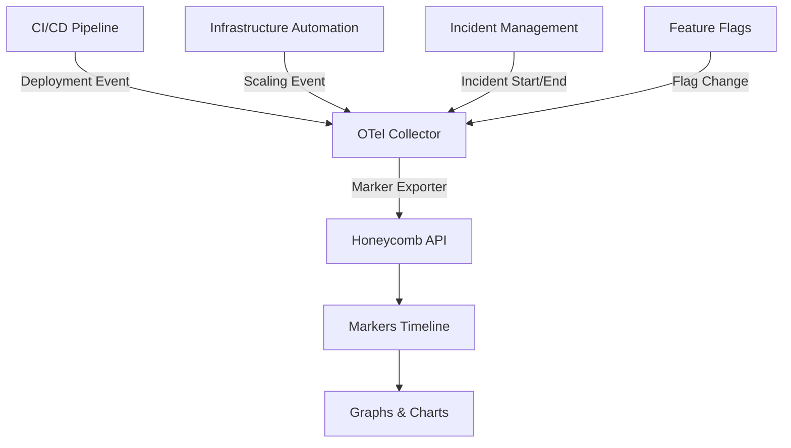

# How to Configure the Honeycomb Marker Exporter in the OpenTelemetry Collector

Author: [nawazdhandala](https://www.github.com/nawazdhandala)

Tags: OpenTelemetry, Collector, Exporters, Honeycomb, Markers, Observability, Deployments, Events

Description: Learn how to configure the Honeycomb Marker exporter in OpenTelemetry Collector to track deployments, releases, and significant events in your observability timeline.

Honeycomb is an observability platform designed for high-cardinality data and complex queries. While most exporters focus on sending continuous telemetry data like logs, metrics, and traces, the Honeycomb Marker exporter serves a unique purpose: it creates markers (also called events) that represent significant moments in your system's timeline. These markers help you correlate system behavior with deployments, configuration changes, incidents, and other operational events, making it easier to understand the impact of changes on your application's performance and reliability.

## Understanding Honeycomb Markers

Markers in Honeycomb are point-in-time annotations that appear as vertical lines on your graphs and charts. They provide context when analyzing telemetry data by highlighting when specific events occurred. Common use cases include marking deployment completions, feature flag changes, infrastructure scaling events, incident starts and resolutions, configuration updates, and database migrations.

Unlike continuous telemetry streams, markers are discrete events that you create intentionally to document important occurrences. When you view a graph showing error rates or latency, markers help you immediately see if a spike correlates with a recent deployment or configuration change.

## Architecture and Use Cases

The Honeycomb Marker exporter typically integrates into CI/CD pipelines and operational workflows rather than running continuously like other exporters. Here's how it fits into your observability architecture:



## Basic Configuration

Here's a minimal configuration to send markers to Honeycomb. This example shows how to create a deployment marker.

```yaml
# Receivers for collecting marker data
receivers:
  # HTTP receiver for webhook-style marker creation
  otlp:
    protocols:
      http:
        endpoint: 0.0.0.0:4318

# Honeycomb Marker exporter configuration
exporters:
  honeycomb_marker:
    # Honeycomb API endpoint (US region)
    api_url: https://api.honeycomb.io

    # API key for authentication (from Honeycomb settings)
    api_key: "${HONEYCOMB_API_KEY}"

    # Marker type (appears in Honeycomb UI)
    marker_type: "deployment"

    # Optional: message template for marker description
    message_template: "Deployed version {{.version}} to {{.environment}}"

# No processors needed for basic marker creation
processors:
  batch:
    timeout: 1s
    send_batch_size: 1

# Pipeline configuration
service:
  pipelines:
    logs:
      receivers: [otlp]
      processors: [batch]
      exporters: [honeycomb_marker]
```

This basic configuration creates deployment markers in Honeycomb. You would trigger marker creation by sending a log event to the collector with appropriate attributes like version and environment.

## Production Configuration with Multiple Marker Types

In production environments, you'll want to track various event types with different marker configurations.

```yaml
receivers:
  otlp:
    protocols:
      http:
        endpoint: 0.0.0.0:4318

exporters:
  # Deployment markers
  honeycomb_marker/deployment:
    api_url: https://api.honeycomb.io
    api_key: "${HONEYCOMB_API_KEY}"
    marker_type: "deployment"
    message_template: "Deployed {{.service_name}} version {{.version}} to {{.environment}}"

    # Additional metadata
    metadata:
      team: "platform"
      tool: "opentelemetry-collector"

  # Incident markers
  honeycomb_marker/incident:
    api_url: https://api.honeycomb.io
    api_key: "${HONEYCOMB_API_KEY}"
    marker_type: "incident"
    message_template: "Incident {{.incident_id}}: {{.title}} - Status: {{.status}}"

    metadata:
      team: "sre"
      tool: "opentelemetry-collector"

  # Configuration change markers
  honeycomb_marker/config:
    api_url: https://api.honeycomb.io
    api_key: "${HONEYCOMB_API_KEY}"
    marker_type: "configuration"
    message_template: "Config change: {{.change_description}} by {{.user}}"

    metadata:
      team: "operations"
      tool: "opentelemetry-collector"

  # Feature flag markers
  honeycomb_marker/feature_flag:
    api_url: https://api.honeycomb.io
    api_key: "${HONEYCOMB_API_KEY}"
    marker_type: "feature_flag"
    message_template: "Feature flag {{.flag_name}} set to {{.flag_value}} in {{.environment}}"

    metadata:
      team: "product"
      tool: "opentelemetry-collector"

processors:
  # Route to appropriate exporter based on marker type
  routing:
    from_attribute: marker.type
    default_exporters: [honeycomb_marker/deployment]
    table:
      - value: deployment
        exporters: [honeycomb_marker/deployment]
      - value: incident
        exporters: [honeycomb_marker/incident]
      - value: configuration
        exporters: [honeycomb_marker/config]
      - value: feature_flag
        exporters: [honeycomb_marker/feature_flag]

  # Add timestamp if not present
  attributes:
    actions:
      - key: timestamp
        action: insert
        value: ${NOW}

  batch:
    timeout: 1s
    send_batch_size: 1

service:
  telemetry:
    logs:
      level: info
    metrics:
      level: detailed
      address: 0.0.0.0:8888

  pipelines:
    logs:
      receivers: [otlp]
      processors: [attributes, routing, batch]
      exporters:
        - honeycomb_marker/deployment
        - honeycomb_marker/incident
        - honeycomb_marker/config
        - honeycomb_marker/feature_flag
```

This configuration supports multiple marker types, each with custom message templates and metadata. The routing processor directs events to the appropriate exporter based on the marker type attribute.

## CI/CD Integration for Deployment Markers

The most common use case for markers is tracking deployments. Here's how to integrate the collector into your CI/CD pipeline.

```yaml
receivers:
  # Accept markers via HTTP POST
  otlp:
    protocols:
      http:
        endpoint: 0.0.0.0:4318
        cors:
          allowed_origins:
            - "*"

exporters:
  honeycomb_marker:
    api_url: https://api.honeycomb.io
    api_key: "${HONEYCOMB_API_KEY}"
    marker_type: "deployment"

    # Rich deployment information
    message_template: |
      Deployment completed
      Service: {{.service_name}}
      Version: {{.version}}
      Environment: {{.environment}}
      Deployed by: {{.deployer}}
      Commit: {{.git_commit}}
      Duration: {{.deployment_duration}}

    # URL to deployment details
    url_template: "{{.ci_pipeline_url}}"

processors:
  # Enrich with deployment metadata
  attributes/deployment:
    actions:
      - key: marker.type
        value: deployment
        action: upsert
      - key: timestamp
        action: insert
        from_attribute: deployment_timestamp
      - key: service_name
        action: insert
        from_attribute: service.name
      - key: deployment_status
        value: success
        action: insert

  batch:
    timeout: 1s
    send_batch_size: 1

service:
  pipelines:
    logs:
      receivers: [otlp]
      processors: [attributes/deployment, batch]
      exporters: [honeycomb_marker]
```

From your CI/CD pipeline (GitHub Actions, GitLab CI, Jenkins, etc.), send a POST request to the collector:

```bash
curl -X POST http://collector:4318/v1/logs \
  -H "Content-Type: application/json" \
  -d '{
    "resourceLogs": [{
      "resource": {
        "attributes": [{
          "key": "service.name",
          "value": {"stringValue": "api-gateway"}
        }]
      },
      "scopeLogs": [{
        "logRecords": [{
          "timeUnixNano": "'$(date +%s)000000000'",
          "body": {"stringValue": "Deployment marker"},
          "attributes": [
            {"key": "version", "value": {"stringValue": "v1.2.3"}},
            {"key": "environment", "value": {"stringValue": "production"}},
            {"key": "deployer", "value": {"stringValue": "alice@example.com"}},
            {"key": "git_commit", "value": {"stringValue": "abc123"}},
            {"key": "ci_pipeline_url", "value": {"stringValue": "https://github.com/org/repo/actions/runs/123"}},
            {"key": "deployment_duration", "value": {"stringValue": "3m 45s"}}
          ]
        }]
      }]
    }]
  }'
```

This creates a rich deployment marker in Honeycomb with all relevant context.

## Kubernetes Deployment Markers

For Kubernetes deployments, you can automate marker creation using a Job or hook.

```yaml
receivers:
  otlp:
    protocols:
      http:
        endpoint: 0.0.0.0:4318

exporters:
  honeycomb_marker:
    api_url: https://api.honeycomb.io
    api_key: "${HONEYCOMB_API_KEY}"
    marker_type: "k8s_deployment"

    message_template: |
      Kubernetes Deployment
      Namespace: {{.k8s_namespace}}
      Deployment: {{.k8s_deployment}}
      Image: {{.container_image}}
      Replicas: {{.replica_count}}
      Cluster: {{.k8s_cluster}}

processors:
  # Add Kubernetes metadata
  k8sattributes:
    auth_type: serviceAccount
    passthrough: false
    extract:
      metadata:
        - k8s.namespace.name
        - k8s.deployment.name
        - k8s.cluster.name
      labels:
        - tag_name: app
          key: app
          from: pod

  # Enrich with K8s-specific attributes
  attributes/k8s:
    actions:
      - key: marker.type
        value: deployment
        action: upsert
      - key: k8s_namespace
        from_attribute: k8s.namespace.name
        action: upsert
      - key: k8s_deployment
        from_attribute: k8s.deployment.name
        action: upsert
      - key: k8s_cluster
        from_attribute: k8s.cluster.name
        action: upsert

  batch:
    timeout: 1s
    send_batch_size: 1

service:
  pipelines:
    logs:
      receivers: [otlp]
      processors: [k8sattributes, attributes/k8s, batch]
      exporters: [honeycomb_marker]
```

Create a Kubernetes Job that runs after successful deployments:

```yaml
apiVersion: batch/v1
kind: Job
metadata:
  name: deployment-marker
  namespace: production
spec:
  template:
    spec:
      containers:
      - name: marker
        image: curlimages/curl:latest
        command:
        - sh
        - -c
        - |
          curl -X POST http://otel-collector.observability:4318/v1/logs \
            -H "Content-Type: application/json" \
            -d '{
              "resourceLogs": [{
                "scopeLogs": [{
                  "logRecords": [{
                    "timeUnixNano": "'$(date +%s)000000000'",
                    "body": {"stringValue": "K8s deployment marker"},
                    "attributes": [
                      {"key": "container_image", "value": {"stringValue": "'"$IMAGE_TAG"'"}},
                      {"key": "replica_count", "value": {"stringValue": "'"$REPLICA_COUNT"'"}}
                    ]
                  }]
                }]
              }]
            }'
      restartPolicy: Never
```

This Job creates a marker in Honeycomb whenever a Kubernetes deployment completes.

## Incident Markers for On-Call Workflow

Track incident lifecycle with markers for start, escalation, and resolution events.

```yaml
exporters:
  honeycomb_marker/incident:
    api_url: https://api.honeycomb.io
    api_key: "${HONEYCOMB_API_KEY}"
    marker_type: "incident"

    message_template: |
      Incident {{.incident_id}}
      Title: {{.title}}
      Severity: {{.severity}}
      Status: {{.status}}
      On-call: {{.oncall_engineer}}
      Start: {{.start_time}}
      Duration: {{.duration}}

    # Link to incident management system
    url_template: "https://pagerduty.com/incidents/{{.incident_id}}"

processors:
  # Transform PagerDuty webhook to marker format
  attributes/incident:
    actions:
      - key: marker.type
        value: incident
        action: upsert
      - key: incident_id
        from_attribute: incident.id
        action: upsert
      - key: title
        from_attribute: incident.title
        action: upsert
      - key: severity
        from_attribute: incident.urgency
        action: upsert
      - key: status
        from_attribute: incident.status
        action: upsert
      - key: oncall_engineer
        from_attribute: incident.assignments[0].assignee.summary
        action: upsert

  batch:
    timeout: 1s
    send_batch_size: 1

service:
  pipelines:
    logs:
      receivers: [otlp]
      processors: [attributes/incident, batch]
      exporters: [honeycomb_marker/incident]
```

Configure your incident management tool (PagerDuty, Opsgenie, etc.) to send webhooks to the collector when incidents are created, acknowledged, or resolved.

## Feature Flag Change Markers

Track feature flag changes to understand their impact on system behavior.

```yaml
exporters:
  honeycomb_marker/feature_flag:
    api_url: https://api.honeycomb.io
    api_key: "${HONEYCOMB_API_KEY}"
    marker_type: "feature_flag"

    message_template: |
      Feature Flag Change
      Flag: {{.flag_name}}
      Environment: {{.environment}}
      Previous: {{.old_value}}
      New: {{.new_value}}
      Changed by: {{.user}}
      Reason: {{.reason}}

processors:
  # Transform LaunchDarkly webhook to marker format
  attributes/feature_flag:
    actions:
      - key: marker.type
        value: feature_flag
        action: upsert
      - key: flag_name
        from_attribute: flag.key
        action: upsert
      - key: environment
        from_attribute: environment.key
        action: upsert
      - key: old_value
        from_attribute: flag.previousValue
        action: upsert
      - key: new_value
        from_attribute: flag.currentValue
        action: upsert
      - key: user
        from_attribute: member.email
        action: upsert

  batch:
    timeout: 1s
    send_batch_size: 1

service:
  pipelines:
    logs:
      receivers: [otlp]
      processors: [attributes/feature_flag, batch]
      exporters: [honeycomb_marker/feature_flag]
```

Configure your feature flag service (LaunchDarkly, Split, etc.) to send webhooks when flags change.

## Database Migration Markers

Track database schema changes and migrations.

```yaml
exporters:
  honeycomb_marker/migration:
    api_url: https://api.honeycomb.io
    api_key: "${HONEYCOMB_API_KEY}"
    marker_type: "database_migration"

    message_template: |
      Database Migration
      Migration: {{.migration_name}}
      Database: {{.database_name}}
      Environment: {{.environment}}
      Direction: {{.direction}}
      Duration: {{.duration}}
      Executed by: {{.user}}

processors:
  attributes/migration:
    actions:
      - key: marker.type
        value: migration
        action: upsert

  batch:
    timeout: 1s
    send_batch_size: 1

service:
  pipelines:
    logs:
      receivers: [otlp]
      processors: [attributes/migration, batch]
      exporters: [honeycomb_marker/migration]
```

Call the collector from your migration scripts:

```bash
# Before running migration
curl -X POST http://collector:4318/v1/logs \
  -H "Content-Type: application/json" \
  -d '{
    "resourceLogs": [{
      "scopeLogs": [{
        "logRecords": [{
          "timeUnixNano": "'$(date +%s)000000000'",
          "body": {"stringValue": "Migration start"},
          "attributes": [
            {"key": "migration_name", "value": {"stringValue": "add_user_preferences"}},
            {"key": "database_name", "value": {"stringValue": "production"}},
            {"key": "environment", "value": {"stringValue": "production"}},
            {"key": "direction", "value": {"stringValue": "up"}},
            {"key": "user", "value": {"stringValue": "dba@example.com"}}
          ]
        }]
      }]
    }]
  }'

# Run migration
flyway migrate

# After migration completes
curl -X POST http://collector:4318/v1/logs \
  -H "Content-Type: application/json" \
  -d '{
    "resourceLogs": [{
      "scopeLogs": [{
        "logRecords": [{
          "timeUnixNano": "'$(date +%s)000000000'",
          "body": {"stringValue": "Migration complete"},
          "attributes": [
            {"key": "migration_name", "value": {"stringValue": "add_user_preferences"}},
            {"key": "duration", "value": {"stringValue": "45s"}}
          ]
        }]
      }]
    }]
  }'
```

## Security and Authentication

Protect your marker endpoint and secure API keys.

```yaml
receivers:
  otlp:
    protocols:
      http:
        endpoint: 0.0.0.0:4318
        # Enable authentication
        auth:
          authenticator: basicauth

# Basic authentication extension
extensions:
  basicauth:
    htpasswd:
      file: /etc/otel/htpasswd
      inline: |
        user1:$apr1$...
        user2:$apr1$...

exporters:
  honeycomb_marker:
    api_url: https://api.honeycomb.io
    # Use environment variable for API key
    api_key: "${HONEYCOMB_API_KEY}"
    marker_type: "deployment"

service:
  extensions: [basicauth]
  pipelines:
    logs:
      receivers: [otlp]
      exporters: [honeycomb_marker]
```

Clients must authenticate when sending markers:

```bash
curl -u user1:password -X POST http://collector:4318/v1/logs \
  -H "Content-Type: application/json" \
  -d '...'
```

## Multi-Environment Configuration

Track markers separately for different environments.

```yaml
exporters:
  # Production markers
  honeycomb_marker/production:
    api_url: https://api.honeycomb.io
    api_key: "${HONEYCOMB_API_KEY_PROD}"
    marker_type: "deployment"
    message_template: "[PROD] Deployed {{.service_name}} {{.version}}"

  # Staging markers
  honeycomb_marker/staging:
    api_url: https://api.honeycomb.io
    api_key: "${HONEYCOMB_API_KEY_STAGING}"
    marker_type: "deployment"
    message_template: "[STAGING] Deployed {{.service_name}} {{.version}}"

processors:
  routing:
    from_attribute: environment
    default_exporters: [honeycomb_marker/production]
    table:
      - value: production
        exporters: [honeycomb_marker/production]
      - value: staging
        exporters: [honeycomb_marker/staging]

service:
  pipelines:
    logs:
      receivers: [otlp]
      processors: [routing]
      exporters: [honeycomb_marker/production, honeycomb_marker/staging]
```

## Monitoring and Troubleshooting

Monitor marker creation with telemetry.

```yaml
service:
  telemetry:
    logs:
      level: debug
      encoding: json
      output_paths: [stdout, /var/log/otel-collector.log]

    metrics:
      level: detailed
      address: 0.0.0.0:8888
```

Key metrics to monitor:

- `otelcol_exporter_sent_log_records`: Markers successfully sent
- `otelcol_exporter_send_failed_log_records`: Failed marker creation
- `otelcol_receiver_accepted_log_records`: Marker requests received

Common issues:

**401 Unauthorized**: Verify Honeycomb API key is correct and has write permissions.

**400 Bad Request**: Check message template is valid and required attributes are present.

**Markers Not Appearing**: Ensure you're viewing the correct time range in Honeycomb and the dataset matches.

**Template Errors**: Verify attribute names in templates match actual log attributes.

## Integration Examples

Here are complete examples for common scenarios.

**GitHub Actions Deployment Marker**:

```yaml
- name: Create deployment marker
  run: |
    curl -X POST http://otel-collector:4318/v1/logs \
      -H "Content-Type: application/json" \
      -d '{
        "resourceLogs": [{
          "scopeLogs": [{
            "logRecords": [{
              "timeUnixNano": "'$(date +%s)000000000'",
              "body": {"stringValue": "GitHub Actions deployment"},
              "attributes": [
                {"key": "service_name", "value": {"stringValue": "'"${{ github.repository }}"'"}},
                {"key": "version", "value": {"stringValue": "'"${{ github.sha }}"'"}},
                {"key": "environment", "value": {"stringValue": "production"}},
                {"key": "deployer", "value": {"stringValue": "'"${{ github.actor }}"'"}},
                {"key": "ci_pipeline_url", "value": {"stringValue": "'"${{ github.server_url }}/${{ github.repository }}/actions/runs/${{ github.run_id }}"'"}}
              ]
            }]
          }]
        }]
      }'
```

**Terraform Change Marker**:

```bash
# After terraform apply
terraform output -json | jq -r 'to_entries | map({
  key: .key,
  value: {stringValue: (.value.value | tostring)}
}) | {
  resourceLogs: [{
    scopeLogs: [{
      logRecords: [{
        timeUnixNano: (now * 1000000000 | floor | tostring),
        body: {stringValue: "Terraform change"},
        attributes: .
      }]
    }]
  }]
}' | curl -X POST http://collector:4318/v1/logs \
  -H "Content-Type: application/json" \
  -d @-
```

## Related Resources

For more information on OpenTelemetry exporters, check out these related posts:

- [How to Configure the Coralogix Exporter in the OpenTelemetry Collector](https://oneuptime.com/blog/post/2026-02-06-coralogix-exporter-opentelemetry-collector/view)
- [How to Configure the Sentry Exporter in the OpenTelemetry Collector](https://oneuptime.com/blog/post/2026-02-06-sentry-exporter-opentelemetry-collector/view)

The Honeycomb Marker exporter provides a powerful way to correlate system behavior with operational events. By creating markers for deployments, incidents, configuration changes, and other significant events, you can quickly understand the impact of changes and accelerate troubleshooting when issues occur.
