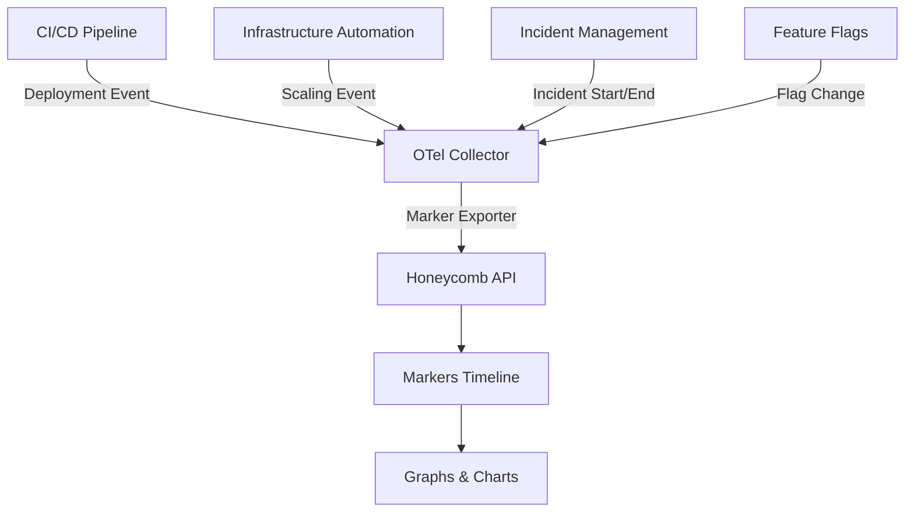

# How to Configure the Honeycomb Marker Exporter in the OpenTelemetry Collector

Author: [nawazdhandala](https://www.github.com/nawazdhandala)

Tags: OpenTelemetry, Collector, Exporter, Honeycomb, Markers, Observability, Deployment, Event

Description: Learn how to configure the Honeycomb Marker exporter in OpenTelemetry Collector to track deployments, releases, and significant events in your observability timeline.

Honeycomb is an observability platform designed for high-cardinality data and complex queries. While most exporters focus on sending continuous telemetry data like logs, metrics, and traces, the Honeycomb Marker exporter serves a unique purpose: it creates markers that represent significant moments in your system's timeline. These markers help you correlate system behavior with deployments, configuration changes, incidents, and other operational events, making it easier to understand the impact of changes on your application's performance and reliability.

## Understanding Honeycomb Markers

Markers in Honeycomb are point-in-time annotations that appear as vertical lines on your graphs and charts. They provide context when analyzing telemetry data by highlighting when specific events occurred. Common use cases include marking deployment completions, feature flag changes, infrastructure scaling events, incident starts and resolutions, configuration updates, and database migrations.

Unlike continuous telemetry streams, markers are discrete events that you create intentionally to document important occurrences. When you view a graph showing error rates or latency, markers help you immediately see if a spike correlates with a recent deployment or configuration change.

## Architecture and Use Cases

The Honeycomb Marker exporter typically integrates into CI/CD pipelines and operational workflows rather than running continuously like other exporters. Here's how it fits into your observability architecture:


```mermaid
graph TD
    A[CI/CD Pipeline] -->|Deployment Event| B[OTel Collector]
    C[Infrastructure Automation] -->|Scaling Event| B
    D[Incident Management] -->|Incident Start/End| B
    E[Feature Flags] -->|Flag Change| B
    B -->|Marker Exporter| F[Honeycomb API]
    F --> G[Markers Timeline]
    G --> H[Graphs & Charts]
```

## Basic Configuration

Here's a minimal configuration to send markers to Honeycomb. This example shows how to create a deployment marker.

```yaml
# Receivers for collecting marker data

receivers:
  # HTTP receiver for webhook-style marker creation
  otlp:
    protocols:
      http:
        endpoint: 0.0.0.0:4318

# Honeycomb Marker exporter configuration
exporters:
  honeycomb_marker:
    # Honeycomb API endpoint (US region)
    api_url: https://api.honeycomb.io

    # API key for authentication (from Honeycomb settings)
    api_key: "${env:HONEYCOMB_API_KEY}"

    markers:
      # Marker type appears in the Honeycomb UI
      - type: "deployment"

        # Optional: dataset slug. Defaults to __all__ for an environment marker.
        dataset_slug: "__all__"

        # Attribute keys used for the marker text and URL
        message_key: "marker_message"
        url_key: "marker_url"

        # Create a marker when any condition matches
        rules:
          log_conditions:
            - 'log.attributes["marker.type"] == "deployment"'

# No processors needed for basic marker creation
processors:
  batch:
    timeout: 1s
    send_batch_size: 1

# Pipeline configuration
service:
  pipelines:
    logs:
      receivers: [otlp]
      processors: [batch]
      exporters: [honeycomb_marker]
```

This basic configuration creates deployment markers in Honeycomb. You would trigger marker creation by sending a log event to the collector with attributes like `marker.type`, `marker_message`, and `marker_url`.

## Production Configuration with Multiple Marker Types

In production environments, you'll want to track various event types with different marker configurations.

```yaml
receivers:
  otlp:
    protocols:
      http:
        endpoint: 0.0.0.0:4318

exporters:
  honeycomb_marker:
    api_url: https://api.honeycomb.io
    api_key: "${env:HONEYCOMB_API_KEY}"
    markers:
      # Deployment markers
      - type: "deployment"
        dataset_slug: "__all__"
        message_key: "marker_message"
        url_key: "marker_url"
        rules:
          log_conditions:
            - 'log.attributes["marker.type"] == "deployment"'

      # Incident markers
      - type: "incident"
        dataset_slug: "__all__"
        message_key: "marker_message"
        url_key: "marker_url"
        rules:
          log_conditions:
            - 'log.attributes["marker.type"] == "incident"'

      # Configuration change markers
      - type: "configuration"
        dataset_slug: "__all__"
        message_key: "marker_message"
        url_key: "marker_url"
        rules:
          log_conditions:
            - 'log.attributes["marker.type"] == "configuration"'

      # Feature flag markers
      - type: "feature_flag"
        dataset_slug: "__all__"
        message_key: "marker_message"
        url_key: "marker_url"
        rules:
          log_conditions:
            - 'log.attributes["marker.type"] == "feature_flag"'

processors:
  batch:
    timeout: 1s
    send_batch_size: 1

service:
  telemetry:
    logs:
      level: info
    metrics:
      level: detailed

  pipelines:
    logs:
      receivers: [otlp]
      processors: [batch]
      exporters: [honeycomb_marker]
```

This configuration supports multiple marker types, each with its own OTTL condition. The exporter creates the appropriate marker when the `marker.type` attribute matches one of the configured conditions.

## CI/CD Integration for Deployment Markers

The most common use case for markers is tracking deployments. Here's how to integrate the collector into your CI/CD pipeline.

```yaml
receivers:
  # Accept markers via HTTP POST
  otlp:
    protocols:
      http:
        endpoint: 0.0.0.0:4318
        cors:
          allowed_origins:
            - "*"

exporters:
  honeycomb_marker:
    api_url: https://api.honeycomb.io
    api_key: "${env:HONEYCOMB_API_KEY}"
    markers:
      - type: "deployment"
        dataset_slug: "__all__"
        message_key: "marker_message"
        url_key: "marker_url"
        rules:
          log_conditions:
            - 'log.attributes["marker.type"] == "deployment"'

processors:
  # Enrich with deployment metadata
  attributes/deployment:
    actions:
      - key: marker.type
        value: deployment
        action: upsert
      - key: deployment_status
        value: success
        action: insert

  batch:
    timeout: 1s
    send_batch_size: 1

service:
  pipelines:
    logs:
      receivers: [otlp]
      processors: [attributes/deployment, batch]
      exporters: [honeycomb_marker]
```

From your CI/CD pipeline (GitHub Actions, GitLab CI, Jenkins, etc.), send a POST request to the collector:

```bash
curl -X POST http://collector:4318/v1/logs \
  -H "Content-Type: application/json" \
  -d '{
    "resourceLogs": [{
      "resource": {
        "attributes": [{
          "key": "service.name",
          "value": {"stringValue": "api-gateway"}
        }]
      },
      "scopeLogs": [{
        "logRecords": [{
          "timeUnixNano": "'$(date +%s)000000000'",
          "body": {"stringValue": "Deployment marker"},
          "attributes": [
            {"key": "marker.type", "value": {"stringValue": "deployment"}},
            {"key": "marker_message", "value": {"stringValue": "Deployed api-gateway v1.2.3 to production by alice@example.com, commit abc123, duration 3m 45s"}},
            {"key": "marker_url", "value": {"stringValue": "https://github.com/org/repo/actions/runs/123"}},
            {"key": "version", "value": {"stringValue": "v1.2.3"}},
            {"key": "environment", "value": {"stringValue": "production"}},
            {"key": "deployer", "value": {"stringValue": "alice@example.com"}},
            {"key": "git_commit", "value": {"stringValue": "abc123"}},
            {"key": "deployment_duration", "value": {"stringValue": "3m 45s"}}
          ]
        }]
      }]
    }]
  }'
```

This creates a rich deployment marker in Honeycomb with all relevant context.

## Kubernetes Deployment Markers

For Kubernetes deployments, you can automate marker creation using a Job or hook.

```yaml
receivers:
  otlp:
    protocols:
      http:
        endpoint: 0.0.0.0:4318

exporters:
  honeycomb_marker:
    api_url: https://api.honeycomb.io
    api_key: "${env:HONEYCOMB_API_KEY}"
    markers:
      - type: "k8s_deployment"
        dataset_slug: "__all__"
        message_key: "marker_message"
        rules:
          log_conditions:
            - 'log.attributes["marker.type"] == "k8s_deployment"'

processors:
  # Add Kubernetes metadata
  k8sattributes:
    auth_type: serviceAccount
    passthrough: false
    extract:
      metadata:
        - k8s.namespace.name
        - k8s.deployment.name
        - k8s.cluster.uid
      labels:
        - tag_name: app
          key: app
          from: pod

  # Enrich with K8s-specific attributes
  attributes/k8s:
    actions:
      - key: marker.type
        value: k8s_deployment
        action: upsert

  batch:
    timeout: 1s
    send_batch_size: 1

service:
  pipelines:
    logs:
      receivers: [otlp]
      processors: [k8sattributes, attributes/k8s, batch]
      exporters: [honeycomb_marker]
```

Create a Kubernetes Job that runs after successful deployments:

```yaml
apiVersion: batch/v1
kind: Job
metadata:
  name: deployment-marker
  namespace: production
spec:
  template:
    spec:
      containers:
      - name: marker
        image: curlimages/curl:latest
        command:
        - sh
        - -c
        - |
          curl -X POST http://otel-collector.observability:4318/v1/logs \
            -H "Content-Type: application/json" \
            -d '{
              "resourceLogs": [{
                "scopeLogs": [{
                  "logRecords": [{
                    "timeUnixNano": "'$(date +%s)000000000'",
                    "body": {"stringValue": "K8s deployment marker"},
                    "attributes": [
                      {"key": "marker.type", "value": {"stringValue": "k8s_deployment"}},
                      {"key": "marker_message", "value": {"stringValue": "Kubernetes deployment image '"$IMAGE_TAG"' with '"$REPLICA_COUNT"' replicas"}},
                      {"key": "container_image", "value": {"stringValue": "'"$IMAGE_TAG"'"}},
                      {"key": "replica_count", "value": {"stringValue": "'"$REPLICA_COUNT"'"}}
                    ]
                  }]
                }]
              }]
            }'
      restartPolicy: Never
```

This Job creates a marker in Honeycomb whenever a Kubernetes deployment completes.

## Incident Markers for On-Call Workflow

Track incident lifecycle with markers for start, escalation, and resolution events.

```yaml
exporters:
  honeycomb_marker/incident:
    api_url: https://api.honeycomb.io
    api_key: "${env:HONEYCOMB_API_KEY}"
    markers:
      - type: "incident"
        dataset_slug: "__all__"
        message_key: "marker_message"
        url_key: "marker_url"
        rules:
          log_conditions:
            - 'log.attributes["marker.type"] == "incident"'

processors:
  # Transform PagerDuty webhook attributes to marker attributes
  attributes/incident:
    actions:
      - key: marker.type
        value: incident
        action: upsert

  batch:
    timeout: 1s
    send_batch_size: 1

service:
  pipelines:
    logs:
      receivers: [otlp]
      processors: [attributes/incident, batch]
      exporters: [honeycomb_marker/incident]
```

Configure your incident management tool (PagerDuty, Opsgenie, etc.) to send webhooks to the collector when incidents are created, acknowledged, or resolved. Include `marker_message` and `marker_url` attributes in the log record so Honeycomb displays the incident summary and link.

## Feature Flag Change Markers

Track feature flag changes to understand their impact on system behavior.

```yaml
exporters:
  honeycomb_marker/feature_flag:
    api_url: https://api.honeycomb.io
    api_key: "${env:HONEYCOMB_API_KEY}"
    markers:
      - type: "feature_flag"
        dataset_slug: "__all__"
        message_key: "marker_message"
        url_key: "marker_url"
        rules:
          log_conditions:
            - 'log.attributes["marker.type"] == "feature_flag"'

processors:
  # Transform LaunchDarkly webhook attributes to marker attributes
  attributes/feature_flag:
    actions:
      - key: marker.type
        value: feature_flag
        action: upsert

  batch:
    timeout: 1s
    send_batch_size: 1

service:
  pipelines:
    logs:
      receivers: [otlp]
      processors: [attributes/feature_flag, batch]
      exporters: [honeycomb_marker/feature_flag]
```

Configure your feature flag service (LaunchDarkly, Split, etc.) to send webhooks when flags change. Include a preformatted `marker_message` attribute with the flag name, environment, old value, new value, user, and reason.

## Database Migration Markers

Track database schema changes and migrations.

```yaml
exporters:
  honeycomb_marker/migration:
    api_url: https://api.honeycomb.io
    api_key: "${env:HONEYCOMB_API_KEY}"
    markers:
      - type: "database_migration"
        dataset_slug: "__all__"
        message_key: "marker_message"
        rules:
          log_conditions:
            - 'log.attributes["marker.type"] == "migration"'

processors:
  attributes/migration:
    actions:
      - key: marker.type
        value: migration
        action: upsert

  batch:
    timeout: 1s
    send_batch_size: 1

service:
  pipelines:
    logs:
      receivers: [otlp]
      processors: [attributes/migration, batch]
      exporters: [honeycomb_marker/migration]
```

Call the collector from your migration scripts:

```bash
# Before running migration
curl -X POST http://collector:4318/v1/logs \
  -H "Content-Type: application/json" \
  -d '{
    "resourceLogs": [{
      "scopeLogs": [{
        "logRecords": [{
          "timeUnixNano": "'$(date +%s)000000000'",
          "body": {"stringValue": "Migration start"},
          "attributes": [
            {"key": "marker.type", "value": {"stringValue": "migration"}},
            {"key": "marker_message", "value": {"stringValue": "Database migration add_user_preferences started on production"}},
            {"key": "migration_name", "value": {"stringValue": "add_user_preferences"}},
            {"key": "database_name", "value": {"stringValue": "production"}},
            {"key": "environment", "value": {"stringValue": "production"}},
            {"key": "direction", "value": {"stringValue": "up"}},
            {"key": "user", "value": {"stringValue": "dba@example.com"}}
          ]
        }]
      }]
    }]
  }'

# Run migration
flyway migrate

# After migration completes
curl -X POST http://collector:4318/v1/logs \
  -H "Content-Type: application/json" \
  -d '{
    "resourceLogs": [{
      "scopeLogs": [{
        "logRecords": [{
          "timeUnixNano": "'$(date +%s)000000000'",
          "body": {"stringValue": "Migration complete"},
          "attributes": [
            {"key": "marker.type", "value": {"stringValue": "migration"}},
            {"key": "marker_message", "value": {"stringValue": "Database migration add_user_preferences completed in 45s"}},
            {"key": "migration_name", "value": {"stringValue": "add_user_preferences"}},
            {"key": "duration", "value": {"stringValue": "45s"}}
          ]
        }]
      }]
    }]
  }'
```

## Security and Authentication

Protect your marker endpoint and secure API keys.

```yaml
receivers:
  otlp:
    protocols:
      http:
        endpoint: 0.0.0.0:4318
        # Enable authentication
        auth:
          authenticator: basicauth/server

# Basic authentication extension
extensions:
  basicauth/server:
    htpasswd:
      inline: |
        user1:$apr1$...
        user2:$apr1$...

exporters:
  honeycomb_marker:
    api_url: https://api.honeycomb.io
    # Use environment variable for API key
    api_key: "${env:HONEYCOMB_API_KEY}"
    markers:
      - type: "deployment"
        dataset_slug: "__all__"
        message_key: "marker_message"
        rules:
          log_conditions:
            - 'log.attributes["marker.type"] == "deployment"'

service:
  extensions: [basicauth/server]
  pipelines:
    logs:
      receivers: [otlp]
      exporters: [honeycomb_marker]
```

Clients must authenticate when sending markers:

```bash
curl -u user1:password -X POST http://collector:4318/v1/logs \
  -H "Content-Type: application/json" \
  -d '...'
```

## Multi-Environment Configuration

Track markers separately for different environments.

```yaml
exporters:
  # Production markers
  honeycomb_marker/production:
    api_url: https://api.honeycomb.io
    api_key: "${env:HONEYCOMB_API_KEY_PROD}"
    markers:
      - type: "deployment"
        dataset_slug: "__all__"
        message_key: "marker_message"
        rules:
          log_conditions:
            - 'log.attributes["marker.type"] == "deployment" and log.attributes["environment"] == "production"'

  # Staging markers
  honeycomb_marker/staging:
    api_url: https://api.honeycomb.io
    api_key: "${env:HONEYCOMB_API_KEY_STAGING}"
    markers:
      - type: "deployment"
        dataset_slug: "__all__"
        message_key: "marker_message"
        rules:
          log_conditions:
            - 'log.attributes["marker.type"] == "deployment" and log.attributes["environment"] == "staging"'

service:
  pipelines:
    logs:
      receivers: [otlp]
      exporters: [honeycomb_marker/production, honeycomb_marker/staging]
```

## Monitoring and Troubleshooting

Monitor marker creation with telemetry.

```yaml
service:
  telemetry:
    logs:
      level: debug
      encoding: json
      output_paths: [stdout, /var/log/otel-collector.log]

    metrics:
      level: detailed
```

Key metrics to monitor:

- `otelcol_exporter_sent_log_records`: Markers successfully sent
- `otelcol_exporter_send_failed_log_records`: Failed marker creation
- `otelcol_receiver_accepted_log_records`: Marker requests received

Common issues:

**401 Unauthorized**: Verify Honeycomb API key is correct and has permission to create markers.

**400 Bad Request**: Check that marker configuration is valid and required marker attributes are present.

**Markers Not Appearing**: Ensure you're viewing the correct time range in Honeycomb and, for dataset-level markers, the correct dataset.

**Condition Errors**: Verify OTTL conditions reference valid log or resource attributes.

## Integration Examples

Here are complete examples for common scenarios.

**GitHub Actions Deployment Marker**:

```yaml
- name: Create deployment marker
  run: |
    curl -X POST http://otel-collector:4318/v1/logs \
      -H "Content-Type: application/json" \
      -d '{
        "resourceLogs": [{
          "scopeLogs": [{
            "logRecords": [{
              "timeUnixNano": "'$(date +%s)000000000'",
              "body": {"stringValue": "GitHub Actions deployment"},
              "attributes": [
                {"key": "marker.type", "value": {"stringValue": "deployment"}},
                {"key": "marker_message", "value": {"stringValue": "Deployed '"${{ github.repository }}"' at '"${{ github.sha }}"' to production by '"${{ github.actor }}"'"}},
                {"key": "marker_url", "value": {"stringValue": "'"${{ github.server_url }}/${{ github.repository }}/actions/runs/${{ github.run_id }}"'"}},
                {"key": "service_name", "value": {"stringValue": "'"${{ github.repository }}"'"}},
                {"key": "version", "value": {"stringValue": "'"${{ github.sha }}"'"}},
                {"key": "environment", "value": {"stringValue": "production"}},
                {"key": "deployer", "value": {"stringValue": "'"${{ github.actor }}"'"}}
              ]
            }]
          }]
        }]
      }'
```

**Terraform Change Marker**:

```bash
# After terraform apply
terraform output -json | jq -r 'to_entries | map({
  key: .key,
  value: {stringValue: (.value.value | tostring)}
}) + [
  {key: "marker.type", value: {stringValue: "configuration"}},
  {key: "marker_message", value: {stringValue: "Terraform apply completed"}}
] | {
  resourceLogs: [{
    scopeLogs: [{
      logRecords: [{
        timeUnixNano: (now * 1000000000 | floor | tostring),
        body: {stringValue: "Terraform change"},
        attributes: .
      }]
    }]
  }]
}' | curl -X POST http://collector:4318/v1/logs \
  -H "Content-Type: application/json" \
  -d @-
```

## Related Resources

For more information on OpenTelemetry exporters, check out these related posts:

- [How to Configure the Coralogix Exporter in the OpenTelemetry Collector](https://oneuptime.com/blog/post/2026-02-06-coralogix-exporter-opentelemetry-collector/view)
- [How to Configure the Sentry Exporter in the OpenTelemetry Collector](https://oneuptime.com/blog/post/2026-02-06-sentry-exporter-opentelemetry-collector/view)

The Honeycomb Marker exporter provides a powerful way to correlate system behavior with operational events. By creating markers for deployments, incidents, configuration changes, and other significant events, you can quickly understand the impact of changes and accelerate troubleshooting when issues occur.
