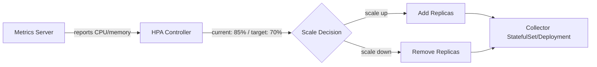

# How to Configure Horizontal Pod Autoscaling for the OpenTelemetry Collector

Author: [nawazdhandala](https://www.github.com/nawazdhandala)

Tags: OpenTelemetry, Kubernetes, Autoscaling, HPA, Collector, Performance

Description: Step-by-step guide to configuring Kubernetes Horizontal Pod Autoscaler for OpenTelemetry Collector deployments to handle variable telemetry loads automatically.

---

Telemetry volume is not constant. During a traffic spike, your services generate more traces and metrics. During off-peak hours, the volume drops. If you run a fixed number of OpenTelemetry Collector replicas, you either over-provision (wasting resources at night) or under-provision (dropping data during peaks). Kubernetes Horizontal Pod Autoscaling (HPA) solves this by dynamically adjusting the collector replica count based on actual load.

This guide shows you how to configure HPA for the OpenTelemetry Collector so it scales up when telemetry volume increases and scales down when things calm down.

## How HPA Works

The Kubernetes HPA controller periodically checks metrics for your pods and compares them to the targets you define. If the average CPU usage across all pods exceeds 70%, for example, it adds more replicas. When usage drops below the target, it removes replicas.



For the OpenTelemetry Collector, you can scale based on:

- **CPU utilization** - the simplest option and a good starting point
- **Memory utilization** - useful when your collector is memory-bound due to batching
- **Custom metrics** - metrics from the collector itself, like queue size or dropped spans

## Prerequisites

Your cluster needs the Kubernetes Metrics Server installed. Most managed Kubernetes services (EKS, GKE, AKS) include it by default. If you are running a self-managed cluster, install it first.

```bash
# Install the Metrics Server (skip if already present in your cluster)
kubectl apply -f https://github.com/kubernetes-sigs/metrics-server/releases/latest/download/components.yaml

# Verify it is running
kubectl get deployment metrics-server -n kube-system
```

## Deploying the Collector as a Deployment

HPA works with Deployments, StatefulSets, and ReplicaSets. For a collector in gateway mode (receiving telemetry over OTLP), a Deployment is the natural choice. Here is a collector Deployment with resource requests and limits defined, which is required for CPU-based autoscaling.

```yaml
# otel-collector-deployment.yaml
# OpenTelemetry Collector deployment configured for HPA
apiVersion: opentelemetry.io/v1beta1
kind: OpenTelemetryCollector
metadata:
  name: gateway-collector
  namespace: monitoring
spec:
  mode: deployment
  replicas: 2
  # Resource requests are required for HPA to calculate utilization percentages
  resources:
    requests:
      cpu: 500m
      memory: 512Mi
    limits:
      cpu: "2"
      memory: 2Gi
  config:
    receivers:
      otlp:
        protocols:
          grpc:
            endpoint: 0.0.0.0:4317
          http:
            endpoint: 0.0.0.0:4318
    processors:
      batch:
        # Batch before exporting to reduce backend calls
        send_batch_size: 1024
        send_batch_max_size: 2048
        timeout: 5s
      memory_limiter:
        check_interval: 5s
        limit_mib: 1800
        spike_limit_mib: 500
    exporters:
      otlp:
        endpoint: "https://your-backend.example.com:4317"
        sending_queue:
          enabled: true
          # Queue size that can absorb short bursts
          queue_size: 5000
        retry_on_failure:
          enabled: true
          initial_interval: 5s
          max_interval: 30s
    service:
      # Enable telemetry so the collector exposes its own metrics
      telemetry:
        metrics:
          address: 0.0.0.0:8888
      pipelines:
        traces:
          receivers: [otlp]
          processors: [memory_limiter, batch]
          exporters: [otlp]
        metrics:
          receivers: [otlp]
          processors: [memory_limiter, batch]
          exporters: [otlp]
```

The important detail here is the `resources.requests` section. HPA calculates utilization as a percentage of the requested resources. Without requests, HPA cannot compute the percentage and will not scale.

## Configuring HPA with CPU-Based Scaling

The simplest HPA configuration scales based on CPU utilization. This works well because the collector is primarily CPU-bound when processing and exporting telemetry.

```yaml
# hpa-collector-cpu.yaml
# Scales the collector based on CPU utilization
apiVersion: autoscaling/v2
kind: HorizontalPodAutoscaler
metadata:
  name: gateway-collector-hpa
  namespace: monitoring
spec:
  scaleTargetRef:
    apiVersion: opentelemetry.io/v1beta1
    kind: OpenTelemetryCollector
    name: gateway-collector
  # Never go below 2 replicas for high availability
  minReplicas: 2
  # Cap at 10 replicas to prevent runaway scaling
  maxReplicas: 10
  metrics:
    - type: Resource
      resource:
        name: cpu
        target:
          # Scale up when average CPU across all pods exceeds 70%
          type: Utilization
          averageUtilization: 70
  behavior:
    scaleUp:
      stabilizationWindowSeconds: 60
      policies:
        - type: Pods
          # Add at most 2 pods per minute
          value: 2
          periodSeconds: 60
    scaleDown:
      stabilizationWindowSeconds: 300
      policies:
        - type: Pods
          # Remove at most 1 pod every 5 minutes
          value: 1
          periodSeconds: 300
```

Apply both resources.

```bash
# Deploy the collector and HPA
kubectl apply -f otel-collector-deployment.yaml
kubectl apply -f hpa-collector-cpu.yaml
```

The `behavior` section is critical. Without it, HPA can be too aggressive. The configuration above adds up to 2 pods per minute when scaling up (you want quick response to load spikes) but only removes 1 pod every 5 minutes when scaling down (you want slow scale-down to avoid flapping).

## Adding Memory-Based Scaling

If your collector buffers a lot of data in memory (large batch sizes, retry queues), you should also scale based on memory. You can combine multiple metrics in a single HPA resource. The HPA scales based on whichever metric suggests the highest replica count.

```yaml
# hpa-collector-cpu-memory.yaml
# Scales based on both CPU and memory utilization
apiVersion: autoscaling/v2
kind: HorizontalPodAutoscaler
metadata:
  name: gateway-collector-hpa
  namespace: monitoring
spec:
  scaleTargetRef:
    apiVersion: opentelemetry.io/v1beta1
    kind: OpenTelemetryCollector
    name: gateway-collector
  minReplicas: 2
  maxReplicas: 10
  metrics:
    - type: Resource
      resource:
        name: cpu
        target:
          type: Utilization
          averageUtilization: 70
    - type: Resource
      resource:
        name: memory
        target:
          # Scale when memory usage exceeds 75% of requested
          type: Utilization
          averageUtilization: 75
  behavior:
    scaleUp:
      stabilizationWindowSeconds: 60
      policies:
        - type: Pods
          value: 2
          periodSeconds: 60
    scaleDown:
      stabilizationWindowSeconds: 300
      policies:
        - type: Pods
          value: 1
          periodSeconds: 300
```

## Scaling Based on Custom Metrics

CPU and memory work fine for many cases, but sometimes you want to scale based on collector-specific signals. For example, the number of items in the exporter's sending queue is a direct indicator of whether the collector is keeping up with incoming telemetry.

The collector exposes its internal metrics on the telemetry endpoint (port 8888 by default). To use these as HPA metrics, you need Prometheus to scrape them and a Prometheus adapter to expose them to the Kubernetes metrics API.

First, make sure the collector's internal metrics are being scraped. Here is a ServiceMonitor for that.

```yaml
# servicemonitor-collector.yaml
# Scrapes the collector's own internal metrics
apiVersion: monitoring.coreos.com/v1
kind: ServiceMonitor
metadata:
  name: otel-collector-internal
  namespace: monitoring
spec:
  selector:
    matchLabels:
      app.kubernetes.io/name: gateway-collector-collector
  endpoints:
    - port: monitoring
      interval: 15s
      path: /metrics
```

Then configure the Prometheus adapter to expose the queue size metric to the Kubernetes custom metrics API.

```yaml
# prometheus-adapter-config.yaml
# Maps the collector's queue size metric to the Kubernetes custom metrics API
rules:
  - seriesQuery: 'otelcol_exporter_queue_size{namespace!="",pod!=""}'
    resources:
      overrides:
        namespace: {resource: "namespace"}
        pod: {resource: "pod"}
    name:
      matches: "^(.*)$"
      as: "${1}"
    metricsQuery: 'avg(<<.Series>>{<<.LabelMatchers>>}) by (<<.GroupBy>>)'
```

Now you can reference this custom metric in your HPA.

```yaml
# hpa-collector-custom.yaml
# Scales based on the exporter queue size
apiVersion: autoscaling/v2
kind: HorizontalPodAutoscaler
metadata:
  name: gateway-collector-hpa
  namespace: monitoring
spec:
  scaleTargetRef:
    apiVersion: opentelemetry.io/v1beta1
    kind: OpenTelemetryCollector
    name: gateway-collector
  minReplicas: 2
  maxReplicas: 10
  metrics:
    - type: Resource
      resource:
        name: cpu
        target:
          type: Utilization
          averageUtilization: 70
    - type: Pods
      pods:
        metric:
          # Scale based on the average queue size per pod
          name: otelcol_exporter_queue_size
        target:
          type: AverageValue
          # Scale up when average queue size exceeds 1000 items per pod
          averageValue: "1000"
```

## Monitoring Your HPA

After deploying, check that the HPA is working correctly.

```bash
# Check the current state of the HPA
kubectl get hpa gateway-collector-hpa -n monitoring

# Watch the HPA in real time
kubectl get hpa gateway-collector-hpa -n monitoring --watch

# Get detailed information including events
kubectl describe hpa gateway-collector-hpa -n monitoring
```

You should see output like this when the HPA is functioning:

```
NAME                      REFERENCE                          TARGETS         MINPODS   MAXPODS   REPLICAS
gateway-collector-hpa     OpenTelemetryCollector/gateway      45%/70%         2         10        3
```

The `TARGETS` column shows `current/target`. If you see `<unknown>/70%`, the metrics server is not returning data for your pods. Check that resource requests are set and that the metrics server is healthy.

## Common Pitfalls

**Forgetting resource requests.** HPA requires `resources.requests` to calculate utilization percentages. Without them, the HPA stays stuck at `<unknown>`.

**Setting minReplicas to 1.** For a telemetry pipeline, losing the single replica means losing data. Always set `minReplicas` to at least 2.

**Scaling too aggressively down.** If the HPA removes pods too quickly after a spike, the remaining pods may get overwhelmed by the redistributed load, causing another scale-up. Set a stabilization window of at least 300 seconds for scale-down.

**Not accounting for the memory limiter.** The collector's `memory_limiter` processor will start refusing data before the pod actually hits its memory limit. If the HPA's memory target is higher than what the memory limiter allows, the HPA will never trigger. Set the HPA memory target below the memory limiter's threshold.

**Ignoring the sending queue.** When all pods scale down, their in-flight data in sending queues can be lost. Use persistent queues if you need guaranteed delivery during scale-down events.

## Recommended Settings

For most production deployments, start with these values and adjust based on observed behavior:

| Parameter | Recommended Value |
|---|---|
| minReplicas | 2 |
| maxReplicas | 5-20 (depends on peak load) |
| CPU target | 70% |
| Memory target | 75% |
| Scale-up window | 60 seconds |
| Scale-down window | 300 seconds |
| Scale-up rate | 2 pods per period |
| Scale-down rate | 1 pod per period |

HPA is one of the simplest ways to make your OpenTelemetry Collector deployment resilient to traffic spikes. The configuration is straightforward, and the payoff is significant: you stop losing telemetry during peaks and stop wasting resources during valleys. Start with CPU-based scaling, observe the behavior for a few days, and then add memory or custom metrics if needed.
