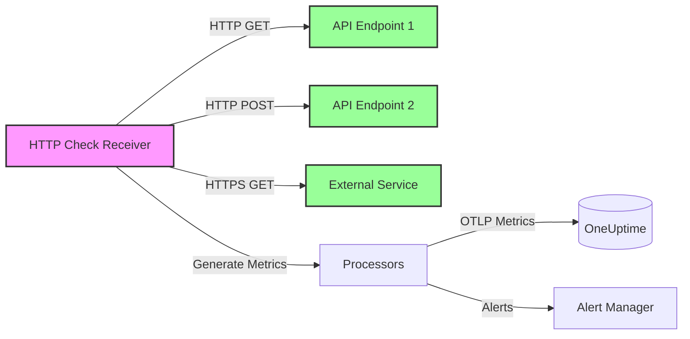
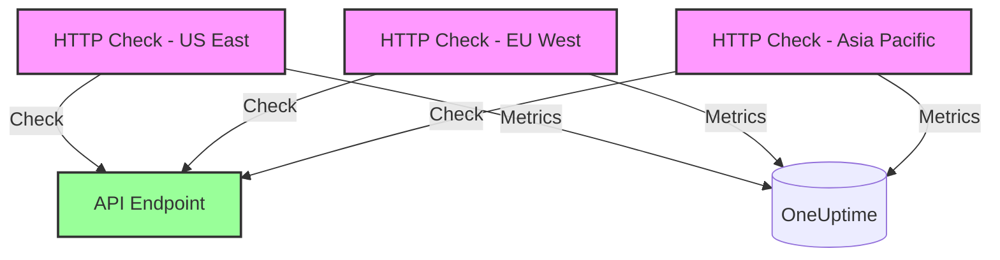

# How to Configure the HTTP Check Receiver in the OpenTelemetry Collector

Author: [nawazdhandala](https://www.github.com/nawazdhandala)

Tags: OpenTelemetry, Collector, HTTP Check, Synthetic Monitoring, Uptime Monitoring, Health Checks

Description: Complete guide to configuring the HTTP Check receiver in OpenTelemetry Collector for synthetic monitoring and endpoint health checks with metrics generation.

---

The HTTP Check receiver in the OpenTelemetry Collector enables you to perform synthetic monitoring by periodically making HTTP requests to endpoints and generating metrics based on response characteristics. This receiver is essential for monitoring API availability, response times, and HTTP status codes without relying on external monitoring services.

By deploying the HTTP Check receiver, you can monitor critical endpoints from within your infrastructure, generate uptime metrics, track performance degradation, and trigger alerts based on endpoint health, all within your OpenTelemetry observability pipeline.

---

## What is the HTTP Check Receiver?

The HTTP Check receiver is an OpenTelemetry Collector component that acts as a synthetic monitoring agent. It periodically sends HTTP requests to configured endpoints and generates metrics based on the responses. Unlike passive receivers that accept incoming telemetry, the HTTP Check receiver actively probes endpoints to assess their health and performance.

The receiver generates several key metrics:
- **Response time** - Time taken to complete the request
- **Status code** - HTTP status code returned by the endpoint
- **Success/failure status** - Binary metric indicating if the request succeeded
- **Response size** - Size of the response body in bytes
- **TLS information** - Certificate validity and expiration (for HTTPS endpoints)

**Primary use cases:**

- API uptime monitoring and SLA tracking
- Performance regression detection
- Certificate expiration monitoring
- Multi-region availability checks
- Dependency health monitoring
- Synthetic user journey simulation

---

## Architecture Overview

The HTTP Check receiver runs within the Collector and actively probes configured endpoints, generating metrics that flow through your observability pipeline:



This architecture allows you to monitor endpoint health from within your infrastructure, ensuring you have visibility into both internal and external dependencies.

---

## Prerequisites

Before configuring the HTTP Check receiver, ensure you have:

1. **OpenTelemetry Collector** version 0.80.0 or later with the HTTP Check receiver component (may require the `otelcol-contrib` distribution)
2. **List of endpoints to monitor** with expected behavior and thresholds
3. **Network connectivity** from the Collector to all monitored endpoints
4. **Understanding of your SLA requirements** for response time and uptime

---

## Basic Configuration

The HTTP Check receiver requires configuring target endpoints and check intervals. Here's a minimal working configuration:

```yaml
# RECEIVERS: Define how telemetry enters the Collector
receivers:
  # HTTP Check receiver performs synthetic monitoring
  httpcheck:
    # Targets to monitor
    targets:
      # Monitor a web service homepage
      - endpoint: https://example.com
        method: GET

      # Monitor an API health endpoint
      - endpoint: https://api.example.com/health
        method: GET

    # How often to perform checks (in seconds)
    collection_interval: 60s

# EXPORTERS: Define where metrics are sent
exporters:
  # Export metrics to OneUptime using OTLP
  otlphttp:
    endpoint: https://oneuptime.com/otlp
    headers:
      x-oneuptime-token: ${ONEUPTIME_TOKEN}

# SERVICE: Wire receivers to exporters
service:
  pipelines:
    # Metrics pipeline: receive from HTTP Check, export to OneUptime
    metrics:
      receivers: [httpcheck]
      exporters: [otlphttp]
```

**Configuration breakdown:**

- `targets`: List of endpoints to monitor with HTTP method
- `collection_interval`: How often to perform health checks (default: 60s)
- Each target generates metrics labeled with the endpoint URL

---

## Production Configuration with Advanced Features

For production deployments, configure timeouts, custom headers, expected status codes, and body validation:

```yaml
receivers:
  httpcheck:
    # List of endpoints to monitor
    targets:
      # API endpoint with authentication and expected response
      - endpoint: https://api.example.com/v1/status
        method: GET

        # Custom headers (authentication, content type, etc.)
        headers:
          Authorization: Bearer ${API_TOKEN}
          Accept: application/json

        # Expected HTTP status code (alerts if different)
        expected_status_code: 200

        # Timeout for the request
        timeout: 10s

        # Expected response body pattern (regex)
        expected_body_pattern: '"status":"healthy"'

      # POST request with body
      - endpoint: https://api.example.com/v1/webhook
        method: POST
        headers:
          Content-Type: application/json
        body: '{"test": true}'
        expected_status_code: 202

      # HTTPS endpoint with TLS verification
      - endpoint: https://secure.example.com
        method: GET
        tls:
          # Enable TLS certificate verification
          insecure_skip_verify: false

          # Custom CA certificate for self-signed certs
          ca_file: /etc/ssl/certs/custom-ca.crt

          # Client certificate authentication
          cert_file: /etc/ssl/certs/client.crt
          key_file: /etc/ssl/private/client.key

      # External dependency with longer timeout
      - endpoint: https://third-party-service.com/api
        method: GET
        timeout: 30s
        expected_status_code: 200

    # Check interval for all targets
    collection_interval: 30s

processors:
  # Protect Collector from memory exhaustion
  memory_limiter:
    limit_mib: 256
    spike_limit_mib: 64
    check_interval: 2s

  # Add resource attributes to identify the check source
  resource:
    attributes:
      - key: monitoring.type
        value: synthetic-http
        action: upsert
      - key: monitoring.location
        value: datacenter-us-east
        action: upsert

  # Transform metrics for better organization
  metricstransform:
    transforms:
      # Rename metrics to follow naming conventions
      - include: httpcheck.duration
        action: update
        new_name: http.check.duration_ms

      - include: httpcheck.status
        action: update
        new_name: http.check.success

exporters:
  # Export to OneUptime with retry configuration
  otlphttp:
    endpoint: https://oneuptime.com/otlp
    headers:
      x-oneuptime-token: ${ONEUPTIME_TOKEN}
    retry_on_failure:
      enabled: true
      initial_interval: 5s
      max_interval: 30s
      max_elapsed_time: 300s
    timeout: 30s
    compression: gzip

service:
  # Enable telemetry for the Collector itself
  telemetry:
    logs:
      level: info
    metrics:
      address: localhost:8888

  pipelines:
    metrics:
      receivers: [httpcheck]
      processors: [memory_limiter, resource, metricstransform]
      exporters: [otlphttp]
```

**Advanced features:**

1. **Custom headers:** Add authentication tokens, API keys, or custom headers
2. **Expected status codes:** Alert when the response code doesn't match expectations
3. **Body pattern matching:** Validate response content using regex patterns
4. **TLS configuration:** Handle self-signed certificates and client authentication
5. **Variable timeouts:** Configure different timeouts for different endpoints

---

## Generated Metrics

The HTTP Check receiver generates several metrics for each target:

**Core metrics:**

| Metric Name | Type | Description |
|-------------|------|-------------|
| `httpcheck.duration` | Gauge | Response time in milliseconds |
| `httpcheck.status` | Gauge | HTTP status code returned |
| `httpcheck.success` | Gauge | 1 if check succeeded, 0 if failed |
| `httpcheck.response_size` | Gauge | Size of response body in bytes |
| `httpcheck.tls_cert_expiry` | Gauge | Days until TLS certificate expires (HTTPS only) |

**Metric labels:**

Each metric includes labels for filtering and aggregation:
- `endpoint`: The URL being checked
- `method`: HTTP method used (GET, POST, etc.)
- `status_code`: HTTP status code returned

**Example metric output:**

```
httpcheck.duration{endpoint="https://api.example.com/health",method="GET",status_code="200"} 145.2
httpcheck.status{endpoint="https://api.example.com/health",method="GET"} 200
httpcheck.success{endpoint="https://api.example.com/health",method="GET"} 1
httpcheck.response_size{endpoint="https://api.example.com/health",method="GET"} 256
httpcheck.tls_cert_expiry{endpoint="https://api.example.com/health",method="GET"} 87
```

---

## Multi-Region Monitoring

Deploy Collectors with HTTP Check receivers in multiple regions to monitor endpoint availability from different geographic locations:



**Configuration for multi-region deployment:**

Each Collector in different regions uses the same configuration but adds a region label:

```yaml
# Collector in US East
receivers:
  httpcheck:
    targets:
      - endpoint: https://api.example.com/health
        method: GET
    collection_interval: 60s

processors:
  resource:
    attributes:
      - key: monitoring.location
        value: us-east-1
        action: upsert

exporters:
  otlphttp:
    endpoint: https://oneuptime.com/otlp
    headers:
      x-oneuptime-token: ${ONEUPTIME_TOKEN}

service:
  pipelines:
    metrics:
      receivers: [httpcheck]
      processors: [resource]
      exporters: [otlphttp]
```

This approach provides visibility into regional availability and helps identify geographic performance issues.

---

## Alerting on Check Failures

Configure your observability backend to alert when HTTP checks fail or performance degrades.

**Example alert conditions:**

1. **Endpoint down:** `httpcheck.success == 0`
2. **Slow response:** `httpcheck.duration > 1000` (1 second)
3. **Wrong status code:** `httpcheck.status != 200`
4. **Certificate expiring:** `httpcheck.tls_cert_expiry < 30` (30 days)

**OneUptime alert configuration example:**

```yaml
# Alert when endpoint is down for 2 consecutive checks
- alert: EndpointDown
  expr: httpcheck.success == 0
  for: 2m
  labels:
    severity: critical
  annotations:
    summary: "Endpoint {{ $labels.endpoint }} is down"
    description: "HTTP check for {{ $labels.endpoint }} has failed for 2 minutes"

# Alert when response time exceeds threshold
- alert: SlowResponse
  expr: httpcheck.duration > 1000
  for: 5m
  labels:
    severity: warning
  annotations:
    summary: "Endpoint {{ $labels.endpoint }} is slow"
    description: "Response time for {{ $labels.endpoint }} is {{ $value }}ms (threshold: 1000ms)"

# Alert on certificate expiration
- alert: CertificateExpiringSoon
  expr: httpcheck.tls_cert_expiry < 30
  labels:
    severity: warning
  annotations:
    summary: "TLS certificate for {{ $labels.endpoint }} expires soon"
    description: "Certificate expires in {{ $value }} days"
```

---

## Dependency Monitoring

Use the HTTP Check receiver to monitor critical dependencies and track their impact on your service health:

```yaml
receivers:
  httpcheck:
    targets:
      # Database API health check
      - endpoint: https://db-proxy.internal.example.com/health
        method: GET
        expected_status_code: 200
        expected_body_pattern: '"status":"ok"'

      # Payment gateway availability
      - endpoint: https://api.payment-provider.com/status
        method: GET
        expected_status_code: 200

      # External authentication service
      - endpoint: https://auth.external-provider.com/health
        method: GET
        expected_status_code: 200

      # CDN availability
      - endpoint: https://cdn.example.com/health.txt
        method: GET
        expected_status_code: 200
        expected_body_pattern: "OK"

      # Message queue management API
      - endpoint: https://queue.internal.example.com/api/health
        method: GET
        headers:
          Authorization: Bearer ${QUEUE_API_TOKEN}
        expected_status_code: 200

    collection_interval: 30s

processors:
  resource:
    attributes:
      - key: monitoring.type
        value: dependency-health
        action: upsert

exporters:
  otlphttp:
    endpoint: https://oneuptime.com/otlp
    headers:
      x-oneuptime-token: ${ONEUPTIME_TOKEN}

service:
  pipelines:
    metrics:
      receivers: [httpcheck]
      processors: [resource]
      exporters: [otlphttp]
```

This configuration provides visibility into external dependencies, helping you identify whether issues originate from your services or third-party components.

---

## Synthetic User Journey Monitoring

Chain multiple HTTP checks to simulate user journeys through your application:

```yaml
receivers:
  httpcheck:
    targets:
      # Step 1: Load homepage
      - endpoint: https://app.example.com
        method: GET
        expected_status_code: 200

      # Step 2: Load login page
      - endpoint: https://app.example.com/login
        method: GET
        expected_status_code: 200

      # Step 3: Submit login (would need session handling in real scenario)
      - endpoint: https://api.example.com/auth/login
        method: POST
        headers:
          Content-Type: application/json
        body: '{"username":"test","password":"test"}'
        expected_status_code: 200

      # Step 4: Load dashboard
      - endpoint: https://app.example.com/dashboard
        method: GET
        headers:
          Cookie: session=test-session
        expected_status_code: 200

      # Step 5: API request
      - endpoint: https://api.example.com/v1/data
        method: GET
        headers:
          Authorization: Bearer ${TEST_TOKEN}
        expected_status_code: 200

    collection_interval: 300s  # Check every 5 minutes

processors:
  resource:
    attributes:
      - key: monitoring.type
        value: synthetic-journey
        action: upsert
      - key: journey.name
        value: user-login-flow
        action: upsert

exporters:
  otlphttp:
    endpoint: https://oneuptime.com/otlp
    headers:
      x-oneuptime-token: ${ONEUPTIME_TOKEN}

service:
  pipelines:
    metrics:
      receivers: [httpcheck]
      processors: [resource]
      exporters: [otlphttp]
```

This approach simulates critical user workflows, ensuring the entire application stack functions correctly from an end-user perspective.

---

## Performance Considerations

**Check interval tuning:**

Balance between monitoring granularity and resource usage:

- **Critical endpoints:** 10-30 seconds
- **Standard endpoints:** 60 seconds
- **Non-critical endpoints:** 300 seconds (5 minutes)
- **External dependencies:** 120 seconds

**Resource usage:**

Each HTTP check consumes:
- Network bandwidth for request/response
- CPU for TLS handshake and pattern matching
- Memory for response buffering

For high-volume monitoring (100+ endpoints), consider:
- Running multiple Collector instances with endpoint sharding
- Increasing `collection_interval` for non-critical checks
- Using separate Collectors for internal vs external checks

**Example resource configuration for high-volume monitoring:**

```yaml
receivers:
  httpcheck:
    targets:
      # ... many endpoints ...
    collection_interval: 60s

processors:
  memory_limiter:
    limit_mib: 512
    spike_limit_mib: 128

service:
  pipelines:
    metrics:
      receivers: [httpcheck]
      processors: [memory_limiter]
      exporters: [otlphttp]
```

---

## Monitoring Internal vs External Endpoints

**Internal endpoints (services within your infrastructure):**

```yaml
receivers:
  httpcheck/internal:
    targets:
      - endpoint: http://service-a.internal:8080/health
        method: GET
        timeout: 5s

      - endpoint: http://service-b.internal:8080/health
        method: GET
        timeout: 5s

    collection_interval: 30s

processors:
  resource:
    attributes:
      - key: monitoring.scope
        value: internal
        action: upsert
```

**External endpoints (third-party services):**

```yaml
receivers:
  httpcheck/external:
    targets:
      - endpoint: https://external-api.com/status
        method: GET
        timeout: 30s

      - endpoint: https://cdn-provider.com/health
        method: GET
        timeout: 30s

    collection_interval: 120s

processors:
  resource:
    attributes:
      - key: monitoring.scope
        value: external
        action: upsert
```

Separating internal and external checks allows different intervals, timeouts, and alerting thresholds.

---

## Combining with Other Receivers

HTTP Check works well alongside other receivers for comprehensive monitoring:

```yaml
receivers:
  # Synthetic HTTP monitoring
  httpcheck:
    targets:
      - endpoint: https://api.example.com/health
        method: GET
    collection_interval: 60s

  # Application metrics from instrumentation
  otlp:
    protocols:
      grpc:
      http:

  # Host metrics
  hostmetrics:
    collection_interval: 30s
    scrapers:
      cpu:
      memory:
      disk:
      network:

processors:
  batch:

exporters:
  otlphttp:
    endpoint: https://oneuptime.com/otlp
    headers:
      x-oneuptime-token: ${ONEUPTIME_TOKEN}

service:
  pipelines:
    # Synthetic monitoring metrics
    metrics/synthetic:
      receivers: [httpcheck]
      processors: [batch]
      exporters: [otlphttp]

    # Application metrics
    metrics/app:
      receivers: [otlp]
      processors: [batch]
      exporters: [otlphttp]

    # Infrastructure metrics
    metrics/infra:
      receivers: [hostmetrics]
      processors: [batch]
      exporters: [otlphttp]
```

This configuration provides a complete view: synthetic monitoring, application performance, and infrastructure health.

---

## Troubleshooting Common Issues

**1. Checks always failing:**

All HTTP checks report failure even though endpoints are accessible.

**Solution:**
- Verify network connectivity from the Collector host
- Check firewall rules and security groups
- Ensure DNS resolution works from the Collector
- Test manually using curl from the Collector host

```bash
# Test from Collector host
curl -v https://api.example.com/health

# Check DNS resolution
nslookup api.example.com
```

**2. TLS certificate errors:**

Checks fail with TLS verification errors.

**Solution:**
- Set `insecure_skip_verify: true` for self-signed certificates (development only)
- Provide custom CA certificate using `ca_file`
- Ensure system CA bundle is up to date

```yaml
receivers:
  httpcheck:
    targets:
      - endpoint: https://self-signed.example.com
        method: GET
        tls:
          insecure_skip_verify: false
          ca_file: /etc/ssl/certs/custom-ca.crt
```

**3. High memory usage:**

The Collector consumes excessive memory with many HTTP checks.

**Solution:**
- Increase `collection_interval` to reduce check frequency
- Enable `memory_limiter` processor
- Split endpoints across multiple Collector instances

**4. Missing metrics in backend:**

HTTP check runs but metrics don't appear in the backend.

**Solution:**
- Check Collector logs for export errors
- Verify exporter configuration (endpoint, authentication)
- Enable debug logging to see generated metrics

```yaml
service:
  telemetry:
    logs:
      level: debug

exporters:
  debug:
    verbosity: detailed
```

---

## Integration with OneUptime

OneUptime provides native support for OpenTelemetry metrics, making it ideal for HTTP check monitoring:

```yaml
exporters:
  otlphttp:
    endpoint: https://oneuptime.com/otlp
    headers:
      x-oneuptime-token: ${ONEUPTIME_TOKEN}
    compression: gzip

service:
  pipelines:
    metrics:
      receivers: [httpcheck]
      processors: [resource, batch]
      exporters: [otlphttp]
```

Once metrics flow into OneUptime, you can:
- Create dashboards showing endpoint uptime and response times
- Configure alerts for check failures or performance degradation
- Track SLA compliance with uptime percentage calculations
- Correlate synthetic checks with application traces and logs
- Identify trends and patterns in endpoint performance

---

## Related Topics

For more information on OpenTelemetry Collector receivers and monitoring:

- [OpenTelemetry Collector: What It Is, When You Need It, and When You Don't](https://oneuptime.com/blog/post/2025-09-18-what-is-opentelemetry-collector-and-why-use-one/view)
- [How to Configure the SSH Check Receiver in the OpenTelemetry Collector](https://oneuptime.com/blog/post/2026-02-06-ssh-check-receiver-opentelemetry-collector/view)
- [How to Monitor IP Addresses with OneUptime](https://oneuptime.com/blog/post/2025-10-27-monitor-ip-addresses-with-oneuptime/view)
- [How to Monitor Service Ports with OneUptime](https://oneuptime.com/blog/post/2025-10-27-monitor-service-ports-with-oneuptime/view)

---

## Conclusion

The HTTP Check receiver transforms the OpenTelemetry Collector into a synthetic monitoring agent, enabling proactive endpoint monitoring without external dependencies. By periodically checking critical endpoints and generating metrics based on responses, it provides early warning of availability and performance issues.

Configure checks with appropriate intervals and timeouts, add validation for expected responses, and export metrics to backends like OneUptime for visualization and alerting. This approach delivers comprehensive synthetic monitoring within your existing OpenTelemetry infrastructure, eliminating the need for separate uptime monitoring services.

Whether you're monitoring internal microservices, external APIs, or simulating user journeys, the HTTP Check receiver provides the flexibility and control needed for modern observability practices.
