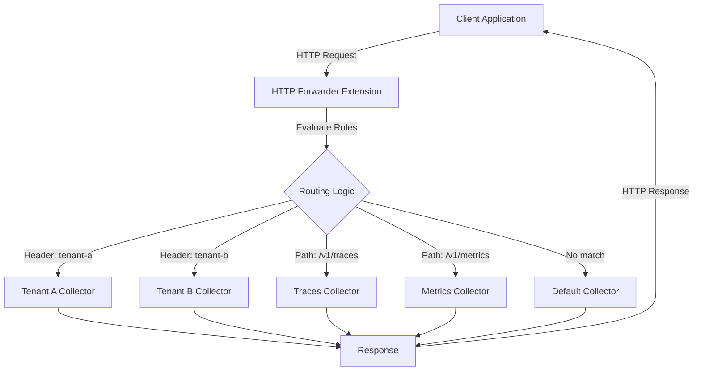

# How to Configure the HTTP Forwarder Extension in the OpenTelemetry Collector

Author: [nawazdhandala](https://www.github.com/nawazdhandala)

Tags: OpenTelemetry, Collector, Extensions, HTTP, Networking, Load Balancing, Traffic Management

Description: Comprehensive guide to configuring the HTTP Forwarder extension in OpenTelemetry Collector for advanced traffic routing, load balancing, and request forwarding capabilities.

The HTTP Forwarder extension in the OpenTelemetry Collector provides powerful capabilities for forwarding HTTP requests to downstream services. This extension is particularly useful for implementing custom routing logic, load balancing across multiple backends, and creating proxy-like functionality within your observability infrastructure.

## What is the HTTP Forwarder Extension?

The HTTP Forwarder extension enables the OpenTelemetry Collector to act as an HTTP proxy, forwarding incoming requests to one or more target endpoints. Unlike exporters that transform and send telemetry data in specific formats, the HTTP Forwarder operates at the HTTP protocol level, forwarding raw requests with minimal modification.

This extension is valuable in scenarios where you need to route traffic based on request attributes, implement failover mechanisms, or create a fan-out pattern where requests are sent to multiple destinations simultaneously.

## Core Use Cases

The HTTP Forwarder extension excels in several deployment scenarios:

**Gateway Pattern**: Position the collector as a gateway that routes requests to different backends based on headers, paths, or other request attributes.

**Load Distribution**: Distribute incoming telemetry requests across multiple collector instances or backend services for horizontal scaling.

**Traffic Mirroring**: Send copies of requests to multiple destinations for testing, validation, or redundancy purposes.

**Protocol Translation**: Forward requests while adding authentication headers, modifying paths, or adjusting other HTTP attributes.

**Legacy System Integration**: Bridge modern OTLP clients with legacy monitoring systems that expect specific HTTP request formats.

## Basic Configuration

Here's a simple HTTP Forwarder configuration that forwards all incoming requests to a single target:

```yaml
# collector-config.yaml
extensions:
  # Configure the HTTP Forwarder extension
  http_forwarder:
    # Ingress defines where the forwarder listens
    ingress:
      endpoint: 0.0.0.0:8080

    # Egress defines where requests are forwarded
    egress:
      # Single target endpoint
      endpoint: "http://backend-collector:4318"

      # Optional: connection timeout
      timeout: 30s

      # Optional: keep-alive settings
      idle_conn_timeout: 90s
      max_idle_conns: 100

receivers:
  otlp:
    protocols:
      grpc:
        endpoint: 0.0.0.0:4317
      http:
        endpoint: 0.0.0.0:4318

processors:
  batch:
    timeout: 10s

exporters:
  logging:
    verbosity: detailed

service:
  # Include the http_forwarder extension
  extensions: [http_forwarder]
  pipelines:
    traces:
      receivers: [otlp]
      processors: [batch]
      exporters: [logging]
```

In this configuration, any HTTP request sent to port 8080 is forwarded to the backend collector at `backend-collector:4318`. The forwarder operates independently of the standard receiver/processor/exporter pipeline.

## Multiple Target Endpoints

Forward requests to multiple endpoints for redundancy or traffic mirroring:

```yaml
extensions:
  http_forwarder:
    ingress:
      endpoint: 0.0.0.0:8080

    egress:
      # Define multiple target endpoints
      endpoints:
        - url: "http://primary-collector:4318"
          # Primary target with higher weight
          weight: 70

        - url: "http://secondary-collector:4318"
          # Secondary target with lower weight
          weight: 30

        - url: "http://backup-collector:4318"
          # Backup target for redundancy
          weight: 0
          # Only used when other targets are unavailable
          fallback: true

      # Load balancing strategy: round_robin, random, least_conn, or weighted
      load_balancing:
        strategy: "weighted"

      # Optional: retry configuration
      retry:
        enabled: true
        max_attempts: 3
        backoff:
          initial_interval: 1s
          max_interval: 10s
          multiplier: 2.0

receivers:
  otlp:
    protocols:
      http:
        endpoint: 0.0.0.0:4318

processors:
  batch:
    timeout: 10s

exporters:
  logging:
    verbosity: normal

service:
  extensions: [http_forwarder]
  pipelines:
    traces:
      receivers: [otlp]
      processors: [batch]
      exporters: [logging]
```

This configuration implements weighted load balancing, sending 70% of traffic to the primary collector and 30% to the secondary. The backup collector only receives traffic if both primary targets fail.

## Request Routing Based on Attributes

Implement intelligent routing based on request attributes like headers, paths, or query parameters:

```yaml
extensions:
  http_forwarder:
    ingress:
      endpoint: 0.0.0.0:8080

    # Define routing rules
    routing:
      # Route based on HTTP headers
      - match:
          header:
            name: "X-Tenant-ID"
            value: "tenant-a"
        egress:
          endpoint: "http://tenant-a-collector:4318"

      - match:
          header:
            name: "X-Tenant-ID"
            value: "tenant-b"
        egress:
          endpoint: "http://tenant-b-collector:4318"

      # Route based on URL path
      - match:
          path:
            prefix: "/v1/traces"
        egress:
          endpoint: "http://traces-collector:4318"

      - match:
          path:
            prefix: "/v1/metrics"
        egress:
          endpoint: "http://metrics-collector:4318"

      # Default route for unmatched requests
      - match:
          any: true
        egress:
          endpoint: "http://default-collector:4318"

receivers:
  otlp:
    protocols:
      http:
        endpoint: 0.0.0.0:4318

processors:
  batch:
    timeout: 10s

exporters:
  logging:
    verbosity: normal

service:
  extensions: [http_forwarder]
  pipelines:
    traces:
      receivers: [otlp]
      processors: [batch]
      exporters: [logging]
```

This configuration enables multi-tenancy by routing requests to different collectors based on tenant identification headers, and separates traces from metrics using path-based routing.

## Traffic Flow Visualization

The following diagram illustrates how the HTTP Forwarder processes and routes requests:



## Header Manipulation

Modify request headers before forwarding to add authentication, routing metadata, or other attributes:

```yaml
extensions:
  http_forwarder:
    ingress:
      endpoint: 0.0.0.0:8080

    egress:
      endpoint: "http://backend-collector:4318"

      # Add, modify, or remove headers
      headers:
        # Add authentication header
        add:
          - name: "Authorization"
            value: "Bearer ${AUTH_TOKEN}"

          # Add custom routing header
          - name: "X-Forwarded-By"
            value: "otel-collector-gateway"

          # Add timestamp header
          - name: "X-Forward-Time"
            value: "${TIMESTAMP}"

        # Remove sensitive headers
        remove:
          - "X-Internal-Secret"
          - "X-Debug-Token"

        # Override existing headers
        set:
          - name: "User-Agent"
            value: "OpenTelemetry-Collector/1.0"

receivers:
  otlp:
    protocols:
      http:
        endpoint: 0.0.0.0:4318

processors:
  batch:
    timeout: 10s

exporters:
  logging:
    verbosity: normal

service:
  extensions: [http_forwarder]
  pipelines:
    traces:
      receivers: [otlp]
      processors: [batch]
      exporters: [logging]
```

Header manipulation enables the forwarder to add authentication credentials, remove sensitive information, or inject metadata required by downstream services.

## TLS Configuration

Secure the ingress and egress connections with TLS:

```yaml
extensions:
  http_forwarder:
    ingress:
      endpoint: 0.0.0.0:8443

      # TLS configuration for ingress (server)
      tls:
        # Server certificate and key
        cert_file: "/etc/certs/server-cert.pem"
        key_file: "/etc/certs/server-key.pem"

        # Client certificate verification (mutual TLS)
        client_ca_file: "/etc/certs/client-ca.pem"
        client_auth_type: "RequireAndVerifyClientCert"

        # Minimum TLS version
        min_version: "1.2"

        # Allowed cipher suites
        cipher_suites:
          - "TLS_ECDHE_RSA_WITH_AES_128_GCM_SHA256"
          - "TLS_ECDHE_RSA_WITH_AES_256_GCM_SHA384"

    egress:
      endpoint: "https://backend-collector:4318"

      # TLS configuration for egress (client)
      tls:
        # Server certificate verification
        ca_file: "/etc/certs/backend-ca.pem"

        # Client certificate for mutual TLS
        cert_file: "/etc/certs/client-cert.pem"
        key_file: "/etc/certs/client-key.pem"

        # Skip server verification (not recommended for production)
        insecure_skip_verify: false

receivers:
  otlp:
    protocols:
      grpc:
        endpoint: 0.0.0.0:4317
      http:
        endpoint: 0.0.0.0:4318

processors:
  batch:
    timeout: 10s

exporters:
  logging:
    verbosity: normal

service:
  extensions: [http_forwarder]
  pipelines:
    traces:
      receivers: [otlp]
      processors: [batch]
      exporters: [logging]
```

This configuration implements end-to-end TLS encryption with mutual authentication for both ingress and egress connections.

## Health Checks and Circuit Breaking

Implement health checking and circuit breaking to handle backend failures gracefully:

```yaml
extensions:
  http_forwarder:
    ingress:
      endpoint: 0.0.0.0:8080

    egress:
      endpoints:
        - url: "http://primary-collector:4318"
          weight: 100

          # Health check configuration
          health_check:
            enabled: true
            endpoint: "http://primary-collector:13133/health"
            interval: 10s
            timeout: 5s
            healthy_threshold: 2
            unhealthy_threshold: 3

        - url: "http://backup-collector:4318"
          weight: 0
          fallback: true

          health_check:
            enabled: true
            endpoint: "http://backup-collector:13133/health"
            interval: 10s
            timeout: 5s

      # Circuit breaker configuration
      circuit_breaker:
        enabled: true
        # Open circuit after consecutive failures
        failure_threshold: 5
        # Keep circuit open for this duration
        timeout: 30s
        # Maximum concurrent requests
        max_concurrent_requests: 1000

      # Connection pool settings
      connection_pool:
        max_idle_conns: 100
        max_idle_conns_per_host: 10
        idle_conn_timeout: 90s

receivers:
  otlp:
    protocols:
      http:
        endpoint: 0.0.0.0:4318

processors:
  batch:
    timeout: 10s

exporters:
  logging:
    verbosity: normal

service:
  extensions: [http_forwarder]
  pipelines:
    traces:
      receivers: [otlp]
      processors: [batch]
      exporters: [logging]
```

Health checks monitor backend availability, while circuit breakers prevent cascading failures by temporarily stopping requests to unhealthy backends.

## Rate Limiting

Control the rate of forwarded requests to protect downstream services:

```yaml
extensions:
  http_forwarder:
    ingress:
      endpoint: 0.0.0.0:8080

      # Rate limiting configuration
      rate_limit:
        enabled: true
        # Requests per second
        requests_per_second: 1000
        # Burst capacity
        burst: 1500
        # Strategy: local or distributed
        strategy: "local"

    egress:
      endpoint: "http://backend-collector:4318"

      # Per-target rate limiting
      rate_limit:
        enabled: true
        requests_per_second: 500
        burst: 750

receivers:
  otlp:
    protocols:
      http:
        endpoint: 0.0.0.0:4318

processors:
  batch:
    timeout: 10s

exporters:
  logging:
    verbosity: normal

service:
  extensions: [http_forwarder]
  pipelines:
    traces:
      receivers: [otlp]
      processors: [batch]
      exporters: [logging]
```

Rate limiting protects backend services from overload and ensures fair resource distribution across multiple clients.

## Integration with Authentication Extensions

Combine the HTTP Forwarder with authentication extensions for secure routing:

```yaml
extensions:
  # OAuth2 client credentials for backend authentication
  oauth2client:
    client_id: "collector-client"
    client_secret: "${OAUTH_CLIENT_SECRET}"
    token_url: "https://auth.example.com/oauth/token"
    scopes: ["telemetry.write"]

  http_forwarder:
    ingress:
      endpoint: 0.0.0.0:8080

    egress:
      endpoint: "https://backend-collector:4318"

      # Use the OAuth2 extension for authentication
      auth:
        authenticator: oauth2client

      # Additional headers
      headers:
        add:
          - name: "X-Forwarded-For"
            value: "${CLIENT_IP}"

receivers:
  otlp:
    protocols:
      http:
        endpoint: 0.0.0.0:4318

processors:
  batch:
    timeout: 10s

exporters:
  logging:
    verbosity: normal

service:
  extensions: [oauth2client, http_forwarder]
  pipelines:
    traces:
      receivers: [otlp]
      processors: [batch]
      exporters: [logging]
```

This configuration authenticates forwarded requests using OAuth2 credentials managed by a separate authentication extension.

## Metrics and Observability

The HTTP Forwarder extension exposes metrics for monitoring its operation:

```yaml
extensions:
  http_forwarder:
    ingress:
      endpoint: 0.0.0.0:8080

    egress:
      endpoint: "http://backend-collector:4318"

    # Enable metrics collection
    telemetry:
      metrics:
        enabled: true
        # Metric prefix
        prefix: "http_forwarder"
        # Metrics to collect
        include:
          - "requests_total"
          - "requests_duration"
          - "requests_in_flight"
          - "response_size"
          - "backend_health"

receivers:
  otlp:
    protocols:
      http:
        endpoint: 0.0.0.0:4318

  # Prometheus receiver to scrape forwarder metrics
  prometheus:
    config:
      scrape_configs:
        - job_name: "otel-collector"
          static_configs:
            - targets: ["localhost:8888"]

processors:
  batch:
    timeout: 10s

exporters:
  logging:
    verbosity: normal

  prometheusremotewrite:
    endpoint: "http://prometheus:9090/api/v1/write"

service:
  extensions: [http_forwarder]

  # Expose internal metrics
  telemetry:
    metrics:
      address: ":8888"

  pipelines:
    traces:
      receivers: [otlp]
      processors: [batch]
      exporters: [logging]

    # Pipeline for forwarder metrics
    metrics:
      receivers: [prometheus]
      processors: [batch]
      exporters: [prometheusremotewrite]
```

Monitoring these metrics helps track forwarding performance, identify bottlenecks, and detect backend issues.

## Best Practices

**Design for failure**: Always configure fallback endpoints and implement circuit breakers to handle backend failures gracefully.

**Use health checks**: Enable health checking to automatically detect and route around unhealthy backends.

**Implement rate limiting**: Protect downstream services from overload with appropriate rate limits.

**Secure connections**: Use TLS for both ingress and egress to protect telemetry data in transit.

**Monitor forwarding metrics**: Track request rates, latencies, and error rates to identify issues quickly.

**Test routing rules**: Thoroughly test routing configurations to ensure requests reach the intended destinations.

## Troubleshooting

**Connection refused errors**: Verify backend endpoints are accessible and listening on the specified ports. Check firewall rules and network policies.

**TLS handshake failures**: Ensure certificates are valid and properly configured. Verify certificate chains and trusted CAs.

**High latency**: Check connection pool settings and adjust based on traffic patterns. Consider increasing timeout values if backends are slow.

**Routing issues**: Enable debug logging to see how requests are being matched and routed. Verify routing rules are evaluated in the correct order.

**Backend health check failures**: Verify health check endpoints are accessible and returning appropriate status codes.

## Conclusion

The HTTP Forwarder extension transforms the OpenTelemetry Collector into a powerful HTTP proxy capable of intelligent routing, load balancing, and traffic management. By leveraging its features, you can build sophisticated telemetry pipelines that scale horizontally, handle failures gracefully, and route data efficiently.

For related topics on collector extensions, explore [Storage Extension configuration](https://oneuptime.com/blog/post/2026-02-06-storage-extension-opentelemetry-collector/view) and [Jaeger Remote Sampling](https://oneuptime.com/blog/post/2026-02-06-jaeger-remote-sampling-extension-opentelemetry-collector/view).
