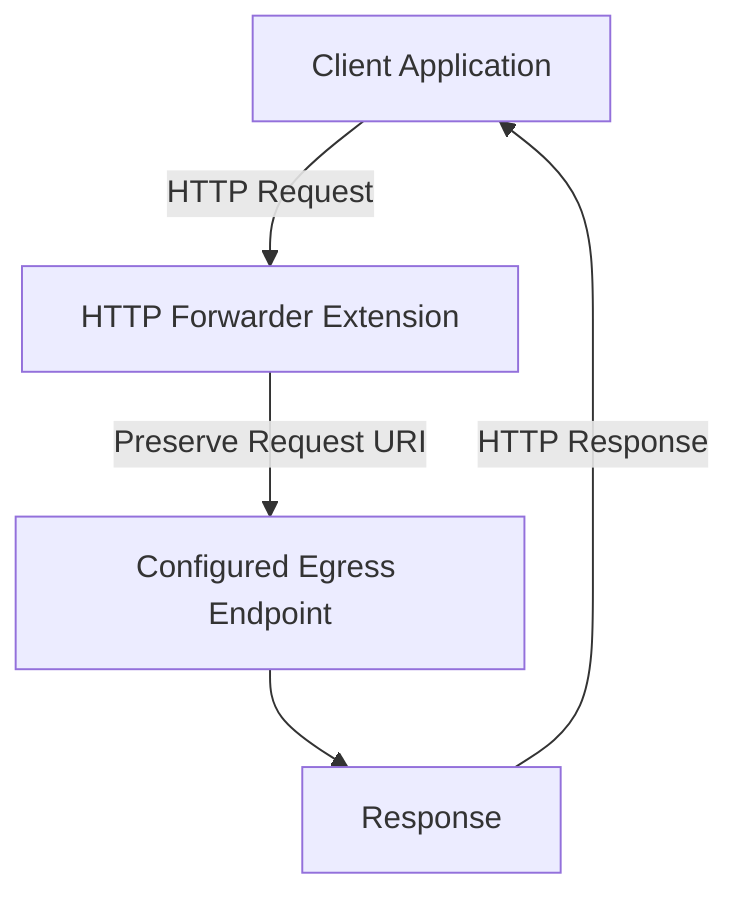

# How to Configure the HTTP Forwarder Extension in the OpenTelemetry Collector

Author: [nawazdhandala](https://www.github.com/nawazdhandala)

Tags: OpenTelemetry, Collector, Extension, HTTP, Networking, Load Balancing, Traffic Management

Description: Comprehensive guide to configuring the HTTP Forwarder extension in OpenTelemetry Collector for advanced traffic routing, load balancing, and request forwarding capabilities.

The HTTP Forwarder extension in the OpenTelemetry Collector accepts HTTP requests and forwards them to a configured downstream service. It is useful when you need the Collector to expose a simple HTTP forwarding endpoint and add a small set of static headers to forwarded requests.

## What is the HTTP Forwarder Extension?

The HTTP Forwarder extension enables the OpenTelemetry Collector to run an HTTP server that forwards incoming requests to a target endpoint. Unlike exporters that transform and send telemetry data in specific formats, the HTTP Forwarder operates at the HTTP protocol level. It preserves the original request URI, changes the scheme and host to the configured egress endpoint, adds any configured egress headers, and adds a `Via` header.

This extension is intentionally small. It supports one egress endpoint per extension instance. It does not implement routing rules, fan-out, traffic mirroring, load balancing, health checks, circuit breaking, or rate limiting by itself.

## Core Use Cases

The HTTP Forwarder extension fits a few focused deployment scenarios:

**Gateway Pattern**: Position the collector as a simple HTTP forwarding endpoint that sends requests to a single backend.

**Static Header Injection**: Add fixed headers to all forwarded requests, such as a routing marker or an authorization header sourced from Collector configuration.

**TLS Termination and Re-encryption**: Use the Collector's HTTP server and client TLS settings to secure ingress and egress connections.

**Legacy System Integration**: Bridge clients that need to send HTTP requests through a Collector-managed forwarding endpoint while preserving the request URI.

## Basic Configuration

Here's a simple HTTP Forwarder configuration that forwards all incoming requests to a single target:

```yaml
# collector-config.yaml

extensions:
  # Configure the HTTP Forwarder extension
  http_forwarder:
    # Ingress defines where the forwarder listens
    ingress:
      endpoint: 0.0.0.0:8080

    # Egress defines where requests are forwarded
    egress:
      # Single target endpoint
      endpoint: "http://backend-collector:4318"

      # Optional: connection timeout
      timeout: 30s

      # Optional: keep-alive settings inherited from the Collector HTTP client config
      idle_conn_timeout: 90s
      max_idle_conns: 100

receivers:
  otlp:
    protocols:
      grpc:
        endpoint: 0.0.0.0:4317
      http:
        endpoint: 0.0.0.0:4318

processors:
  batch:
    timeout: 10s

exporters:
  debug:
    verbosity: detailed

service:
  # Include the http_forwarder extension
  extensions: [http_forwarder]
  pipelines:
    traces:
      receivers: [otlp]
      processors: [batch]
      exporters: [debug]
```

In this configuration, any HTTP request sent to port 8080 is forwarded to the backend collector at `backend-collector:4318`. The forwarder operates independently of the standard receiver/processor/exporter pipeline.

## Multiple Target Endpoints

The HTTP Forwarder extension does not support multiple egress endpoints, weighted load balancing, fallback targets, or traffic mirroring in a single extension instance. Configure one egress endpoint per `http_forwarder` instance, and use an external load balancer or proxy if you need backend selection:

```yaml
extensions:
  http_forwarder/primary:
    ingress:
      endpoint: 0.0.0.0:8080
    egress:
      endpoint: "http://primary-collector:4318"
      timeout: 10s

  http_forwarder/secondary:
    ingress:
      endpoint: 0.0.0.0:8081
    egress:
      endpoint: "http://secondary-collector:4318"
      timeout: 10s

service:
  extensions: [http_forwarder/primary, http_forwarder/secondary]
```

This configuration exposes two independent forwarding listeners. It does not split traffic automatically; traffic distribution has to happen before requests reach these listeners.

## Request Routing Based on Attributes

The HTTP Forwarder extension does not evaluate routing rules based on headers, paths, or query parameters. Requests received by one forwarder instance go to that instance's single configured `egress.endpoint`.

If you need tenant-aware or path-aware routing, put a routing proxy such as Envoy, NGINX, HAProxy, or an application gateway in front of separate forwarder instances. If the request is OTLP telemetry and you want to route after decoding telemetry data, receive it with the OTLP receiver and use Collector processors/exporters designed for telemetry routing instead of the HTTP Forwarder extension.

## Traffic Flow Visualization

The following diagram illustrates how the HTTP Forwarder processes requests:


```mermaid
graph TD
    A[Client Application] -->|HTTP Request| B[HTTP Forwarder Extension]
    B -->|Preserve Request URI| C[Configured Egress Endpoint]
    C --> D[Response]
    D -->|HTTP Response| A
```

## Header Manipulation

The HTTP Forwarder extension can add static headers to forwarded requests. The `headers` setting is a map of header names to values:

```yaml
extensions:
  http_forwarder:
    ingress:
      endpoint: 0.0.0.0:8080

    egress:
      endpoint: "http://backend-collector:4318"

      # Add these headers to all forwarded requests
      headers:
        Authorization: "Bearer ${env:AUTH_TOKEN}"
        X-Forwarded-By: "otel-collector-gateway"

receivers:
  otlp:
    protocols:
      http:
        endpoint: 0.0.0.0:4318

processors:
  batch:
    timeout: 10s

exporters:
  debug:
    verbosity: normal

service:
  extensions: [http_forwarder]
  pipelines:
    traces:
      receivers: [otlp]
      processors: [batch]
      exporters: [debug]
```

Header manipulation in this extension is limited to adding headers. It does not provide separate `add`, `set`, or `remove` lists, and it does not generate dynamic values such as timestamps or client IP addresses.

## TLS Configuration

Secure the ingress and egress connections with TLS using the Collector's standard HTTP server and client TLS settings:

```yaml
extensions:
  http_forwarder:
    ingress:
      endpoint: 0.0.0.0:8443

      # TLS configuration for ingress (server)
      tls:
        cert_file: "/etc/certs/server-cert.pem"
        key_file: "/etc/certs/server-key.pem"
        client_ca_file: "/etc/certs/client-ca.pem"
        client_auth_type: "RequireAndVerifyClientCert"
        min_version: "1.2"

    egress:
      endpoint: "https://backend-collector:4318"

      # TLS configuration for egress (client)
      tls:
        ca_file: "/etc/certs/backend-ca.pem"
        cert_file: "/etc/certs/client-cert.pem"
        key_file: "/etc/certs/client-key.pem"
        insecure_skip_verify: false

receivers:
  otlp:
    protocols:
      grpc:
        endpoint: 0.0.0.0:4317
      http:
        endpoint: 0.0.0.0:4318

processors:
  batch:
    timeout: 10s

exporters:
  debug:
    verbosity: normal

service:
  extensions: [http_forwarder]
  pipelines:
    traces:
      receivers: [otlp]
      processors: [batch]
      exporters: [debug]
```

This configuration implements TLS encryption with mutual authentication for both ingress and egress connections.

## Health Checks and Circuit Breaking

The HTTP Forwarder extension does not include backend health checks or circuit breaker settings. If you need automatic failover or circuit breaking, place a proxy or load balancer with those features in front of the backend, and configure the forwarder to send traffic to that proxy:

```yaml
extensions:
  http_forwarder:
    ingress:
      endpoint: 0.0.0.0:8080
    egress:
      endpoint: "http://telemetry-proxy:4318"
      timeout: 10s

service:
  extensions: [http_forwarder]
```

Health checking and circuit breaking should be configured in `telemetry-proxy`, not in the HTTP Forwarder extension.

## Rate Limiting

The HTTP Forwarder extension does not provide ingress or egress rate-limiting configuration. Control request rates with an upstream API gateway, reverse proxy, service mesh, or load balancer:

```yaml
extensions:
  http_forwarder:
    ingress:
      endpoint: 0.0.0.0:8080
    egress:
      endpoint: "http://rate-limited-proxy:4318"
      timeout: 10s

service:
  extensions: [http_forwarder]
```

Rate limiting protects backend services from overload, but it has to be implemented outside this extension.

## Integration with Authentication Extensions

Combine the HTTP Forwarder with authentication extensions for egress authentication:

```yaml
extensions:
  # OAuth2 client credentials for backend authentication
  oauth2client:
    client_id: "collector-client"
    client_secret: "${env:OAUTH_CLIENT_SECRET}"
    token_url: "https://auth.example.com/oauth/token"
    scopes: ["telemetry.write"]

  http_forwarder:
    ingress:
      endpoint: 0.0.0.0:8080

    egress:
      endpoint: "https://backend-collector:4318"

      # Use the OAuth2 extension for authentication
      auth:
        authenticator: oauth2client

      # Additional static headers
      headers:
        X-Forwarded-By: "otel-collector-gateway"

receivers:
  otlp:
    protocols:
      http:
        endpoint: 0.0.0.0:4318

processors:
  batch:
    timeout: 10s

exporters:
  debug:
    verbosity: normal

service:
  extensions: [oauth2client, http_forwarder]
  pipelines:
    traces:
      receivers: [otlp]
      processors: [batch]
      exporters: [debug]
```

This configuration authenticates forwarded requests using OAuth2 credentials managed by a separate authentication extension.

## Metrics and Observability

The HTTP Forwarder extension does not expose a custom `telemetry` block or a documented set of extension-specific metrics such as `requests_total` or `backend_health`. Monitor the Collector through its standard internal telemetry, and monitor backend availability with your proxy, load balancer, or backend service:

```yaml
extensions:
  http_forwarder:
    ingress:
      endpoint: 0.0.0.0:8080
    egress:
      endpoint: "http://backend-collector:4318"
      timeout: 10s

service:
  extensions: [http_forwarder]
  telemetry:
    logs:
      level: info
```

Standard Collector telemetry helps you see Collector-level behavior, while backend-specific metrics should come from the backend or proxy layer.

## Best Practices

**Use one endpoint per forwarder instance**: Configure each `http_forwarder` instance with a single egress endpoint.

**Keep advanced traffic management outside the extension**: Use a proxy, gateway, service mesh, or load balancer for routing, load balancing, health checks, circuit breaking, mirroring, and rate limiting.

**Secure connections**: Use TLS for ingress and egress when forwarding sensitive telemetry data.

**Use authentication extensions for egress auth**: Prefer Collector authentication extensions over hard-coded credentials when downstream services require OAuth2 or another supported client authenticator.

**Monitor the surrounding path**: Track Collector internal telemetry, proxy metrics, and backend health so forwarding failures are visible quickly.

## Troubleshooting

**Connection refused errors**: Verify the single configured `egress.endpoint` is reachable and listening on the specified port. Check firewall rules and network policies.

**TLS handshake failures**: Ensure certificates are valid and properly configured. Verify certificate chains, trusted CAs, and whether mutual TLS is required.

**High latency**: Check backend response time, network latency, and the `egress.timeout` setting. If a proxy sits between the forwarder and backend, check its connection pool and retry behavior.

**Unexpected routing behavior**: The forwarder does not evaluate routing rules. Confirm the request reached the intended forwarder listener, or check the external proxy that performs routing.

**Backend health check failures**: The forwarder does not run health checks. Verify health checks in your load balancer, proxy, or backend monitoring system.

## Conclusion

The HTTP Forwarder extension turns the OpenTelemetry Collector into a focused HTTP forwarding endpoint. It is best suited for forwarding requests to one configured backend, preserving the request URI, adding static headers, and using the Collector's HTTP client and server settings for TLS and authentication. For intelligent routing, load balancing, mirroring, rate limiting, and failover, pair it with infrastructure that is designed for traffic management.

For related topics on collector extensions, explore [Storage Extension configuration](https://oneuptime.com/blog/post/2026-02-06-storage-extension-opentelemetry-collector/view) and [Jaeger Remote Sampling](https://oneuptime.com/blog/post/2026-02-06-jaeger-remote-sampling-extension-opentelemetry-collector/view).
