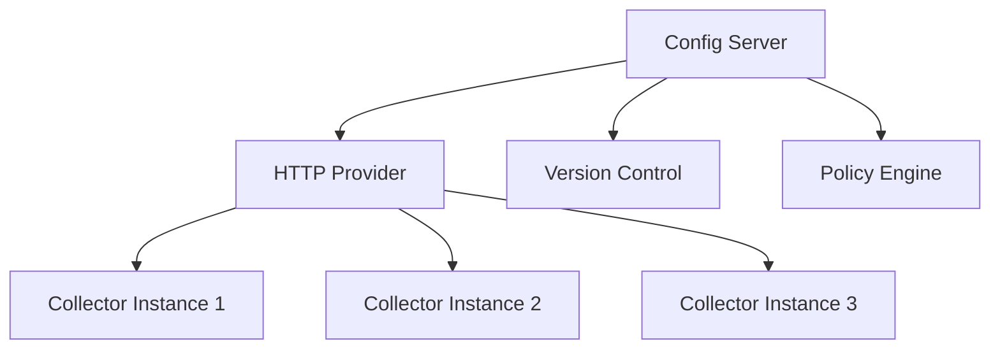

# How to Use the HTTP Provider for Remote Collector Configuration

Author: [nawazdhandala](https://www.github.com/nawazdhandala)

Tags: OpenTelemetry, Collector, Configuration, HTTP Provider, Remote Configuration

Description: Implement centralized remote configuration management for OpenTelemetry Collectors using HTTP providers to control fleet-wide deployments from a single source.

The HTTP provider enables OpenTelemetry Collectors to fetch configuration from remote HTTP endpoints, allowing centralized management of collector fleets. This approach is essential for organizations managing hundreds or thousands of collector instances across distributed infrastructure.

## Understanding HTTP Configuration Providers

HTTP providers fetch configuration data from remote HTTP/HTTPS endpoints instead of local files. The collector polls these endpoints at regular intervals and applies configuration updates automatically.

This architecture enables centralized control over distributed collector fleets:



## Setting Up HTTP Provider

Enable the HTTP provider in your collector configuration:

```yaml
# collector-config.yaml
# Base configuration with HTTP provider
providers:
  http:
    # Enable HTTP provider
    enabled: true

    # Configuration endpoint URL
    endpoint: https://config.example.com/otel/config

    # Poll interval for checking updates (default: 30s)
    poll_interval: 30s

    # Request timeout
    timeout: 10s

    # HTTP headers for authentication
    headers:
      Authorization: Bearer ${CONFIG_API_TOKEN}
      X-Collector-ID: ${COLLECTOR_ID}

    # TLS configuration for secure connections
    tls:
      insecure: false
      cert_file: /etc/certs/client.crt
      key_file: /etc/certs/client.key
      ca_file: /etc/certs/ca.crt

receivers:
  otlp:
    protocols:
      grpc:
        endpoint: 0.0.0.0:4317

exporters:
  debug:
    verbosity: basic

service:
  pipelines:
    traces:
      receivers: [otlp]
      exporters: [debug]
```

Start the collector with the HTTP provider feature enabled:

```bash
export CONFIG_API_TOKEN="your-api-token"
export COLLECTOR_ID="collector-prod-us-east-1a"
./otelcol --config collector-config.yaml --feature-gates=configprovider.Enable
```

## Building a Configuration Server

Create a simple configuration server that serves collector configurations based on collector identity:

```go
// config-server.go
package main

import (
    "encoding/json"
    "log"
    "net/http"
    "os"
    "path/filepath"
    "strings"
)

// CollectorConfig represents the collector configuration
type CollectorConfig struct {
    Receivers  map[string]interface{} `json:"receivers"`
    Processors map[string]interface{} `json:"processors"`
    Exporters  map[string]interface{} `json:"exporters"`
    Service    ServiceConfig          `json:"service"`
}

type ServiceConfig struct {
    Pipelines map[string]Pipeline `json:"pipelines"`
}

type Pipeline struct {
    Receivers  []string `json:"receivers"`
    Processors []string `json:"processors"`
    Exporters  []string `json:"exporters"`
}

// configHandler serves collector configuration
func configHandler(w http.ResponseWriter, r *http.Request) {
    // Verify authentication
    authHeader := r.Header.Get("Authorization")
    if !validateToken(authHeader) {
        http.Error(w, "Unauthorized", http.StatusUnauthorized)
        return
    }

    // Get collector ID from headers
    collectorID := r.Header.Get("X-Collector-ID")
    if collectorID == "" {
        http.Error(w, "X-Collector-ID header required", http.StatusBadRequest)
        return
    }

    // Determine configuration based on collector ID
    configFile := determineConfigFile(collectorID)

    // Load configuration from file
    config, err := loadConfig(configFile)
    if err != nil {
        log.Printf("Error loading config for %s: %v", collectorID, err)
        http.Error(w, "Configuration not found", http.StatusNotFound)
        return
    }

    // Set response headers
    w.Header().Set("Content-Type", "application/json")
    w.Header().Set("X-Config-Version", getConfigVersion(configFile))

    // Return configuration
    json.NewEncoder(w).Encode(config)

    log.Printf("Served config to %s (file: %s)", collectorID, configFile)
}

// validateToken verifies the authentication token
func validateToken(authHeader string) bool {
    // Extract token from "Bearer <token>"
    parts := strings.Split(authHeader, " ")
    if len(parts) != 2 || parts[0] != "Bearer" {
        return false
    }

    expectedToken := os.Getenv("CONFIG_API_TOKEN")
    return parts[1] == expectedToken
}

// determineConfigFile selects configuration based on collector ID
func determineConfigFile(collectorID string) string {
    // Parse collector ID: collector-<env>-<region>
    parts := strings.Split(collectorID, "-")

    if len(parts) >= 2 {
        env := parts[1] // prod, staging, dev

        // Return environment-specific config
        return filepath.Join("configs", env, "config.yaml")
    }

    // Default configuration
    return "configs/default/config.yaml"
}

// loadConfig reads configuration from file
func loadConfig(filename string) (*CollectorConfig, error) {
    data, err := os.ReadFile(filename)
    if err != nil {
        return nil, err
    }

    var config CollectorConfig
    // In production, parse YAML properly
    // For this example, assume JSON format
    err = json.Unmarshal(data, &config)
    return &config, err
}

// getConfigVersion returns the configuration version
func getConfigVersion(filename string) string {
    info, err := os.Stat(filename)
    if err != nil {
        return "unknown"
    }
    return info.ModTime().Format("20060102-150405")
}

// healthHandler provides health check endpoint
func healthHandler(w http.ResponseWriter, r *http.Request) {
    w.WriteHeader(http.StatusOK)
    w.Write([]byte("OK"))
}

func main() {
    http.HandleFunc("/otel/config", configHandler)
    http.HandleFunc("/health", healthHandler)

    port := os.Getenv("PORT")
    if port == "" {
        port = "8080"
    }

    log.Printf("Configuration server listening on :%s", port)
    log.Fatal(http.ListenAndServe(":"+port, nil))
}
```

Configuration files for different environments:

```yaml
# configs/prod/config.yaml
receivers:
  otlp:
    protocols:
      grpc:
        endpoint: 0.0.0.0:4317
      http:
        endpoint: 0.0.0.0:4318

processors:
  batch:
    timeout: 30s
    send_batch_size: 1000

  memory_limiter:
    check_interval: 1s
    limit_mib: 512

  resource:
    attributes:
      - key: environment
        value: production
        action: upsert

exporters:
  otlp/tempo:
    endpoint: tempo-prod.monitoring.svc:4317
    compression: gzip

  prometheusremotewrite:
    endpoint: https://prometheus-prod.monitoring.svc/api/v1/write

service:
  pipelines:
    traces:
      receivers: [otlp]
      processors: [memory_limiter, resource, batch]
      exporters: [otlp/tempo]
    metrics:
      receivers: [otlp]
      processors: [memory_limiter, resource, batch]
      exporters: [prometheusremotewrite]
```

```yaml
# configs/dev/config.yaml
receivers:
  otlp:
    protocols:
      grpc:
        endpoint: 0.0.0.0:4317
      http:
        endpoint: 0.0.0.0:4318

processors:
  batch:
    timeout: 5s
    send_batch_size: 100

  resource:
    attributes:
      - key: environment
        value: development
        action: upsert

exporters:
  debug:
    verbosity: detailed

  otlp/tempo:
    endpoint: tempo-dev.monitoring.svc:4317
    tls:
      insecure: true

service:
  telemetry:
    logs:
      level: debug

  pipelines:
    traces:
      receivers: [otlp]
      processors: [resource, batch]
      exporters: [debug, otlp/tempo]
```

## Advanced Configuration with Templates

Implement template-based configuration to generate collector configs dynamically:

```go
// template-handler.go
package main

import (
    "bytes"
    "encoding/json"
    "net/http"
    "text/template"
)

// CollectorMetadata contains collector-specific information
type CollectorMetadata struct {
    CollectorID string
    Environment string
    Region      string
    Zone        string
    ClusterName string
}

// configTemplateHandler generates configuration from templates
func configTemplateHandler(w http.ResponseWriter, r *http.Request) {
    // Authenticate request
    if !validateToken(r.Header.Get("Authorization")) {
        http.Error(w, "Unauthorized", http.StatusUnauthorized)
        return
    }

    // Extract collector metadata
    metadata := extractMetadata(r)

    // Load configuration template
    tmpl, err := template.ParseFiles("templates/collector-config.tmpl")
    if err != nil {
        http.Error(w, "Template error", http.StatusInternalServerError)
        return
    }

    // Generate configuration from template
    var buf bytes.Buffer
    err = tmpl.Execute(&buf, metadata)
    if err != nil {
        http.Error(w, "Template execution error", http.StatusInternalServerError)
        return
    }

    // Return generated configuration
    w.Header().Set("Content-Type", "application/x-yaml")
    w.Header().Set("X-Config-Version", getTemplateVersion())
    w.Write(buf.Bytes())
}

// extractMetadata parses collector metadata from request
func extractMetadata(r *http.Request) CollectorMetadata {
    collectorID := r.Header.Get("X-Collector-ID")

    // Parse collector ID to extract metadata
    // Format: collector-<env>-<region>-<zone>
    parts := parseCollectorID(collectorID)

    return CollectorMetadata{
        CollectorID: collectorID,
        Environment: parts["env"],
        Region:      parts["region"],
        Zone:        parts["zone"],
        ClusterName: parts["cluster"],
    }
}
```

Configuration template:

```yaml
# templates/collector-config.tmpl
receivers:
  otlp:
    protocols:
      grpc:
        endpoint: 0.0.0.0:4317
      http:
        endpoint: 0.0.0.0:4318

processors:
  batch:
    {{- if eq .Environment "production" }}
    timeout: 30s
    send_batch_size: 1000
    {{- else }}
    timeout: 5s
    send_batch_size: 100
    {{- end }}

  resource:
    attributes:
      - key: collector.id
        value: {{ .CollectorID }}
        action: upsert
      - key: environment
        value: {{ .Environment }}
        action: upsert
      - key: region
        value: {{ .Region }}
        action: upsert
      - key: zone
        value: {{ .Zone }}
        action: upsert
      - key: cluster.name
        value: {{ .ClusterName }}
        action: upsert

exporters:
  {{- if eq .Environment "production" }}
  otlp/tempo:
    endpoint: tempo-prod-{{ .Region }}.monitoring.svc:4317
    compression: gzip

  prometheusremotewrite:
    endpoint: https://prometheus-{{ .Region }}.monitoring.svc/api/v1/write
    headers:
      X-Scope-OrgID: {{ .Environment }}
  {{- else }}
  debug:
    verbosity: detailed

  otlp/tempo:
    endpoint: tempo-dev.monitoring.svc:4317
    tls:
      insecure: true
  {{- end }}

service:
  telemetry:
    logs:
      {{- if eq .Environment "production" }}
      level: warn
      {{- else }}
      level: debug
      {{- end }}

  pipelines:
    traces:
      receivers: [otlp]
      processors: [resource, batch]
      {{- if eq .Environment "production" }}
      exporters: [otlp/tempo]
      {{- else }}
      exporters: [debug, otlp/tempo]
      {{- end }}
```

## Configuration Versioning and Rollback

Implement version control and rollback capabilities for configuration management:

```go
// versioned-config.go
package main

import (
    "encoding/json"
    "net/http"
    "strconv"
    "sync"
)

// ConfigVersion represents a versioned configuration
type ConfigVersion struct {
    Version     int                    `json:"version"`
    Config      map[string]interface{} `json:"config"`
    CreatedAt   string                 `json:"created_at"`
    Description string                 `json:"description"`
}

// ConfigStore manages versioned configurations
type ConfigStore struct {
    mu       sync.RWMutex
    configs  map[string][]ConfigVersion // collectorID -> versions
    current  map[string]int             // collectorID -> current version
}

var store = &ConfigStore{
    configs: make(map[string][]ConfigVersion),
    current: make(map[string]int),
}

// versionedConfigHandler serves configuration with version support
func versionedConfigHandler(w http.ResponseWriter, r *http.Request) {
    if !validateToken(r.Header.Get("Authorization")) {
        http.Error(w, "Unauthorized", http.StatusUnauthorized)
        return
    }

    collectorID := r.Header.Get("X-Collector-ID")
    requestedVersion := r.URL.Query().Get("version")

    store.mu.RLock()
    defer store.mu.RUnlock()

    versions, exists := store.configs[collectorID]
    if !exists || len(versions) == 0 {
        http.Error(w, "No configuration found", http.StatusNotFound)
        return
    }

    var config ConfigVersion

    if requestedVersion != "" {
        // Serve specific version
        version, _ := strconv.Atoi(requestedVersion)
        config = findVersion(versions, version)
    } else {
        // Serve current version
        currentVersion := store.current[collectorID]
        config = findVersion(versions, currentVersion)
    }

    w.Header().Set("Content-Type", "application/json")
    w.Header().Set("X-Config-Version", strconv.Itoa(config.Version))
    json.NewEncoder(w).Encode(config.Config)
}

// rollbackHandler rolls back to a previous configuration version
func rollbackHandler(w http.ResponseWriter, r *http.Request) {
    if r.Method != http.MethodPost {
        http.Error(w, "Method not allowed", http.StatusMethodNotAllowed)
        return
    }

    if !validateToken(r.Header.Get("Authorization")) {
        http.Error(w, "Unauthorized", http.StatusUnauthorized)
        return
    }

    var req struct {
        CollectorID string `json:"collector_id"`
        Version     int    `json:"version"`
    }

    if err := json.NewDecoder(r.Body).Decode(&req); err != nil {
        http.Error(w, "Invalid request", http.StatusBadRequest)
        return
    }

    store.mu.Lock()
    defer store.mu.Unlock()

    versions, exists := store.configs[req.CollectorID]
    if !exists {
        http.Error(w, "Collector not found", http.StatusNotFound)
        return
    }

    // Validate version exists
    if findVersion(versions, req.Version).Version == 0 {
        http.Error(w, "Version not found", http.StatusNotFound)
        return
    }

    // Update current version
    store.current[req.CollectorID] = req.Version

    w.WriteHeader(http.StatusOK)
    json.NewEncoder(w).Encode(map[string]interface{}{
        "collector_id": req.CollectorID,
        "version":      req.Version,
        "status":       "rollback successful",
    })
}

// findVersion locates a specific configuration version
func findVersion(versions []ConfigVersion, version int) ConfigVersion {
    for _, v := range versions {
        if v.Version == version {
            return v
        }
    }
    return ConfigVersion{}
}
```

## Kubernetes Integration

Deploy the configuration server and collectors in Kubernetes:

```yaml
# k8s-config-server.yaml
apiVersion: apps/v1
kind: Deployment
metadata:
  name: otel-config-server
  namespace: observability
spec:
  replicas: 3
  selector:
    matchLabels:
      app: otel-config-server
  template:
    metadata:
      labels:
        app: otel-config-server
    spec:
      containers:
      - name: config-server
        image: yourorg/otel-config-server:latest
        ports:
        - containerPort: 8080
          name: http
        env:
        - name: CONFIG_API_TOKEN
          valueFrom:
            secretKeyRef:
              name: config-server-secrets
              key: api-token
        volumeMounts:
        - name: configs
          mountPath: /configs
        livenessProbe:
          httpGet:
            path: /health
            port: 8080
          initialDelaySeconds: 10
          periodSeconds: 30
      volumes:
      - name: configs
        configMap:
          name: collector-configs

---
apiVersion: v1
kind: Service
metadata:
  name: otel-config-server
  namespace: observability
spec:
  selector:
    app: otel-config-server
  ports:
  - port: 80
    targetPort: 8080
    name: http
  type: ClusterIP
```

Collector deployment with HTTP provider:

```yaml
# k8s-collector-deployment.yaml
apiVersion: apps/v1
kind: DaemonSet
metadata:
  name: otel-collector
  namespace: observability
spec:
  selector:
    matchLabels:
      app: otel-collector
  template:
    metadata:
      labels:
        app: otel-collector
    spec:
      containers:
      - name: otel-collector
        image: otel/opentelemetry-collector-contrib:latest
        args:
          - --config=/etc/otel/config.yaml
          - --feature-gates=configprovider.Enable
        env:
        - name: CONFIG_API_TOKEN
          valueFrom:
            secretKeyRef:
              name: config-server-secrets
              key: api-token
        - name: COLLECTOR_ID
          value: "collector-prod-$(NODE_NAME)"
        - name: NODE_NAME
          valueFrom:
            fieldRef:
              fieldPath: spec.nodeName
        - name: POD_NAMESPACE
          valueFrom:
            fieldRef:
              fieldPath: metadata.namespace
        volumeMounts:
        - name: config
          mountPath: /etc/otel
      volumes:
      - name: config
        configMap:
          name: otel-collector-base-config
```

Base configuration with HTTP provider:

```yaml
# k8s-configmap.yaml
apiVersion: v1
kind: ConfigMap
metadata:
  name: otel-collector-base-config
  namespace: observability
data:
  config.yaml: |
    providers:
      http:
        enabled: true
        endpoint: http://otel-config-server.observability.svc/otel/config
        poll_interval: 30s
        timeout: 10s
        headers:
          Authorization: Bearer ${CONFIG_API_TOKEN}
          X-Collector-ID: ${COLLECTOR_ID}

    # Minimal fallback configuration
    receivers:
      otlp:
        protocols:
          grpc:
            endpoint: 0.0.0.0:4317

    exporters:
      debug:
        verbosity: basic

    service:
      pipelines:
        traces:
          receivers: [otlp]
          exporters: [debug]
```

## Best Practices

**Authentication**: Always use strong authentication tokens and TLS for securing configuration endpoints.

**Caching**: Implement caching in the configuration server to reduce database load and improve response times.

**Fallback Configuration**: Include a minimal working configuration in case the HTTP provider fails to fetch remote config.

**Version Control**: Store configuration files in Git and implement proper versioning for rollback capabilities.

**Monitoring**: Track configuration fetch attempts, failures, and version changes through metrics and logs.

**Rate Limiting**: Implement rate limiting on the configuration server to prevent abuse and ensure availability.

For even more advanced centralized management, explore [OpAMP protocol for collector management](https://oneuptime.com/blog/post/2026-02-06-manage-collector-configuration-opamp/view). You can also combine HTTP providers with [environment variables](https://oneuptime.com/blog/post/2026-02-06-environment-variables-opentelemetry-collector-configuration/view) for flexible deployments.

## Conclusion

The HTTP provider enables centralized configuration management for large-scale OpenTelemetry Collector deployments. By fetching configuration from remote endpoints, teams can manage thousands of collectors from a single control plane, implement sophisticated configuration policies, and respond quickly to changing requirements. Combined with proper authentication, versioning, and monitoring, the HTTP provider provides enterprise-grade configuration management capabilities.
