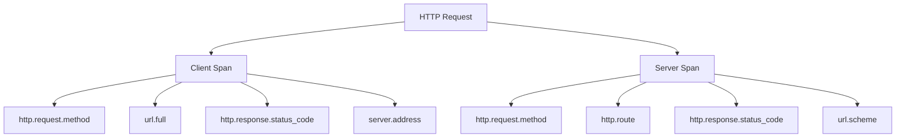

# How to Apply HTTP Semantic Conventions in OpenTelemetry

Author: [nawazdhandala](https://www.github.com/nawazdhandala)

Tags: OpenTelemetry, HTTP, Semantic Conventions, Tracing, Observability, Web Services, Instrumentation

Description: Learn how to apply OpenTelemetry HTTP semantic conventions to your web services for consistent tracing, meaningful span attributes, and reliable dashboards across all your HTTP-based applications.

---

HTTP is the backbone of most modern applications. Whether you are building REST APIs, GraphQL endpoints, or traditional web servers, nearly every request flows over HTTP at some point. OpenTelemetry provides a well-defined set of semantic conventions specifically for HTTP operations, and applying them correctly makes the difference between telemetry data that is actually useful and telemetry data that just takes up space.

This guide walks through the HTTP semantic conventions in detail, with practical code examples that you can adapt for your own services.

## What HTTP Semantic Conventions Cover

The OpenTelemetry HTTP semantic conventions define a standard set of attribute names and values for describing HTTP client and server operations. They cover things like the HTTP method, status code, URL components, request and response sizes, and network-level details.

Here is the high-level structure of what gets captured:



The key insight is that client spans and server spans capture slightly different attributes. A client span records where the request is going, while a server span records the route that handled the request.

## Span Naming for HTTP Operations

The convention for naming HTTP spans is straightforward. For HTTP server spans, use the HTTP method and the route pattern. For HTTP client spans, use just the HTTP method.

```
# Server span names
GET /users/{id}
POST /orders
DELETE /sessions/{sessionId}

# Client span names
GET
POST
```

If the route is not known, fall back to just the HTTP method. Never put the full URL in the span name because it creates high-cardinality issues that will blow up your tracing backend.

## Server-Side Implementation in Node.js

Let us start with a practical server-side example using Express and the OpenTelemetry Node.js SDK.

```javascript
// tracing.js - Initialize the OpenTelemetry SDK with HTTP semantic conventions
const { NodeSDK } = require('@opentelemetry/sdk-node');
const { HttpInstrumentation } = require('@opentelemetry/instrumentation-http');
const { ExpressInstrumentation } = require('@opentelemetry/instrumentation-express');
const { OTLPTraceExporter } = require('@opentelemetry/exporter-trace-otlp-http');
const { Resource } = require('@opentelemetry/resources');
const {
  ATTR_SERVICE_NAME,
  ATTR_SERVICE_VERSION,
} = require('@opentelemetry/semantic-conventions');

// Configure the SDK with HTTP and Express auto-instrumentation
const sdk = new NodeSDK({
  resource: new Resource({
    [ATTR_SERVICE_NAME]: 'user-api',
    [ATTR_SERVICE_VERSION]: '1.4.0',
  }),
  traceExporter: new OTLPTraceExporter({
    url: 'https://otel-collector.example.com/v1/traces',
  }),
  instrumentations: [
    new HttpInstrumentation(),
    new ExpressInstrumentation(),
  ],
});

sdk.start();
```

The `HttpInstrumentation` module automatically applies HTTP semantic conventions to every incoming and outgoing request. It sets attributes like `http.request.method`, `http.response.status_code`, `url.scheme`, `url.path`, and `server.address` without you having to write any manual instrumentation code.

For cases where auto-instrumentation does not capture everything you need, you can add custom attributes that follow the conventions.

```javascript
// routes/users.js - Adding custom HTTP attributes to spans
const { trace } = require('@opentelemetry/api');

app.get('/users/:id', async (req, res) => {
  const span = trace.getActiveSpan();

  if (span) {
    // Set standard HTTP semantic convention attributes
    span.setAttribute('http.route', '/users/:id');
    span.setAttribute('http.request.header.x-request-id', req.headers['x-request-id']);

    // Set custom attributes that follow the convention patterns
    span.setAttribute('app.user.lookup_type', 'by_id');
  }

  try {
    const user = await userService.findById(req.params.id);
    res.json(user);
  } catch (error) {
    span?.setAttribute('error.type', error.constructor.name);
    res.status(500).json({ error: 'Internal server error' });
  }
});
```

This code retrieves the active span created by the auto-instrumentation and adds extra context. The `http.route` attribute uses the parameterized route pattern rather than the actual URL, which keeps cardinality low. The custom `app.user.lookup_type` attribute follows the dot-notation naming pattern that the conventions establish.

## Client-Side HTTP Instrumentation in Python

On the client side, HTTP semantic conventions help you understand how your service communicates with its dependencies. Here is an example using Python with the `requests` library.

```python
# http_client.py - Instrumented HTTP client with semantic conventions
from opentelemetry import trace
from opentelemetry.instrumentation.requests import RequestsInstrumentor
from opentelemetry.sdk.trace import TracerProvider
from opentelemetry.sdk.trace.export import BatchSpanProcessor
from opentelemetry.exporter.otlp.proto.grpc.trace_exporter import OTLPSpanExporter
from opentelemetry.sdk.resources import Resource
from opentelemetry.semconv.resource import ResourceAttributes

# Set up the tracer provider with resource attributes
resource = Resource.create({
    ResourceAttributes.SERVICE_NAME: "order-service",
    ResourceAttributes.SERVICE_VERSION: "2.1.0",
})

provider = TracerProvider(resource=resource)
provider.add_span_processor(
    BatchSpanProcessor(OTLPSpanExporter(endpoint="otel-collector:4317"))
)
trace.set_tracer_provider(provider)

# This automatically instruments all requests library calls
RequestsInstrumentor().instrument()
```

Once instrumented, every call made through the `requests` library will generate a client span with the proper HTTP semantic convention attributes. The instrumentation handles `http.request.method`, `url.full`, `server.address`, `server.port`, and `http.response.status_code` automatically.

For more granular control, you can create manual spans that still follow the conventions.

```python
# manual_http_span.py - Manual HTTP client span with full semantic conventions
import requests
from opentelemetry import trace
from opentelemetry.semconv.trace import SpanAttributes

tracer = trace.get_tracer("order-service")

def fetch_inventory(product_id: str) -> dict:
    url = f"https://inventory-api.internal/products/{product_id}/stock"

    # Create a client span following HTTP semantic conventions
    with tracer.start_as_current_span(
        name="GET",
        kind=trace.SpanKind.CLIENT,
        attributes={
            SpanAttributes.HTTP_REQUEST_METHOD: "GET",
            SpanAttributes.URL_FULL: url,
            SpanAttributes.SERVER_ADDRESS: "inventory-api.internal",
            SpanAttributes.SERVER_PORT: 443,
        },
    ) as span:
        response = requests.get(url, timeout=5)

        # Set response attributes after the call completes
        span.set_attribute(SpanAttributes.HTTP_RESPONSE_STATUS_CODE, response.status_code)
        span.set_attribute(
            SpanAttributes.HTTP_RESPONSE_BODY_SIZE, len(response.content)
        )

        if response.status_code >= 400:
            span.set_status(trace.Status(trace.StatusCode.ERROR))
            span.set_attribute("error.type", str(response.status_code))

        return response.json()
```

This function wraps an HTTP GET call in a span that captures all the relevant HTTP attributes. Notice that `SpanKind.CLIENT` is explicitly set because this is an outbound request. The response attributes are set after the call returns, since we do not know the status code or body size beforehand.

## Key HTTP Attributes Reference

Here are the most important HTTP semantic convention attributes you should be using:

```yaml
# Required attributes for HTTP spans
http.request.method: "GET"          # The HTTP method (GET, POST, PUT, DELETE, etc.)
http.response.status_code: 200      # The HTTP response status code

# Server span attributes
http.route: "/users/{id}"           # The matched route pattern
url.scheme: "https"                 # The URI scheme (http or https)
url.path: "/users/42"              # The actual path of the request

# Client span attributes
url.full: "https://api.example.com/users/42"  # Full request URL
server.address: "api.example.com"              # The server hostname
server.port: 443                               # The server port

# Optional but useful
http.request.body.size: 1024        # Request body size in bytes
http.response.body.size: 8192      # Response body size in bytes
network.protocol.version: "1.1"    # HTTP version (1.0, 1.1, 2, 3)
user_agent.original: "Mozilla/5.0" # The user agent string
```

## Handling Status Codes Correctly

The semantic conventions have specific rules about how to handle HTTP status codes in relation to span status. Not every 4xx response means the span itself should be marked as an error.

```javascript
// status-handling.js - Proper HTTP status code to span status mapping
const { SpanStatusCode } = require('@opentelemetry/api');

function setHttpSpanStatus(span, statusCode) {
  // For server spans: only 5xx is an error
  // The client sent a bad request (4xx), but the server handled it correctly
  if (statusCode >= 500) {
    span.setStatus({
      code: SpanStatusCode.ERROR,
      message: `HTTP ${statusCode}`,
    });
    span.setAttribute('error.type', statusCode.toString());
  }
  // For client spans: both 4xx and 5xx indicate something went wrong
  // from the client's perspective
}

function setHttpClientSpanStatus(span, statusCode) {
  if (statusCode >= 400) {
    span.setStatus({
      code: SpanStatusCode.ERROR,
      message: `HTTP ${statusCode}`,
    });
    span.setAttribute('error.type', statusCode.toString());
  }
}
```

This distinction is important. A 404 on a server span is not an error from the server's perspective. The server correctly identified that the resource does not exist and returned the appropriate status code. But from a client's perspective, getting a 404 when you expected a resource to exist is a problem worth flagging.

## Filtering Sensitive Data

HTTP requests often carry sensitive information in headers, query parameters, or request bodies. The semantic conventions give you hooks to sanitize this data before it gets exported.

```javascript
// sanitize.js - Strip sensitive data from HTTP spans
const { HttpInstrumentation } = require('@opentelemetry/instrumentation-http');

const httpInstrumentation = new HttpInstrumentation({
  // Hook into request processing to filter sensitive headers
  requestHook: (span, request) => {
    // Remove authorization tokens from span attributes
    const sanitizedHeaders = { ...request.headers };
    delete sanitizedHeaders['authorization'];
    delete sanitizedHeaders['cookie'];
    delete sanitizedHeaders['x-api-key'];

    // Only record safe headers
    if (sanitizedHeaders['content-type']) {
      span.setAttribute(
        'http.request.header.content-type',
        sanitizedHeaders['content-type']
      );
    }
  },
  // Control which URLs get traced at all
  ignoreIncomingRequestHook: (request) => {
    // Skip health check endpoints to reduce noise
    return request.url === '/health' || request.url === '/ready';
  },
});
```

This configuration prevents sensitive headers from ending up in your tracing backend while still capturing the useful metadata. It also filters out health check endpoints, which would otherwise flood your traces with uninteresting data.

## Querying HTTP Telemetry

Once your HTTP semantic conventions are in place, querying becomes predictable. Here are some example queries you might run against your tracing backend.

```sql
-- Find slow API endpoints (server spans with latency over 1 second)
SELECT http.route, avg(duration_ms), count(*)
FROM spans
WHERE span.kind = 'SERVER'
  AND http.response.status_code IS NOT NULL
  AND duration_ms > 1000
GROUP BY http.route
ORDER BY avg(duration_ms) DESC;

-- Find failing outbound HTTP calls by target service
SELECT server.address, http.response.status_code, count(*)
FROM spans
WHERE span.kind = 'CLIENT'
  AND http.response.status_code >= 400
GROUP BY server.address, http.response.status_code
ORDER BY count(*) DESC;
```

These queries work across all your services because every service uses the same attribute names. That is the whole point of semantic conventions.

## Wrapping Up

HTTP semantic conventions are one of the most immediately useful parts of the OpenTelemetry specification. Most auto-instrumentation libraries handle them out of the box, so the effort to adopt them is minimal. The payoff is consistent, queryable telemetry data that works across your entire fleet of services.

Start by enabling auto-instrumentation for your HTTP framework, verify that the standard attributes are being captured correctly, and then layer on custom attributes where you need additional context. Keep span names low-cardinality, handle status codes according to the spec, and sanitize sensitive data before it leaves your application. With these practices in place, your HTTP traces will be a reliable foundation for debugging and performance analysis.
