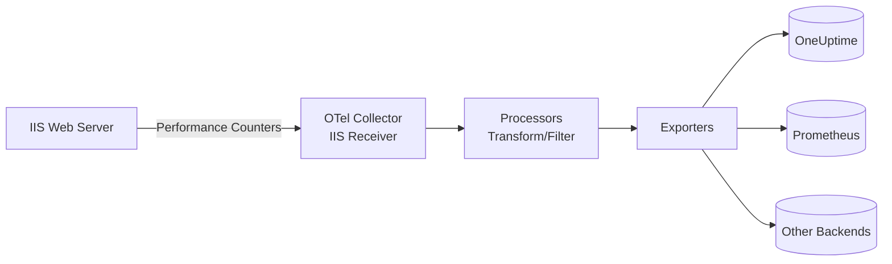

# How to Configure the IIS Receiver in the OpenTelemetry Collector

Author: [nawazdhandala](https://www.github.com/nawazdhandala)

Tags: OpenTelemetry, Collector, IIS, Windows, Web Server, Observability, Metrics, Microsoft

Description: Complete guide to configuring the IIS receiver in OpenTelemetry Collector for Windows environments with practical YAML examples and performance counter setup.

---

Internet Information Services (IIS) is Microsoft's web server platform, powering enterprise applications across Windows environments. Monitoring IIS performance is critical for maintaining responsive applications and identifying bottlenecks. The OpenTelemetry Collector's IIS receiver provides standardized metric collection from IIS instances using Windows Performance Counters.

This guide covers IIS receiver configuration from initial setup through production deployment, including performance counter selection, multiple site monitoring, and integration with observability platforms.

## Understanding the IIS Receiver

The IIS receiver collects metrics from IIS by reading Windows Performance Counters. These counters expose detailed information about web server performance, request processing, connection management, and resource utilization.

Key metrics collected include:

- Request rate and active connections
- HTTP status code distributions
- Request queue depth
- Bytes sent and received
- Cache hit rates
- Application pool status
- Worker process metrics
- Network I/O statistics

The receiver converts these Windows-specific metrics into OpenTelemetry's standard format, enabling cross-platform observability and vendor-neutral backends.

## Prerequisites: IIS and Performance Counters

Before configuring the receiver, ensure IIS is installed and performance counters are enabled.

Verify IIS is running:

```powershell
# Check IIS service status
Get-Service W3SVC | Select-Object Status, StartType

# List IIS sites
Get-IISSite
```

Verify performance counters are accessible:

```powershell
# List available IIS performance counters
Get-Counter -ListSet "Web Service" | Select-Object -ExpandProperty Counter

# Test reading a counter
Get-Counter "\Web Service(_Total)\Current Connections"
```

If performance counters are missing or corrupted, rebuild them:

```powershell
# Run as Administrator
cd C:\Windows\System32
lodctr /r
```

## Data Flow Architecture

The following diagram shows how metrics flow from IIS through the Collector:



The receiver reads Windows Performance Counters at regular intervals, converts them to OpenTelemetry metrics, and forwards them through the configured pipeline.

## Basic Configuration

Here's a minimal configuration to monitor a local IIS instance:

```yaml
# receivers: Define how telemetry enters the Collector
receivers:
  # IIS receiver collects metrics from Windows Performance Counters
  iis:
    # How often to scrape metrics
    collection_interval: 30s

# exporters: Define where telemetry is sent
exporters:
  # Export to OneUptime using OTLP over HTTP
  otlphttp:
    endpoint: https://oneuptime.com/otlp
    headers:
      x-oneuptime-token: ${env:ONEUPTIME_TOKEN}

# service: Wire receivers and exporters into pipelines
service:
  pipelines:
    # Metrics pipeline for IIS data
    metrics:
      receivers: [iis]
      exporters: [otlphttp]
```

This basic setup collects default IIS metrics every 30 seconds and exports them to OneUptime. On Windows, environment variables use `${env:VARIABLE_NAME}` syntax.

## Production Configuration

Production environments require comprehensive monitoring, resource management, and reliable export. Here's a complete configuration:

```yaml
receivers:
  # IIS receiver with full production settings
  iis:
    # Collection interval - balance freshness vs overhead
    # 10-30s for production servers
    # 60s for less critical environments
    collection_interval: 10s

    # Specify which metrics to collect
    # By default, collects a comprehensive set
    # Customize to reduce overhead on high-traffic servers
    metrics:
      # Request metrics
      iis.request.count:
        enabled: true
      iis.request.duration:
        enabled: true
      iis.request.queue.count:
        enabled: true
      iis.request.queue.age.max:
        enabled: true

      # Connection metrics
      iis.connection.active:
        enabled: true
      iis.connection.attempt.count:
        enabled: true
      iis.connection.anonymous:
        enabled: true

      # Network metrics
      iis.network.io:
        enabled: true
      iis.network.bytes_sent:
        enabled: true
      iis.network.bytes_recv:
        enabled: true

      # File metrics
      iis.network.file.count:
        enabled: true

      # Thread metrics
      iis.thread.active:
        enabled: true

      # Uptime
      iis.uptime:
        enabled: true

# processors: Transform and enrich metrics
processors:
  # Add resource attributes for context
  resource:
    attributes:
      - key: service.name
        value: iis-production
        action: upsert
      - key: deployment.environment
        value: production
        action: upsert
      - key: host.name
        value: ${env:COMPUTERNAME}
        action: upsert
      - key: os.type
        value: windows
        action: upsert
      - key: iis.server.role
        value: web-frontend
        action: upsert

  # Batch metrics to reduce network overhead
  batch:
    timeout: 10s
    send_batch_size: 512

  # Prevent collector from exhausting memory
  memory_limiter:
    check_interval: 5s
    limit_mib: 512
    spike_limit_mib: 128

  # Filter out noisy or low-value metrics if needed
  # filter/metrics:
  #   metrics:
  #     exclude:
  #       match_type: regexp
  #       metric_names:
  #         - "iis\\.network\\.file\\..*"

exporters:
  # Export to OneUptime with retry and queuing
  otlphttp:
    endpoint: https://oneuptime.com/otlp
    headers:
      x-oneuptime-token: ${env:ONEUPTIME_TOKEN}
    timeout: 30s

    # Retry configuration for reliability
    retry_on_failure:
      enabled: true
      initial_interval: 5s
      max_interval: 30s
      max_elapsed_time: 300s

    # Queue metrics during backend outages
    sending_queue:
      enabled: true
      num_consumers: 10
      queue_size: 1000

service:
  pipelines:
    metrics:
      receivers: [iis]
      processors: [memory_limiter, resource, batch]
      exporters: [otlphttp]
```

This production configuration includes metric selection, resource tagging, batching, memory protection, and reliable export with retry logic.

## Monitoring Multiple IIS Sites

To monitor multiple IIS sites or servers separately, use resource attributes to distinguish them:

```yaml
receivers:
  # Single receiver collects all sites
  iis:
    collection_interval: 10s

processors:
  # The IIS receiver automatically includes site names as attributes
  # Add additional context with resource processor
  resource:
    attributes:
      - key: service.name
        value: iis-production
        action: upsert
      - key: host.name
        value: ${env:COMPUTERNAME}
        action: upsert

  # Transform attributes to standardize naming
  attributes:
    actions:
      # Rename IIS site attribute if needed
      - key: iis.site
        action: insert
        from_attribute: site
      # Add business-friendly names
      - key: application
        value: customer-portal
        action: upsert
        # Use match conditions for different sites
        # from_attribute: site
        # value: "Default Web Site"

exporters:
  otlphttp:
    endpoint: https://oneuptime.com/otlp
    headers:
      x-oneuptime-token: ${env:ONEUPTIME_TOKEN}

service:
  pipelines:
    metrics:
      receivers: [iis]
      processors: [resource, attributes]
      exporters: [otlphttp]
```

The IIS receiver automatically includes the IIS site name in metric attributes, allowing you to filter and group by site in your observability backend.

## Monitoring Multiple IIS Servers

For monitoring multiple IIS servers from a centralized collector (less common due to Windows architecture), deploy collectors locally on each Windows server:

```yaml
# Deploy this config on each IIS server
receivers:
  iis:
    collection_interval: 10s

processors:
  resource:
    attributes:
      - key: host.name
        value: ${env:COMPUTERNAME}
        action: upsert
      - key: host.ip
        value: ${env:SERVER_IP}
        action: upsert
      - key: datacenter
        value: us-east-1
        action: upsert

exporters:
  # All servers export to same backend
  otlphttp:
    endpoint: https://oneuptime.com/otlp
    headers:
      x-oneuptime-token: ${env:ONEUPTIME_TOKEN}

service:
  pipelines:
    metrics:
      receivers: [iis]
      processors: [resource]
      exporters: [otlphttp]
```

Deploy using configuration management tools like Ansible, Puppet, or DSC to maintain consistency across servers.

## Key Metrics Explained

The IIS receiver exposes these critical metrics:

**iis.request.count**
- Total HTTP requests per second
- Primary indicator of traffic volume
- Alert on sudden drops or spikes

**iis.request.duration**
- Request processing time in milliseconds
- High values indicate slow application performance
- Set percentile alerts (p95, p99)

**iis.request.queue.count**
- Requests waiting to be processed
- Non-zero values indicate saturation
- Critical alert threshold: sustained > 0

**iis.request.queue.age.max**
- Maximum time requests spend in queue
- High values indicate severe overload
- Should typically be near zero

**iis.connection.active**
- Current active connections
- Monitor trends and capacity
- Alert when approaching configured limits

**iis.connection.attempt.count**
- Connection attempts per second
- Higher than request count is normal (keepalive)
- Sudden drops may indicate network issues

**iis.network.bytes_sent**
- Bytes sent per second
- Useful for bandwidth planning
- Correlate with request count for per-request size

**iis.network.bytes_recv**
- Bytes received per second
- Track upload traffic
- Alert on unusual patterns

**iis.thread.active**
- Active worker threads
- High values indicate thread pool pressure
- Configure thread pool appropriately

**iis.uptime**
- Server uptime in seconds
- Track restarts and availability
- Alert on unexpected resets

## Application Pool Monitoring

IIS application pools isolate applications and provide resource management. To monitor specific application pools, use the Windows Performance Counters receiver:

```yaml
receivers:
  # Windows Performance Counters for detailed app pool metrics
  windowsperfcounters:
    collection_interval: 10s
    perfcounters:
      # Application pool CPU usage
      - object: "APP_POOL_WAS"
        counters:
          - name: "Current Application Pool State"
          - name: "Current Application Pool Uptime"
        instances: ["DefaultAppPool", "MyApplicationPool"]

      # Worker process metrics
      - object: "Process"
        counters:
          - name: "% Processor Time"
          - name: "Working Set"
          - name: "Private Bytes"
        instances: ["w3wp*"]

  # IIS receiver for web server metrics
  iis:
    collection_interval: 10s

processors:
  batch:
    timeout: 10s

exporters:
  otlphttp:
    endpoint: https://oneuptime.com/otlp
    headers:
      x-oneuptime-token: ${env:ONEUPTIME_TOKEN}

service:
  pipelines:
    metrics:
      receivers: [iis, windowsperfcounters]
      processors: [batch]
      exporters: [otlphttp]
```

This combined approach provides both web server metrics and detailed application pool health data.

## Deployment Patterns

### Pattern 1: Local Agent per Server

Deploy a Collector instance on each IIS server (recommended):

```yaml
receivers:
  iis:
    collection_interval: 10s

processors:
  resource:
    attributes:
      - key: host.name
        value: ${env:COMPUTERNAME}
        action: upsert
```

**Pros**: No network overhead, resilient, accurate metrics
**Cons**: Requires deployment automation

**Deployment with PowerShell DSC:**

```powershell
Configuration OTelCollector {
    Import-DscResource -ModuleName PSDesiredStateConfiguration

    Node "localhost" {
        File CollectorConfig {
            Ensure = "Present"
            DestinationPath = "C:\Program Files\OpenTelemetry Collector\config.yaml"
            Contents = Get-Content ".\collector-config.yaml"
        }

        Service OTelCollector {
            Name = "otelcol"
            State = "Running"
            StartupType = "Automatic"
        }
    }
}
```

### Pattern 2: Centralized Collector

One Collector per environment or region aggregating from local agents:

```yaml
# Local agent forwards to regional collector
receivers:
  iis:
    collection_interval: 10s

exporters:
  otlp:
    endpoint: regional-collector.example.com:4317
    tls:
      insecure: false

# Regional collector forwards to backend
receivers:
  otlp:
    protocols:
      grpc:

exporters:
  otlphttp:
    endpoint: https://oneuptime.com/otlp
```

**Pros**: Regional aggregation, reduces backend connections
**Cons**: More infrastructure, network dependency

### Pattern 3: Container-Based Deployment

For modernized IIS deployments using Windows containers:

```dockerfile
# Dockerfile for IIS with OpenTelemetry Collector
FROM mcr.microsoft.com/windows/servercore/iis:windowsservercore-ltsc2022

# Install OpenTelemetry Collector
RUN powershell -Command \
    Invoke-WebRequest -Uri "https://github.com/open-telemetry/opentelemetry-collector-releases/releases/download/v0.100.0/otelcol_0.100.0_windows_amd64.msi" -OutFile otelcol.msi; \
    Start-Process msiexec.exe -ArgumentList '/i', 'otelcol.msi', '/quiet' -Wait; \
    Remove-Item otelcol.msi

# Copy collector configuration
COPY config.yaml "C:\Program Files\OpenTelemetry Collector\config.yaml"

# Start collector and IIS
CMD powershell -Command \
    Start-Service otelcol; \
    Start-Service W3SVC; \
    Wait-Event
```

## Troubleshooting Common Issues

**Performance Counters Not Found**

Rebuild performance counters:

```powershell
# Run as Administrator
cd C:\Windows\System32
lodctr /r

# Verify counters exist
Get-Counter -ListSet "Web Service"
```

**Permission Denied**

Ensure the Collector service runs with appropriate permissions:

```powershell
# Run Collector as Local System or with Performance Monitor Users group membership
sc.exe config otelcol obj= "LocalSystem"

# Or add service account to Performance Monitor Users
net localgroup "Performance Monitor Users" "NT AUTHORITY\NETWORK SERVICE" /add
```

**High Memory Usage**

Configure memory limiter:

```yaml
processors:
  memory_limiter:
    check_interval: 5s
    limit_mib: 512
```

**Missing Metrics**

Verify IIS is running and sites are active:

```powershell
# Check IIS status
Get-Service W3SVC

# Check active sites
Get-IISSite | Where-Object {$_.State -eq "Started"}

# Test counter manually
Get-Counter "\Web Service(_Total)\Current Connections"
```

**Collector Not Starting**

Check Windows Event Viewer:

```powershell
# View Collector service events
Get-EventLog -LogName Application -Source "OpenTelemetry Collector" -Newest 50
```

Validate configuration syntax:

```powershell
& "C:\Program Files\OpenTelemetry Collector\otelcol.exe" --config config.yaml validate
```

## Windows Service Installation

Install the Collector as a Windows service for automatic startup:

```powershell
# Download and install Collector
$url = "https://github.com/open-telemetry/opentelemetry-collector-releases/releases/download/v0.100.0/otelcol_0.100.0_windows_amd64.msi"
$output = "otelcol.msi"
Invoke-WebRequest -Uri $url -OutFile $output
Start-Process msiexec.exe -ArgumentList "/i", $output, "/quiet" -Wait

# Copy configuration
Copy-Item config.yaml "C:\Program Files\OpenTelemetry Collector\config.yaml"

# Start service
Start-Service otelcol

# Set to start automatically
Set-Service otelcol -StartupType Automatic

# Verify status
Get-Service otelcol
```

## Integration with OneUptime

Once metrics flow to OneUptime, you can:

1. **Create dashboards** visualizing request rates, response times, and connection counts across all IIS servers
2. **Set up alerts** for request queue buildup, high response times, or service restarts
3. **Correlate with application traces** to understand how IIS performance impacts user experience
4. **Track capacity trends** for planning server scaling and resource allocation
5. **Compare environments** to validate configuration changes before production deployment

OpenTelemetry's standard format ensures your Windows-based IIS metrics integrate seamlessly with metrics from Linux servers, databases, and cloud services.

## Best Practices

**Choose appropriate collection intervals**:
- 10s for high-traffic production servers
- 30-60s for medium traffic
- 60-120s for development environments

**Use resource attributes** for context:
```yaml
processors:
  resource:
    attributes:
      - key: service.name
        value: iis
      - key: deployment.environment
        value: production
      - key: host.name
        value: ${env:COMPUTERNAME}
```

**Monitor application pools separately**:
```yaml
receivers:
  windowsperfcounters:
    perfcounters:
      - object: "APP_POOL_WAS"
        instances: ["DefaultAppPool", "MyAppPool"]
```

**Deploy as Windows service**:
```powershell
Set-Service otelcol -StartupType Automatic
```

**Protect credentials** with environment variables:
```powershell
[System.Environment]::SetEnvironmentVariable('ONEUPTIME_TOKEN', 'your-token', 'Machine')
```

**Monitor the Collector** itself:
```yaml
service:
  telemetry:
    metrics:
      readers:
        - periodic:
            exporter:
              otlp:
                endpoint: https://oneuptime.com/otlp
```

**Use batching** to reduce overhead:
```yaml
processors:
  batch:
    timeout: 10s
    send_batch_size: 1024
```

## Performance Tuning IIS

Use metrics to guide IIS optimization:

**High Request Queue**: Increase application pool queue length or add servers

```powershell
Set-ItemProperty "IIS:\AppPools\DefaultAppPool" -Name queueLength -Value 2000
```

**High Thread Usage**: Adjust thread pool settings

```powershell
# Edit applicationHost.config
# <applicationPools>
#   <add name="DefaultAppPool">
#     <processModel maxWorkerThreads="100" minWorkerThreads="50"/>
#   </add>
# </applicationPools>
```

**Connection Limits**: Increase connection limits

```powershell
Set-WebConfigurationProperty -PSPath "IIS:\Sites\Default Web Site" -Filter "system.webServer/serverRuntime" -Name "maxRequestEntityAllowed" -Value 4294967295
```

## Related Resources

For more on OpenTelemetry Collector:

- [OpenTelemetry Collector: What It Is, When You Need It, and When You Don't](https://oneuptime.com/blog/post/2025-09-18-what-is-opentelemetry-collector-and-why-use-one/view)
- [How to collect internal metrics from OpenTelemetry Collector](https://oneuptime.com/blog/post/2025-01-22-how-to-collect-opentelemetry-collector-internal-metrics/view)

For monitoring other infrastructure:
- [How to Configure the Elasticsearch Receiver in the OpenTelemetry Collector](https://oneuptime.com/blog/post/2026-02-06-elasticsearch-receiver-opentelemetry-collector/view)
- [How to Configure the Nginx Receiver in the OpenTelemetry Collector](https://oneuptime.com/blog/post/2026-02-06-nginx-receiver-opentelemetry-collector/view)
- [How to Configure the Apache Receiver in the OpenTelemetry Collector](https://oneuptime.com/blog/post/2026-02-06-apache-receiver-opentelemetry-collector/view)

## Final Thoughts

The IIS receiver brings standardized observability to Windows-based web infrastructure. Deploy collectors on each IIS server, configure appropriate metrics collection, and export to your observability backend of choice.

OpenTelemetry's cross-platform standard means your Windows IIS metrics integrate seamlessly with Linux services, cloud platforms, and containerized workloads. Build once, monitor everywhere.

Need a backend for your OpenTelemetry metrics? OneUptime provides native OTLP support with powerful dashboards, alerting, and correlation capabilities without vendor lock-in.
