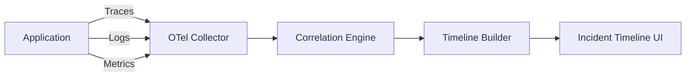

# How to Build Incident Timeline Reconstruction from OpenTelemetry Traces, Logs, and Metrics

Author: [nawazdhandala](https://www.github.com/nawazdhandala)

Tags: OpenTelemetry, Incident Management, Observability, Distributed Tracing

Description: Learn how to reconstruct detailed incident timelines by correlating OpenTelemetry traces, logs, and metrics into a unified view.

When an incident happens, the first question everyone asks is: "What happened and when?" Answering that question accurately requires stitching together data from multiple sources - traces showing request flows, logs capturing errors and state changes, and metrics revealing system-level degradation. OpenTelemetry provides the foundation for this by enforcing consistent context propagation across all three signal types.

## The Core Problem

Most teams investigate incidents by jumping between dashboards, log viewers, and trace explorers. Each tool has its own timeline, its own filtering, and its own notion of what matters. Reconstructing a coherent sequence of events from these fragmented views is slow and error-prone.

OpenTelemetry solves this by attaching the same trace ID and span ID to traces, logs, and metrics. This shared context is what makes automated timeline reconstruction possible.

## Architecture Overview

The reconstruction pipeline ingests all three signal types, correlates them by trace context and timestamp, and produces an ordered event timeline.



## Setting Up Context Propagation

The first requirement is making sure your logs carry trace context. Here is how to configure the OpenTelemetry SDK in Python so that log records include `trace_id` and `span_id`.

```python
# Configure OpenTelemetry logging with trace context injection
import logging
from opentelemetry import trace
from opentelemetry.sdk._logs import LoggerProvider, LoggingHandler
from opentelemetry.sdk._logs.export import BatchLogRecordProcessor, ConsoleLogExporter
from opentelemetry.sdk.trace import TracerProvider

# Set up tracing
trace.set_tracer_provider(TracerProvider())
tracer = trace.get_tracer(__name__)

# Set up logging with OTel integration
logger_provider = LoggerProvider()
logger_provider.add_log_record_processor(
    BatchLogRecordProcessor(ConsoleLogExporter())
)

# Attach the OTel handler to Python's standard logging
handler = LoggingHandler(logger_provider=logger_provider)
logging.getLogger().addHandler(handler)
logging.getLogger().setLevel(logging.INFO)

logger = logging.getLogger(__name__)

# Now every log emitted inside a span automatically carries trace context
with tracer.start_as_current_span("process-order") as span:
    logger.info("Starting order processing", extra={"order_id": "12345"})
```

## Collector Configuration for Timeline Data

The OpenTelemetry Collector needs to receive all three signal types and enrich them before forwarding. This configuration sets up receivers for OTLP data, adds resource attributes for correlation, and exports to your backend.

```yaml
# otel-collector-config.yaml
receivers:
  otlp:
    protocols:
      grpc:
        endpoint: 0.0.0.0:4317
      http:
        endpoint: 0.0.0.0:4318

processors:
  # Add resource attributes that help with timeline grouping
  resource:
    attributes:
      - key: environment
        value: production
        action: upsert
      - key: team
        value: platform
        action: upsert

  # Group logs and spans by trace ID for easier correlation
  groupbytrace:
    wait_duration: 10s
    num_traces: 1000

  # Batch for performance
  batch:
    send_batch_size: 512
    timeout: 5s

exporters:
  otlp/backend:
    endpoint: "timeline-service:4317"
    tls:
      insecure: false

service:
  pipelines:
    traces:
      receivers: [otlp]
      processors: [resource, groupbytrace, batch]
      exporters: [otlp/backend]
    logs:
      receivers: [otlp]
      processors: [resource, batch]
      exporters: [otlp/backend]
    metrics:
      receivers: [otlp]
      processors: [resource, batch]
      exporters: [otlp/backend]
```

## Building the Timeline Correlation Query

Once data lands in your backend, you need a query strategy that pulls events across signal types. The following pseudocode shows how to build a timeline from a known incident window.

```python
# Timeline reconstruction from correlated OTel data
def build_incident_timeline(start_time, end_time, affected_services):
    timeline_events = []

    # 1. Find error traces in the incident window
    error_traces = query_traces(
        time_range=(start_time, end_time),
        services=affected_services,
        status="ERROR"
    )

    for t in error_traces:
        timeline_events.append({
            "timestamp": t.start_time,
            "type": "trace_error",
            "service": t.service_name,
            "detail": t.status_message,
            "trace_id": t.trace_id
        })

    # 2. Pull logs correlated by trace IDs found above
    trace_ids = [t.trace_id for t in error_traces]
    correlated_logs = query_logs(
        trace_ids=trace_ids,
        severity=["ERROR", "WARN"]
    )

    for log in correlated_logs:
        timeline_events.append({
            "timestamp": log.timestamp,
            "type": "log_entry",
            "service": log.resource.service_name,
            "detail": log.body,
            "trace_id": log.trace_id
        })

    # 3. Find metric anomalies in the same window
    anomalies = query_metric_anomalies(
        time_range=(start_time, end_time),
        services=affected_services,
        metrics=["http.server.duration", "http.server.request.count"]
    )

    for a in anomalies:
        timeline_events.append({
            "timestamp": a.detected_at,
            "type": "metric_anomaly",
            "service": a.service_name,
            "detail": f"{a.metric_name} deviated by {a.deviation_pct}%"
        })

    # Sort everything chronologically
    timeline_events.sort(key=lambda e: e["timestamp"])
    return timeline_events
```

## Linking Metrics to Trace Context

Metrics do not natively carry trace IDs, but you can link them through resource attributes and exemplars. Exemplars are sample trace IDs attached to metric data points, giving you a bridge from a metric spike back to specific traces.

```python
# Recording a metric with an exemplar that links to the current trace
from opentelemetry import metrics, trace

meter = metrics.get_meter(__name__)
request_duration = meter.create_histogram(
    "http.server.duration",
    unit="ms",
    description="Duration of HTTP server requests"
)

def handle_request(request):
    span = trace.get_current_span()
    start = time.time()

    # Process the request
    response = process(request)

    duration_ms = (time.time() - start) * 1000
    # The SDK automatically attaches exemplars with trace context
    request_duration.record(
        duration_ms,
        attributes={
            "http.method": request.method,
            "http.route": request.path,
            "http.status_code": response.status_code
        }
    )
    return response
```

## Practical Considerations

When building timeline reconstruction, keep these points in mind:

- **Clock skew matters.** Services running on different hosts may have slightly different clocks. Use NTP synchronization and consider adding a small tolerance window (a few hundred milliseconds) when ordering events from different sources.
- **Sampling affects completeness.** If you are using trace sampling, your timeline will have gaps. Consider using tail-based sampling in the Collector so that error traces are always captured.
- **Volume management.** Storing every log and trace for timeline queries is expensive. Use the Collector's filtering processors to keep only high-severity logs and error/slow traces for incident correlation, while sampling normal traffic more aggressively.

The result of this approach is a single, chronologically ordered view of everything that happened during an incident - from the first metric anomaly, through the error traces, down to individual log lines. This removes the guesswork from postmortem analysis and cuts investigation time significantly.
